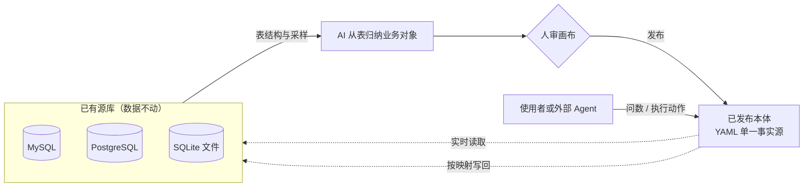
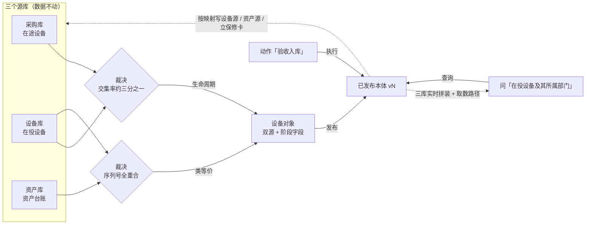
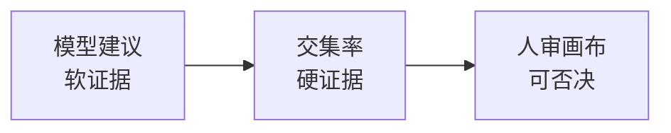
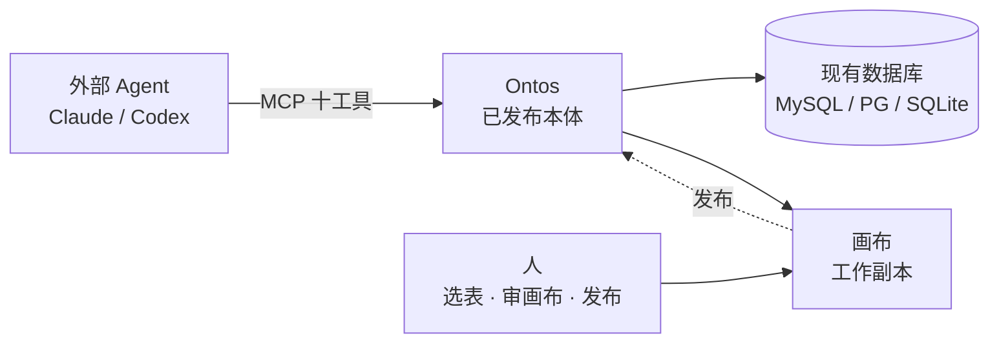

# Ontos（安托斯）

> **让系统回归存在本身。**

**现有数据库之上的 AI 读写中间层**

Ontos 是一个通用本体平台：从企业存量数据库里逆向出机器可读的业务本体（Ontology），架在全部现有数据库之上，充当人与 AI Agent 共用的读写中间层——查询实时下推各源库拼装作答；写入先核对本体的定义、再按映射投影回原表；最难判错的难题——「两个来源的记录是不是同一个东西」，用数据交集率当硬证据、由人定案。

> **当前进度**：完整闭环已在真实代码中通车——MySQL / PostgreSQL / SQLite 三种源库接入、十个 MCP 工具对外开放、测试全绿（`npm test`）。系统按生产形态建造：服务无状态可水平扩展、平台元库一行配置切换 MySQL / PostgreSQL、并发编辑有乐观锁保护。本文讲清三件事：它今天能做什么、为什么这样造、下一站去哪里。


---

## 一、为什么这一层还没有人做出来

一家真实的公司里，同一个客户的数据散落在采购、设备、财务几套互不相认的现有数据库。想让 AI Agent 替人来办这些事，卡在三道坎上：

| 卡点 | 后果 |
|---|---|
| 数据搬家太贵 | 数仓 / 主数据管理先把数据复制一份再治理——周期以季度计，源头一改全链路跟着改 |
| 模型直连没人敢放权 | 裸 Text-to-SQL 一条幻觉 SQL 就能拖垮生产库；让模型写库等于交出真相的编辑权 |
| 跨系统认人全靠猜 | 同一台设备在三套系统里三个名字，模型分不清谁是谁——答错不是缺陷，是事故 |

所以适合的客户画像很清楚：手里攥着几个历史遗留系统、想让 AI 真正接管一部分业务、但绝不允许有人动这些系统的团队。

## 二、方案：把本体盖上去，而不是把数据搬出来

Ontos 反着来：数据和系统都不动，把这个领域的共同理解写成一份明确的模型（本体），盖在现有数据库上面当读写中枢。建好它只要三步：

1. **生成对象**：勾选源库的表结构，模型读列名与注释，从表**归纳**出业务对象和关系（跨表归并同一概念），直接放上画布随手可改——建议只进草稿，已发布的本体一动不动；
2. **多源整合**：Agent 按证据对齐疑似重复的对象（不同库，或同一库的两张表）：先定唯一键（凭什么认定两条记录指向同一个体），再算交集率（两边标识字段取值的重合比例），据此把该合并的合并、该连线的连线，全部落成可回滚草稿——结论与证据留痕可查，人在画布上审结果、可指令推翻；
3. **发布**：对象、关系、动作定义定稿成单一事实源（YAML），带版本号入库，随时回滚到任一历史版本；裁决结论与证据是工作留痕，住平台元库、不进 YAML。

发布后，画布上的内容回到工作副本（未发布的草稿）状态，下一次改动照旧累积为「待发布」；问数与动作永远只读已发布快照——**改到一半的本体，下游永远看不见**。

两个入口，一套动词。人在画布上做的事与外部 Agent 经 MCP 做的事走同一条校验通道：`propose_objects` 只建议、`edit_draft` 才写工作副本，界面拖拽和远程调用没有特权差异。



### 两分钟看懂一次完整链路

采购、设备、资产三个库都接好后，第一组疑似重复出现：采购库的「在途设备」和设备库的「在役设备」。算一下序列号交集率——约三分之一相同，Agent 据此把这两类定为**生命周期**（同一批设备的先后时期），两类合为一个对象挂双源，阶段变成读时现算的派生字段，转化动作随之自动建立。第二组设备 × 资产序列号全部重合，定为**类等价**，资产台账并入同一对象。

发布后问一句「列出在役设备及其所属部门」——答案是三个源库的实时拼装，附取数路径（这次查询是怎么执行的逐步说明）：

再执行动作「验收入库」，点名某台在途设备：设备源与资产台账各落一行新记录并立起保修卡。**再问一次，这台设备的阶段已经是「在役」。**



## 三、AI 用在哪里：把不可靠的部分圈起来

这套产品对模型的态度是全场最重要的设计决策——**模型只当顾问，不当计算器**：

- **模型只有四个出口**：建模草稿建议、唯一键建议、重复关系倾向、自然语言编结构化请求。查询的执行不含模型——编译、下推、跨源对齐、拼装全是确定性代码，同一个问题永远走同一条取数路径。
- **三层证据链兜底判断**：模型建议是软证据，交集率是硬证据，Agent 依证据定案，人审画布才是结论——不同意就否决、指令推翻。合并判错比不合并更糟，所以落的是可回滚草稿、发布由人点；每次裁决连同当时的证据快照入库留痕。
- **验收问题集当质量闸门**：一批带期望结果的问题挂在每个版本上，「全量跑一遍」失败会按阶段落因（编译失败 / 执行出错 / 答案不符）；本体改坏了，绿点变红一眼可见。发布前可对草稿试跑，不污染验收记录。
- **引擎拒绝自由发挥**：配置里没有的动作、属性、关系名一律报错不猜。Agent 拿到的是十个边界清晰的工具，自转的循环留在 Claude Code 这类外部调用方那边——Ontos 内部保持确定性。

一句话总结分工：模型负责理解语言和表结构的语义，引擎负责精确执行，人负责只有人该负责的审与发布。



## 四、生产级工程能力：按企业形态建造的

这是评委最容易看漏、也是我们最想被看见的部分——演示功能的底下是一套按生产标准写的系统：

| 工程能力 | 实现方式（都可验证） |
|---|---|
| 无状态水平扩展 | 进程内没有写队列与内存缓存，草稿与快照全部读平台元库；同一份元库下任意多实例行为一致。元库经 `ONTOS_META_DSN` 在 SQLite 单文件 / MySQL / PostgreSQL 之间一行配置切换，三种方言 DDL 各自独立成文件 |
| 并发编辑互不覆盖 | 每次草稿写入携带修订号做乐观锁更新；检出冲突时画布端自动重读重试叠加应用，接口端返回明确的「草稿已变」（`src/server/features/ontology/editDraft.ts`） |
| 多端实时协同 | 画布每 2 秒轮询本体的修订号（ETag/304），同事或外部 Agent 的改动两秒内自动刷新画布并弹提示（`src/server/etag.ts`） |
| 领域依赖由测试守门 | 分层方向 schema → infra → features → 路由由结构守门测试强制（`src/tests/structureGuard.test.ts`、`purityBoundary.test.ts`）：查询引擎 import 不到写解释器，读路径依赖不了写路径 |
| 分布式安全发号 | 全局唯一业务编号用雪花号（41 位毫秒 + 10 位实例位 + 12 位序列），多实例各持实例位互不碰撞（`src/server/infra/snowflake.ts`）；创建动作靠源表唯一键加插入后重查兜底实现幂等，动作重发不会落双行 |
| 测试永远离线 | 测试套件启动即剥掉模型 Key 与写令牌，不连外网、随时可跑 |

## 五、治理与安全承诺

平台的每一条承诺都写在架构里，不是口号：

- 业务行永不进平台：平台元库里没有任何业务数据列；
- 问数实时只读查源库，日志记请求与成败、不存结果集；交集比对在内存完成，标识字段的取值集合算完即弃；
- 写入只能执行已发布动作的定义，配置之外的写法引擎一律拒绝；
- 表结构采样脱敏后才进界面；
- 最小权限姿态：问数用只读账号，动作另备可写账号；写端点可再加一道 Bearer 访问令牌；
- 全程审计：每次问数与动作留痕（时间、版本、入参摘要、成败与耗时），每条裁决附证据快照，任何历史版本一键回滚覆盖工作副本。

## 六、技术栈

| 层 | 选型 |
|---|---|
| 应用形态 | Next.js 16 + React 19 前后端一体，单仓库单进程跑通全链路 |
| 画布 | React Flow（对象卡的编辑、连线、摆位都在其上） |
| 模型接入 | Vercel AI SDK + Zod 结构化校验，OpenAI 兼容协议任意接；无 Key 时 test 演示空间走剧本实现，功能可演示 |
| 源库驱动 | mysql2 / pg / node:sqlite |
| 平台元库 | SQLite 起步，DSN 切 MySQL / PostgreSQL，方言 DDL 三份独立维护 |
| 对外协议 | MCP（JSON-RPC 2.0）十个工具 + REST 只读查询 |

## 七、十分钟上手

需要 Node ≥ 22.5。

```bash
npm install
cp .env.example .env   # 全部变量可选：不配 Key 也能走主要流程（test 演示空间离线可跑）
npm run demo:seed      # 把十二套演示库写成 .ontos-demo/ 下的 SQLite 文件
npm run dev            # http://localhost:6688
```

最快的入口：打开页面把左上角工作空间切到 `test`——自带现成本体和七个 fixture 连接，直接体验画布、多源归并与留痕视图、验收问题集跑批。想要完整走查（设备一生 + 办公线 · 八套接入系统，配真模型效果最佳），照 [docs/真模型端到端测试.md](docs/真模型端到端测试.md) 走，全程约三十分钟。

> 本地浏览器操作不要设置 `ONTOS_TOKEN`，否则画布写请求会 401。

生产启动：`npm run build && npm start`。

## 八、给外部 Agent 的接口

外部 Agent（Claude Code 等）经 MCP 端点驱动 Ontos——裁决、交集率、识别唯一键、看过交集率再建议已开放给 Agent；发布是人对结果的最终确认，刻意不开放给自动流程（publish 永不开放）：

```
POST http://localhost:6688/api/<空间名>/mcp      # JSON-RPC 2.0
POST http://localhost:6688/api/<空间名>/query    # 只读查询的 REST 形态
```

十个工具：`query`（查数）、`run_action`（执行动作）、`propose_objects` / `propose_action`（建议草稿，只建议不写）、`edit_draft`（编辑工作副本）、`list_classes` / `read_class` / `search`（读本体的清单、单类视图、全文检索）、`list_tables`（读表结构）、`list_candidates`（读疑似重复清单，只读）。

配套四个 skill 教 Agent 怎么用：[`ontos-query`](skills/ontos-query/SKILL.md) · [`ontos-action-run`](skills/ontos-action-run/SKILL.md) · [`ontos-canvas`](skills/ontos-canvas/SKILL.md) · [`ontos-action`](skills/ontos-action/SKILL.md)。



## 九、已完成与未完成

**已经通车的**：三种源库连接与脱敏采样 · AI 生成对象草稿 · 候选对发现与交集率计算 · 对齐整合（同一概念的表并成一个多源类；不同概念之间建领域谓词链；子类型本期不定案）· 版本化发布与历史回滚 · 自然语言问数（含取数路径）· 动作执行与多源写回 · MCP 十工具与配套 skill · 验收问题集批量回归 · 多工作空间隔离 · 无状态多实例部署。

**当前阶段的边界，白纸黑字讲清**：

- 变更事件已随动作结果返回（`delivered` 字段就位），webhook 外发通道未通；
- 对外鉴权与连接凭据采用最简形态：单一访问令牌 + 凭据明文存于平台元库，两者都排在下一站的清单上；
- 子类型的裁决留作下一版开放；没有推理机，表达力止于派生字段的取值规则；
- 跨源对齐在内存中完成，受实例内存上限约束；
- 不做跨库分布式事务：写回部分失败的补偿手段是幂等重发同一动作或人工修库——诚实的小步，好过黑盒的大事务。

## 十、下一站：从第一阶段到企业形态

路线图上的每一项都来自现有设计文档的既定预留，不是临场许诺：

1. **告知外发**：变更事件送达下游系统，打通通知闭环——接收方与事件形状已在配置里预留；
2. **凭据加密与权限细化**：连接凭据静态加密，鉴权从单令牌走向分级授权与企业身份体系对接；
3. **子类型落地**：这一项类与类关系的完整流程开放；
4. **建模质量回归**：标注测试库上量化对象识别与映射的查准查全，北星指标 = 人工修改率 + 裁决接受率；
5. **裁决自动化分级**：接受率长期达标的「同形异义」类升级为机器预分拣加人工抽检；合并类无论接受率多高都不毕业——一次错并的代价与一百次对的好处不对称。

第二阶段的全部工作只有一个标准：**让企业敢于把写权限交给 AI——因为每一次写下都有定义、有证据、有回滚。**

## 深入阅读

| 文件 | 内容 |
|---|---|
| [docs/Ontology平台MVP设计文档.md](docs/Ontology平台MVP设计文档.md) | 产品定位、系统架构、元数据库设计、红线与风险 |
| [docs/ontos-article.md](docs/ontos-article.md) | 概念展开与配置骨架：全部键定义、保留字、完整可发布示例 |
| [docs/真模型端到端测试.md](docs/真模型端到端测试.md) | 设备一生 + 办公线的完整走查剧本 |
| [AGENTS.md](AGENTS.md) | 仓库约定：用语、术语表、代码结构纪律 |
