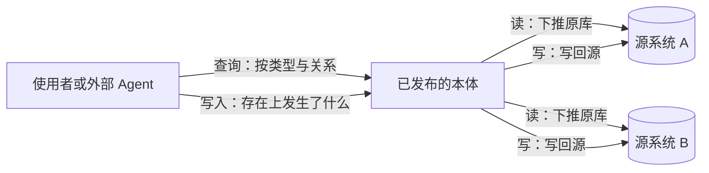
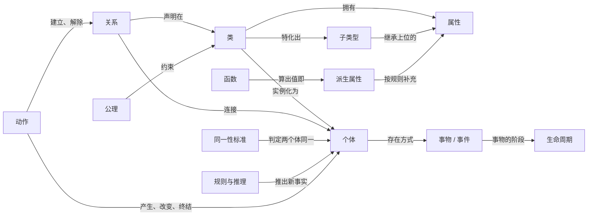
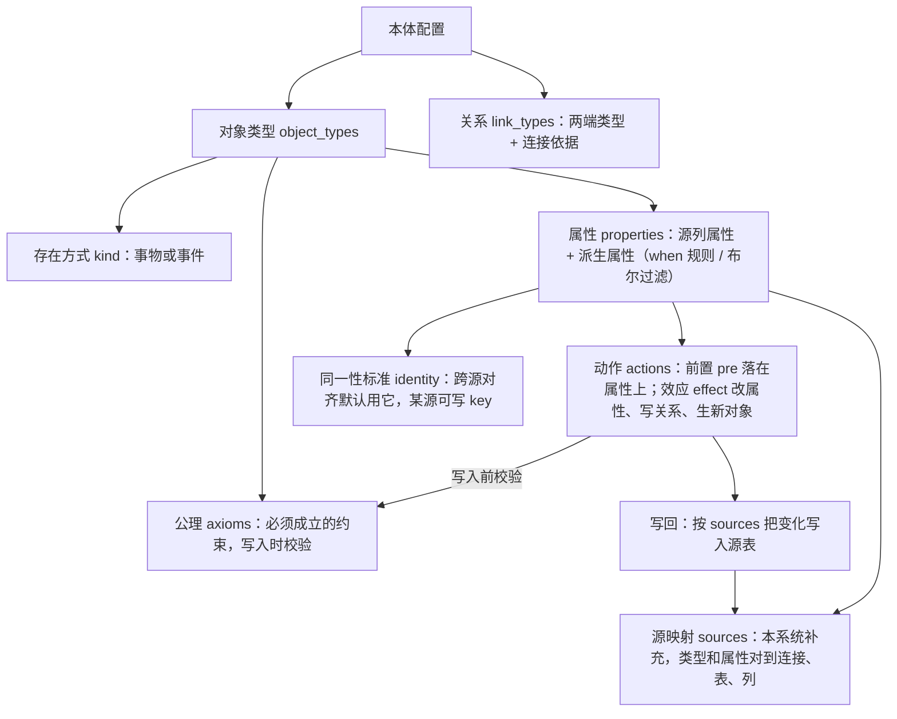
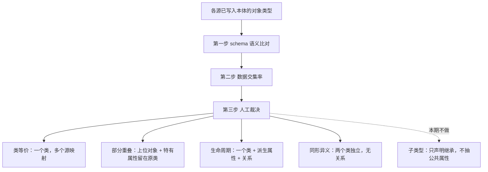
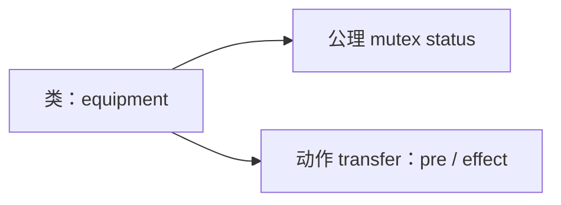
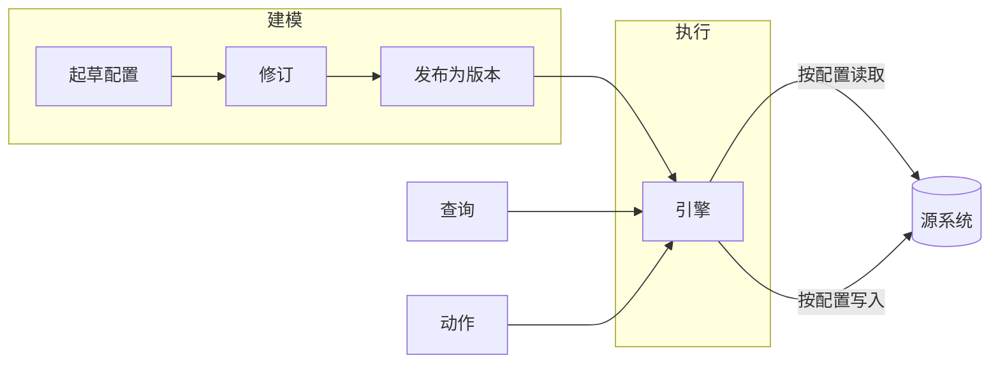
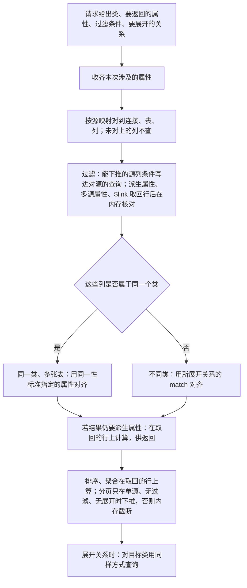
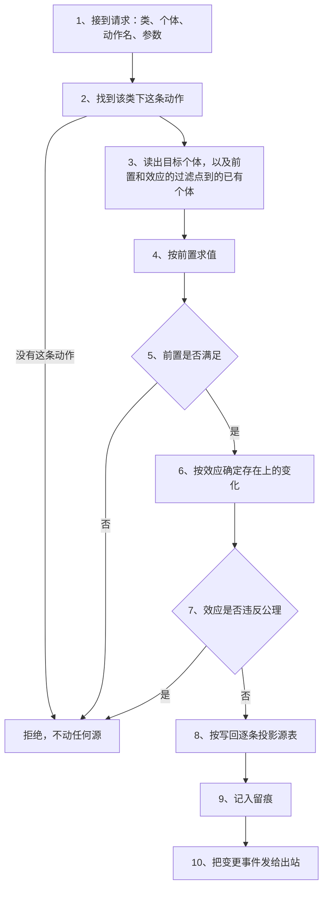

# 标题待定

## 1. 引言

本体论原是哲学问题：世界里有什么，一类事物与另一类如何区分，两个个体何时算同一个。知识工程把它写成可计算的规定，把一个领域的概念化明确列出来：类型、属性、关系，以及同一性标准。它约束的是「有什么」，不是某张表怎么建。

本系统把上述规定写成一份可发布的模型，并用它访问已有系统。多个源上的对象先判别是同一、部分重叠、阶段还是仅名称相似，再进入同一份本体。查询按类型与关系读原库。写入先说明存在上发生了什么（阶段变化、新生一个关联对象等），再写回相应的源。换领域只改这份模型。



图 1：本体盖在已有系统之上。读写都先经过本体，再落到原库。

对照两端。一端是 Palantir Foundry 的 Ontology：产品里的对象层。另一端是知识工程里的形式化本体（formal ontology）：托马斯·格鲁伯（Thomas R. Gruber）1993 年把本体说成「对概念化的明确说明」（an explicit specification of a conceptualization）；OWL（Web Ontology Language，网络本体语言）是后来万维网联盟（W3C，World Wide Web Consortium）用来写出类、关系和约束、供机器推理的语言。第 2 节用的就是这条线。本文两条都不走。

| | 本文 | Palantir Ontology（Foundry） | 形式化本体（Gruber 1993，OWL） |
|---|---|---|---|
| 本体是什么 | 一份可发布的规定 | 平台内的对象图：对象类型、属性、链接 | 对概念化的明确说明；用 OWL 写出类和约束 |
| 业务行在哪 | 只在源库，平台不留副本 | 先灌进 Foundry 对象存储 | 通常不谈源库 |
| 读 | 按映射下推原库 | 查已经编好的对象 | 推理、一致性检查 |
| 写 | 先说存在上发生了什么，再投影到有映射的源 | 先改对象库，再经 writeback / 连接器往外推 | 一般不规定怎么写库 |
| 没有映射的系统 | 不能投影 | Functions、连接器外发 | 不涉及 |
| 换领域 | 换这份规定，引擎不动 | 换对象类型和 Action，对象库还在 | 换公理系统 |

中间这条路是：规定盖在已有系统上。没有映射，就不能投影。除了一次动作的处理过程，个体不留在引擎里。

## 2. 本体论要素

本体论在工程领域的用途，是给一个领域写一份明确的说明：领域里有什么，两个体何时算同一个，允许发生什么变化。人和机器都读这份说明，系统集成、数据共享、知识推理都拿它做共同依据。托马斯·格鲁伯（Thomas R. Gruber）1993 年的定义流传最广：本体是对概念化的明确说明（an explicit specification of a conceptualization），概念化就是对一片现实做什么样的抽象。拉尔夫·施图德（Rudi Studer）等人后来补上三个词：明确，类型和约束都写出来；形式化，机器可读；共享，是一群人的共识，不是个人理解。

本体的构成，阿松西翁·戈麦斯-佩雷斯（Asunción Gómez-Pérez）归为五样：概念、关系、函数、公理、实例。后来的实践把这张清单铺得更细，可以归成五类。

**基本要素：类、属性、个体、同一性标准。** 类是对领域里事物的分类：人、设备、订单，各归为一种，每一种是一个类。属性附着于类，描述一类的个体长什么样——名称、颜色、注册日期，取值是字面值，一个数、一段文本、一个日期。个体是类所描述的具体事物：某一台设备，某一张订单。类是规定，个体是被规定的对象。同一性标准（identity criterion）是判定同一所凭的特征：凭什么说两条记录指向同一个东西。没有这条标准，同一性就无从判定。能当同一性标准的属性须能区分（不同个体不得同值）、能覆盖（每个个体都有值）、稳定（存续期间不改）。取值或是请求带来的已有键（出厂序列号、工号），或是插入时按属性上 `generate` 拼出的编号。源表主键 `pk` 只定位行，和同一性标准所指的属性可以不是同一个。

**类间关系：关系、类等价、子类型、同形异义、部分与整体。** 关系把一类的个体连到另一类的个体上：设备「归属于」部门，每台设备连一个部门，一个部门可以连多台设备——从谁到谁是方向，允许连几个是基数。关系的取值是另一个体，这是它和属性的分界：属性的取值是字面值。类等价是两个名字指同一类。子类型是一类完全落在另一类里面：它的每个个体同时是上位类的个体，并继承上位类的全部属性——上位类就是这条关系的另一端，不是另一种关系。部分重叠是两类的个体有交集、又各有一部分不属于对方。处理它不用子类型：公共部分抽出来另立一个上位对象，公共属性移到上位对象上，各自特有的留在原类；上位对象不带继承语义，属性是移上去的，不是继承来的。同形异义是名字相同而所指不同：两个系统里都有「账户」，一个指资金账户，一个指登录账户，就不能并成一类。部分与整体是组成关系：发动机是车的一部分。它和子类型常被混淆，判别方法很简单：子类型的每个个体同时是上位类的个体，而一台发动机不是一台车，所以它是部分，不是子类型。

**时间中的存在：事物与事件、生命周期。** 事物持续存在，每个时刻都完整地在那儿，同时可以变化：今天和明天是同一台设备，状态却可以不同。事件在时间中发生，发生过就确定了，比如一次维修；事件不变化，只被记录。生命周期是同一事物经历的阶段，阶段不是新个体，是同一个体的一段时期。

**推导与动作：派生属性、函数、公理、规则与推理、动作。** 派生属性由规则算出，不必逐条记录，比如由出生日期算年龄。函数由给定对象唯一确定结果：算出值来就是派生属性；算出真假来叫可计算谓词，是一个是非判断，比如「是否已过保」。公理是必须成立的约束，比如开始时间不晚于结束时间。规则与推理从已写下的事实推出没写下的事实。这里的事实是本体中的断言：某个体属于某类，两个体之间某关系成立，某属性取某值。写下「机床是设备的子类型」，再写下「这是一台机床」，「这是一台设备」就不必写了，推理自动得到。动作规定可以对世界做什么：一个对象允许发生什么变化，变化在什么条件下被允许，发生之后意味着什么。

**形式语言：RDF、OWL、描述逻辑。** RDF 把一切表示成三元组，OWL 在其上定义类和约束，描述逻辑提供可判定的推理。机器可以在其上检验一致性、推出隐含结论，代价是表达复杂。

这些要素不是一袋零件，它们互相勾连，组成一个模型：



图 2：要素组成的模型。箭头上的文字是要素之间的关系。

图里，类是中心：拥有属性，实例化为个体，特化出子类型。关系声明在类上，连接的是个体。同一性标准判定个体同一，派生属性补充属性，函数以个体为输入、算出唯一结果——算出值就是派生属性，算出真假就是谓词。公理约束类，规则与推理推出新事实。动作产生、改变、终结个体，建立和解除关系；个体分事物与事件，事物的阶段是生命周期。类等价、同形异义、部分与整体不在图里，它们是两个类相遇时的关系；形式语言是画图用的纸笔。

这套词汇写出的本体是抽象的。它和已有系统之间是什么关系——怎么作用于系统，又怎么从系统长出来——是下一节的内容。

## 3. 本体与已有系统

### 3.1 本体的操作化

第 2 节的要素，几乎全是描述性的：它们规定世界是什么样。一份描述自己不会读数据，也不会改数据。要让本体作用于已有系统，需要补三样东西。

**源映射。** 类型和属性是抽象的，读写之前必须知道它们物理上在哪。源映射把每个类型、每个落在源列上的属性，绑定到具体的连接、表、列。本体和现实之间的桥就是它。

**动作。** 第 2 节已经把动作列为要素：一个对象允许发生什么变化。但那只是概念层面的规定：条件怎么校验、变化写回哪些源，本体论本身没有给出答案。要写已有系统，动作必须落成可执行的三段式：前置、效应、写回。

**引擎。** 本体已经把这些概念定义好了，还需要一个引擎来执行它们。引擎是本体的运行时：加载已发布的本体配置，接收查询和动作两类请求，按配置里的定义逐条求值——定义里有的照做，没有的拒绝。它能解释的构造全是通用的：类型、属性、关系、源映射、动作，没有一个领域概念。接入新领域，换一份本体就够，引擎不动。

这三样加进第 2 节的模型，组织形式如下：



图 3：本体配置的结构与依赖。属性是对象类型的地基：同一性标准从属性里选，源映射把类型和属性对到连接、表、列；动作的前置落在属性上，效应改属性、写关系、生新对象，写回把变化写入源表——写去哪张表、哪一列，查源映射。标「本系统补充」的源映射不在第 2 节的要素清单里；公理挂在对象类型下，效应定完之后、写回之前校验；派生属性按形状分两种：`when` 规则谈源，布尔派生就是一条过滤。

### 3.2 跨系统本体对齐

现有系统要用上本体，第一步是从系统逆向建模：读它的表结构和数据，认出类、属性和关系。系统一多，多一层问题：每个系统只存现实的一个侧面，各起各的名字，各建各的表——这个系统的某个类和那个系统的某个类是什么关系，必须先判定。这一步就是跨系统本体对齐。对齐的结论有五种，判定分三步。

#### 五种结论

判定的依据是两类个体的重合程度：

| 结论 | 情形 | 处理 |
|---|---|---|
| 同一 | 两个名字指同一类 | 合并为一个**对象类型**，挂多个源 |
| 部分重叠 | 个体有交集，又各有一部分不属于对方 | 公共部分立**上位对象**，各自特有的留在原类 |
| 阶段 | 两条记录是同一实体的不同时期 | 立一个**对象类型**；阶段是**派生属性**，读时按规则现算；**转化关系**由**动作**写入时记录 |
| 仅名称相似 | 名字像而所指不同 | 各自独立，互不映射 |
| 子类型 | 一类完全含于另一类 | 声明**子类型**：个体自动是上位类的个体，继承它的全部属性 |

注意部分重叠和子类型的区别：上位对象不带继承语义，属性是移上去的，不是继承来的。

#### 三步判定

判定不从「两个库的全部表」铺开。人先在表结构抽屉里勾选表，点「生成对象」：对象直接上画布，表本身不成节点。没有预览卡，也没有确认草稿卡。机器只在**已上画布的对象**之间找跨源候选对。单源对象不进裁决，可以直接发布。发布之后再加表，只裁新冒出来的对。

前两步自动跑，第三步才打断人。中间至多浮一张卡：先问唯一键（有抉择才问），再问候选对。同一时间底中只有这一张。点节点改字段、改唯一键，随时可以，不必再走一遍确认。

第一步，schema 语义比对。各源已经建成对象类型、写进本体文本之后，把来自不同源的类型两两拿出来，只看结构，不读业务行。比三样东西：类型叫什么，各有哪些字段，字段分别是什么类型。名称相近或字段能对上（名称对名称、编号对编号，类型也一致），就列为候选对，并给一个倾向——更像同一、部分重叠、阶段，还是只是名字像。对不上的不进后面两步。这一步由语言模型做，只出建议和比对依据，不定案。

例如采购侧「在途设备」有名称、出厂序列号、到货日，设备侧「在役设备」有名称、出厂序列号、状态、启用日。两边对象名不同，但名称对名称、序列号对序列号，类型都是文本，列为候选对，倾向同一。再如两边都有一个「账户」，一个字段是账号、币种、余额，另一个是用户名、密码、权限，除了「账户」这个词，字段对不上，倾向仅名称相似。起名是各系统自己的事：同名未必同类，异名未必无关，所以结构像不像不能当定案。

第二步，数据交集率。对候选对两端已设的唯一键归一化后算取值交集。没设唯一键，卡上写「两边对不上号」。字段像序列号、身份证时，生成后会先问设不设为唯一键；点节点也能改。

还是在途设备和在役设备：唯一键都是出厂序列号，去掉横杠、统一大小写后再比。采购里 120 台，设备里 100 台，序列号重合 40 台，交集率约三分之一。接近全交才像同一批东西现在都在两边；接近零才像完全两批。三分之一落在中间，再看字段——设备侧有状态、启用日，倾向阶段：同一批设备，只是有的还在途、有的已在役。

| 交集率 | 指向 | 再细分 |
|---|---|---|
| 接近零 | 仅名称相似 | 无需细分 |
| 接近全交 | 同一 或 部分重叠 | 属性几乎全同是同一；各有一大块特有属性是部分重叠 |
| 介于中间 | 部分重叠 或 阶段 | 有状态、时间字段，阶段的可能性大 |

要比的是两个值相不相等，不是把标识存下来。识别列整列只读取出（超过 5 万行拒绝，先收窄范围再算），归一化后在内存里求交集，值集合算完即弃；落库的只有计数与比率。敏感列的脱敏比对、明文不出库时的指纹比对，本期未做。

第三步，人工裁决。前两步给出的是建议和交集率，定案只能是人。语言模型建议大约六到八成准；交集率把范围收到一两种，选哪一种仍要人拍板。跳过按各自独立处理，以后可以改。子类型本期不定。

在途对在役：建议曾是同一，交集约三分之一，倾向阶段。人定阶段——两个类收成一个「设备」，挂两个源，并增加转化关系。账户对账户：人定仅名称相似，两个类各自独立，互不映射。定案按上一节的表写进本体。验收问题集用来核本体（已发布版本、当前草稿都能跑），不参与这一步。



图 4：人裁的是第 2 节的类间关系与生命周期，定案后改本体。类等价：两个名字并成一个类，两边的表都写成源映射。部分重叠：公共属性抽出来立上位对象，属性移上去、不带继承语义，特有属性留在原类。生命周期：收成一个类，阶段用派生属性读时现算，转化写成关系，由动作写入。同形异义：两个类都留下，不建关系，源映射也不共用。子类型：一类完全含于另一类，只声明继承、不抽公共属性，本期不做。

上面那一对，人选阶段之后，配置里只留一个设备类。同一份已发布配置里还有部门类，以及设备到部门的关系；它们来自另一次对齐。

```yaml
# 已发布配置的对齐切片。键以附录 B 为准。完整文本见附录 C。候选对、交集率不在这里。
object_types:
  equipment:
    description: 设备              # 给人 / Agent 看；引擎不读
    kind: thing                    # thing 可经历阶段；event 不可
    identity: serial_no            # 属性名，跨源对齐默认用它。某源没有此列时，该源条目写 key（附录 B）
    properties:                    # 键是属性名。取值是字面值；关系见 link_types
      name:
        type: string
        description: 名称
      serial_no:
        type: string
        description: 出厂序列号    # identity 指向的属性；各源的 fields 里都要有它，除非该源写了 key
      dept:
        type: string
        description: 所属部门编号  # 源列属性；只在设备源有映射
      mark:
        type: enum
        values: [scrapped]
        description: 台账标记      # 源列属性。设备表 status 列映射到这里，不是派生属性 status
      status:
        type: enum
        description: 阶段
        values: [in_transit, in_service, scrapped]   # 只列出有规则能算出的值
        derived:                   # 派生：不对应源列。规则里写到的源，引擎才访问
          - when:
              device:
                mark: scrapped     # 设备源有行，且已映射属性 mark 为 scrapped
            value: scrapped
          - when:
              purchase: true       # 采购源必须有行；过滤时本次要的列从这里取
              device: false        # 设备源必须无行
            value: in_transit
          - when:
              device: true         # 设备源必须有行。不写 purchase：这条规则不查采购源
            value: in_service
    sources:                       # 键是源条目名。when 和写回都用这个键，不用连接名。同名属性多源都有时，排在前面的源优先
      purchase:
        connection: purchase_sys
        table: po_item
        pk: po_id                  # 表主键，仅供台账与展示。不是同一性标准
        fields:                    # 源列属性 → 列。派生属性不得出现
          name: item_name
          serial_no: sn
      device:
        connection: device_sys
        table: device
        pk: dev_id
        fields:
          name: name
          serial_no: serial_no
          dept: dept_id
          mark: status             # 设备表 status 列；本体属性 status 是派生，不进 fields
    axioms:
      status_one:
        description: 同一时刻一个阶段
        type: mutex
        property: status
    actions:
      convert:
        description: 验收入库
        pre:
          status: in_transit       # 可引用派生属性；引擎先按 when 求值
          $link:
            converted: false
        effect:
          - link: converted        # 转化没有另一端；作用在请求点名的那台设备上
  department:
    description: 部门
    kind: thing
    identity: dept_id                 # 部门编号
    properties:
      name:
        type: string
        description: 部门名称
      dept_id:
        type: string
        description: 部门编号
    sources:
      org:
        connection: device_sys
        table: department
        pk: dept_id
        fields:
          name: dept_name
          dept_id: dept_id
link_types:
  converted:
    description: 转化为
    from: equipment
    to: equipment
    inverse: converted_from        # 反向名：展开时写它，从 to 走回 from
    card: 1:1
    transition:                    # 同一个体，阶段从 from 到 to
      property: status
      from: in_transit
      to: in_service
  belongs_to:
    description: 属于
    from: equipment
    to: department
    inverse: has_equipment         # 部门 → 设备：查某部门下有哪些设备
    card: N:1
    match:                         # 两端属性值相等则关系成立。这里是属性名，不是列名
      - { from: dept, to: dept_id }
```

节点是对象类型，字段是属性，边是关系。候选对和交集率只用来让人定案，定案后收进对象、源和边里，不必另存一份。

**关系**随**类**的建立和第三步的判定写入配置。新**类**加入后，它与已有**类**之间的**关系**仍走上述过程。

三步做完之后还要写进配置的，见下一小节。

### 3.3 类上的可执行规定

经过上面三步，配置中已有**类**、**同一性标准**和**源映射**。第三步判定的是这两个被比对的**类**之间的**关系**，该项为**类等价**、**部分重叠**、**生命周期**、**同形异义**或**子类型**之一。

第三步判定这两个**类**之间的**关系**为**生命周期**时，它们描述的是同一个体的两个阶段。配置里因此只写一个**类**。两个源上的表都挂在这个**类**的**源映射**上。两个阶段不再各自作为**类**，而成为这个**类**上阶段**派生属性**的取值。阶段之间的转化写成**关系**，并配一条转化**动作**。

例如：采购系统有尚未验收入库的设备，设备系统有已经投入使用的设备，逆向建模时各建成一个**类**（在途设备、在役设备）。定案为**生命周期**之后，配置里只写「设备」这一个**类**；两张表成为它的两条**源映射**；「在途」「在役」是阶段**派生属性**的取值。

对齐之后仍须补上的要素如下。

| 要素 | 含义 | 配置字段 | 示例 |
|---|---|---|---|
| **动作** | 该类个体允许发生的变化，以及如何写入源表 | `actions`：`pre`、`effect` | 调拨一台在役设备。`pre` 要求阶段为在役；`effect` 更改所属部门；写回按 `sources` 推出 |
| **公理** | 写入前必须成立的约束 | `axioms`：`type`、`property` | 同一设备同一时刻只有一个阶段。`type: mutex`，`property: status` |

定案为**生命周期**之后，配置里已经有一条**动作**。这条**动作**只完成阶段之间的转化：效应是个体从前一阶段转到后一阶段，写回对应的源表。

同一**类**上往往还有别的变化。把一台在役设备调到另一个部门，改变的是归属，不是阶段。把一台设备标为报废，改变的是另一件事。已有的转化**动作**不能用来做这些事。因此调拨、报废要各自写成**动作**。每一条**动作**须说清三件事：变化发生前个体必须满足什么（前置），存在上变成什么（效应），变化写入哪张源表的哪些列（写回）。其中前置和效应是动作定义里的键；写回不配在动作上，引擎按效应和 `sources` 推出，见 6.3。引擎只执行配置里写明的**动作**。某一变化没有对应的**动作**，引擎就不能把这次变化写入源表。

**公理**在每次写入前按 `type` 校验。`type` 为 `mutex`、`property` 为 `status` 时，引擎拒绝使该属性在同一时刻取得两个值的写入。上一份 YAML 中的 `status_one` 是**公理**。



图 5：对齐之后仍须写入**类**上的**公理**和**动作**。动作只配前置和效应；写回不在动作上配名单，引擎按效应和 `sources` 推出写哪张表、哪一列。

## 4. 本体与引擎

引擎加载的是已经发布的那一版配置，例如 3.2 节末尾的 `equipment`。查询和动作都针对这份配置，不针对某张源表。未发布的草稿引擎不加载。语言模型只在三处出现：起草本体配置、给候选对建议、把自然语言编成查询或写入请求。执行 `derived`、写回时都不在场。模型给建议，不定案，不算交集率。人不发话，模型不自己再生成、不自己写库。请求里的类名、属性名、关系名、动作名对不上已发布配置，引擎拒绝。

一次查询给出**类**、过滤条件和要展开的**关系**。引擎取出该类的 `sources`、`identity`、`derived` 和相关 `link_types`，按**源映射**下推到源系统，用**同一性标准**所指定的**属性**作为键到其他源中查询，再算派生值。

一次动作给出**类**、**动作**名和要作用的个体。引擎取出对应的 `actions` 条目，用 `pre` 和 `axioms` 校验，按 `effect` 改变存在，再按 `sources` 写源表。配置里没有这条**动作**，引擎拒绝。引擎不补写**公理**，也不发明**动作**。



图 6：引擎加载已发布配置。查询与动作均作用于该配置；引擎依据配置访问源系统。

`equipment`、`in_transit`、`convert` 只写在配置里。引擎的求值源码里没有这些词，也没有按行业分的支路；唯一的例外是无 Key 时的离线回退编译器，它内置演示剧本的几问几答、只服务 test 演示空间（演示数据按空间名归属，与配不配 Key 无关），是演示支架，不在正式链路里。换领域等于换一份已发布文本。

| | 本体 | 引擎 |
|---|---|---|
| 形态 | 已发布的文本 | 程序 |
| 内容 | 第 2、3 节中的要素 | 不含领域知识 |
| 换领域时 | 更换这份文本 | 不改 |
| 如何检验 | 版本比较；`description` 是否与可求值字段一致 | 求值源码中不出现领域名词 |

常见规则引擎在条件成立时触发一条行为，多用于告警和审批。这里的**动作**和**公理**不是触发器：前者规定个体允许经历什么变化、变化写入哪张表，后者规定写入前必须成立什么。引擎解释这些字段并访问源库，不另跑一套与配置无关的流程。

接入新领域时若必须改引擎才能工作，说明有规定写进了程序。应当把这些规定写回本体并重新发布，引擎保持不动。

## 5. 查询

查询按已发布配置检索存在，不改变存在。本节分四步说：请求怎么写，过滤怎么写，请求由谁编出来，引擎怎么求值。过滤这一套写法，写入的前置也用。

### 5.1 请求的写法

一次查询是一棵以**类**为根的树，不是一张单层列表。每个节点写法相同：

```json
{
  "object": "Class",                 // 从哪个类查起。只根节点写
  "identity": "value",               // 可选。认准一个体：该类唯一键的值
  "properties": ["field"],           // 本类要返回的属性
  "filter": {
    "field": "value",                // 属性名配字面值 = 等值
    "field2": {
      "gte": "2026-01-01"            // 运算符：eq / ne / lt / lte / gt / gte / in / contains
    },
    "$link": {
      "linkName": true               // 关系条件：true / false，或对象=目标侧过滤
    }
  },
  "order": {
    "field": "desc"                  // 可选。按该属性排序
  },
  "limit": 20,                       // 可选。最多返回多少条
  "aggregate": {                     // 可选。有它就不返回个体行，只返回统计
    "group_by": ["field"],
    "metrics": [
      { "count": "*" },
      { "avg": "field" }
    ]
  },
  "expand": [                        // 按已声明关系进入目标类
    {
      "relation": "linkName",        // link_types 里的名字，或 inverse
      "properties": ["field"],
      "filter": {},                  // 筛的是展开到的那个类
      "expand": []                   // 可再往下套
    }
  ]
}
```

各键的含义，用 3.2 节那份配置上的一个完整例子来说明：

```json
{
  "object": "equipment",              // 从设备查起
  "properties": ["name"],             // 要返回：设备名称
  "filter": {
    "status": "in_service"            // 派生属性：只要阶段=在役
  },
  "expand": [
    {
      "relation": "belongs_to",       // 设备 → 部门
      "properties": ["name"]          // 要返回：部门名称
    }
  ]
}
```

这份请求的意思是：在役设备的名称，以及各自所属部门的名称。

| 键 | 含义 |
|---|---|
| `object` | 起点：从哪一个**类**查。仅根节点写；展开节点的**类**由 `relation` 的 `to` 得出 |
| `identity` | 可选：认准一个体。取值是**同一性标准**指定的**属性**的值 |
| `properties` | 本**类**上要返回的**属性** |
| `filter` | 本**类**上的过滤。写法见 5.2 |
| `order`、`limit` | 可选：排序、分页 |
| `aggregate` | 可选：分组统计。给了它就不返回个体行。与 `expand` 互斥 |
| `expand` | 按已声明的**关系**进入目标**类**继续查 |

**`expand` 进入目标类。** 每项对应一条已声明的**关系**；`relation` 的取值是配置里 `link_types` 的名字，不是引擎写死的枚举。目标**类**不用写，它取自该条**关系**的 `to`：`belongs_to` 的 `to` 是 `department`，进入的就是部门。方向由写哪个名字决定：`belongs_to` 声明的方向是设备到部门；起点是部门、要查它下面有哪些设备时，写这条关系的反向名 `has_equipment`：

```json
{
  "object": "department",             // 从部门查起
  "expand": [
    {
      "relation": "has_equipment",    // belongs_to 的反向名：部门 → 设备
      "properties": ["name"]
    }
  ]
}
```

`expand` 里放多项，表示同一个体连出多条**关系**——一台设备既要部门又要维保记录，就写两项。项内再写 `expand`，表示继续进入更远的**类**——查完部门还要查部门的地点，就在 `belongs_to` 这一项里再套一层。一层层套下去，请求就成了本节开头说的那棵树。`expand` 每一项里也可以再写 `filter`，筛的是展开到的那个**类**，写法与 5.2 相同。

**`aggregate` 改变返回的形态。** 不给它，返回一台台设备；给了它，返回分组统计——按部门分组、每组多少台。聚合与 `expand` 不能同给：分组统计不携带逐个体明细。

**名字对不上就拒绝。** 配置中没有该**类**，或 `properties`、`filter`、`expand` 指向未定义的**属性**、**关系**，引擎拒绝，不猜。

**根上给 `identity` 是另一种查法。** 不给 `filter` 而给 `"identity": "SN-40217"`，意思从筛一批变成认准一台——这里是某台设备的出厂序列号。

### 5.2 过滤

过滤是对一个**类**上当前存在的条件。满足的个体留下，不满足的不进结果。它不改变存在。

查询请求根上的 `filter`、`expand` 每一项里的 `filter`、写入动作的 `pre`，用的是同一套写法。写入的 `pre` 多两个键：`$request` 把请求参数拉进比较，`$exists` 声明这个体现在有没有行。其余相同。引擎怎么把这些条件翻成对源库的查询，见 5.4。

一条过滤是一个对象。键的种类由形状区分，不必翻配置：直挂其下的是本类的**属性**（含派生属性），收在 `$link` 下的是**关系**。`$` 打头的键是语法保留键。配置里的**属性**名不得以 `$` 开头。各层键的构成见附录 B。

**字段条件。** 键是属性名。

属性名配字面值，就是等值。`{ "status": "in_service" }` 与 `{ "status": { "eq": "in_service" } }` 相同。字面值里的 `null` 表示为空：`{ "ended_at": null }` 只留结束时刻没有值的行。

属性名配一个对象，对象的键是运算符：`eq`、`ne`、`lt`、`lte`、`gt`、`gte`、`in`、`contains`。

```json
{
  "status": "in_service",             // 等值。写成 { "eq": "in_service" } 一样
  "serial_no": {
    "contains": "SN-4"                // 序列号包含这段文字
  },
  "dept": {
    "in": ["D07", "D08"]              // 部门编号是这两个之一
  }
}
```

两个属性相比，被比较的那个写成 `{ "property": "另一属性名" }`。履历的生效日不得晚于失效日：`{ "valid_from": { "lte": { "property": "valid_to" } } }`。

派生属性可以出现在字段条件里。它没有对应的源列，引擎按 5.4 节的形状翻译，不按这个名字去表上找列。

**关系条件。** 关系没有值可比，只有连没连上、连的是谁。一律收在 `$link` 里，键是关系名或反向名。

配 `true`：这条关系成立。配 `false`：不存在这样的关联个体。配对象：存在一个满足该条件的关联个体；这个对象本身又是一条过滤，落在关系的目标**类**上。

```json
{
  "$link": {
    "belongs_to": true,               // 这条关系必须成立
    "converted": false,               // 不存在这样的关联（转化尚未发生）
    "covered_by": {                   // 存在一张到期日不早于该日的保修卡
      "expiry": {
        "gte": "2026-01-01"           // 目标类（保修卡）上的过滤
      }
    }
  }
}
```

**合取。** 一条过滤里并列的键必须全部成立。没有析取键。要「或」，拆成两次请求，或在类上建成**派生属性**再按它滤。

**名字对不上就拒绝。** 属性名、关系名、运算符，有一个不在配置或本表里，引擎拒绝，不猜。

查询里过滤用来筛一批。写入里同一套条件用来核对这一个体现在过不过关。差别只在作用的个体数：查询可以对许多个体，前置只对请求点名的那一个。

### 5.3 请求的编写

自然语言由 Agent 编成上述请求。类名、属性名、关系名不得写死在 Agent 中。编请求之前，Agent 按需读取已发布配置的一个视图，而不是整份文本。`description` 供阅读；填进 JSON 的是键——配置里没有 `name` 字段，键就是机器名。

| 接口 | 返回 | 不返回 |
|---|---|---|
| 列出**类** | 每个**类**的 `name`、`description` | **属性**、**关系**、**源映射** |
| 读取一个**类** | 该**类**的**属性**（`name`、`description`、`type`；枚举附 `values`，派生附形式）；从该类出发的**关系**（`name`、`description`、`to`）；**动作**（`name`、`description`、`pre`） | `sources`、`pk`、`axioms` |
| 检索（**类**很多时） | 与用户语句相关的**类**名、**关系**名 | 整份配置 |

用户说「在役设备的名称和所属部门」时：先列出**类**（或检索），得到 `equipment` 与 `department`；再读取 `equipment`，见到 `name`、`status`（可取值 `in_transit`、`in_service`、`scrapped`）以及 `belongs_to` 指向 `department`；再读取 `department`，见到 `name`；然后写出请求 JSON。对 `to` 所指的**类**再读取一次，即可继续嵌套展开。

### 5.4 请求的求值

**引擎先定列，再下推。** 本次需要哪些**属性**，按**源映射**确定它们落在哪些连接、哪些表、哪些列。未点名的列不下推。过滤能下推的才下推：源列属性、只在一个源有映射、操作数不依赖本条个体的其他属性，三者都满足时，条件写进对该源的查询，在库内完成。其余过滤——派生属性、多个源都有映射的属性、`$link`——先取回行，再在引擎里核对。

#### 派生属性的两种形状

派生属性不对应源列，值由定义算出。定义按形状区分，没有第三种专用键。

**列表：`when` 规则，谈源。** 按个体出现在哪些源、已映射属性取什么值来定值，从上到下取第一条命中。`when` 的键是源条目名。值为 `true` 或 `false` 时，只谈有没有行。值为一条过滤时，该源必须有行，且已映射属性满足这条过滤。过滤里写属性名，不写列名。`status` 就是（摘自 3.2 的配置，只留规则部分）：

```yaml
      status:
        derived:
          - when:
              device:
                mark: scrapped   # 设备源有行，且 mark 为 scrapped
            value: scrapped
          - when:
              purchase: true     # 采购源必须有行
              device: false      # 设备源必须没有行
            value: in_transit
          - when:
              device: true       # 设备源必须有行；采购源没写，这条不看它
            value: in_service
```

`mark` 是源列属性，映射到设备表的 `status` 列。本体属性 `status` 是派生的，不进 `fields`。

**对象：一条过滤，取布尔。** 与 5.2 同形，含 `$link`。当前个体满足这条过滤则为真。设备是否在保，取决于保修卡里有没有到期日不早于今天的行：

```yaml
      in_warranty:
        type: boolean
        description: 是否在保
        derived:                       # 布尔派生=一条过滤。满足则为真
          $link:
            covered_by:                # 设备出发：有没有保修卡
              expiry: { gte: now/d }   # 到期日不早于今天 0 点
```

任职是否在任、维修是否未结束，同样是一条过滤：`valid_from` / `valid_to` 覆盖今天，或 `ended_at` 为空。失效日没有值，比较时按至今。没有单独的 `eq` 形式，也没有 `exists` / `where`。

#### 派生属性的过滤与返回

派生属性在请求里有两种用法，引擎的活不一样。

**第一种用法是按它过滤。** 请求在 `filter` 里把这个**派生属性**写成条件，如 `{ "status": "in_transit" }`，意思是只留阶段算出来等于在途的设备。派生过滤不下推：引擎把规则谈到的源的行取回、对齐成个体，再逐个体求值。`when` 列表是 if / else if / else：从上到下，第一条成立的规则给出值，后面的不看；值等于过滤条件的留下，其余丢弃。布尔派生的定义本身就是一条过滤，在个体上按 5.2 求值：源列属性条件看刚取回的行，属性仍是派生就接力算，`$link` 到目标类的源上查存在性。`filter` 写 `{ "in_warranty": false }`，查到的就是过保设备。请求里直接写的 `$link` 按同一方式核对，只是目标侧条件写在请求里，不经派生定义。这些核对都在引擎内存里做，规模受限（见第 7 节）。

**第二种用法是只返回、不过滤。** 请求只在 `properties` 里点这个**派生属性**，如 `"properties": ["status"]`，意思是每台设备都算出阶段给人看，不筛掉谁。`when` 列表里出现过的源都访问，用**同一性标准**对齐后按规则从上到下取第一条命中；布尔派生在取回的行上按那条过滤现算。都算出来供展示，不再承担筛选。

#### 多源的对齐

同一**类**的列分布在多张表中：各源取回后，按该类**同一性标准**所指定的**属性**对齐到同一个体——某个源没有这一列，按该源条目的 `key` 对齐。不同**类**之间：用所展开那条**关系**的 `match` 对齐。下推语句由引擎按上述列、条件与对齐编写，用后即弃，不是配置的一部分。

#### 带时间区间的关系

带时间区间的关系不用新机制。一张履历表本身就是一类记录：设备在某个时间段属于某个部门，就建成一个履历类。它连设备、连部门各用一条普通关系，关联依据和 `belongs_to` 一样写在 `match` 里——两端属性值相等，关系成立：

```yaml
object_types:
  assignment:
    description: 履历                # 设备在某段时间属于某部门。不是设备，不是部门
    kind: event                    # 发生过即确定，不经历阶段
    identity: asgn_no              # 履历编号；插入时 generate
    properties:
      asgn_no:
        type: string
        description: 履历编号
        generate:
          - { from: identity }
          - "-"
          - { date: now/d, format: yyyyMMdd }
          - "-"
          - { snowflake: true }
      serial_no: { type: string, description: 设备序列号 }   # 用来对上设备
      dept_id: { type: string, description: 部门编号 }      # 用来对上部门
      valid_from: { type: date, description: 生效日 }
      valid_to: { type: date, description: 失效日 }         # 空=至今
    sources:
      history:
        connection: device_sys
        table: assignment
        pk: id
        fields:
          asgn_no: asgn_no
          serial_no: sn            # 属性 serial_no 对照列 sn
          dept_id: dept_id
          valid_from: valid_from
          valid_to: valid_to
link_types:
  of_equipment:
    description: 哪台设备
    from: assignment
    to: equipment
    inverse: assignments           # 从设备查履历时写这个名字
    card: N:1
    match:
      - { from: serial_no, to: serial_no }   # 履历.序列号 = 设备.序列号
  of_department:
    description: 哪个部门
    from: assignment
    to: department
    inverse: has_assignments
    card: N:1
    match:
      - { from: dept_id, to: dept_id }
```

查某个时刻的归属，时间条件用范围运算符落在履历的属性上：

```json
{
  "object": "equipment",
  "identity": "SN-40217",             // 认准这一台设备
  "expand": [
    {
      "relation": "assignments",      // 设备 → 履历
      "filter": {
        "valid_from": {
          "lte": "2025-03-01"         // 生效日不晚于这天
        },
        "valid_to": {
          "gte": "2025-03-01"         // 失效日不早于这天；空按至今
        }
      },
      "expand": [
        {
          "relation": "of_department", // 履历 → 部门
          "properties": ["name"]       // 只要部门名称
        }
      ]
    }
  ]
}
```

`assignments` 是履历连向设备那条关系的反向名。失效日没有值表示至今，比较时按至今处理。反过来问「三月里属于某部门的所有设备」：根换成部门，反向展开到履历，过滤不变。

#### 一次完整求值

把 5.1 那份请求对照 3.2 那份已发布配置走一遍：在役的设备、设备名称、所属部门的名称。请求里没有表名，只有配置里的名字。引擎逐项处理：

- `filter.status` 是**派生属性**，不下推。设备源取本次需要的列（`name`、`serial_no`、`mark`），采购源取它映射的列（`name`、`sn`），按序列号对齐成一台台设备后逐台算阶段：设备源有行且 `mark` 为报废的先命中报废；采购有行、设备没行的命中在途；设备有行的命中在役。只留下算出来等于 `in_service` 的。
- `name` 在两个源都有映射：同一个体对齐之后，按 `sources` 的声明顺序取，排在前面的源优先。
- `expand.belongs_to` 按 `match` 把 `equipment.dept` 对到 `department.dept_id`，经 `fields` 落到列，再读部门的 `name`。

过滤值换成 `{ "status": "in_transit" }` 时，取回与对齐相同，只是逐台算阶段时命中的规则不同：设备源没有同一序列号的行、采购源有行的个体命中在途。采购记录在役之后不会删，区分在途与在役靠的是设备源有没有行，不是采购源缺行。`po_item` 上没有阶段列。

`po_item` 的到货日未出现在 `properties`、`filter` 和派生规则的输入中，不查询——这就是本节开头说的「未点名的列不下推」。



图 7：查询求值。全程只读，不写入源系统。

## 6. 写入

查询检索存在，写入改变存在。一次写入是已发布配置里的一条**动作**作用在一个体上。请求只负责点名：哪个类、哪个个体、哪条动作。改什么、怎么改，写在这条动作的定义里，请求不描述。

```json
{
  "action": "convert",                 // 配置里 actions 的一条，不是引擎写死的枚举
  "object": "equipment",               // 哪个类
  "identity": "SN-40217"               // 同一性标准那个属性的值
}
```

`object` 与 `identity` 认准个体。`identity` 的取值是**同一性标准**指定的**属性**的值，写法和查询根上相同。`action` 必须是该类 `actions` 里已有的一条，不是引擎写死的枚举。配置里没有这个名字，引擎拒绝。

动作要带参数时——调拨要一个目标部门——第四个键是 `request`。`request` 里的键名就是**属性**名，和读出来的当前值是同一套名字。比的时候用 `from: current` 还是 `from: request` 区分从哪来，见 6.1。

引擎按定义执行，顺序如下：



图 8：写入求值，按步执行。3 读目标个体，以及前置、效应里过滤点到的已有个体。4–5 核前置，6–7 定效应并校验公理，8 才投影。9 留痕。10 若配置了告知，把这次变更收成一条事件再外发。投影语句即用即弃。第 4 步的过滤见 5.2，派生翻译见 5.4。

前置、效应、写回是一条动作的三段，下面各成一节。转化关系是效应 `link` 的一种，判定规则单独一节。写回之后还可以告知：把这次变更收成一条事件，发给没有映射的系统。见 6.5。

### 6.1 前置

前置是动作发生前必须成立的条件。图 8 第 3 步先读，第 4、5 步才核前置。读不到当前状态，阶段、部门、关系成不成立都无从判断。

引擎按请求里的 `identity` 到该类各个源去读。读的结果有两种。一种是至少有一个源有行，个体当前的属性值和派生值可以算出来。一种是各源都没有行，个体尚不存在——这是合法状态，不是引擎故障。前置里的 `$link`、效应里认个体的过滤若点到别的类，第 3 步把那些已有个体一并读出，供前置核对、供效应改旧值。读完之后，按 5.2 节的过滤对前置求值：同一套**属性**名，同一组运算符，同一个 `$link`。任一条件不成立，整次写入拒绝，不投影任何源。

前置检查的是**当前**存在。请求打算写成什么，不会自动变成前置里的条件。参数要参与核对，必须写进 `$request`，或在比较里写明 `from: request`。

点另一个属性时，写法都是 `{ property: 名, from: current | request }`。`from: current` 是本条过滤或 `update` 正在谈的那个体。`from: request` 是写入请求 `request` 里的参数。请求顶上的识别值、动作名、类名写成 `{ from: identity }`、`{ from: action }`、`{ from: object }`。插入时生编号写成 `{ from: generated }`。没有 `from: root`，没有 `$root`。省略 `from`，等于 `current`。直挂在 `pre` 下的键，等于刚读到的该属性。写在 `$request` 下的键，等于请求里的该参数。

**派生属性。** 验收要求这台设备现在处于在途。`pre` 上直挂 `status`，比的是刚读出来的阶段，不是请求参数。要相等的值是 `in_transit`。请求里通常没有 `status`：阶段是派生的，不能当参数传来。

```yaml
        pre:
          status: in_transit    # 刚读到的阶段必须是在途。按 5.4 的 when 求值
```

引擎按 5.4 节的 `when` 对这台已读到的设备求值。采购源有行、设备源无行，条件成立。已经在役的设备走这条动作，读出来的阶段是 `in_service`，和 `in_transit` 对不上，前置失败。报废同样比刚读到的阶段，只是要相等的值换成 `in_service`。已报废的个体命中更靠前的报废规则，不会落进 `in_service`，因此也过不了报废自己的前置。

**跟谁比。** 一条字段条件就是 `pre` 里的一个键值对。键是拿来比的属性。值是拿来比的对象：一个字面量，或另一个属性，或请求参数。值就写在这个键下面，没有另开一份配置。键直挂在 `pre` 下，比的是刚读到的属性；写在 `$request` 下，比的是请求参数。

跟字面值比。只允许从编号为 `D07` 的部门调出：

```yaml
        pre:
          dept: D07             # 刚读到的部门必须是 D07
```

`dept` 来自设备源读到的 `dept_id`。它不是请求参数。当前部门不是 `D07`，前置失败。

跟刚读到的另一个属性比。履历有两个日期：生效日、失效日。前置要求刚读到的生效日不晚于刚读到的失效日：

```yaml
        pre:
          valid_from: { lte: { property: valid_to, from: current } }
          # 刚读到的生效日 ≤ 刚读到的失效日。不是再查一次
```

`{ property: valid_to, from: current }` 点的是同一个体上已经读到的失效日。如果写成 `"2026-01-01"`，比的就是这个固定日期。这里要比的是另一栏的值，所以用 `property` 点名，并用 `from: current` 标明来自刚读到的个体。

跟请求参数比。被比较的那个同样写 `property`，只是 `from: request`。调拨的新部门不得与当前相同：

```yaml
        pre:
          status: in_service
          dept: { ne: { property: dept, from: request } }
          # 刚读到的部门 ≠ 请求里的 request.dept
```

```json
{
  "action": "transfer",               // 做「调拨」
  "object": "equipment",              // 对设备做
  "identity": "SN-40217",             // 哪台设备（序列号）
  "request": {
    "dept": "D07"                     // 要调去的部门；前置和效应都取这里
  }
}
```

比的是刚读到的当前部门，和请求里要调去的 `D07`。当前已经是 `D07`，请求却再写一次 `D07`，前置失败。

两个都是请求参数。键写进 `$request`，被比较的那个也写 `from: request`。两边都不读源。登记履历时请求带了生效日和失效日，要求参数里的生效日不晚于参数里的失效日：

```yaml
        pre:
          $exists: false
          $request:
            valid_from: { lte: { property: valid_to, from: request } }
            # request.valid_from ≤ request.valid_to，不读源
            dept_id: { object: department }    # request.dept_id 必须能认到已有部门
```

```json
{
  "action": "register_assignment",     // 登记履历，挂在设备上（完整定义见附录 C）
  "object": "equipment",               // 对哪台设备登记
  "identity": "SN-90001",              // 新设备的序列号；也是新履历 serial_no 的值
  "request": {
    "dept_id": "D07",                  // 履历上的部门 → create.properties.dept_id
    "valid_from": "2026-03-01",        // 请求里的生效日
    "valid_to": "2026-01-01"           // 请求里的失效日。生效晚于失效，前置失败
  }
}
```

拿请求里的 `2026-03-01` 去比请求里的 `2026-01-01`。生效日晚于失效日，前置失败。`{ property: valid_to, from: current }` 和 `{ property: valid_to, from: request }` 不是同一个东西：前者是读出来的属性，后者是请求参数。

**参数必须能认到另一个体。** 调拨的目标部门必须是已经存在的部门。引擎把 `request.dept` 当作部门类的同一性标准再读一次。读不到这个部门，前置失败：

```yaml
        pre:
          status: in_service
          $request:
            dept: { object: department }    # request.dept 必须是已有部门
```

**关系是否成立。** 关系没有值可比。当前有没有归属，不拿 `dept` 去和「空」比，走 `$link`。调拨要求当前已经属于某个部门。验收要求转化尚未发生：

```yaml
        pre:
          status: in_service
          $link:
            belongs_to: true                # 当前已有归属
```

```yaml
        pre:
          status: in_transit
          $link:
            converted: false                # 转化尚未发生
```

`$link` 下也可以带目标侧条件。只允许调到名称里带「生产」的部门，写成 `belongs_to: { name: { contains: "生产" } }`。目标侧的过滤按 5.2 节写，按 5.4 节翻译。

**多条同时成立。** 前置里并列的键是合取，必须全部成立。调拨把上面几类收在一起：

```yaml
      transfer:
        description: 调拨
        pre:
          status: in_service                                    # 刚读到的阶段必须在役
          dept: { ne: { property: dept, from: request } }       # 新部门 ≠ 当前部门
          $link:
            belongs_to: true                                    # 当前已有归属
          $request:
            dept: { object: department }                        # 新编号能认到部门
```

引擎先读这台设备，算出阶段，取出当前 `dept`，再读目标部门是否存在，再看 `belongs_to` 是否成立。有一条失败就整次拒绝，后面的效应和写回都不执行。

**个体尚不存在。** 请求里的 `identity` 在各源都对不上行，读的结果是空。没有当前值可比。任何字段条件——`status: in_transit`、`dept: D07`、`dept: { ne: { property: dept, from: request } }`——都比不成，不成立。`$link` 同样不成立：没有个体，就没有关系。

因此纯新增不能复用验收、调拨那种前置。它只能声明「现在必须没有这个体」，以及核对请求参数：

```yaml
      register:
        description: 登记
        pre:
          $exists: false                    # 各源都没有这个 identity
          $request:
            dept: { object: department }    # 带了部门编号，必须能认到
        effect:
          - create:
              object: equipment             # 新生一台设备
              properties:
                name: { from: request }     # 名称=request.name
                dept: { from: request }     # 部门=request.dept
                serial_no: { from: identity }  # 序列号=请求顶上的 identity
```

```json
{
  "action": "register",
  "object": "equipment",
  "identity": "SN-90001",              // 新序列号，各源尚无此行；也是 serial_no 的值
  "request": {
    "name": "新机床",                   // → create.properties.name
    "dept": "D07"                      // → create.properties.dept
  }
}
```

`$exists: false` 成立之后，没有当前个体上的属性可比。个体尚不存在，效应用 `create`，不用 `update`。名称、部门来自请求。序列号 `{ from: identity }`，取自请求里的 `identity`。第 3 步没有行，写回按 `create` 插入设备源。

`$exists: true` 表示至少一个源已经有行。调拨、验收、报废都隐含这个前提：它们的字段条件在空个体上会自己失败。登记必须显式写 `$exists: false`。否则已有个体会被当成新生去插。

配置里没有写前置，视为没有额外条件，只靠后面的公理挡。

公理不是前置。前置在效应之前，检查的是当前个体。公理在效应之后，检查的是「若这次变化发生，存在上是否仍合法」。`mutex` 挡的是效应会让阶段同时取两个值的那种写入。

### 6.2 效应

效应写存在上变成了什么。前置问「现在过不过关」。效应问「过关之后，世界里多了谁、谁改了、谁没了、谁和谁连上了」。它不写表名，也不写 SQL。写哪张表是写回的事。

效应是一份列表。每一项一种操作，形状相同：先说对哪个类，再说找谁或新生谁，最后说属性怎么赋值。引擎只认四种：

| 操作 | 做什么 |
|---|---|
| `update` | 改已经存在的个体 |
| `create` | 新生一个个体 |
| `delete` | 撤走某个已有个体 |
| `link` | 建立一条已声明的关系 |

插入是一条 `create`。更新是一条 `update`。插入的同时更新，就是列表里两条都写。没有第五种「调岗操作」。

认人必须写明。请求点名的那个体：`object` 加 `identity: { from: identity }`。其他已有个体：`object` 加 `filter`，过滤落在该类上。`filter` 里的 `$link` 必须用该类出发的关系名，不能把前置里另一端的名字抄过来。第 3 步把过滤点到的个体一并读出。`update` 改的就是读到的这些行。

属性新值的来源必须写明。`{ from: request }`：请求 `request` 里的同名参数。`{ property: 名, from: current | request }`：点名的属性；`current` 是本条 `update` 的对象。`{ from: identity }` / `{ from: action }` / `{ from: object }`：请求顶上的识别值、动作名、类名。`{ from: generated }`：按该属性的 `generate` 列表拼出编号。再就是表达式。没有 `$root`，没有 `from: root`。

表达式分两套。表面都跟 Elasticsearch：中缀的 `+` `-`，写成一根字符串，不是对象树，没有 `left` / `right`。语义不能混。

日期一套，跟 Elasticsearch 的 date math。锚点只有 `now`，表示此刻，值是 UTC Unix 秒。后面接 `+1d`、`-1d` 这种步进，单位是 `y` / `M` / `w` / `d` / `h` / `m` / `s`。再接 `/d`、`/h` 是向下取整到该单位的起点。`now/d` 是今天 0 点。`now-1d/d` 是昨天 0 点。没有单独的 `today`。求值结果仍是 UTC Unix 秒。`type: date` 的属性按这个秒落到日期。

```yaml
          valid_from: now/d          # 今天 0 点（UTC Unix 秒）
          valid_to: now-1d/d         # 昨天 0 点
          ended_at: now              # 此刻
```

数字一套，同样写 `+` `-`，但没有单位，也不能取整。锚点是 `current.属性名`、`request.参数名`，或数字字面量。与 `{ from: current | request }` 同一组来源。

```yaml
          qty: current.qty-1                     # 本条正在改的个体上，qty 减 1
          amount: current.amount+request.delta   # 当前金额加上 request.delta
```

`now-1` 不合法：日期的加减必须带单位。`current.qty-1d` 不合法：数字加减不能带日历单位。`now` 不能出现在数字表达式里。过滤里拿来比的日期也用这一套，所以 `expiry: { gte: now/d }` 与效应里的 `valid_from: now/d` 是同一个求值器。

设备调拨只改请求点名的那台设备上的部门。类和识别值都要写：

```yaml
        effect:
          - update:
              object: equipment
              identity: { from: identity }   # 序列号=请求里的 identity
              properties:
                dept: { from: request }      # 值来自 request.dept
```

`update` / `create` 的 `properties` 只接受源列属性。派生属性写进来，引擎拒绝。

结束维修：改的不是设备，是已经存在的那条未结束维修。前置写在设备上，用设备出发的关系。效应改维修，过滤落在维修自己的字段上，不再抄设备那边的关系名：

```yaml
      finish_repair:
        description: 结束维修
        pre:
          $link:
            under_repair:
              is_open: true              # 这台设备有一条未结束的维修
        effect:
          - update:
              object: repair
              filter:
                is_open: true
                serial_no: { eq: { from: identity } }   # 这台设备的序列号
              properties:
                ended_at: now            # 结束时刻=此刻
```

过滤结果为空，`update` 没有对象，动作拒绝。请求不必传维修编号。

调岗是两条操作并列：一条 `update` 关旧职，一条 `create` 开新职。`appointment` 是任职，不是人。人是 `person`。任职是一条记录：谁、在哪个部门、任什么职务、从哪天到哪天。一个人可以有多条任职，同时只有一条在任。调岗不改人，只关旧记录、开新记录。

`held_by` 不是保留字。它是任职连向人员的关系名，靠 `person_no` 与人员编号相等成立。从人往回看，同一条关系叫 `appointments`。前置写在人上，用 `appointments`。效应改任职，过滤用任职自己的字段，把工号写成 `{ from: identity }`。新任职同样只写 `person_no`，不再另写一条指向代词的 `link`。

```yaml
      transfer_post:
        description: 调岗                    # 动作名；挂在人员类上，不是挂在任职类上
        pre:
          $link:
            appointments:                   # 从这个人出发，看他的任职
              is_current: true              # 必须已经有一条在任
          $request:
            dept: { object: department }    # request.dept 必须能按部门编号认到已有部门
        effect:
          - update:
              object: appointment           # 改任职，不改人
              filter:
                is_current: true
                person_no: { eq: { from: identity } }  # 这个人的工号 + 在任
              properties:
                valid_to: now-1d/d          # 只改失效日。职务、部门、生效日保持原值
          - create:
              object: appointment           # 再新建一条任职
              properties:                   # 只写这次要赋的源列属性。held_by 靠 person_no 的 match 成立
                appt_no: { from: generated }   # 属性名：任职编号。按该类该属性的计数器发号
                person_no: { from: identity }  # 人员编号=请求顶上的 identity（如下面的 P001）
                title: { from: request }       # 职务=request.title（如下面的「经理」）
                dept: { from: request }        # 部门=request.dept（如下面的 D07）
                valid_from: now/d              # 生效日=今天 0 点。valid_to 不写，空着表示至今
```

```json
{
  "action": "transfer_post",            // 做「调岗」这条动作
  "object": "person",                  // 对人员做，不是对任职做
  "identity": "P001",                  // 哪个人；也是新任职 person_no 的值
  "request": {
    "title": "经理",                   // 新职务 → create.properties.title
    "dept": "D07"                      // 新部门 → create.properties.dept
  }
}
```

两条在同一次动作里完成。拆成两次请求，中间会出现空窗或重叠。`is_current`、`is_open` 是类上已有的派生属性，定义见附录 C：任职的生效日与失效日覆盖今天，维修的结束时刻为空。

验收兼立保修卡，同样是列表里两项。转化没有另一端，`link` 只写关系名。保修卡靠序列号与设备相等，`covers` 的 `match` 自己成立，不必再写 `link`：

```yaml
        effect:
          - link: converted                    # 转化。没有另一端
          - create:
              object: warranty_card            # 新生一张保修卡
              properties:
                serial_no: { from: identity }  # 序列号=设备的识别值；covers 靠 match 成立
                expiry: now+1y                 # 到期日=今天起一年
```

阶段转化见 6.4。`delete` 的认人和 `update` 相同，必须写 `object` 加 `identity` 或 `filter`。存在上的变化必须写在效应里。报废改的是源列属性 `mark`，不是派生属性 `status`：

```yaml
        effect:
          - update:
              object: equipment
              identity: { from: identity }   # 哪台设备=请求里的序列号
              properties:
                mark: scrapped               # 只改台账标记；派生 status 随后算成报废
```

效应定完，引擎对将发生的变化做公理校验。通过才进入写回。

### 6.3 写回

写回把已经确定的效应投影到源表。表在哪、列怎么对，查该类的 `sources`。动作上不再另配一份名单。认人、要写的属性，效应里已经有了。

插还是改，看第 3 步读这个源时有没有行：有行就改，没行就插。写回不再查一遍。值取效应之后该个体的属性；效应没赋的，用第 3 步读到的值。未映射的 `pk`，插入时由源库自生。

往哪张表写，按效应推：

- 改了哪些属性，就改映射了这些属性、并且第 3 步已经有行的源。调拨改 `dept`，只有设备源有 `dept` 且已有行，只改设备表。
- 新生一个体，插入映射了所赋全部属性的源。登记赋了名称、部门、序列号，只有设备源三项都有，只插设备表。采购、资产缺部门这一项，不插。
- 转化：插入该类里第 3 步没有行、又映射了唯一键的源。验收时采购源已有行，不动；设备源、资产源没行，各插一行。保修卡是另一条 `create`，插入它自己的源。
- 撤走一个体：删掉第 3 步读到行的那些源上的行。只想改阶段、留着采购记录，用报废改 `mark`，不要 `delete`。

接进一个新系统，先问第 3.2 节那个问题。答案只有三种：

| 新系统里是 | 建模 | 写入时 |
|---|---|---|
| 同一个体的又一源 | 本类 `sources` 加一行 | 转化时第 3 步该源没行、又映射了唯一键，就插入 |
| 挂在个体上的新对象 | 立一个新对象类型，加一条到本类的关系 | 效应 `create`，插入该类能承接所赋属性的源 |
| 另一件事 | 本类不动 | 另立动作，另一次请求 |

验收之后进资产台账，是第一种。立保修卡是第二种。下个月才做的点检是第三种，不塞进验收。请求不指定写哪几个系统。完整配置见附录 C。

报废只改 `mark`。这个属性只挂在设备源上：

```yaml
      scrap:
        description: 报废
        pre:
          status: in_service        # 刚读到的阶段必须在役
        effect:
          - update:
              object: equipment
              identity: { from: identity }
              properties:
                mark: scrapped              # 台账标记改为报废
```

效应改的是属性 `mark`。设备源 `fields` 里是 `mark: status`，落到表上才是列 `status`。本体属性 `status` 是派生的阶段，不是这张表上的列。

```sql
-- mark → 列 status；serial_no 仍是序列号
UPDATE device SET status = 'scrapped' WHERE serial_no = 'SN-40217';
```

验收之后设备源有行，`device: true` 成立，再读时阶段为在役：

```sql
-- name、serial_no 经各源 fields 翻成列
INSERT INTO device (name, serial_no) VALUES ('精密机床', 'SN-40217');
INSERT INTO asset (asset_name, sn) VALUES ('精密机床', 'SN-40217');
INSERT INTO warranty_card (sn, expiry) VALUES ('SN-40217', ...);
```

写回逐条执行，可能部分失败。跨库没有分布式事务：已成功的投影不回滚，失败条目进留痕。补偿是再发一次同一动作：第 3 步重读，有行则改、没行则插；`create` 投影前按识别列查一次，已有行的源跳过——这一查是补偿幂等，不是插改决策——结果与上次成功的部分相同。或人工修库。写完要核对就再读一次。读走的仍是第 5 节的查询。写入的效果由读规则确认，不由写入方自报。

### 6.4 转化关系

效应 `link: converted` 只声明存在上要建立这条转化。它成不成立，仍用读到的事实判定。写入自己不另报一条「关系已建立」。转化没有另一端，所以没有 `$root`。读发生在投影前：前置里的 `$link.converted` 用这次读。读也发生在投影后：再读一次，确认关系是否成立。两次用同一条判定，差别只在读发生在投影前还是投影后。

转化关系与 `match` 不是同一种判定。`match` 比较两端各一个**属性**的值，值相等则关系成立。转化关系的两端是同一个体，没有两列可对：

```yaml
  converted:
    from: equipment
    to: equipment                   # 同一类，同一个体
    transition:
      property: status              # 比的是这个派生属性
      from: in_transit              # 出发阶段
      to: in_service                # 到达阶段
```

它也不要求两个阶段同时成立。同一时刻只能有一个阶段。转化一旦完成，出发阶段的整条规则已经不成立：设备源已经有行，「设备源必须无行」为假。

判定拆成两截，都落在 5.4 节已经定义的阶段规则上，不另写一套：

1. 看 `transition.from` 那条规则里值为 `true` 的源：这些源现在有没有行。不要求出发阶段的整条规则现在仍命中。
2. 看 `transition.to` 那条规则：现在是否整条命中。

两截都满足，这条转化关系成立。

验收走完 6.1 到 6.3 之后再读 `SN-40217`。设备源已经有行，阶段为在役；在途的整条规则不再成立。转化关系现在成立：出发阶段里值为 `true` 的源是采购源，记录还在；到达阶段整条命中。投影之前第二截不成立，关系不成立。只在采购源缺行、设备源却有行时，第一截不成立。

调拨不写 `link: converted`，不走这一节的判定。它改的是 `dept`，关系仍按 `match` 比属性值。

引擎源码里没有 `convert`、`transfer`、`scrap` 这些词。配置里没有的动作，引擎拒绝。某一变化没有对应的动作，这次变化就不能经平台写入源库。

### 6.5 告知

有的系统没有经过逆向建模，没有源映射。引擎不能按列去改它的库。写回用不上。对这些系统，只能**告知**：告诉它这边发生了什么。

告知不另造一种效应。第 2 节里事件是「发生过、已确定、只被记录」。一次动作做完，把「这次改了哪些」收成一条**变更事件**，再把这条事件发给对方。对方听到的是本体里的断言：哪个类、哪个个体、做了 `update` / `create` / `delete` / `link` 中的哪一种。不是 SQL，也不是对方的表名。

这条事件是泛化的。不要为调岗、维修各建一个事件类。操作种类与效应相同。任职、维修若在效应里被新建或改过，作为这条事件里的一行出现。

动作配置了告知，引擎在写回之后生成这条变更事件。不必在效应里再手写一遍 `create`。事件上要写的属性必须出现在 `inform.properties` 里：动作名、发生时间、请求的识别值和类名。`change_id` 没在 `properties` 里给出时，引擎把全部已解析的值按声明顺序用 `|` 拼成它；有任一值解析不出，就不合成。`change_line` 按效应逐项、项内每个目标个体各生成一条，每条带 `op`、`object_class`、`target`、`change_id` 和 `line_id`（`change_id` 加序号）。有映射的事件表，走写回。没有映射的出站，只收告知。同一条存在变化，两条出路。

出站是已声明的收件地址，不是 `sources` 里的表。配置里没有告知，引擎就不生成事件。外发本期未实现：事件生成后随动作结果返回，由调用方转交。已写下的源表不因告知回滚。

推荐的变更事件类如下。键以附录 B 为准。

```yaml
object_types:
  change:
    description: 变更                  # 一次动作做完后的那包变更，不是业务表
    kind: event
    identity: change_id               # inform 没给时，按 inform.properties 的值声明序拼接
    properties:
      change_id:
        type: string
        description: 变更编号
      action_name:
        type: string
        description: 动作名            # inform 里 { from: action }
      occurred_at:
        type: date
        description: 发生时间          # inform 里 now
      subject:
        type: string
        description: 请求点名个体的识别值   # inform 里 { from: identity }
      subject_class:
        type: string
        description: 请求点名个体的类名     # inform 里 { from: object }
  change_line:
    description: 变更条目              # 效应里每一项一行
    kind: event
    identity: line_id
    properties:
      line_id:
        type: string
        description: 条目编号
      change_id:
        type: string
        description: 所属变更
      op:
        type: enum
        values: [update, create, delete, link]
        description: 操作种类，与效应相同
      object_class:
        type: string
        description: 被操作个体的类名
      target:
        type: string
        description: 被操作个体的识别值
link_types:
  has_line:
    description: 变更包含条目
    from: change
    to: change_line
    card: 1:N
    inverse: of_change
    match:
      - { from: change_id, to: change_id }
```

调岗做完：一条 `change`，下面两行 `change_line`——`update` 旧任职、`create` 新任职。整包收成一条事件，不拆成两条通知。

```yaml
outlets:
  payroll:
    description: 薪酬侧收件
    connection: payroll_hook
actions:
  transfer_post:
    inform:
      - object: change                       # 发变更事件，不是发人员表
        to: [payroll]                        # 出站名，见 outlets
        properties:
          action_name: { from: action }      # 请求里的动作名，此处 transfer_post
          occurred_at: now                   # 此刻
          subject: { from: identity }        # 请求里的工号，此处 P001
          subject_class: { from: object }    # 请求里的类名，此处 person
```

薪酬系统以后若接入建模、任职有了源映射，那条路径改成写回。在那之前，它只收这条变更事件。

留痕是平台给自己看的执行记录。变更事件是领域里可见的事件个体。告知发的是后者。

写回部分失败时，事件仍按效应计划生成，与实际存在可能有差；哪些投影成功、哪些失败，在留痕里写清。

## 7. 局限

分四处说：本体论上没做的，引擎做不到的，判定甩给人的，承诺本身换来的。

**与形式化本体的距离。** 配置是 YAML，不是 OWL，没有推理机。公理只跑写入前校验的一种类型（`mutex`），不做全局一致性检查。规则与推理只到派生属性的取值规则为止，推不出没写下的事实。函数不单独立构造：逐个体的计算统一写成**派生属性**的两种形状（`when` 规则，或一条过滤）；标准本体论里函数进公理、当同一性的键、参与推理的角色未做，同一性由 `identity` 承担。子类型只预留不定案，部分与整体未落地。换来的是配置读写都简单；代价是第 2 节要素清单里机器替人做不了的那部分，仍然靠人。另一头，Palantir Ontology 那种先灌进对象库再改的路，和第 1 节写的不是一条：本文不建对象库，个体不在平台里落库。

**读的边界。** 跨源对齐在引擎内存里做，规模受限；聚合跨源时在取回的行上算，同样受限。没有变更数据捕获：源库被原地改动，平台当时无感，下次读才看见——读到的是已发布配置对应的现在。

**写的边界。** 不做跨库分布式事务，失败靠重发与人工修。动作只能写写回里列出的源表，不封装任意存储过程与审批流。经本体的写如何保持语义一致，在学界仍是开放问题：基于本体的数据访问（ontology-based data access, OBDA）通常只覆盖读——本体加映射、查询改写、数据不动，与本系统的读路径同构。本系统对写的回答是工程性的：把写约束成已发布动作的投影，语义的正确性由人裁决与公理校验承担，不由逻辑保证。

**判定靠人。** schema 比对与候选对建议出自模型，准确率有限。交集率要求两端有可比的唯一键；识别列直接取出比对，敏感列的脱敏比对本期未做。五种结论里子类型本期不定案。合并判错类型比不合并更糟，所以裁决留痕、发布可回滚。

**承诺即限制。** 不存个体、不落地标识集合，所以做不了主数据式的记录合并与存量迁移。平台不留业务数据副本，读的可用性系于各源库。这些是第 3 节那套承诺的另一面：承诺不是功能清单之外的遗漏，是功能成立的前提。

## 附录 A 术语表

只收概念。配置里的键、层次、写法见附录 B。

**本体论要素（第 2 节）**

| 术语 | 含义 |
|---|---|
| 本体 | 把一个领域的概念化明确写出来的模型：有什么类、什么属性、什么关系，两个体何时算同一个 |
| 类 | 对领域里事物的分类；规定一类的个体长什么样 |
| 属性 | 附着于类的描述，取值是字面值：一个数、一段文本、一个日期 |
| 个体 | 类所描述的具体事物：某一台设备，某一张订单 |
| 同一性标准 | 判定两条记录指向同一个体所凭的特征。界面上叫唯一键 |
| 关系 | 把一类的个体连到另一类的个体；取值是另一个体，这是它和属性的分界 |
| 类等价 | 两个名字指同一类 |
| 子类型 | 一类完全含于另一类：它的每个个体同时是上位类的个体，并继承上位类的全部属性 |
| 上位类 | 子类型关系的另一端，不是另一种关系 |
| 同形异义 | 名字相同而所指不同 |
| 部分与整体 | 组成关系；部分的个体不是整体的个体，以此区别于子类型 |
| 事物 / 事件 | 个体的两种存在方式：事物持续存在、可以变化；事件发生过就确定，只被记录 |
| 生命周期 | 同一事物经历的阶段；阶段不是新个体，是同一个体的一段时期 |
| 派生属性 | 不对应源列、读时现算的属性 |
| 函数 | 本体论要素之一：给定对象唯一确定结果。本系统不单独立构造，逐个体的计算统一写成派生属性 |
| 可计算谓词 | 产出真假的派生属性，一个是非判断，如「是否已过保」 |
| 公理 | 必须成立的约束；效应定完之后、写回之前校验 |
| 规则与推理 | 从已写下的事实推出没写下的事实 |
| 动作 | 规定一个对象允许发生什么变化 |

**对齐与运行（第 3、4 节）**

| 术语 | 含义 |
|---|---|
| 本体配置 | 本体的可发布文本；画布按它画图，引擎按它执行 |
| 源映射 | 类型和属性到连接、表、列的绑定；本体和现实之间的桥 |
| 前置 | 动作三段式之一（§3.1 为写已有系统所补，不是第 2 节要素）：变化发生前必须成立的条件 |
| 效应 | 动作三段式之一：变化在存在上是什么——改属性、写关系、生新对象 |
| 写回 | 动作三段式之一：把已经确定的效应写入源表。按 `sources` 推出，动作上不另配名单 |
| 验收问题集 | 核对本体的一组业务问题：对已发布版本或当前草稿跑批，逐条编译执行后对期望；存元库，不进配置文本，不参与裁决 |
| 跨系统本体对齐 | 判定不同源里的类两两是什么关系；结论五种：同一、部分重叠、阶段、仅名称相似、子类型 |
| 结论对照 | 同一=类等价；部分重叠=立上位对象；阶段=生命周期；仅名称相似=同形异义；子类型本期不定案。裁决留痕存英文键：same / overlap / stage / name_similar / skip |
| 候选对 | schema 比对认为可能有关、待裁决的一对类 |
| 交集率 | 候选对两端唯一键取值集合的交集占比；判定重合程度的硬证据 |
| 上位对象 | 部分重叠时抽公共部分立起的类；不带继承语义，属性是移上去的，不是继承来的 |
| 转化关系 | 记录同一个体从一个阶段转到另一个阶段的关系 |
| 定案 | 人工裁决的结论，写进本体 |
| 画布 | 配置的图形界面：节点是对象类型，字段是属性，边是关系 |
| 引擎 | 本体的运行时：加载已发布配置，执行查询和动作两类请求；定义里有的照做，没有的拒绝 |
| 发布 | 把配置定成一版；引擎只加载已发布的版本，草稿不进引擎 |

**查询与写入（第 5 节起）**

| 术语 | 含义 |
|---|---|
| 查询 | 按已发布配置检索存在的只读请求；一棵以类为根的树，可展开到其他类 |
| 过滤 | 对一个类上当前存在的条件；查询用来筛一批，写入前置用来核这一个体 |
| 展开 | 按已声明的关系进入目标类继续查 |
| 下推 | 把取哪些列、按什么条件筛写进对源库的查询，在库内完成，而不是取回全部行再丢 |
| 对齐 | 各源分别查完后，按同一性标准指定的属性的值把不同源的行配成同一个体；发生在引擎里，不是跨库关联查询 |
| 聚合 | 分组统计，不返回个体行 |
| 投影 | 一次存在上的变更按源映射写到多个源 |
| 写入 | 按已发布动作改变存在的请求 |
| 告知 | 写回之后，把这次变更收成一条泛化的变更事件，随结果返回（外发本期未实现），目标是没源映射的出站 |
| 出站 | 已声明的收件地址，不是源表 |
| 留痕 | 每次动作的记录：哪条动作、哪个体、每条投影的成败；平台留它，不留业务行 |
| 归一化 | 比对前把唯一键洗成统一格式；只在内存，不改源值、不落库 |
| 再生成 | 人驱动的草稿重产：上一版配置加人的一句话，再生成一次，停 |
| Agent | 把自然语言编成查询或写入请求的调用方；类名、属性名、关系名读配置得来，不写死 |

## 附录 B 本体配置

已发布文本里有哪些键、写在哪一层。概念见附录 A。完整可发布文本见附录 C。与正文片段冲突时，以附录 B、C 为准。

文本两棵树：`object_types` 下每个键是一个**类**，`link_types` 下每个键是一条**关系**。根上还可有 `outlets`。具名的一律用映射，键就是机器名。列表只用于：`when` 规则、效应操作、告知条目、`match` 的配对、`generate` 的项、`values` 的可取值、告知的 `to`。

**类**

| 键 | 含义 |
|---|---|
| `description` | 给人 / Agent 读；引擎不读 |
| `kind` | `thing` 或 `event` |
| `identity` | 同一性标准：一个源列属性的名。每个源的 `fields` 里都要有它，除非该源写了 `key`。没有源的类（如变更事件）不受此限，`identity` 的取值由引擎在生成时合成（见告知） |
| `properties` | 属性。键是属性名 |
| `sources` | 源映射。键是源条目名；`when` 用这个键。写回也按这些条目推表 |
| `axioms` | 公理。键是公理名 |
| `actions` | 动作。键是动作名 |

**属性**

| 键 | 含义 |
|---|---|
| `type` | `string` / `number` / `boolean` / `date` / `enum` |
| `description` | 给人 / Agent 读 |
| `values` | `enum` 的可取值；只列出有规则能算出的值 |
| `derived` | 有它就是派生属性，禁止再出现在任何源的 `fields` 里 |
| `generate` | 可选。列表，按顺序拼成该属性的值。项为：字面量；与效应相同的取值；`{ date: now/d, format: yyyyMMdd }`（UTC，记号 `yyyy` `MM` `dd` `HH` `mm` `ss`）；`{ snowflake: true }`（64 位雪花号十进制串：41 位毫秒时间戳 + 10 位实例 + 12 位序列，实例位来自 `ONTOS_INSTANCE_ID` 或随机派生）；`{ uuid: v7 }`。效应写 `{ from: generated }` |

`derived` 按形状区分，没有第三种专用键。

列表：`when` 规则，从上到下取第一条命中。`when` 的键是源条目名。值为 `true`（该源必须有行）、`false`（该源必须无行），或一条过滤（该源必须有行，且已映射属性满足这条过滤）。过滤里写属性名，不写列名。没有 `column`。

对象：一条过滤，与 5.2 同形（含 `$link`）。取值为布尔：当前个体满不满足这条过滤。失效日没有值，比较时按至今。没有单独的 `eq` 形式，也没有 `exists` / `where`。

**源映射**

| 键 | 含义 |
|---|---|
| `connection` | 连接名 |
| `table` | 表名 |
| `pk` | 该表主键，仅供台账与展示（表结构抽屉标出）。引擎认行走 `identity` / `key`，不读这一键。未出现在 `fields` 里的主键列，插入时由源库自生，引擎不发明值 |
| `fields` | 源列属性 → 列名。派生属性不得出现 |
| `key` | 可选。该源用于对齐、认行的属性名；省略则用类的 `identity` |

**关系**

| 键 | 含义 |
|---|---|
| `description` | 给人 / Agent 读 |
| `from` / `to` | 两端的类名 |
| `inverse` | 反向名；展开时写它，从 `to` 走回 `from` |
| `card` | 基数 |
| `match` | 两端属性值相等则关系成立。写属性名，不是列名 |
| `transition` | 转化：同一个体，`property` 从 `from` 阶段到 `to` 阶段。转化关系在 `$link` 里只配 `true` / `false`，不带目标侧过滤 |

`match` 与 `transition` 互斥，一条关系只写一种。

**动作**

| 键 | 含义 |
|---|---|
| `description` | 给人 / Agent 读 |
| `pre` | 前置。形状与过滤相同，另多 `$request`、`$exists`。`$request` 下可写 `{ object: 类名 }`：该参数必须能按该类 `identity` 读到个体 |
| `effect` | 列表。每项一个键，四种之一：`update` / `create` / `delete` / `link`。认人必须写明，不许省略、不许 `$root`。请求点名的那个体：`object` + `identity: { from: identity }`。其他已有个体：`object` + `filter`（过滤落在该类上，关系用该类出发的名字）。`create` 必须写 `object`。`match` 关系靠 `properties` 里的配对字段成立，`create` 不写 `link`。`link` 只用于转化：值为关系名，作用在请求点名的个体上，没有另一端 |
| `inform` | 告知。写回之后生成变更事件；外发本期未实现，事件随结果返回。每条：`object` 为事件类名，`to` 为出站名列表，`properties` 写明事件属性从哪来 |

属性值来源。`{ from: request }`：请求 `request` 里的同名参数。`{ property: 名, from: current \| request }`：点名的属性；`current` 是本条过滤或 `update` 正在谈的那个体，不是代词换一个人。`{ from: identity }` / `{ from: action }` / `{ from: object }`：请求顶上的识别值、动作名、类名。`{ from: generated }`：按该属性的 `generate` 发一个新号并写入源表。日期表达式、数字表达式见保留字。没有 `from: root`，没有 `$root`。`update` / `create` 的 `properties` 只接受源列属性。

写回不另配名单。值取效应之后该个体的属性；效应没赋的，用第 3 步读到的值。插还是改，看第 3 步该源有没有行。往哪张表写，按 6.3 从效应和 `sources` 推出。列名经源条目 `fields` 翻。

告知的 `properties` 必须写明。`change_line` 按效应逐项、项内每个目标个体各生成一条：`op` 为操作名，`object_class` 为该类名，`target` 为该个体识别值；每条带 `change_id`（所属变更的 `identity` 值）与 `line_id`（`change_id` 加序号）。事件类的 `identity` 属性未在 `properties` 中给出时，引擎把全部已解析值按声明顺序用 `|` 拼接合成；有任一值解析不出，则不合成。

根上还可有 `outlets`：出站。键是出站名。`connection` 是收件地址，不是源表。

**请求**

查询节点：`object`、`identity`、`properties`、`filter`、`order`、`limit`、`aggregate`、`expand`。`expand` 项内再写 `relation`、`properties`、`filter`、`expand`。`aggregate` 与 `expand` 互斥。

写入请求：`action`、`object`、`identity`，参数放 `request`。

过滤（查询的 `filter`、动作的 `pre`、布尔派生、`when` 下的过滤）是同一个对象。直挂的键是属性名，等于刚读到的该属性。关系收在 `$link`，键是**该类出发**的关系名或反向名。运算符为 `eq` / `ne` / `lt` / `lte` / `gt` / `gte` / `in` / `contains`。拿来比的可以是字面量（`null` 表示为空）、日期表达式，或 `{ from: identity }`。点另一个属性写成 `{ property: 名, from: current | request }`，省略 `from` 等于 `current`。`$request` 下的键等于请求里的该参数。失效日没有值，比较时按至今。

**保留字**

下列名字由引擎解释，业务里的类名、属性名、关系名、出站名不得占用。要增加一个，先写入本表，再进例子。

| 名字 | 层 | 含义 |
|---|---|---|
| `$link` | 过滤 / 前置 | 关系条件 |
| `$request` | 前置 | 请求参数参与核对 |
| `$exists` | 前置 | 请求 `identity` 在各源是否有行 |
| `now` | 日期表达式 | 锚点。此刻，UTC Unix 秒。`now`、`now/d`、`now-1d`、`now-1d/d`、`now+1y` |
| `current` `request` | 值 / 数字表达式 | `from` 的来源。`current` 是本条过滤或 `update` 正在谈的个体 |
| `identity` `action` `object` | 值 | `{ from: identity }` / `{ from: action }` / `{ from: object }`：请求顶上的识别值、动作名、类名 |
| `generated` | 值 | `{ from: generated }`。按该属性 `generate` 发号 |
| `update` `create` `delete` `link` | 效应操作 | 改已有 / 新生 / 撤走 / 建关系 |
| `eq` `ne` `lt` `lte` `gt` `gte` `in` `contains` | 过滤运算符 | 比较 |

| `thing` `event` | `kind` | 事物 / 事件 |

没有 `$root`、`from: root`、`today`、`yesterday`、`builtin`、`addDays`、`column`、`where`、`exists`（派生键）、`of`、`columns`、`by`、`save`、`mode`，也不用 `{ add: { left, right } }` 或 `{ today: [] }`。一天写成 `1d`，不是 `86400`。效应不是映射，是列表。`update: [属性名]` 不合法。不许省略 `object` 当「请求点名的那个体」。写回按效应和 `sources` 推出，动作上不写 `write`。

**键的命名空间**

每个对象层级的键尽量同质：要么全是语法键，要么全是业务名。必须混层时，语法键加 `$` 与业务名隔开。配置里的属性名不得以 `$` 开头。混层只出现在过滤里：`filter` 的语法键是 `$link`；`pre` 另外多 `$request`、`$exists`。

| 层 | 键 | 混层 |
|---|---|---|
| 查询节点顶层 | 语法键：`object`、`identity`、`properties`、`filter`、`order`、`limit`、`aggregate`、`expand` | 否 |
| `filter` 内 | 业务属性名 + `$link` | 是 |
| `pre` 内 | 业务属性名 + `$link`、`$request`、`$exists` | 是 |
| `$link` 内 | 业务关系名 | 否 |
| 字段条件的值内 | 运算符 | 否 |
| `expand` 项内 | 语法键：`relation`、`properties`、`filter`、`expand` | 否 |
| `object_types`、`link_types`、`outlets` 下 | 业务类名、关系名、出站名 | 否 |
| 类之下 | 语法键：`description`、`kind`、`identity`、`properties`、`sources`、`axioms`、`actions` | 否 |
| 关系之下 | 语法键：`from`、`to`、`inverse`、`card`、`match`、`transition` | 否 |
| `properties` 下、`fields` 下 | 业务属性名 | 否 |
| 属性之下 | 语法键：`type`、`values`、`derived`、`generate` | 否 |
| `sources` 下、`when` 下 | 源条目名 | 否 |
| 源条目之下 | 语法键：`connection`、`table`、`pk`、`fields`、`key` | 否 |
| 公理之下 | 语法键：`description`、`type`、`property` | 否 |
| 动作之下 | 语法键：`description`、`pre`、`effect`、`inform` | 否 |
| `effect` 列表项内 | 语法键：`update` / `create` / `delete` / `link` 之一 | 否 |
| `update` 条内 | 语法键：`object`、`identity`、`filter`、`properties` | 否 |
| `delete` 条内 | 语法键：`object`、`identity`、`filter` | 否 |
| `create` 条内 | 语法键：`object`、`properties` | 否 |
| `link` 项 | 值为转化关系名 | 否 |

| `inform` 条内 | 语法键：`object`、`to`、`properties` | 否 |
| 布尔派生 / `when` 下的过滤 | 与 `filter` 内相同 | 是（有 `$link` 时） |

`effect` 下的 `link` 不加 `$`：那一层全是语法键，不混层。规则针对混层，不针对某个词。

## 附录 C 已发布配置

正文里出现过的类、关系、动作收在这一份里。形状以附录 B 为准。引擎加载的就是这样一份文本。

```yaml
object_types:
  equipment:
    description: 设备
    kind: thing
    identity: serial_no
    properties:
      name:
        type: string
        description: 名称
      serial_no:
        type: string
        description: 出厂序列号
      dept:
        type: string
        description: 所属部门编号
      mark:
        type: enum
        values: [scrapped]
        description: 台账标记
      status:
        type: enum
        description: 阶段
        values: [in_transit, in_service, scrapped]
        derived:                               # 不进 fields。从上到下第一条命中
          - when:
              device:
                mark: scrapped                 # 设备源有行且 mark=报废
            value: scrapped
          - when:
              purchase: true                   # 采购源必须有行
              device: false                    # 设备源必须无行
            value: in_transit
          - when:
              device: true                     # 只看设备源
            value: in_service
      in_warranty:
        type: boolean
        description: 是否在保
        derived:                               # 布尔=一条过滤
          $link:
            covered_by:
              expiry: { gte: now/d }           # 有到期日不早于今天的保修卡
    sources:
      purchase:
        connection: purchase_sys
        table: po_item
        pk: po_id                              # 表主键，不是同一性标准
        fields:
          name: item_name
          serial_no: sn
      device:
        connection: device_sys
        table: device
        pk: dev_id
        fields:
          name: name
          serial_no: serial_no
          dept: dept_id
          mark: status                         # 设备表 status 列
      asset:
        connection: asset_sys
        table: asset
        pk: asset_id
        fields:
          name: asset_name
          serial_no: sn
    axioms:
      status_one:
        description: 同一时刻一个阶段
        type: mutex
        property: status
    actions:
      convert:
        description: 验收入库
        pre:
          status: in_transit                   # 现在必须在途
          $link:
            converted: false                   # 转化尚未发生
        effect:
          - link: converted                    # 转化没有另一端；作用在请求点名的那台设备上
          - create:
              object: warranty_card
              properties:
                serial_no: { from: identity }  # 与设备序列号相同，covers 靠 match 成立
                expiry: now+1y
      transfer:
        description: 调拨
        pre:
          status: in_service
          dept: { ne: { property: dept, from: request } }  # 新部门不得等于当前
          $link:
            belongs_to: true
          $request:
            dept: { object: department }       # request.dept 必须能认到部门
        effect:
          - update:
              object: equipment
              identity: { from: identity }
              properties:
                dept: { from: request }        # 部门=请求里的部门
      scrap:
        description: 报废
        pre:
          status: in_service
        effect:
          - update:
              object: equipment
              identity: { from: identity }
              properties:
                mark: scrapped                 # 台账标记改为报废
      register:
        description: 登记
        pre:
          $exists: false                       # 各源都还没有这个序列号
          $request:
            dept: { object: department }
        effect:
          - create:
              object: equipment
              properties:
                name: { from: request }
                dept: { from: request }
                serial_no: { from: identity }  # 序列号=请求顶上的 identity
      register_assignment:
        description: 登记履历                      # 对一台全新设备登记第一条履历
        pre:
          $exists: false                       # 各源都还没有这个序列号
          $request:
            valid_from: { lte: { property: valid_to, from: request } }  # 生效日不晚于失效日；不读源
            dept_id: { object: department }    # request.dept_id 必须能认到已有部门
        effect:
          - create:
              object: assignment
              properties:
                asgn_no: { from: generated }   # 履历编号按 generate 发出，编号里含设备序列号
                serial_no: { from: identity }  # 设备序列号=请求顶上的 identity
                dept_id: { from: request }
                valid_from: { from: request }
                valid_to: { from: request }
      finish_repair:
        description: 结束维修
        pre:
          $link:
            under_repair:
              is_open: true                   # 前置在设备上，用设备出发的关系名
        effect:
          - update:
              object: repair
              filter:
                is_open: true
                serial_no: { eq: { from: identity } }   # 过滤落在维修上，用维修自己的字段
              properties:
                ended_at: now                  # 结束时刻=此刻
  department:
    description: 部门
    kind: thing
    identity: dept_id
    properties:
      name:
        type: string
        description: 部门名称
      dept_id:
        type: string
        description: 部门编号
    sources:
      org:
        connection: device_sys
        table: department
        pk: dept_id
        fields:
          name: dept_name
          dept_id: dept_id

  assignment:
    description: 履历                          # 设备某段时间属于某部门。不是设备
    kind: event
    identity: asgn_no
    properties:
      asgn_no:
        type: string
        description: 履历编号
        generate:
          - { from: identity }
          - "-"
          - { date: now/d, format: yyyyMMdd }
          - "-"
          - { snowflake: true }
      serial_no:
        type: string
        description: 设备序列号
      dept_id:
        type: string
        description: 部门编号
      valid_from:
        type: date
        description: 生效日
      valid_to:
        type: date
        description: 失效日
    sources:
      history:
        connection: device_sys
        table: assignment
        pk: id
        fields:
          asgn_no: asgn_no
          serial_no: sn
          dept_id: dept_id
          valid_from: valid_from
          valid_to: valid_to

  warranty_card:
    description: 保修卡                        # 挂在设备上，不是设备自己
    kind: thing
    identity: serial_no                        # 与设备同一序列号
    properties:
      serial_no:
        type: string
        description: 出厂序列号
      expiry:
        type: date
        description: 到期日
    sources:
      cards:
        connection: asset_sys
        table: warranty_card
        pk: card_id
        fields:
          serial_no: sn
          expiry: expiry

  repair:
    description: 维修                          # 一次维修记录。不是设备
    kind: event
    identity: repair_no
    properties:
      repair_no:
        type: string
        description: 维修单号
        generate:
          - { from: identity }
          - "-"
          - { date: now/d, format: yyyyMMdd }
          - "-"
          - { snowflake: true }
      serial_no:
        type: string
        description: 设备序列号
      started_at:
        type: date
        description: 开始时刻
      ended_at:
        type: date
        description: 结束时刻
      is_open:
        type: boolean
        description: 是否未结束
        derived:
          ended_at: null                       # 结束时刻为空=未结束
    sources:
      repairs:
        connection: device_sys
        table: repair
        pk: id
        fields:
          repair_no: repair_no
          serial_no: serial_no
          started_at: started_at
          ended_at: ended_at

  person:
    description: 人员
    kind: thing
    identity: person_no                        # 工号
    properties:
      person_no:
        type: string
        description: 人员编号
      name:
        type: string
        description: 姓名
    sources:
      hr:
        connection: hr_sys
        table: person
        pk: person_no
        fields:
          person_no: person_no
          name: name
    actions:
      transfer_post:
        description: 调岗                         # 挂在人员上：对某个人调岗，不改人本身
        pre:
          $link:
            appointments:                        # 前置在人上，用人出发的关系名
              is_current: true
          $request:
            dept: { object: department }
        effect:
          - update:
              object: appointment
              filter:
                is_current: true
                person_no: { eq: { from: identity } }  # 过滤落在任职上：这个人工号 + 在任
              properties:
                valid_to: now-1d/d
          - create:
              object: appointment
              properties:
                appt_no: { from: generated }     # 任职编号（属性名，不是保留字）。计数器发号
                person_no: { from: identity }    # 人员编号=请求顶上的工号
                title: { from: request }
                dept: { from: request }
                valid_from: now/d              # 生效日=今天 0 点
        inform:
          - object: change
            to: [payroll]
            properties:
              action_name: { from: action }
              occurred_at: now
              subject: { from: identity }
              subject_class: { from: object }

  appointment:
    description: 任职                            # 谁在哪个部门任什么职、从哪天到哪天。不是人
    kind: event                                 # 一条记录发生过即确定；在任与否用日期算，不另改类
    identity: appt_no
    properties:
      appt_no:
        type: string
        description: 任职编号
        generate:
          - { from: identity }
          - "-"
          - { date: now/d, format: yyyyMMdd }
          - "-"
          - { snowflake: true }
      person_no:
        type: string
        description: 人员编号                    # 用来和人对上；held_by 比的就是它
      title:
        type: string
        description: 职务
      dept:
        type: string
        description: 部门编号
      valid_from:
        type: date
        description: 生效日
      valid_to:
        type: date
        description: 失效日                      # 空=至今
      is_current:
        type: boolean
        description: 是否在任                    # 派生，表上没有这一列
        derived:
          valid_from: { lte: now/d }            # 生效日不晚于今天
          valid_to: { gte: now/d }              # 失效日不早于今天；空按至今
    sources:
      posts:
        connection: hr_sys
        table: appointment
        pk: id
        fields:
          appt_no: appt_no
          person_no: person_no
          title: title
          dept: dept_id
          valid_from: valid_from
          valid_to: valid_to

  change:
    description: 变更                            # 一次动作做完后的那包变更
    kind: event
    identity: change_id                         # inform 没给时，按 inform.properties 的值声明序拼接
    properties:
      change_id:
        type: string
        description: 变更编号
      action_name:
        type: string
        description: 动作名                      # inform：{ from: action }
      occurred_at:
        type: date
        description: 发生时间                    # inform：now
      subject:
        type: string
        description: 请求点名个体的识别值        # inform：{ from: identity }
      subject_class:
        type: string
        description: 请求点名个体的类名          # inform：{ from: object }

  change_line:
    description: 变更条目
    kind: event
    identity: line_id
    properties:
      line_id:
        type: string
        description: 条目编号
      change_id:
        type: string
        description: 所属变更
      op:
        type: enum
        values: [update, create, delete, link]
        description: 操作种类，与效应相同
      object_class:
        type: string
        description: 被操作个体的类名
      target:
        type: string
        description: 被操作个体的识别值

link_types:
  converted:
    description: 转化为
    from: equipment
    to: equipment                              # 同一台设备的两个阶段
    inverse: converted_from
    card: 1:1
    transition:
      property: status
      from: in_transit
      to: in_service
  belongs_to:
    description: 属于
    from: equipment
    to: department
    inverse: has_equipment                     # 从部门查设备时写这个名字
    card: N:1
    match:
      - { from: dept, to: dept_id }
  of_equipment:
    description: 哪台设备
    from: assignment
    to: equipment
    inverse: assignments
    card: N:1
    match:
      - { from: serial_no, to: serial_no }
  of_department:
    description: 哪个部门
    from: assignment
    to: department
    inverse: has_assignments
    card: N:1
    match:
      - { from: dept_id, to: dept_id }
  covers:
    description: 保修
    from: warranty_card
    to: equipment
    inverse: covered_by
    card: N:1
    match:
      - { from: serial_no, to: serial_no }
  on_equipment:
    description: 维修哪台
    from: repair
    to: equipment
    inverse: under_repair                      # 从设备查维修时写这个名字
    card: N:1
    match:
      - { from: serial_no, to: serial_no }
  held_by:
    description: 任职于谁                         # 任职 → 人。不是保留字
    from: appointment
    to: person
    inverse: appointments                        # 人 → 任职。前置里写这个名字
    card: N:1                                    # 一人可有多条任职，一条任职只属于一人
    match:
      - { from: person_no, to: person_no }       # 任职.person_no = 人.person_no 则关系成立
  posted_in:
    description: 任职于哪
    from: appointment
    to: department
    inverse: has_posts
    card: N:1
    match:
      - { from: dept, to: dept_id }
  has_line:
    description: 变更包含条目
    from: change
    to: change_line
    inverse: of_change
    card: 1:N
    match:
      - { from: change_id, to: change_id }

outlets:
  payroll:
    description: 薪酬侧收件
    connection: payroll_hook
```
