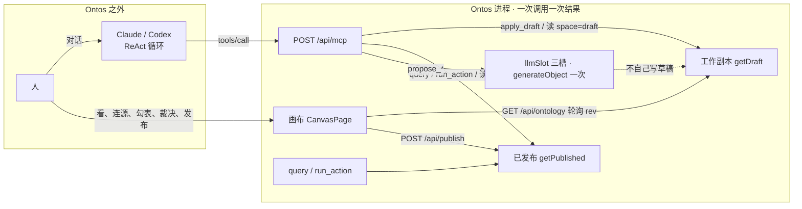
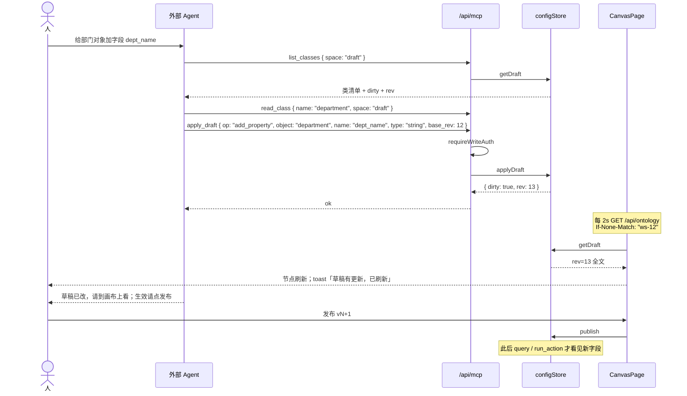
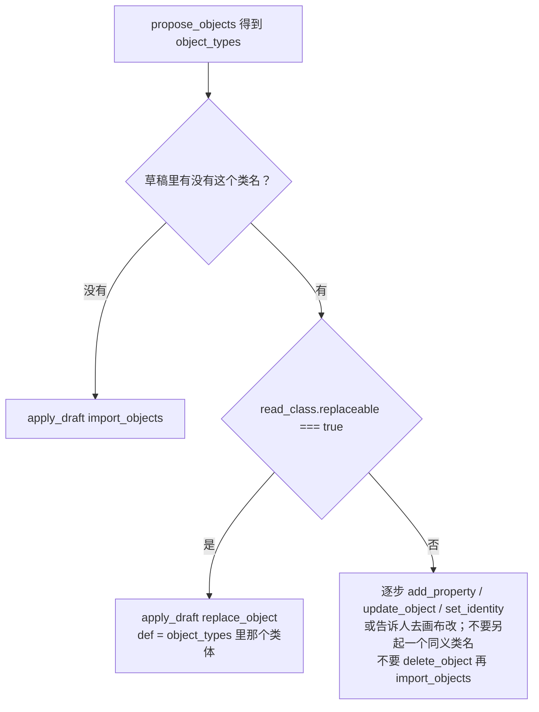

# 外部 Agent 编辑画布（MCP `edit_draft`）

> **历史评审记录**：本文档是早期迭代的评审结论，代码路径与 API 形态随重构变化。
> 现行结构见 `README.md`「代码结构」与 `AGENTS.md`。历史名对照：`configStore.ts` → `features/ontology/`（editDraft / commit / ops 的旧称）、
> `llmSlot.ts` → `infra/llm/slot.ts`、`views.ts` → `features/ontology/views.ts`、`load.ts` → `infra/connections.ts`、
> `apply_draft` 路由 → `edit_draft`；工作空间从 `?ws=` / `x-ontos-ws` 改为路径段 `/api/<空间名>/…`（`workspaceOf`）。


| 字段 | 值 |
|---|---|
| 作者 | TBD |
| 日期 | 2026-08-22 |
| 状态 | 已落地（2026-08-22～24） |
| 仓库 | `/Users/majiang/Documents/freespace/js/ontos` |
| 产品约束 | 画布仍是工作台；ReAct / 工具循环留在 Claude Code / Codex / 任意 MCP 客户端；Ontos 一次调用一次结果；不在页内加对话列、Copilot 侧栏、「再说一句」再生卡 |

下文是当时的设计。现行入口、工具清单与轮询纪律以 README、`skills/`、AGENTS.md 为准；op 以 `src/server/schema/ops.ts` 为准（16 个：14 条改本体 + `save_layout` / `save_edge_bend`；钉点随建线/改接的 `pins`）。

---

## Overview

今天外部 Agent 能问数、能跑已发布动作，也能让 `propose_objects` / `propose_action` 给出建议，但建议**不进工作副本**。画布上的改动只走 UI → `POST /api/apply_draft` → `applyDraft`。人在画布上看着、Agent 在 MCP 里写着——这两条路还没接上。`list_classes` / `read_class` / `search` 读的是已发布快照，Agent 若按这份配置改画布，会盖掉人尚未发布的编辑。

本设计补上这一条路：给 MCP 增加与 `draftOpSchema` **同一套**编辑语言的写入工具 `apply_draft`（与画布共用 `applyDraft` 同一判别联合），并让发现类工具能显式读工作副本。动作定义也走同一套 op：人在对象卡上新建/改/删，Agent 经 `set_action` / `remove_action` 写入，两端都进草稿。对象卡列出动作摘要（含「删除某某」），发布条点名动作变化。画布继续当**监视器**：轮询工作副本的 `rev`，有外部改动就刷新并 toast。发布、放弃、裁决、回滚、连接数据源、画布上的「生成对象」仍是人的关卡，不做成 MCP 写工具。循环、推理、多步拼装全部在 Ontos 之外；Ontos 内部保持一次调用、一次确定性结果（既有 LLM 槽位仍是一次 `generateObject`）。

---

## Background & Motivation

### 当前两条入口并不对称

《Ontology平台MVP设计文档.md》§9 写明入口两个、内核同一套：画布点「生成对象」走后端 `generateObject`；外部 Agent 经 MCP 调 `propose_objects` / `propose_action` / `query` / `run_action`。实现上第二条入口是半截的：

| 路径 | 读什么 | 写什么 | 是否上画布 |
|---|---|---|---|
| 画布 UI | `GET /api/ontology` → `getDraft` | `POST /api/apply_draft` → `applyDraft`；`POST /api/propose_objects` 再 `apply_draft` `{ op: import_objects }` | 是 |
| MCP | `getPublished`（`list_classes` / `read_class` / `search` / `query` / `run_action` / `propose_action`） | 只有 `run_action`（改源库个体，不改本体） | `propose_*` 明确不落地 |

`src/app/api/mcp/route.ts` 在 `tools/call` 入口无条件 `getPublished`。`propose_objects` 用 `resolveTableInfos` + `getSlot().proposeObjects` 产对象，返回 `{ object_types }` 即停——与 `src/app/api/propose_objects/route.ts` 同名同义。落地走 `apply_draft` `{ op: import_objects }`。

`src/server/schema/ops.ts` 的 `draftOpSchema` 已是画布编辑语言：`create_object` / `delete_object` / `update_object` / `add_property` / `remove_property` / `set_identity` / `create_link` / `delete_link` / `import_objects` / `save_layout`。MCP 一条都没暴露。

### 痛点

1. **建议不落地。** 人在 Claude 里说「把 department 表建成对象」，Agent 只能把 YAML 念出来，人还得回画布勾表、点「生成对象」。
2. **Agent 看不见工作副本。** 人刚在画布上加了字段、尚未发布，Agent 的 `read_class` 读不到。两端各改各的。
3. **画布不是监视器。** `CanvasPage.tsx` 的 `refresh` 只在本页 `op()` / generate / publish / discard / 回滚 / 裁决 `onDone` 之后调用。MCP 写入之后，开着的画布不会动。
4. **产品已经否掉页内对话。** 不为「再说一句」加浮卡，不为 Agent 开聊天列。人继续在画布上点关卡；Agent 继续在画布外面转圈。

### 不可协商（产品已定）

- 画布仍是唯一工作台，页上无对话抄本。
- ReAct 留在 MCP 调用方。不引入 Mastra，不在后端做 tool-calling LLM，不第四个 NL 改稿槽位。
- 人的关卡（引擎真的不做这些写工具）：连接的保存/删除、裁决、发布/放弃/回滚、摆位（`save_layout`）、以及画布上「勾表并点生成对象」的一次性按钮。产品事实：外部 Agent 经 `list_tables` → `propose_objects` → `import_objects` 也能把表建成对象，不经过画布勾选——这是 §9 第二条入口的完整形态，选表关卡只约束画布那条入口。
- 不新增本体 YAML 键，不改附录 B 保留字。编辑走 `draftOpSchema`（本设计只**谨慎扩三个**判别值 `replace_object` / `set_action` / `remove_action`，理由见下）。
- 用户看得见的字（工具说明、skill、toast）走 `AGENTS.md` 大白话。代码标识符可继续用 `draft` / `identity` / 工具名。

---

## Goals & Non-Goals

### Goals

1. 外部 Agent 能对**当前工作空间**的工作副本做逐步编辑（与画布共用 `applyDraft` 同一判别联合）：对象、字段、关系与画布同权；动作两端走同一套 `set_action` / `remove_action`。**本期对象卡表单只覆盖附录 B 动作定义的一个子集**（见 §6）：前置里本类非派生字段等于/不等于字面量、关系已发生/未发生；效应里 `update` 与 `delete`（请求点名的那个体）、`create`、转化 `link`。编号不在表单里填，在执行请求的 `identity` 里点。**只有 `update` / `delete` 保存时自动带上**附录 B 的 `object` + `identity: { from: identity }`；`create` 与 `link` 没有这个认人键（新建没有已有个体可认，转化用 `link: 关系名`）。控件上不出现认人。演示里验收入库（`now+1y`）、调拨、登记、结束维修、以及前置读阶段的报废，超出这个子集——先做出子集给人看，再决定要不要加格子。
2. Agent 能**显式**读工作副本，且默认读已发布——`query` / `run_action` 绝不改口。
3. `propose_objects` 仍只建议；Agent 自己把建议落成 `import_objects` 或 `replace_object`。`propose_action` 同样只建议，落地走 `set_action`。人在对象卡上也能新建/编辑/删除**简单动作**（同一套 op，范围见 Goal 1）。对象卡列出动作摘要、发布条点名动作变化。
4. 开着的画布在 Agent 写入后于约 2 秒内显示新草稿，并给一句白话 toast。
5. 写工具走 `requireWriteAuth`；空间由 URL 路径段决定，工具入参不带空间名。
6. Skill 拆成四个，按「世界 × 读写」分工：`ontos-query`（已发布·只读：查数）、`ontos-action-run`（已发布·写：执行已发布动作）、`ontos-canvas`（草稿：表→对象、逐步编辑画布）、`ontos-action`（草稿：写动作定义）。任何 skill 不得教 Agent 发布、放弃、裁决、回滚。

### Non-Goals

- 页内聊天列、Copilot 侧栏、「再说一句」/ `reviseObject` 浮卡。
- 把 `generate`（内省 + 槽位 + `import_objects` 一次完成）暴露为 MCP 工具。
- 在画布上做动作的 YAML / JSON 编辑器。对象卡白话表单只覆盖简单动作（见 Goal 1）；表单填不全的动作只展示摘要、只许删除，避免点「编辑」再保存把结构弄丢。告知（`inform`）本期表单不做。演示五条完整规矩是否加进表单，看过简单表单效果再定，不挡本期。
- 第四个 LLM 槽位（NL → 动作）。生成动作的是外部 Agent 自己；`propose_action` 仍给确定性模板，不开新的 `generateObject` 槽。
- 按 skill 裁剪 MCP 工具列表。`tools/list` 全量暴露九个工具（PR 2 起），分工由 skill 文档承担（§13）——skill 是提示不是沙箱：红线靠模型守；引擎真没有的是发布/裁决等关卡工具。
- Agent 写摆位（`save_layout`）。
- 新元数据表 `log_draft`、SSE/WebSocket、跨进程共享工作副本。
- 改附录 B、给动作加 `write` 名单、引入 `$root`。
- 多实例部署下草稿互见（`runtime.ts` 已写明单进程假设）。

---

## Proposed Design

### 总结构



人同时开着画布和外部 Agent。Agent 改的是工作副本；画布显示工作副本；问数与动作仍只加载已发布快照。Agent 停在「草稿已脏」。人在画布上点「发布 vN+1」或「放弃」，或打开「待确认」做裁决。

### 一次改画布的时序



---

### 1. 一个写工具：`apply_draft`

**选定：MCP 只增加一个写入工具 `apply_draft`，入参就是现有的判别联合 `draftOpSchema`，外加可选信封字段 `base_rev`。不为每个 op 各做一个工具，不发明第二套编辑语言。**

理由：

- `POST /api/apply_draft` 已经是「一个端点 + 判别联合」。MCP 与 REST 同骨架，Agent 与画布不会各写各的。
- 鉴权、`rev` 递增、`DraftReject` 映射、禁止 `save_layout`，都只拦在一处。
- 外部 Agent 已经在 skill 里按 JSON 拼 `query` / `run_action`；再拼一个带 `op` 的对象，与现状同级。
- 十个独立工具会让 `tools/list` 膨胀，并在每个工具里复制一份形状——`draftOpSchema` 一改，十处要跟。

一次调用只应用**一条** op，不收数组。多步由外部循环发起多次 `tools/call`。这与「一次调用一次结果、可回归」一致，也与 `POST /api/apply_draft` 一致。`import_objects` 内部仍是整批预检再一次写入（`configStore.ts` 已有原子性），那是一条 op 的既有语义，不是新的批处理信封。

#### 入参

调用形状与 REST 对齐（`add_property` 的 `object` 仍是类名）。`base_rev` 只出现在 MCP 信封，不进 REST 的 `draftOpSchema`：

```json
{ "jsonrpc": "2.0", "id": 1, "method": "tools/call",
  "params": { "name": "apply_draft",
    "arguments": { "op": "add_property", "object": "department", "name": "dept_name", "type": "string", "base_rev": 12 } } }
```

落地建议（新类）：

```json
{ "op": "import_objects", "objects": { "vendor": { "kind": "thing", "identity": "vendor_no", "properties": { "vendor_no": { "type": "string" } } } } }
```

整份替换（`def` 是单个类体，从 `propose_objects.object_types.department` 取出，不是整张 map，也不是 `read_class` 视图）：

```json
{ "op": "replace_object", "name": "department", "def": { "kind": "thing", "identity": "dept_id", "properties": { "dept_id": { "type": "string" }, "name": { "type": "string" } }, "sources": { "org": { "connection": "device_sys", "table": "department", "fields": { "dept_id": "dept_id", "name": "dept_name" } } } } }
```

信封与 op 分两次校验，禁止手拆字段。`base_rev` 在 MCP 信封**必填**（改画布必须先读草稿拿到 `rev`；省略即 `-32602`——后写赢只对 REST 画布成立），parse op 之前先把 `base_rev` 从信封里剥掉：

```ts
const applyDraftEnvelope = z.object({
  base_rev: z.number().int().nonnegative(),
}).passthrough();

// REST 的 draftOpSchema 仍含 save_layout（画布要写摆位）。
// MCP 的 op 联合与之共用同一组 variant，但抽掉 save_layout，避免 inputSchema 教 Agent 去调再被拒。
const mcpDraftOpSchema = z.discriminatedUnion("op", draftOpVariantsWithoutSaveLayout);
```

`src/app/api/mcp/route.ts` 在 `tools/call` 里：`requireWriteAuth` → 若 arguments 带 `space` 则 `-32602`（本工具不读已发布/草稿切换）→ `applyDraftEnvelope.parse`（失败 `-32602`，拦住 `"12"` 这种字符串与缺 `base_rev`）→ `mcpDraftOpSchema.parse`（先剥离 `base_rev`：`const { base_rev, ...rest } = env`；若仍收到 `save_layout`，运行时再 `DraftReject` 兜底）→ **`applyDraft(op, ws, { base_rev })`**。`base_rev` 的比较在 `applyDraft` 的 **enqueue task 开头**做（见 §7），MCP 路由不再比一次、也不再包一层队列。

`DraftReject` 必须映射为 JSON-RPC `-32000`（与 `EngineReject` 同档，`mcp/route.ts` 已落地：草稿冲突、校验回退都走这条）。REST 侧 `respond()` 把 `DraftReject` 变成 422；信封恒 200，错误看信封。

#### 返回

不把整份配置塞回 MCP（体大、且 Agent 应按视图再读）：

```ts
{
  ok: true,
  dirty: boolean,
  rev: number,           // Store.rev，与 GET /api/ontology、list_classes space=draft 同一计数
  base_version: number,
  op: string,
  names: string[],       // 见下表
}
```

`names` 收类名、关系名或 `类名.动作名`（不收字段名）：

| `op` | `names` |
|---|---|
| `create_object` / `delete_object` / `update_object` / `replace_object` / `update_link` | `[name]`（`update_link` 改名时给新名） |
| `add_property` / `remove_property` / `set_identity` / `update_property` | `[object]`（这里的 `object` 是类名，与现有 op 相同） |
| `set_action` / `remove_action` | `[object + "." + name]`（类名 + 动作名，如 `equipment.convert`）。画布 toast / 发布条不读这个字段，读 GET 的 `action_changes` |
| `create_link` / `delete_link` | `[name]`（关系名） |
| `import_objects` | `Object.keys(objects)`（可多个类名） |

Zod 失败：`-32602`。领域拒绝（重名、不存在、被引用、锁定、rev 冲突、禁止摆位）：`-32000`，message 中文，指明错在哪。未授权：`-32001`。

#### `tools/list` 说明（大白话，给 Agent 读）

今天七个工具的 description 都不提已发布（`list_classes` 写「列出本体里全部的类」）。加上 `space` 之后若不改说明，改画布的 Agent 会继续 `list_classes {}`，按已发布改，正是 Overview 要修的盖写。**PR 1 就必须改发现工具说明**；PR 2 补 `list_tables` 与 `apply_draft`。测试钉死 description 含「已发布」或「草稿」，避免回归成「全部的类」。

| 工具 | description |
|---|---|
| `query` | 按**已发布**本体查业务数据（只读）。入参：`{ query: 查询 JSON }`。不接受 `space`。 |
| `run_action` | 执行一条**已发布**动作。入参：`{ action, object, identity, request? }`。不接受 `space`。 |
| `propose_objects` | 对选中的表产对象建议（**不落到画布**）。入参：`{ tables: [{ connection, table }] }`。不接受 `space`。 |
| `propose_action` | 对某个类产一条动作建议（**不发布、不落到画布**）。返回 `{ name, action }`：`name` 是建议动作名，`action` 可直接作 `set_action.def`。有转化关系给 `convert_to_<晚阶段>` 转化模板，否则给 `set_fields` 骨架（属性已接好，与导入自动生成的同形同名）。入参：`{ object, space? }`。`space` 缺省 `published`（已发布）；草稿里尚未发布的类请传 `draft`。 |
| `list_classes` | 列出类的名字和说明。**缺省看已发布**；要看画布上还没发布的草稿，必须传 `space: "draft"`（返回里带 `outlets`——告知要发去的系统名列表）。入参：`{ space? }`。 |
| `read_class` | 读一个类的字段、关系、动作。**缺省已发布**（不含来源表）。改画布请传 `space: "draft"`，会带上来源对照。入参：`{ name, space? }`。**PR 2 起**补「能不能整份替换（`replaceable`）」；**PR 3 起**再补「完整动作定义」（读回-改-写回）。PR 1 的 description 写到「来源对照」为止，测试不钉「整份替换」与「完整动作定义」。 |
| `search` | 按文本找类名、关系名。**缺省已发布**；找草稿里的名字请传 `space: "draft"`。入参：`{ text, space? }`。 |
| `list_tables` | 列出已连接库里的表和列（只读列定义，**没有采样行**，不保存连接）。入参：`{ connection? }`。不接受 `space`。 |
| `apply_draft` | 改草稿，一次只改一步。草稿还没发布，问数和已发布动作看不见。入参 `{ op, ... }`，**必带 `base_rev`**（先 `list_classes space=draft` 拿 `rev`）。`op` 与草稿编辑同一套：创建/删除对象、增删字段、设认出同一对象靠的字段、创建/删除关系、导入对象、整份替换（未发布且未锁定的类）、设置/删除一条动作（`set_action` / `remove_action`）。不能发布、放弃、裁决、回滚，也不能改节点位置。不接受 `space`。 |

`inputSchema`：对 `apply_draft` 用 **Zod 4 的实例方法** `mcpDraftOpSchema.toJSONSchema()`（或 `import { toJSONSchema } from "zod"`），再并上**必填**的 `base_rev`。测试只断言「有 `inputSchema`、其中没有 `save_layout`、`base_rev` 不是 optional」，不要钉死某一个生成函数的符号。现有工具可以在同一 PR 补 `inputSchema`（纯加字段）；不是阻断项。

---

### 2. 编辑语言的两处扩展：`replace_object` 与动作写入（`set_action` / `remove_action`）

`import_objects` 在 `applyDraft` 里对已存在的类名整批拒绝（`configStore.ts`：「类已存在」；半途撞名不留下前几个类）。因此 Agent 不能对「刚生成、尚未发布」的类做「按表再建议一次并覆盖」。`delete_object` 再 `import_objects` 不是替代方案：`dropClass` 会拆掉挂在该类上的全部关系。

**不新增 `apply_proposal`，不新增 `upsert_objects`。** 建议仍由 `propose_objects` 产出；落地仍是 Agent 自己选 `import_objects` 或 `replace_object`（动作的落地见 §2.2 的 `set_action`）。upsert 会把「新建」和「覆盖」混成一次调用，Agent 不知道自己有没有打到已有类。`apply_proposal` 是第二套入口，提案形状与 op 形状会分叉。

为 `replace_object` 在 `draftOpSchema` 增加一个判别值（REST `POST /api/apply_draft` 同步具备，画布 UI 不必做按钮）。字段名用 `def`，避开现有语言里 `object` = 类名（`add_property` / `remove_property` / `set_identity`）：

```ts
// 草稿路径的类体剥掉 actions / axioms：动作只走 set_action（§2.2），公理本期没有写入 op
const draftObjectSchema = objectTypeSchema.omit({ actions: true, axioms: true });

z.object({
  op: z.literal("replace_object"),
  name: z.string(),
  def: draftObjectSchema, // 单个类体，不要 z.unknown()，不要 { [类名]: ObjectType } 那张 map
})
```

`import_objects` 与 `replace_object` 的类体统一剥掉 `actions` / `axioms`（多余键按 Zod 默认丢弃）——「写动作只走 `set_action`」由此成为**引擎形状，不是 skill 红线**；REST 画布的「生成对象」（`import_objects`）同口径剥离：生成对象不携带动作，动作只走 `set_action`。派生字段（`derived`）保留在类体里（派生允许经导入进入新类，见 §2.2 末段）。

`def` **只**来自 `propose_objects` 返回的 `object_types[name]`（从 map 里取出那一个类体）。禁止把 `read_class` 的视图塞回去：那份视图的 `properties` / `sources` 是数组，派生被压成 `"when" | "filter"`，过不了 `objectTypeSchema`。`read_class` 带的 `pk` / `sources` 只给逐步 `add_property` 看对照，不给整份替换当原料。

`applyDraft` 新分支（与 `import_objects` 一样：先校验，失败用既有 `backup` 整步回退）：

1. 类必须已存在，否则 `DraftReject("类不存在：…，新建请用 import_objects")`。
2. 用下面的**锁定规则**检查现有类。锁定则拒绝，message 列出原因，**不改草稿**。
3. 写入 `d.object_types[name] = input.def`（Zod 已在 schema 层 parse）。
4. **不**走 `dropClass`。关系留在 `link_types`。若替换后某条 `match` 指向已不存在的字段，既有 `validateSemantics` 会抛错，整步回退——Agent 应先 `delete_link` 或保留被配对的字段。
5. 摆位键仍在，节点不跳到新坐标。

#### 锁定规则（禁止覆盖，不做字段级合并）

`replaceBlockers(existing, publishedHasClass): string[]` 与 `applyDraft`、`read_class space=draft` 共用。命中一条即锁定。集合是否非空用 **`Object.keys(...).length`**，不用真值——`actions: {}` / `axioms: {}` 在 JS 里为真，LLM 草稿常带上空 map，不能因此误拒。

| 条件（实现） | 白话理由（加入 `replace_blockers` / `DraftReject`） |
|---|---|
| `publishedHasClass` | 已经发布过 |
| `Object.values(properties).some(p => p.derived)` | 含派生字段 |
| `Object.keys(actions ?? {}).length > 0` | 含动作 |
| `Object.keys(axioms ?? {}).length > 0` | 含公理 |
| `Object.keys(sources ?? {}).length > 1` | 挂了多个来源 |
| **仅当** `Object.keys(sources ?? {}).length >= 1`，且存在非派生字段，其名不出现在任何一条 `sources.fields` 的键里 | 含有未对照到表列的字段 |

命中则：

```
DraftReject("equipment 不能整对象替换：已经发布过；含派生字段；含动作；挂了多个来源。请用增删字段等逐步操作")
```

**未锁定** = 草稿里有这个类、已发布快照里没有、至多一个来源、没有派生字段/动作/公理，并且：有来源时每个非派生字段都能在 `fields` 里对上列。Agent 可以对它再跑一次 `propose_objects` 并整份换掉。

**没挂来源的类故意不走「未对照字段」锁。** `CannedSlot.proposeObjects` 猜不到识别字段时产出 `{ kind: "thing", properties }`、不写 `sources`（有源无 identity 过不了发布闸）。这正是「按表再建议一次并覆盖」要救的残缺生成态，必须 `replaceable: true`。人「新建对象」后的空类（`properties: {}`）同样可换。人在无源类上 `add_property` 过的，整份替换是后写赢——skill 写明：没挂来源的类一换会盖掉人加的字段；人已经在画布上改过就改用逐步操作。有来源的类上人加的字段仍靠上一表最后一行锁住。

识别字段和描述在未锁定类上是**后写赢**：`replace_object` 用建议稿里的 `identity` / `description` 盖掉当前值，不把「描述不同」当成锁。

不做字段级 merge。锁定即整类拒绝，Agent 改走 `add_property` / `update_object` / `set_identity`，或告诉人去画布改。

**引擎不闭合「先删再导入」。** `delete_object` 仍允许删已发布类（与画布危险区同权）；删完后草稿里没有这个名字，`import_objects` 按今天的「类已存在」规则会放行。画布「删掉再点生成对象」走的也是这条路，引擎不能改口去拒。闭合只靠 skill 红线 + 人点发布/放弃。`replace_object` 的锁定表管的是「这个名字还在草稿里的时候能不能整份盖」，不管绕开路径。

#### 2.2 `set_action` / `remove_action`：人和 Agent 都能写动作

动作的形状以《ontos-article.md》第 6 节和附录 B 为准，本设计不另开一套键。两层不能混：

- **写入请求**（执行时）：`{ action, object, identity, request? }`。只负责点名：哪个类、哪个个体、哪条动作。编号在入参里。
- **动作定义**（配置里 `actions` 的一条）：`description` / `pre` / `effect` / `inform`。改什么、怎么改，写在定义里。请求点名的那个体，效应写成 `object` + `identity: { from: identity }`；其他已有个体写成 `object` + `filter`。不许省略 `object`，不许 `$root`。`effect` 是列表，四项：`update` / `create` / `delete` / `link`（`link` 只用于转化，作用在请求点名的个体上，没有另一端）。

画布今天没有任何动作编辑入口。定义今天只来自种子配置和阶段裁决生成的转化动作。本设计只补落地点：`set_action` / `remove_action` 写入的 `def` 必须过现有 `actionSchema`（就是附录 B 那份）。人在对象卡上点「新建动作」/「编辑」/「删除」，走 `POST /api/apply_draft`；Agent 走 `apply_draft`。表单是附录 B 的**子集**，保存结果仍是合法 `ActionDef`，不是新语言。表单形状见 §6。

```ts
z.object({
  op: z.literal("set_action"),
  object: z.string(), // 类名，与 add_property 的 object 同义
  name: z.string(), // 动作名，就是 actions map 的键（actionSchema 里没有 name 字段）
  def: actionSchema, // 与种子配置、conversionAction 同一个 schema；不从 import_objects 带进来
});
z.object({
  op: z.literal("remove_action"),
  object: z.string(),
  name: z.string(),
});
```

规则：

1. **`def` 来自三处：`propose_action` 的返回、`read_class space=draft` 返回的完整动作定义（读回-改-写回，见 §3）、或按动作骨架拼的等价形状。** `propose_action` 返回的 `{ name, action }` 里 `action` 就是 `actionSchema` 的一份实例（`adjudicate.ts` 的 `conversionAction` 与 `skeletons.ts` 的 `set_fields` 骨架同构造点出品），建议与落地之间没有第二套形状。draft 视图的 `read_class` 必须返回完整 `ActionDef`（`effect` / `inform` 原样），否则 Agent 改现有动作只能盲覆盖——published 视图维持今天的 `name/description/pre`（问数 Agent 不碰写侧）。类上已有转化关系时 `propose_action` 只给转化模板（`conversionAction`），否则给 `set_fields` 骨架（属性已从类定义接好）；带前置的业务动作（调拨、报废）要在此基础上补前置、调效应——业务动作骨架内嵌在 `ontos-action`（§13）。
2. **`set_action` 是单条 upsert：同名覆盖、不同名新增。** 不做类级 merge、不整份替换 `actions` map。写错的动作用 `remove_action` 删掉重来，不靠 `delete_object` 再 `import_objects`（那条路拆关系，且 `replace_object` 对含动作的类锁定）。
3. **校验是「Zod + 语义校验」两道闸，语义校验本期补三处缺口（PR 3 随 `set_action` 与对象卡动作区一起合入 `validate.ts`）。** `actionSchema` 校验的是**定义**（`pre` / `effect` / `inform`），不是写入请求。写入请求仍是 `{ action, object, identity, request? }`。附录 B：禁止 `$root`，动作上不写 `write` 名单，插入生编号走 `generate` 列表，认人必须写明。`actionSchema` 就是这份规则。`validateSemantics` 保证引用合法（前置与效应过滤的键必须是类属性、`$link` 可解析，效应指向的类必须存在，效应写的属性必须存在且非派生，`$request` 与 `inform` 指向的类/出站必须存在）。四处今天漏掉的形状由**独立函数 `validateActionShapes`**（仍在 `validate.ts`）补上，`applyDraft` / `mutateDraft` / `publish` 在 `validateSemantics` 之后调用它——`getPublished` / `rollbackTo` **不调**，历史已发布的坏配置加载放行（运行期 `action.ts` 兜底，见 §14 与 Risks）：①**效应 `link` 项**必须指向 `link_types` 里已存在的 `transition` 关系，且 `from` / `to` 都在动作宿主类上（与 `action.ts:211-216` 运行期口径一致——今天只有运行期拦，草稿期不拦）；②**转化成对**：每条 `transition` 关系必须被至少一条动作的效应 `link` 引用（防孤儿转化关系，见规则 4）；③**取值来源形状**：效应与 `inform` 的 `properties` 取值、`update.identity` / `delete.identity`、效应 `filter` 的取值一律过形状校验——`from` 只许 `identity` / `action` / `object` / `current` / `request` / `generated`；`{ property, from? }` 组合里 from 缺省即 `current`（与 `expr.ts` 的求值分支一致），给了 from 则只许 `current` / `request`；`generated` 只许出现在 `create` 效应且目标属性带 `generate` 列表；`current` 只许出现在 `update` 效应的 `properties` 与 `update` / `delete` 效应的 `filter` 取值（逐个体求值有 current 上下文），`identity` 字段与 `create` / `inform` 不可用（create 投影没有 current 上下文，运行期必炸）——与 `expr.ts` 的 `resolveValue` 分支一致，今天非法形状要运行期才炸。④**认人必须写明**（附录 B）：每条 `update` / `delete` 必须有 `identity` 或 `filter`（二选一，不许都缺）。表单路径保存时自动写 `identity: { from: identity }`；Agent 缺了 → `DraftReject`，不要等发布后执行才拒。前置（`pre`）的取值本期**不在** ③ 范围——前置求值失败只是业务失败（`stage: "pre"`），不写库。任一失败整步回退（`configStore.ts` 每步操作后都跑）。Zod 失败 → `-32602`（REST 422）；类不存在 → `DraftReject` → `-32000`。注意：这两道闸保证的是**能跑**（形状与指称合法），不管**该不该跑**——业务毒性（前置被掏空、效应多挂 `delete`）能过形状闸。人自己在对象卡上写的，人看着摘要决定发不发；Agent 写来的，同样靠对象卡摘要 + 发布条点名（§6）。
4. **转化关系由裁决独占；转化动作的名字与内容不独占。** `create_link` 仍只收 `match`——Agent 无法用草稿 op 造出转化关系、冒充「阶段」定案；`stage` 裁决的 `mutateDraft` 生成的 `convert_to_*` 是转化动作的默认构造点，但动作本身可被同名覆盖/替代（与画布编辑同权，见规则 5；画布审查面让人看得见内容变化）。`set_action` 写出的动作若在效应里 `link` 一条关系，该关系必须已在 `link_types` 里（草稿期就拦，见规则 3①）。反过来（规则 3②）：`remove_action` 删掉一条转化关系的唯一引用动作会整步回退——孤儿转化关系（有关系、没有动作推进它）发布不出去。**逃生路径**：先 `set_action` 一条同样 `link` 该转化关系的替代动作，再 `remove_action` 删旧的——转化关系本身被 `linkRefs` 当引用保护（`refs.ts`），`delete_link` 删不掉。
5. **覆盖既有动作与画布编辑同权。** 覆盖种子配置的动作（demo 里的 `convert` 验收入库）或裁决生成的转化动作都允许：草稿可放弃；人点发布才进已发布，`run_action` 只执行已发布快照上的动作。
6. **`inform` 的出站必须已声明，而 `outlets` 没有写入 op。** 空白空间（`default` 与新建空间）的种子配置没有出站（`workspace.ts`；演示模板里的出站只在 `test` 空间），Agent 在那种空间写不出带 `inform` 的合法动作——去掉 `inform`，或由人在种子配置里声明出站。发现路径：`list_classes space=draft` 返回 `outlets` 名列表（§3）。

`replace_object` 的锁定规则不变：含动作的类不能整份替换，动作的修正走 `set_action` / `remove_action`。

`create_link` 仍然只收 `match`，不能写 `transition`。转化关系只由裁决的 `mutateDraft` 产生（`adjudicate.ts`）。Agent 无法用草稿 op 冒充「阶段」定案。

`add_property` 仍然没有 `derived` 字段。派生进工作副本的途径：`import_objects` / `replace_object` 的类体（剥掉 `actions` / `axioms`，`derived` 保留），或人在画布上裁决「阶段」。不为此再开 op。

---

### 3. 发现：默认已发布，显式 `space=draft`

**选定：在现有 `list_classes` / `read_class` / `search` 上增加可选 `space: "published" | "draft"`，缺省 `"published"`。不另做一套 `read_draft_*`，也不把已有工具默默改成读草稿。**

缺省保持已发布，问数 Agent 的既有剧本不用改。改画布的 Agent 必须在入参里写出 `space: "draft"`——这是刻意摩擦，避免把 `query` 的世界和画布的世界当成同一个。

`src/app/api/mcp/route.ts` 今天在任何工具之前 `const config = (await getPublished(ws)).config`。改为**按工具取配置**：`query` / `run_action` 继续只取已发布；三个发现工具与 `propose_action` 用

```ts
z.enum(["published", "draft"]).optional()
```

解析 `space`（缺省 published）。非法值 `"Draft"` / `"working"` → `-32602`，不要静默当 published。

下列工具**不接受** `space`：`query`、`run_action`、`propose_objects`、`apply_draft`、`list_tables`。arguments 里一旦出现 `space` 键 → `-32602`「这个工具不接受 space」。Agent 带着 `space: "draft"` 去 `query` 时必须失败，不能假装查了草稿却返回已发布世界。

#### 返回形状

`space=published`（缺省）：与今天一致。`read_class` 仍不返回 `sources` / `pk` / `axioms`（`views.ts` 与《ontos-article.md》§5.3：问数 Agent 不绑表）。

`space=draft`：

`list_classes`：

```ts
{
  space: "draft",
  dirty: boolean,
  rev: number, // getRev(ws)，与 Store.rev 同一计数
  base_version: number,
  classes: { name: string; description?: string; state: "new" | "modified" | "same" }[],
  outlets: string[] // 全局出站名（inform 的合法去向），只读
}
```

`outlets` 是全局配置，不是类属性，放在 `list_classes` 一次带回——Agent 写带 `inform` 的动作前必须从这里确认出站名（`outlets` 没有写入 op，见 §2.2 规则 6）。

`state` 的算法与 `GET /api/ontology` 相同（`ontology/route.ts` 用 `sameConfig`）。

`read_class` 在既有 `ClassView` 上增加（仅 draft）：

```ts
{
  // ...既有 name / description / kind / identity / properties / relations
  actions: { name: string; def: ActionDef }[], // draft：完整动作定义（读回-改-写回）
  state: "new" | "modified" | "same",
  sources?: { name: string; connection: string; table: string; pk?: string; fields: Record<string, string> }[],
  replaceable: boolean,
  replace_blockers: string[]  // 空数组 = 可 replace_object；否则与 replaceBlockers 同一套白话
}
```

draft 视图**带 sources**（连接名、表名、`fields`，可带 `pk`），因为逐步改画布必须看见对照。仍不返回连接密码。**类的**这些字段**不能** round-trip 进 `replace_object.def`：`def` 只从 `propose_objects.object_types[name]` 取。**动作是例外**：draft 视图的 `actions[].def` 是完整 `ActionDef`（`effect` / `inform` 原样，视图不压扁），Agent 改完直接塞回 `set_action.def`——这是动作的读回-改-写回闭环；published 视图维持今天的 `{ name, description, pre }`（问数 Agent 不碰写侧）。`replaceable` / `replace_blockers` 由与 `applyDraft` 共用的 `replaceBlockers` 计算（PR 2 接线）。完整 `actions[].def` 在 PR 3 才返回（与 `set_action` 同 PR）。PR 1 的 draft `read_class` 只加 `state` / `sources` / `pk`。

`search` 在草稿的类名、说明、关系名上做与今天相同的子串匹配。

实现落在 `src/server/features/ontology/views.ts`：现有纯函数继续吃一份 `OntologyConfig`；`replaceable` / `replace_blockers` 由 `configStore`（或与 `applyDraft` 共用的 `replaceBlockers(existing, publishedHasClass)`）计算，避免锁定文案在读路径和写路径各写一份。

#### `propose_action` 与 `space`

今天 `propose_action` 在**已发布**配置上找类。草稿里新建、尚未发布的类会得到「配置中没有类」。允许 `space: "draft"`，缺省仍 `"published"`。只改变查找哪份配置，仍然一次出模板、不落地、不新增槽位。转化模板继续走 `conversionAction`（`adjudicate.ts` 唯一构造点）。

`propose_objects` 不读本体配置，只读表结构，不需要 `space`。

`propose_action` 返回的 `{ action }` 就是 `set_action.def` 的一份实例（动作骨架同形，见 §2.2），非转化类拿到的 `set_fields` 骨架属性已接好，可直接落地；业务动作在此之上补前置、调效应——效应写了不存在的属性会被拦（`validate.ts`）。

---

### 4. 只读发现表结构：`list_tables`

`propose_objects` 的入参是 `{ tables: [{ connection, table }] }`。没有表名，Agent 只能猜。画布的「表结构」抽屉走 `GET /api/list_tables`（含 3 行脱敏采样）。采样是给人看的；Agent 建模只需要列定义。

新增只读工具 `list_tables`，入参 `{}` 或可选 `{ connection?: string }`：

```ts
{
  sources: {
    connection: string;
    error?: string;
    tables: { name: string; columns: { name: string; type: string; pk: boolean }[] }[];
  }[]
}
```

复用 `getDriverRegistry(ws).introspect`，**不下发 `sample`**。不保存连接，不删连接。不设写令牌闸（与 `introspect` 一致）。

按连接 `try/catch`，与 `GET /api/list_tables` 同口径：一个连接失败不让整个工具变成信封错误。`DriverRegistry.introspect` 对未注册连接抛 `EngineReject`，对无 `introspect` 的驱动抛普通 `Error`（`registry.ts`）；两者都收进该槽的 `error`，**不要**把驱动内部主机/路径原样出网，文案与 introspect 相同：「连接失败或读取表结构失败」。未知 `connection` 名（入参点了不存在的连接）：

```ts
{ sources: [{ connection, tables: [], error: "没有这个连接" }] }
```

不要 `-32603`，也不要空数组假装「这个空间没有任何库」。未传 `connection` 时遍历 `connectionNames()`，逐个 introspect，失败的源仍出现在 `sources` 里并带 `error`。

这不是「选表关卡」的缺口——**选表关卡只约束画布那条入口**（勾表 → 「生成对象」按钮不做成 MCP 工具）。产品事实写清：外部 Agent 经 `list_tables` → `propose_objects` → `import_objects` 也能把表建成对象，不经过画布勾选——这是 §9 第二条入口的完整形态。若产品仍要求「选表必须经过人」，就不该给 `import_objects`——本设计选择给，并把话说在明处。

连接数据源（账号、密码、测通）仍只走画布 `ConnectForm` → `POST /api/connections`。MCP 不列密码，不提供保存/删除连接。

---

### 5. 人的关卡 vs Agent 能写什么

| 能力 | REST（画布） | MCP | 裁定 |
|---|---|---|---|
| `create_object` / `update_object` / `delete_object` | `POST /api/apply_draft` | `apply_draft` | 允许。与编辑卡危险区同权；未发布可放弃 |
| `add_property` / `remove_property` / `set_identity` | 同上 | 同上 | 允许 |
| `create_link`（仅 `match`）/ `delete_link` | 同上 | 同上 | 允许。`transition` 仍只有裁决能写 |
| `import_objects` | generate 内部；draft 也可 | `apply_draft` | 允许。这是 `propose_objects` 的落地点；类体剥掉 `actions` / `axioms`（动作只走 `set_action`） |
| `replace_object`（新判别值） | `POST /api/apply_draft` 可用，UI 无按钮 | `apply_draft` | 允许，受锁定规则约束；类体同样剥掉 `actions` / `axioms` |
| `set_action` / `remove_action`（新判别值） | 对象卡「新建动作」/「编辑」/「删除」→ `POST /api/apply_draft` | `apply_draft` | 允许。人与 Agent 同权。删掉转化关系的唯一引用动作会被语义校验拦下（§2.2 规则 4） |
| `save_layout` | 画布拖动 / 「整理布局」 | **禁止** | 摆位是界面状态；新节点走 dagre |
| 勾表并「生成对象」 | 画布连发 `propose_objects` + `apply_draft` `{ op: import_objects }` | **禁止**做成第三条 MCP 写工具 | 画布关卡。Agent 自己拆成 propose + import |
| `propose_objects` / `propose_action` | 无 | 保持，只建议 | 建议；落地分别走 `import_objects` / `set_action` |
| `query` / `run_action` | `POST /api/query`；动作无 REST 主路径 | 保持，只读已发布 | 引擎不加载草稿 |
| `list_classes` / `read_class` / `search` | 无（画布走 `/api/ontology`） | `space` 缺省 published | 改画布必须显式 draft |
| `list_tables` | `GET /api/list_tables`（含采样） | 新工具，无采样 | 允许只读 |
| 连接的保存/删除 | `POST`/`DELETE /api/connections` | **禁止** | 连源关卡 |
| 发布 / 放弃 | `POST`/`DELETE /api/publish` | **禁止** | 发布关卡 |
| 裁决 | `POST /api/decide` | **禁止** | 裁决关卡 |
| 回滚 | `POST /api/versions` | **禁止** | 回滚关卡 |
| 交集率 | `POST /api/compute_overlap` | **禁止（本期）** | 证据在裁决卡上；该调用会全列扫描并写计数 |
| 候选对列表 | `GET /api/list_candidates` | **禁止（本期）** | Skill 让 Agent 请人去点「待确认」 |
| 验收问题集 | `/api/questions` | **禁止** | 画布卡 |
| 工作空间的新建 | `POST /api/workspaces` | **禁止** | 空间由 URL 路径段 `/api/<空间名>/…` 绑定 |

`delete_object` 允许删已发布类：草稿变脏，`GET /api/ontology` 的 `deleted` 列出待删。真正从引擎消失要等人发布。人随时「放弃」。Skill 写明：删已发布类之前要读 `space=draft`，并告诉人「放弃可撤销」。

删完再 `import_objects` 同一名字，引擎会当成新建（锁定只挂在 `replace_object` 上）。这是故意与画布「删掉再生成」对齐，不是漏洞要在引擎里堵。风险见 Risks；skill 红线禁止 Agent 用这条路绕过已发布锁定。

---

### 6. 画布当监视器：`rev` + 短轮询 + ETag

今天没有任何 `EventSource` / `etag` / `setInterval`。`CanvasPage` 只在自己的写路径之后 `refresh()`。最小能让「画布是监视器」成立的机制：

#### 后端：`rev` 挂在 `Store` 上，只加不回零

`rev` **不**放进易失的 `DraftState`。`discard` 会 `store.draft = undefined`；`rollbackTo` 会整份替换 `store.draft` 对象。若 `rev` 活在 `DraftState` 上，这两步要么把计数归零，要么新对象上根本没有 `rev`。监视器按相等比较：干净画布 `lastRev === 0`，另一标签回滚后新草稿也是 `rev = 0`，本页会漏刷新。

```ts
interface Store {
  published?: { config: OntologyConfig; version: number };
  draft?: DraftState; // DraftState 不加 rev
  rev: number;        // 进程内单调，只加不回零；新建 Store 为 0
}

export function getRev(ws: string): number {
  return storeOf(ws).rev;
}
```

`storeOf` 建新条目时写 `{ rev: 0 }`（今天是 `s = {}`，本功能必须改，否则 `store.rev += 1` 得到 `NaN`）。下列路径在内容已经写进 `Store` 之后、**下一个 `await` 之前** `store.rev += 1`（失败不加，`save_layout` 不加）：`applyDraft`、`mutateDraft`、`publish`、`discard`、`rollbackTo`。

今天 `applyDraft` 在 `validateSemantics` 之后就会 `await setLayout`（删对象）和 `await getPublished`（算 dirty）。若把 `rev += 1` 放在函数末尾，中间窗口里草稿已变、`getRev()` 仍是旧值：监视器带着旧 `If-None-Match` 会 304，把已经改过的正文当成没变；队列内下一条带 `base_rev` 的写入也会误判相等。约定按路径拆两条：

1. `applyDraft` / `mutateDraft`：`validateSemantics` 成功后立刻 `store.rev += 1`（内容已写、第一个 `await` 之前）。
2. `publish` / `rollbackTo` / `discard`：`store.published` / `store.draft` 换好之后、下一个 `await`（如 `fillDecisionVersions`）之前 `+= 1`——它们的 store 写入本来就在 `await` 之后（先 `insertVersion` 再换快照），「第一个 await 前」不可行；关键是「写完、下一个 await 之前」，同样不给监视器与 `base_rev` 留误判窗口。

PR 1 在五个写路径各加注释钉这条：「`rev += 1` 必须在内容写进 Store 之后、下一个 `await` 之前」。

`getDraft` 在 `store.draft` 为空时从已发布克隆，**只填 DraftState，不改 `rev`**。

导出 `getRev`。`GET /api/ontology`、`list_classes space=draft`、`apply_draft` 的返回与 `base_rev` 比较，一律读 `getRev(ws)`，不读「草稿对象上的字段」。

不给 `save_layout` 加 `rev`：人拖节点不应让监视器当成外部改动去 toast。Agent 也被禁止写摆位。

`GET /api/ontology` 的 JSON 增加 `rev: getRev(ws)`。响应头同时带：

- `ETag: "<ws>-<rev>"`
- `Cache-Control: no-store`（**200 与 304 都带**）

请求带匹配的 `If-None-Match` 时，`respond` 的 fn 直接返回 `304` 空体（`respond` 已支持透传 `NextResponse`），304 也要 `Cache-Control: no-store` 与同一 `ETag`。没有 `Cache-Control` 时，浏览器默认 `fetch` 可能把 GET 200 缓存起来，轮询就看不见 Agent 写入。

`rev` 不进元数据库。工作副本今天就是进程内对象（`runtime.ts`：已发布/工作副本是进程内缓存，多实例不会互见）。进程重启后草稿本就丢；`rev` 丢了画布会整页重载。不为 `rev` 单开持久化。

PR 1 的 `configStore` 测试钉：放弃后 `getRev()` 变了且**不等于 0**（相对放弃前 +1）；在 `rev === 0` 的干净草稿上 `rollbackTo` 也会 `+1`。

#### 前端：2 秒轮询，隐页暂停

`CanvasPage.tsx`：

1. `lastRev` ref，**每次** `setOnt` 成功都写成这次 JSON 的 `rev`（本页写入的 `refresh` 与轮询共用这一句）。
2. `localBusy` ref。下列本页写路径都必须包进同一个助手 `withLocalWrite`：`op()`、generate、publish、discard、rollback、**裁决 `PairCard onDone`**（今天是 `loadPairs().then(() => refresh())`，不经 `op()`，漏了就会把人刚裁的「同一」toast 成外部改动）。

```ts
async function withLocalWrite(fn: () => Promise<void>): Promise<boolean> {
  localBusy.current = true;
  try {
    await fn(); // 内部：请求 + refresh/setOnt。成功路径上不要在 apiPost 与 setOnt 之间把 localBusy 放下
    return true;
  } catch (e) {
    failToast(e);
    return false;
  } finally {
    localBusy.current = false; // 失败也放下。写成功但 refresh 失败同样放下，让下一轮 2s 轮询把已落地的草稿拉回来
  }
}
```

禁止只在成功路径置假：今天 `op()` 在 `apiPost` 抛错时 `failToast` 并 `return false`、不 `setOnt`。若没有 `finally`，`localBusy` 永真，点 3 会让监视器从此失效。PR 3 用注释钉这条约定（React 轮询不强制 vitest；若抽得出纯函数助手可单测「reject 之后 `localBusy === false`」）。
3. 轮询结果若 `localBusy` 或 `rev === lastRev`：**既不 `setOnt` 也不 toast**（304 视为 `rev === lastRev`）。
4. `setInterval(2000)` + `document.visibilityState === "visible"`。页隐藏则停。卸载时 `clearInterval`。
5. 轮询用自有 `fetch`（不要复用现在的 `apiGet`：它对非 2xx 抛错，且假定 JSON 体），显式 `cache: "no-store"`，并带 `If-None-Match`。304 = 无变化。
6. 打开的对象卡若对应类已不在 `object_types`（进了 `deleted` 或不存在）：`setCard(null)`，toast「这个对象已从草稿里去掉」。
7. 描述框监视范围（实现时不要「修」成每次 poll 冲掉正在打的字）：
   - **焦点在该 textarea 上**：保持 `key={card.name}` + `defaultValue`，refresh 不重挂，未保存的字保住。失焦仍跟 `defaultValue` 比，没改就不发 `update_object`。
   - **焦点不在该框**：用 `key={\`${card.name}:${sel.description ?? ""}\`}` 按当前草稿重挂，让 Agent 的 `update_object` 出现在卡内。
   - 开着且人没碰描述时，若实现忘了无焦点重挂，卡内会留着旧 `defaultValue`，节点上的说明已经新了。这是已知限制，不要靠关卡来「解决」。
8. `OntologyCanvas` 已在 `initialNodes` 变化时保留当前节点坐标（正在拖的不被回包弹回）。新节点没有当前坐标，走 dagre 回退（`layout?.[name] ?? pos.get(name)`）。**外部改动不 `fitView`。** 例外：现有 `fittedOnce` 在本页观察到 `objects.length` 从 0 变成非 0 时取景一次（空画布 + Agent 第一次 `import_objects` 要能看见节点）。取过这一次之后，再有外部新增不取景。人可用已有的「整理布局」。

Toast 文案（大白话，不出现 MCP / draft op / working copy / 工作副本）。对象名集合用本页上次 `ont.object_types` 的键与新 JSON 做差集；动作差集读本次 JSON 的 `action_changes`（**不是** MCP 返回的 `names`）。判定顺序必须如下，禁止「对象键不变 → 默认句」把动作句做成死代码：

1. 对象键有增减 **且** `action_changes` 三个数组不全空：一句拼完。「草稿有更新，已刷新（新对象：vendor；动作有更新：equipment.convert）」
2. 只有 `action_changes` 非空（对象键不变，含同名覆盖、只改 `pre` / `effect`）：「草稿有更新，已刷新（动作有更新：equipment.convert）」。名字取 `added ∪ overwritten ∪ removed`，多个用顿号。
3. 只有对象键增减：沿用下面三句。
   - 只有新增：「草稿有更新，已刷新（新对象：vendor、site）」
   - 只有去掉：「草稿有更新，已刷新（已去掉：vendor）」
   - 新增和去掉都有：「草稿有更新，已刷新（新对象：vendor；已去掉：site）」
4. 对象键不变 **且** `action_changes` 三个数组都空（只改了字段/关系/描述）：「草稿有更新，已刷新」
5. 轮询连续失败一次即可（不要每 2 秒弹）：「没法自动刷新画布，请重新打开本页」

「删了再导入同名」：对象键差集可能为空，但类体与已发布不同，`action_changes` 或类级 `states: modified` 仍会现形；若动作也被剥掉再另写，走第 2 句。

#### 动作区（看 + 改）

人和 Agent 都能写动作（§2.2）。对象卡要能新建、编辑、删除；Agent 写来的也要看得见（新增 / 已修改标记、发布条、toast）。下面先钉展示契约，再钉表单。这与对象卡上「加字段 / 删字段」不是一件事：加字段是给这类东西多一个特征；动作里「把字段写成某值」是将来对**某一个体**（某一台设备、某一个人）改源库里已有的那一列。

**`GET /api/ontology` 不改 `object_types[cls].actions` 的形状**——今天已是完整 `ActionDef`（`effect` / `inform` 原样）。对象卡从这份 def **在前端算出展示**；不要把 GET 的 `actions` 换成摘要数组（`Object.keys` 会变成 `"0"`、`"1"`，节点动作名标签会坏）。另给顶层差集，与 `deleted` 同模式（服务端算好再下发）：

```ts
action_changes: {
  added: string[];       // "equipment.transfer"
  overwritten: string[]; // 同名且 sameConfig(已发布动作, 草稿动作) === false
  removed: string[];     // 已发布有、草稿没有
}
```

计算：遍历草稿与已发布的每一类 `actions`。名字只在草稿 → `added`；只在已发布 → `removed`；两边都有且 `sameConfig` 失败 → `overwritten`。元素一律 `类名.动作名`。

**效应摘要**是画布纯函数，入参一条 `ActionDef`，出 `string[]`（每条效应一行，`inform` 另行列出）。四种效应和告知都必须覆盖——缺「撤走」一行就不许写「多挂 delete 能被人看见」：

| 效应 | 展示（白话；类名/属性名/关系名用配置里的机器名） |
|---|---|
| `update` | `把 <object> 的 <属性名顿号连接> 写成新值` |
| `delete` | `撤走 <object>`（毒性关卡底线，不能省；列表按钮仍叫「删除」，效应摘要用「撤走」，避免两个「删除」） |
| `create` | `新建 <object>` |
| `link` | `转化 <关系名>` |
| `inform`（可选，每条一行） | `告知 <to 里的名字顿号连接>（<object>）` |

不展示 `from`、字面量、`filter`、`identity`。同一属性换取值来源或字面量，摘要一行不变——写进 Risks。表单认得出的动作，人点「编辑」能看见取值；认不出的只有摘要。不要假装列表已经审完函数体。

前置：`pre` 缺省或 `{}` 时**显式写「无前置」**，不要把这一栏藏起来（掏空前置必须看得见）。非空则把 `pre` 的 JSON 原样列出，不再摘要。

1. **对象卡动作区**：字段区之下加「动作」区。顶部「新建动作」。每条动作：名字、若在 `action_changes.added` 标「新增」、若在 `overwritten` 标「已修改」、描述、前置、效应摘要（`effectSummary`）；后接「编辑」「删除」（能否「编辑」见下面表单兼容）。数据：`object_types[name].actions`（完整 def）+ 顶层 `action_changes`。列表按钮跟常见后台一致：编辑 / 删除；不要用「改」（会和「把字段写成某值」撞名）。
2. **发布条点名动作差集**：发布按钮的 `title` 除了「将删除的类」，只印 `action_changes` 里**实际发生**的子集，三个动词不要永远并排：
   - 只有新增：「将新增的动作：equipment.transfer」
   - 只有内容变了：「将更新的动作：equipment.convert」
   - 只有去掉：「将删除的动作：equipment.scrap」
   - 多类变化用分号拼：「将新增的动作：equipment.transfer；将更新的动作：equipment.convert」
3. **toast 点名动作变化**：见上表第 1、2 句。人手在对象卡上保存动作也走 `op()` → `withLocalWrite`，不 toast 成「外部改动」。

「放弃」今天是一键生效、无确认。改为点「放弃」先 `window.confirm("放弃会连别人刚写的动作和你改的字段一起没。确定放弃？")`：否 → 不发 `DELETE /api/publish`；是 → 再发。不要只写在按钮 `title` 上冒充确认。文案不出现「Agent」。

##### 对象卡上怎么加 / 改动作

仍是右侧那张对象卡，不新开 `Card` 种类（同一时间一张卡）。点「新建动作」或「编辑」时，动作区换成表单；保存或取消回到列表。保存走 `op({ op: "set_action", object, name, def })`；删除走 `op({ op: "remove_action", object, name })`，先 `window.confirm("删除这条动作？进草稿，发布后才从已发布里拿掉")`。引擎拒绝（例如删掉转化关系的唯一引用）走现成 `failToast`。

表单是附录 B **动作定义**的子集，不是写入请求的编辑器（请求仍是第 6 节的 `{ action, object, identity }`）。控件不出现配置键名；保存拼出的 `def` 必须过 `actionSchema`。编号不出现在表单上。

表单白话字段：

| 栏 | 控件 | 写成配置 |
|---|---|---|
| 名字 | 文本。新建可改；已有动作改名字本期不做（没有改名 op，要删了再建） | `set_action.name` |
| 说明 | 多行文本 | `description` |
| 这条动作要先满足 | 可空列表，「加一条」。两种行：① 选本类非派生字段 + 等于/不等于 + 字面量；② 选从本类出发的关系 + 「必须已经发生」/「必须还没发生」 | ① `pre[字段]=值` 或 `{ ne: 值 }`；② `pre.$link[关系]=true/false` |
| 做完会 | 非空列表，「加一条」。对应附录 B 效应四项的子集：① `update` 把本类**非派生**源列属性写成某值（值=`{ from: request }` 或字面量，不要 `now` 系）；② `link` 转化（下拉本类上已有的 `transition` 关系；`link` 没有另一端）；③ `create` 新生某个已有类（属性值：`{ from: request }` / `{ from: identity }`＝请求顶上的识别值 / 字面量）；④ `delete` 撤走本类、请求点名的那个体。①④ 控件不出现「哪一台」；保存时按附录 B 自动写 `object` + `identity: { from: identity }`，无 `filter`。不是给类加字段、删字段 | `update` / `link` / `create` / `delete` |

「请求里来的」= `{ from: "request" }`。不做 `$request` 认人、`$exists`、跨类 `update.filter`、告知、派生字段当前置、日期表达式。演示里这几条表单加不出原样：报废（前置要阶段）、验收入库（一年保修）、调拨、登记、结束维修。Agent 仍能写；列表只展示、只许删。

**表单认不出的动作**：列表里照常展示摘要；**不出现「编辑」**，只留「删除」。点「编辑」再保存不得把认不出的键丢掉。谓词必须与从表单控件重拼出的 `def` 一致，签名 `formCompatible(def, cls, config)`。白名单：

- 无 `inform`
- `pre`：键只能是本类**非派生**字段（值为字面量或 `{ ne: 字面量 }`）或 `$link`（值为 true/false，不能嵌套过滤）
- `update`：`object` 是宿主类、无 `filter`、**必须** `identity: { from: identity }`（附录 B：请求点名的那个体必须这样写；缺了不是「入参里有编号就行」，引擎不补）、属性名非派生源列属性、属性值只许 `{ from: "request" }` 或字面量（字符串不得是 `now` / `now/d` / `now+1y` / `now-1d/d`）
- `create`：属性值只许 `{ from: "request" }` / `{ from: identity }` / 字面量（不要表达式、不要 `{ from: generated }`）
- `delete`：`object` **必须是宿主类**（本类、请求点名的那一个；Agent 写的跨类删除不算表单能编辑的）、无 `filter`、**必须** `identity: { from: identity }`；下拉只给本类
- `link`：关系必须是配置里从本类出发的转化关系

不满足则无「编辑」。PR 3 用演示动作钉测试：`convert` / `transfer` / `scrap` / `register` / `finish_repair` 必须为假（列表无「编辑」）。为真用例必须带 `identity: { from: identity }`；`expiry: now/d` 的 create 必须为假。

新建默认：名字空、说明空、前置空、做完会一条「把字段写成某值」占位（保存前必须选出属性；写出的 `update` 按附录 B 带 `object` 与 `identity: { from: identity }`）。有转化关系时，「做完会」的种类里才出现「转化」。效应种类文案用「把字段写成某值」，不要和列表按钮「编辑」撞名。

表单开着时（与描述框同级，避免未保存被冲掉）：

- 视为 `formBusy`：轮询 `rev` 变了也不 `setOnt` 冲表单；保存或取消后再拉一次。可用 toast「草稿有更新，保存会盖掉外面刚写的」提醒，不要偷偷重挂。
- Esc：焦点在输入框里不关卡（已有）；焦点在表单里、不在输入框 = 取消表单回到列表，不是关掉整张对象卡。有未保存改动则 `confirm`。
- 点另一个对象 / 关卡 / 对象被删：有未保存改动则 `confirm`。
- 保存仍不带 `base_rev`；若 `getRev()` 已不是打开表单时的值，先 `confirm`「外面已经改过这份草稿，还要按表单覆盖吗？」

不在画布上调 `propose_action`（那是 MCP 槽位/模板）。转化动作的默认骨架仍只由裁决生成；人可以在表单里加一条「转化」效应，规则 3① 会拦指向不存在的转化关系。

不加常驻「直播中」指示灯。关卡区已有「发布 vN+1 / 放弃」随 `dirty` 出现，足够表示草稿未发布。

不新增「刷新」按钮。不引入 SSE：单用户、2 秒延迟可接受、少一条长连接与 Next 路由形态。

体量：演示本体 JSON 约数十 KB；304 时无 body。单标签约 30 次 GET/分钟。目标：有改动时端到端（Agent 调用返回 → 画布可见）p95 < 3s，其中轮询周期占 2s。

---

### 7. 并发：进程内队列 + 可选 `base_rev`

工作副本是进程内可变对象。`applyDraft` 在同步的 `switch` 里改同一份 `state.draft`，但校验之后有 `await setLayout` / `await getPublished`。两个请求在 await 处交错时，备份回退会对错对象。画布 `op()` 与 MCP `apply_draft` 同时发生，是本功能的真实交叉，不是假想多租户。

**选定：`configStore` 按工作空间串行化** `applyDraft` / `mutateDraft` / `publish` / `discard` / `rollbackTo`。实现为每空间一条 Promise 链（内存 Map），不是分布式锁。单用户 demo 够用，也堵住 await 窗口。

链失败后必须还能继续。禁止 `tail = tail.then(fn)` 这种写法：第一次 `DraftReject` / `validateSemantics` 失败会让后续 `applyDraft`、画布拖动、发布全部挂死直到进程重启。契约：

```ts
const tails = new Map<string, Promise<void>>();

function enqueue<T>(ws: string, task: () => Promise<T>): Promise<T> {
  const prev = tails.get(ws) ?? Promise.resolve();
  const run = prev.then(task, task);          // 前一次拒绝也跑这一次
  tails.set(ws, run.then(() => undefined, () => undefined)); // 只续链，吞掉结果
  return run;                                 // 拒绝仍传给 MCP / REST
}
```

**全仓只有这一层队列。** 各写路径的函数体包进自己的 `enqueue`（`applyDraft` / `mutateDraft` / `publish` / `discard` / `rollbackTo` 各包一次）。MCP / REST **禁止**再套一层 `enqueue`：同一条 `tails` 链会等自己，写路径挂死。PR 2 测试钉：前一次 `DraftReject` 之后，下一次 `create_object` 仍成功。

`base_rev` 必须在**同一个** enqueue task 里、在改草稿之前比较。推荐签名：

```ts
export async function applyDraft(
  input: DraftOp,
  ws: string = DEFAULT_WS,
  opts?: { base_rev?: number }, // 只 MCP 传；REST / 画布不传
): Promise<DraftState> {
  return enqueue(ws, async () => {
    if (opts?.base_rev !== undefined && opts.base_rev !== getRev(ws)) {
      throw new DraftReject(`草稿已变（rev=${getRev(ws)}），请重新读取再改`);
    }
    // …现有 switch + validateSemantics
    // validate 成功后、第一个 await 前：if (input.op !== "save_layout") storeOf(ws).rev += 1
    // …
  });
}
```

MCP 只 `parse` 然后 `applyDraft(op, ws, { base_rev: env.base_rev })`，**不要**在路由里比 `getRev`。比在队列外的时序：Agent 读到 12 → 路由判断 12===12 → 画布 `add_property` 跑完 rev=13 → MCP 的 `applyDraft` 入队写上去，冲突被吞掉。

- **省略 `base_rev`**：只发生在 REST 画布路径（不发 `base_rev`，在队列里后到的写入赢，与今天画布连续点字段同一语义）。MCP 信封必填，省了就 `-32602`。
- **传入且 task 开头 `getRev()` 对不上**：`DraftReject` → `-32000`。改画布的 Agent 必须先 `list_classes space=draft` 拿 `rev` 再带上。

PR 2 并发测试（不必注入 gate）：`const p1 = applyDraft(create_object…); const p2 = applyDraft(add_property…, { base_rev: 0 }); await Promise.allSettled([p1, p2])` —— 第二次必须 `DraftReject`，草稿里没有那次 `add_property`。再加一条串行：先成功一次把 rev 加到 ≥1，再 `applyDraft(..., { base_rev: 0 })` 同样拒绝。

画布 REST **不**发 `base_rev`（`POST /api/apply_draft` 形状不变）。人在对象卡里改描述、Agent 同时 `add_property`：队列保证两步都完整落地。人在对象卡里改描述、Agent 同时 `update_object` 同一段描述：后到的赢。单用户可接受；不为 textarea 做 OT。

对象卡失焦时若 `rev` 已变：仍按「值是否等于挂载时的 `defaultValue`」决定发不发 `update_object`。人改过就后写赢；没改就不发，避免把 Agent 刚写的描述盖回去。字段列表已随轮询更新（描述框见 §6 点 7）。

---

### 8. 摆位

Agent 不写 `save_layout`。MCP 的 `mcpDraftOpSchema` 不含该判别值；万一仍收到，`applyDraft` 里也可再拒。REST 画布继续走该 op。

新对象没有 `layout[name]`：`OntologyCanvas` 用 dagre 给一个坐标；人拖了才 `save_layout`。`import_objects` 一批新类时，节点可能落在视口外——toast 点名新对象，人不自动被 `fitView`。这是刻意的：监视器更新图，不抢镜头。

---

### 9. 槽位：仍是三个，没有 NL→ops

`src/server/infra/llm/slot.ts` 三个槽位不变：`nlToQuery`、`proposeObjects`、`proposePairs`。每个仍是一次 `generateObject` + Zod。

Agent 自己把自然语言编成 `draftOpSchema`。Ontos 不提供「改 equipment 的说明」这种第四槽。`propose_objects` 继续当表→对象建议的一次性槽位，由 Agent 决定是否落地。`propose_action` 不是槽位，是确定性模板（`conversionAction` 或 `set_fields` 骨架，两个构造点），返回形状即 `set_action.def`；生成动作的是外部 Agent 自己，Ontos 不开 NL→动作的第四槽。

画布「生成对象」继续：选表 → `POST /api/propose_objects` → `apply_draft` `{ op: import_objects }`。人点按钮，不是 Agent 点。两步与 MCP 同名。

---

### 10. 工作空间与进程边界

`workspaceOf` 从路径段取值，非法名 `BadRequest`。MCP 工具入参**禁止**出现 `ws` / `workspace`。跨空间只能靠换 URL，换不成静默串写。

Skill 写明：端点 `POST <host>/api/<空间名>/mcp`。画布 `workspaceClient` 的当前空间与 Agent 所用路径段必须是同一个，人才能在开着的画布上看到 Agent 的改动。

**演示场景一律用 `/api/test/…` 路径段：演示模板（`src/server/config/ontology.yaml`）与四个 fixture 连接只属于 `test` 空间**（`infra/workspace.ts` 的 `seedYamlFor` / `infra/connections.ts` 的 `getDriverRegistry` 按空间名判断，与是否配置 LLM Key 无关）；`default` 与新建空间一样空白起步（空本体、无连接、无出站）。skill 与文档里的示例（`convert` 验收入库、演示四个动作）全在 `test`。

多实例 / 无粘滞负载均衡：实例 A 的 MCP 写入进不了实例 B 的画布。`runtime.ts` 已声明该假设。本期不引入 Redis/共享草稿。部署约束写进 README：画布与 `/api/mcp` 打到同一进程。

工作副本不落盘（与今天 UI 编辑相同）。进程重启 = 未发布改动消失。发布才进 `onto_version`。

---

### 11. 鉴权

`requireWriteAuth`（`src/app/api/_shared.ts`）：仅当环境变量 `ONTOS_TOKEN` 有值时要求 `Authorization: Bearer <token>`。演示默认放开。

| 工具 | 令牌 |
|---|---|
| `apply_draft` | 与 `run_action`、`POST /api/apply_draft` 相同，要写令牌 |
| `query` / 三个发现 / `list_tables` / `propose_objects` / `propose_action` | 保持只读放开 |
| `run_action` | 已有写闸，不变 |

不把读工具改成要令牌：画布 `GET /api/ontology` 也不要令牌；发现工具与之同级。`rev` 不是机密。

---

### 12. 可观测性：不建 `log_draft`

`log_query` / `log_action` 记录的是已发布世界上的问数与动作。草稿编辑今天没有对等表。人问「为什么画布上多了 vendor」时，路径是：

1. 节点上的「草稿 / 待发布」标签（已有 `states`）。
2. 工具条「发布 vN+1 / 放弃」（`dirty`）。
3. 外部 Agent 的对话抄本（循环本就不在 Ontos 里）。
4. `apply_draft` 返回的 `{ op, names, rev }`，调用方可在 MCP 客户端里看见。

**本期不新建 `log_draft` 表。** 理由：工作副本在发布前是易失的；发布后的事实源是 `onto_version` 快照。草稿留痕若没有产品界面去读，只会变成第二份没人看的日志，且与外部 Agent 的工具抄本重复。`discard` 的语义就是丢掉未发布改动——再持久化一份草稿流水，和「放弃」打架。动作内容的审查面不在流水，在画布（对象卡动作区 + 发布条点名 + toast，§6）——人问「为什么 convert 变了」时，对象卡就能看见。

若以后要查「是画布点的还是 MCP 写的」，再加表不迟，列至少包括 `workspace_id, rev, op, names, source, created_at`，不存整份配置。不在本设计预建。

`apply_draft` 失败不写 `log_action`（那张表的主体是源库个体，不是类名）。

---

### 13. Skill：四个 skill，按「世界 × 读写」分工，发布权在人

Skill 从一份 `skills/ontos/SKILL.md` 拆成四个目录，各自自包含（端点、信封、错误码、鉴权、语法、红线都写全），不建公共文件——Agent 往往只加载一个 skill，缺上下文就会瞎拼。四个 skill 的端点都写 `POST <host>/api/<空间名>/mcp`；演示场景一律用 `/api/test/…` 路径段（演示种子与 fixture 只在 `test`，default 空白起步，见 §10）。**`tools/list` 从 PR 2 起是全量九个工具**（PR 1 仍是七个），MCP 单一端点不按 skill 裁剪；分工与克制靠 skill 正文（Non-Goals）。

| skill | 世界 | 方向 | 工具 | 方法论 | 关键红线 |
|---|---|---|---|---|---|
| `ontos-query`（查数） | **已发布** | 只读 | `search` / `list_classes` / `read_class`（缺省 published）/ `query` | 发现 → 组装 → 执行 → 纠错（现 skill 迁入，只留查数内容：删 `propose_objects` / `propose_action` / `run_action` 三行工具与动作语法、剧本二） | 不传 `space`；不碰草稿 |
| `ontos-action-run`（执行已发布动作） | **已发布** | 写源库 | `run_action` / `read_class` / `query`（查询语法与 `ontos-query` 同文内嵌） | 先查前置 → 执行 → 复查 | 只执行已发布动作；不 `set_action`；前置不满足就停 |
| `ontos-canvas`（改画布） | **草稿** | 读写 | `list_tables` / `propose_objects` / `list_classes` / `read_class` / `search`（必须 `space: "draft"`）/ `apply_draft` | 发现草稿 → 组装 op → 应用 → 停下请人发布 | 不 `query` / `run_action`；不发布、不裁决、不放弃；`save_layout` 不存在 |
| `ontos-action`（写动作定义） | **草稿** | 写 | `list_classes` / `read_class`（`space: "draft"`，含完整动作定义）/ `propose_action`（一律 `space: "draft"`）/ `apply_draft`（op 限 `set_action` / `remove_action`） | 看现有动作 → 取模板或读回 def → 完善 → 落地 → 请人发布 | 转化关系由裁决独占；`inform` 出站先查 `outlets`；覆盖前先读回；不发布 |

拆成四个的理由：四个任务包，同一端点，工具全量可见——**skill 是提示不是沙箱**（红线靠模型守；引擎真没有的是发布/裁决等关卡工具）。拆开的理由是意图与触发词聚焦：问数、执行动作、改画布、写动作定义，各自的方法论与红线互不干扰，一份 SKILL.md 越长越容易串味。`run_action` 独立成 skill：它写源库，风险与纪律（前置核对、投影成败、部分失败不回滚、留痕）跟只读查询完全不同——查数任务不该加载写闸纪律，执行任务不该被查数的完整语法带偏。`ontos-query` 迁入时**必须删掉 `propose_objects` / `propose_action` 两行草稿世界工具**（归 `ontos-canvas` / `ontos-action`）**与 `run_action` 一行**（归 `ontos-action-run`），共删三行，否则拆分就白拆了。

#### `ontos-action-run` 的方法论（三步）

1. **发现**：`read_class`（缺省已发布）看目标类的动作与前置（`pre` 里的 `$request` 块列出参数名和约束）。要认个体时先用 `query` 确认存在与当前状态——查询语法与 `ontos-query` 的「查询 JSON 语法」节**同文完整内嵌**在本 skill（前置核对与复查要用 `$link` 与嵌套子过滤：演示四个动作的前置全含 `$link`），不维护子集、不引用别的 skill。
2. **执行**：`run_action { action, object, identity, request? }`。前置不满足 = 业务失败（`isError: true`，`stage: "pre"`）：先查目标个体当前状态，确认哪条前置不满足，该修正修正、该放弃放弃——**不要原样重发**。
3. **复查**：执行成功后，用 `query` 查同一 `identity`，把最新状态展示给用户。部分失败不回滚——如实报告 `projections` 明细，补偿由人决定。

#### `ontos-canvas` 的方法论（四步）

1. **发现（草稿）**：`list_classes` / `search` / `read_class` 必须带 `space: "draft"`。`query` 读的是已发布快照，不能当画布真相。需要表名时用 `list_tables`，不要编连接名。
2. **组装**：严格按 `draftOpSchema` 拼一条 op。从某张表建新对象：先 `propose_objects`（不落地），检查类名是否已在草稿里。
3. **应用**：`apply_draft`。带上刚读到的 `rev` 作为 `base_rev`。失败读 `-32000` 的 message，不要原样重发。
4. **停下**：告诉人「草稿已改，请到画布上看；要问数/动作生效，请在画布上点发布」。若新建了跨源对象，请人点「待确认」做裁决。**不要**寻找发布、放弃、裁决、回滚工具——没有这些工具。

落地建议的分支（写进 `ontos-canvas`，避免 Agent 发明第三条路）。`replace_object.def` **只**取 `propose_objects` 的 `object_types[name]`，禁止把 `read_class` 塞回去：



#### `ontos-action` 的方法论（四步）

1. **发现**：`list_classes space=draft`（顺带拿到 `outlets`）→ `read_class { name, space: "draft" }` 看该类现有动作（完整定义）与关系。
2. **组装**：`propose_action` **一律传 `space: "draft"`**（工具缺省是已发布，会拿到基于已发布配置的模板——对草稿类空转一轮甚至被校验拦）。非转化类拿到 `set_fields` 骨架（属性已接好），业务动作补前置、调效应后作为 `set_action.def`；要改现有动作：从 `read_class space=draft` 的 `actions[].def` 读回，改完塞回 `set_action.def`（同名覆盖）；要删：`remove_action`。
3. **应用**：`apply_draft`，带 `base_rev`。失败读 `-32000` 的 message 修 `def` 再发；「效应 `link` 指向不存在的转化关系」「删掉转化关系唯一引用动作」「取值来源不认识」这类回退都按 message 改。
4. **停下**：告诉人「草稿已改，画布上该类的动作区会显示新动作、发布条会点名变化；生效请点发布」。**不要**寻找发布、裁决工具。

#### 红线（按 skill 分）

`ontos-query`：

- 不传 `space`；不把草稿当成已发布世界。
- 只读：不调用 `run_action` / `apply_draft`。

`ontos-action-run`：

- 只执行**已发布**动作；不调用 `apply_draft` / `set_action` / `remove_action`，不碰草稿。
- 动作前置不满足就停下报给用户，不原样重试；动作部分失败时如实报告 projections 明细。
- 发动作前先认个体存在与当前状态（查询语法与 `ontos-query` 同文内嵌），`$request` 参数从 `read_class` 的 `pre` 里读。

`ontos-canvas`：

- 不 `query` / `run_action`；不把 `query` / 默认 `read_class` 当作画布内容。写动作归 `ontos-action`：`apply_draft` 只用对象/字段/关系/导入/替换 op，不用 `set_action` / `remove_action`。
- 不把 `read_class` 的返回塞进 `replace_object.def`。
- 没挂来源的类可以整份替换（残缺生成靠这个补来源）；一换会盖掉人在这个类上加的字段。人已经在画布上改过，就用逐步操作，不要 `replace_object`。
- 不对已锁定类（含已经发布过的类）`delete_object` 再 `import_objects` 来绕过锁定（会拆关系）。引擎不拦这条路，靠这条红线和人点发布/放弃。
- 不调用、不臆造 `publish` / `discard` / `decide` / `rollback` / `generate` / `save_layout` 工具。
- 不编造类名、字段名、连接名、表名。
- `query` / `run_action` / `propose_objects` / `apply_draft` / `list_tables` 不要传 `space`。

`ontos-action`：

- 写动作只走 `set_action` / `remove_action`。`import_objects` / `replace_object` 的类体会被剥掉 `actions`，新类也要另走 `set_action`。不臆造 `set_actions`、不整份塞 `actions` map。
- 动作写进草稿不等于生效：`run_action` 只执行已发布快照上的动作，人发布后才可见。
- 转化关系由裁决独占：`create_link` 不收 `transition`，别想造转化关系；删掉转化关系的唯一引用动作会被引擎拦——**逃生路径：先 `set_action` 一条同样 `link` 该转化关系的替代动作，再 `remove_action` 删旧的**（转化关系本身被引用保护，`delete_link` 删不掉）。
- 写带 `inform` 的动作前，先从 `list_classes space=draft` 的 `outlets` 确认出站已声明；没出站就去掉 `inform`，不编造出站名。
- 同名覆盖现有动作前，先 `read_class space=draft` 读回完整定义确认要改什么；不调用 `publish` / `discard` / `decide` / `rollback`。

工具说明与 skill 正文用大白话。「工作副本」「draft op」「MCP」不出现在 toast 和按钮上；skill 里可以出现工具名（那是给 Agent 的 API 名，与代码标识符同档）。

---

### 14. 关键接口（实现对照）

MCP 路由伪代码（现有信封不变：HTTP 200，成败看 JSON-RPC；`toolResult` 双通道）：

```ts
// src/app/api/mcp/route.ts 内 tools/call 分支（示意）
const workspace = await workspaceOf(params);
const SPACE_OK = new Set(["list_classes", "read_class", "search", "propose_action"]);
if ("space" in args && !SPACE_OK.has(name)) {
  return rpcErr(id, -32602, "这个工具不接受 space");
}

if (name === "apply_draft") {
  const denied = requireWriteAuth(req);
  if (denied) return rpcErr(id, -32001, "未授权：写操作需要有效的令牌");
  const { base_rev, ...rest } = applyDraftEnvelope.parse(args); // base_rev 必填 number；剥掉再 parse op（判别联合不收信封字段）
  const op = mcpDraftOpSchema.parse(rest);    // 无 save_layout
  // 不要在这里比 getRev，不要再 enqueue：比较在 applyDraft 的 task 开头
  const next = await applyDraft(op, ws, { base_rev });
  return rpcOk(id, toolResult({
    ok: true, dirty: next.dirty, rev: getRev(ws), base_version: next.baseVersion, op: op.op,
    names: affectedNames(op),
  }));
}

if (name === "list_classes" || name === "read_class" || name === "search" || name === "propose_action") {
  const space = z.enum(["published", "draft"]).optional().parse(args.space) ?? "published";
  const config = space === "draft" ? (await getDraft(ws)).draft : (await getPublished(ws)).config;
  // list/search/read 走 views.ts；draft 时附 dirty/rev=getRev(ws)/sources/outlets
  // PR 2：read_class + draft 再调 replaceBlockers 填 replaceable / replace_blockers
}

if (name === "query" || name === "run_action") {
  const config = (await getPublished(ws)).config; // 不可改成 getDraft
  // 其余同今
}
```

`replace_object` 在 `applyDraft` 中的锁定（示意）：

```ts
case "replace_object": {
  const cur = mustType(d, input.name);
  const publishedHas = Boolean((await getPublished(ws)).config.object_types[input.name]);
  const blockers = replaceBlockers(cur, publishedHas);
  if (blockers.length) throw new DraftReject(`${input.name} 不能整对象替换：${blockers.join("；")}。请用增删字段等逐步操作`);
  d.object_types[input.name] = input.def;
  break;
}
```

`set_action` / `remove_action` 不新开校验：`def` 在 schema 层过 `actionSchema`，类必须存在，之后照常走每步的 `validateSemantics`（效应指向不存在的类、写派生属性、效应 `link` 指向不存在或非转化关系、删掉转化关系唯一引用动作、取值来源非法形状都会整步回退——见 §2.2 规则 3）。

```ts
case "set_action": {
  const t = mustType(d, input.object); // 类不存在 → DraftReject「新建类请先 import_objects」
  t.actions ??= {};
  t.actions[input.name] = input.def; // upsert：同名覆盖、不同名新增
  break;
}
case "remove_action": {
  const t = mustType(d, input.object);
  if (!t.actions?.[input.name]) throw new DraftReject(`动作不存在：${input.name}`);
  delete t.actions[input.name];
  if (Object.keys(t.actions).length === 0) delete t.actions; // 空 map 会让 sameConfig 的 dirty 收不回来，删干净
  break;
}
```

`validate.ts` 随本 PR 补四处动作校验（§2.2 规则 3 的 ①②③④；种子配置与单跳裁决产物都满足，多跳合并场景靠 `mergeInto` 配套修改，见下）：

```ts
// 动作效应循环里：link 项必须指向已存在的转化关系，且 from/to 都在宿主类上（与 action.ts 运行期同口径）
if ("link" in item) {
  const l = config.link_types[item.link];
  if (!l?.transition) throw new Error(`配置不合法：${clsName}.${actName} 的效应 link 指向不存在的转化关系 ${item.link}`);
  if (l.from !== clsName || l.to !== clsName) throw new Error(`配置不合法：转化关系 ${item.link} 不在 ${clsName} 上`);
}
// 取值来源形状（③）：properties / update.identity / delete.identity / 效应 filter 的取值一律校验——
// from ∈ identity|action|object|current|request|generated；{ property, from? } 缺省 from = current、给了只许 current|request；
// generated 只许 create 且目标属性带 generate 列表；current 只许 update 的 properties 与 update/delete 的 filter（identity 与 create/inform 不可用）
// link_types 循环之后：每条 transition 关系必须被至少一条动作的效应 link 引用，孤儿转化关系发布不出去
// 执行时机：①②③④ 放进独立函数 validateActionShapes，只在草稿写入路径（applyDraft / mutateDraft / 发布校验）的
// validateSemantics 之后调用；getPublished / rollbackTo 加载历史版本不执行，避免历史坏配置让工作空间加载即炸——运行期由 action.ts 兜底
```

**裁决侧的配套修改（PR 3，与 `set_action` 同一 PR）**：`mergeInto`（`adjudicate.ts`）复制被吸收类的 `actions` 时，跳过 `pre` / 效应 `filter` 的 `$link` 引用、或效应 `link` 项指向将被 `dropClass` 移除的关系的动作——三种引用随 B 的关系消亡全部失效，整步复制必然回退——「先阶段、后合并」的多跳裁决下，B 的 `convert_to_*` 随 B 的转化关系一起消亡，不能跟着复制进 A，否则校验① 整步回退，人的裁决关卡被引擎拒绝且画布无解。多效应动作（update + link）整体跳过会连 update 部分一起丢，可接受——它服务的转化结构已随 B 消亡。阶段裁决本身的产物（`conversionAction`）不受影响。

`remove_action` 删掉转化关系唯一引用动作的 `-32000` message 必须带逃生指引：「先写一条同样 link 该转化关系的替代动作，再删旧的」——转化关系本身被 `linkRefs`（`refs.ts`）当引用保护，`delete_link` 删不掉。

画布轮询不改 `op()` 语义：本页写入仍立即 `refresh()`，不等 2 秒。

---

## API / Interface Changes

### MCP `tools/list`（顺序稳定，测试钉死）

1. `query`（说明改为点明已发布；不接受 `space`）
2. `run_action`（同上）
3. `propose_objects`（仍写「不落到画布」；不接受 `space`）
4. `propose_action`（可选 `space`，缺省已发布，仍不落地）
5. `list_classes`（入参 `{ space? }`；说明点明缺省已发布）
6. `read_class`（入参 `{ name, space? }`）
7. `search`（入参 `{ text, space? }`）
8. **`list_tables`（新）**
9. **`apply_draft`（新）**

完整白话 description 见 Proposed Design §1 表。`src/tests/m4m6.test.ts`：PR 1 仍是七个工具，但发现工具 description 必须含「已发布」或「草稿」；`space: "Draft"` → `-32602`；`query` 带 `space` → `-32602`。PR 2 改为九个，并加：默认 `list_classes` 看不见未发布类；`space=draft` 看得见；已发布类 `replaceable: false`；`apply_draft` 无令牌（当 `ONTOS_TOKEN` 有值）→ `-32001`；`save_layout` → `-32602` 或 `-32000`；`import_objects` 撞名 → `-32000`；`replace_object` 锁定 → `-32000`；`query` 在 `apply_draft` 之后、发布之前仍读旧已发布；`list_tables` 无 `sample` 键；未知连接名返回槽内 `error: "没有这个连接"`。

### REST

| 接口 | 变更 |
|---|---|
| `POST /api/apply_draft` | 因 `draftOpSchema` 增加 `replace_object` / `set_action` / `remove_action` 而能接受这三个 op；对象卡「新建动作」/「编辑」/「删除」调用后两个 |
| `GET /api/ontology` | JSON 增加 `rev`（= `getRev(ws)`）；`ETag` / `If-None-Match` / 304；200 与 304 均 `Cache-Control: no-store`。`object_types[cls].actions` **保持完整 `ActionDef`**（不改成摘要）。另增顶层 `action_changes: { added, overwritten, removed }`（`类名.动作名`，对照已发布算好，与 `deleted` 同模式）。对象卡用完整 def 算效应摘要，发布条 / toast 只读 `action_changes`。 |
| 其余 | 无 |

### Skill / README

- 四个 skill：`skills/ontos-query/`、`skills/ontos-action-run/`、`skills/ontos-canvas/`、`skills/ontos-action/`（§13 分工表），旧的 `skills/ontos/SKILL.md` 删除。
- `README.md` 接口表：MCP 行补 `apply_draft` / `list_tables` / `space`；注明画布轮询 `/api/ontology`；skill 列表改为四个。

---

## Data Model Changes

无新表，无新 YAML 键，无迁移。

内存态 `Store.rev: number`（每工作空间一份，只加不回零）。`DraftState` 不加 `rev`。不写 `ontos-meta.db`。

`replace_object` 只改 `draft.object_types[name]`（写入 `def`），关系树不动。

`set_action` / `remove_action` 只改该类 `actions` 上的单条键，关系树不动。

---

## Observability

见 Proposed Design §12。补充：

- 现有 `withQueryLog` / `withActionLog` 不包装 `apply_draft`。
- `safeLog` 可在开发环境打一条 `apply_draft ws=… op=… rev=…` 到进程日志，不作为产品承诺，测试不依赖它。
- 画布 toast 是人能看见的唯一站内信号。
- 发布后的审计继续是 `onto_version`（`origin=publish`）+ 既有裁决留痕。

告警：无 SLO 告警需求。单用户 demo。若轮询 304 比异常高，只说明没人在改草稿，正常。

---

## Rollout Plan

无 feature flag。行为全是加工具、加可选字段、加轮询。

1. 后端先合：`rev` + MCP 读 `space=draft`（旧客户端不传 `space`，行为与今天相同）。
2. 再合 `apply_draft` + `replace_object` + `list_tables`（**不含** `set_action` / `remove_action`）。无 UI 也能用 MCP 改对象/字段/关系；开着的旧画布仍不刷新，直到监视器 PR。
3. 监视器、对象卡动作表单、`set_action` / `remove_action` **同一 PR 合入**。禁止「先能写动作、后才看得见」的中间态接到有人会点发布的环境。
4. 最后合 skill / README，避免文档早于工具。

回滚：撤 MCP 新工具即可；`rev` 对旧前端是多一个 JSON 字段，可留。画布轮询撤掉 `useEffect` 即回到「只在本页写入后刷新」。`replace_object` 若需撤回：从 `draftOpSchema` 去掉判别值，旧调用变成未知 op，Zod 拒绝。

演示默认 `ONTOS_TOKEN` 未设，写闸放开，与今天 `run_action` / `POST /api/apply_draft` 相同。

---

## Risks

| 风险 | 严重度 | 缓解 |
|---|---|---|
| Agent 删除已发布类，人未注意就点了发布 | 中 | Skill 警告；画布 `deleted` 名单；发布按钮 title 已列出将删除谁（`CanvasPage.tsx`）；放弃可逆 |
| Agent `delete_object` 再 `import_objects` 绕过已发布锁定 | 中 | 引擎接受（与画布删了再生成对齐）；skill 红线禁止；人闸仍在 |
| Agent 用 `import_objects` 另起同义类，制造新的疑似重复 | 中 | Skill 禁止绕开锁定；人仍必须裁决才能合并；Agent 不能自己 `decisions` |
| 画布轮询在拖动中刷新 | 低 | `OntologyCanvas` 已保留当前坐标；`save_layout` 不加 `rev` |
| 开着的对象卡描述框不是监视器 | 低 | 无焦点时按描述重挂；有焦点不冲掉正在打的字 |
| 浏览器/中间层缓存 `GET /api/ontology` | 高（若漏 `Cache-Control`） | 200/304 都 `no-store`；轮询 `fetch cache: "no-store"` |
| 队列第一次拒绝后后续写全部挂死 | 高（若写错 `then`） | `enqueue` 用 `prev.then(task, task)` + `tail.catch` 只续链；测试钉 DraftReject 之后 create 仍成功 |
| `base_rev` 过期导致 Agent 空转 | 低 | `-32000` 写明当前 rev；skill：重新 `list_classes space=draft`；信封 Zod 拦住 `"12"` |
| 进程重启丢掉 Agent 未发布编辑 | 低（已有行为） | 与画布手改相同；要保住就发布 |
| 画布与 MCP 打到不同进程 | 高（若有人多实例部署） | README 写死单进程/粘滞；本期不修 |
| `list_tables` 泄露表名与列名 | 低 | 连接本就为人而配；无密码、无采样行；不比 introspect 抽屉更多 |
| 把 `read_class` 默默改成读草稿，问数 Agent 看见未发布字段并拿去 `query`，引擎拒绝或查到旧世界 | 高（若选错方案） | **缺省 published**；`query` 带 `space` 直接 `-32602` |
| Agent 写出的动作引用不存在的关系/类、写派生属性、取值来源非法 | 中 | `actionSchema` Zod 机器可读 + 每步 `validateSemantics` 整步回退（含效应 `link`、转化成对、取值来源形状三项新校验）；人发布闸；`run_action` 只执行已发布 |
| `set_action` 同名覆盖种子/裁决动作 | 低 | 发布条点名 `action_changes.overwritten` + 对象卡标「已修改」+ toast 点名（§6）；草稿可放弃（`window.confirm`）；发布前不生效；`ontos-action` 红线要求覆盖前先 `read_class space=draft` 读回完整定义 |
| 同一属性换取值来源或字面量，效应摘要一行不变 | 低 | 摘要不展示 `from` / 字面量。表单认得出的动作，人点「编辑」能看见取值；认不出的只有摘要。不假装列表已经审完函数体。 |
| `remove_action` 删掉转化关系的唯一引用动作 | 低 | 语义校验成对约束整步回退（§2.2 规则 4）；`-32000` message 带逃生指引「先写替代动作再删」；`ontos-action` 红线写明 |
| 多跳裁决（先阶段、后合并）复制出指向已删关系的动作 | 低 | `mergeInto` 跳过这类动作（§14）；PR 2 测试钉「合并带转化动作的类不炸」 |
| 历史已发布配置违反新校验（N1 路径） | 低 | ①②③④ 只在草稿写入/发布路径生效，加载历史版本放行；运行期由 `action.ts` 兜底。回滚出坏版本后草稿编辑会被拦，**再回滚到合法版本**才恢复（放弃没用——草稿回的也是坏版本） |

---

## Key Decisions

1. **一个 MCP 写工具 `apply_draft`，入参 = `mcpDraftOpSchema`（`draftOpSchema` 去掉 `save_layout`）+ 信封 `base_rev`（必填，parse op 前剥离）。** 不为每个 op 做工具。一次调用一条 op。与 `POST /api/apply_draft` 同骨架。对象、字段、关系与画布同权；动作两端走同一 op，对象卡表单本期只覆盖简单动作（Goal 1）。
2. **`propose_*` 继续只建议。** Agent 用 `import_objects` 落地新类，用 `replace_object` 覆盖未锁定类。`def` 只来自 `propose_objects.object_types[name]`。不增加 `apply_proposal` / `upsert_objects`。
3. **草稿语言的两处扩展：整类替换 `replace_object` 与动作写入 `set_action` / `remove_action`（字段名 `def`）。** 锁定用 `Object.keys` 计数；「未对照到表列的字段」**只锁已挂来源的类**（残缺生成没挂来源，必须能整份换）。未锁定类的识别字段/描述后写赢。`delete_object` + `import_objects` 引擎放行，skill 禁止。`import_objects` / `replace_object` 的类体剥掉 `actions` / `axioms`——「写动作只走 `set_action`」是引擎形状，不是红线。
4. **发现工具加 `space`，缺省 `published`，非法值 `-32602`。** 改画布必须写 `space: "draft"`。`query` / `run_action` / `propose_objects` / `apply_draft` / `list_tables` 带 `space` → `-32602`。draft 的 `read_class` 才带 `sources` 与（PR 2）`replaceable`。
5. **人的关卡不做写工具：** 发布、放弃、裁决、回滚、连接的保存/删除、画布「生成对象」、`save_layout`。`list_tables` 只读且无采样，不是选表关卡。
6. **画布监视器用 `Store.rev`（只加不回零，加在第一个 await 前）+ 2s 轮询 + ETag/304 + `Cache-Control: no-store`。** 不用 SSE。`save_layout` 不递增 `rev`。仅空画布第一次出现节点时 `fitView`。`withLocalWrite` 覆盖裁决 `onDone`，`finally` 里放下 `localBusy`（失败也放）。
7. **无第四个 LLM 槽位。** Agent 在外编排 op；`proposeObjects` 仍只给 `propose_objects` 与画布 generate。
8. **`apply_draft` 走 `requireWriteAuth`；发现工具保持放开。** 工具入参不带 `ws`。
9. **不建 `log_draft`。** 未发布编辑以画布状态与外部对话抄本为准；发布后以 `onto_version` 为准。
10. **并发：每空间一层 `enqueue`（失败也续链）。`base_rev` 在 `applyDraft` task 开头比较，MCP 不再比、不再套队列。** MCP 信封必填；REST 画布不传，队列里后到的写入赢。不在对象卡上做 OT。
11. **`DraftReject` 在 MCP 上映射 `-32000`。** 与 REST 422、与 `EngineReject` 同档。
12. **用户可见文案走大白话。** toast「草稿有更新，已刷新」。锁定理由说「派生字段」不说「派生属性」。工具说明点明缺省已发布，不教发布。
13. **动作写入是 `set_action` / `remove_action` 两个 op，人和 Agent 都用。** 定义形状以《ontos-article.md》§6 / 附录 B 为准：`pre` / `effect` / `inform`。写入请求仍是 `{ action, object, identity }`，编号在入参。表单是附录 B 的子集，保存仍是合法 `ActionDef`；`update`/`delete` 自动带 `object` + `identity: { from: identity }`，控件上不填编号；`create` / `link` 不带这句认人。演示五条超出子集则无「编辑」。**转化关系**由裁决独占。
14. **Skill 拆成四个（`ontos-query` / `ontos-action-run` / `ontos-canvas` / `ontos-action`），`tools/list` 全量暴露不裁剪。** 分工与克制由 skill 正文承担；四个 skill 各自自包含（端点、错误码、红线），发布权永远在人。
15. **对象卡能加/改/删简单动作，也能看见 Agent 写来的。** `action_changes` + `effectSummary`（含「删除」）；`formCompatible` 钉演示五条为假；表单开着时暂停冲刷、Esc 取消表单不是关卡。`set_action`、摘要、表单同一 PR 合入。

---

## Alternatives Considered

### A. 一工具一 op（`create_object`、`add_property`、…）

MCP 客户端有时对「多名工具 + 窄 schema」更熟，模型少把判别字段拼错。

代价：`tools/list` 从 7 涨到 17+；每份 schema 与 `draftOpSchema` 双份维护；鉴权/`rev`/`save_layout` 禁令要复制。外部 Agent 已经在拼判别式 JSON（`query.filter`、动作 `effect`）。**不采用。** 把 `op` 枚举写进 MCP 的 `inputSchema`（不含 `save_layout`）与 skill，足以约束形状。

### B. `apply_proposal`：把 `propose_objects` 的产物一次写入

少一步，看起来更像画布 generate。

代价：第二条落地入口，与 `import_objects` 分叉；撞名策略（拒 / 替换 / 合并）会藏进这个工具，而不是显式 op。人在外循环里「先看建议再决定落不落」的能力被收回 Ontos。**不采用。** 保持槽位只建议，与 §9「模型当顾问」一致。

### C. 发现工具默认改读草稿；或另做 `read_draft_*` 三件套

默认改读：问数剧本会把未发布字段编进 `query`，引擎按已发布拒绝，Agent 空转。这是本任务点名的陷阱。**不采用静默切换。**

三件套（`list_draft_classes` 等）：语义最干净，但工具数翻倍，问数与改画布的「列出类」在 Agent 眼里变成两个词。可选 `space` 用一个参数切开两个世界，缺省还是今天的行为。**采用 `space`。**

### D. SSE / WebSocket 推草稿，或只做手动刷新

SSE 端到端延迟更短，但要新增路由、处理代理缓冲、重连，单用户 2 秒轮询足够「监视器」。手动刷新（按钮或 F5）则画布不是监视器，人必须记得去按——与「让 Agent 去编辑画布、人看着画布」不符。**采用短轮询 + ETag。**

### E. 用 `delete_object` + `import_objects` 代替 `replace_object`

零扩展 `draftOpSchema`。

代价：`dropClass` 删除全部相关 `link_types`。对未发布的新类「再生成一次」会误伤人手画的 `match` 边。**采用带锁定的 `replace_object`，关系默认保留，语义校验失败则整步回退。**

### F. 新建 `log_draft` 表

可回答「谁在什么时候 apply 了哪条 op」。

代价：新 DDL、MySQL/SQLite 双份、没人读的 UI、与「放弃即丢草稿」冲突。外部 Agent 的工具抄本已经是这条流水。**本期不建。**

### G. `propose_action` 直接落地（建议即写入）

少一步，Agent 不用拼 `set_action`。

代价：第二条落地入口，与 `apply_draft` 分叉；同名策略（覆盖 / 拒绝）会藏进 `propose_action`，而不是显式 op；Agent「先看建议再决定改不改」的能力被收回 Ontos。**不采用。** 与 B（`apply_proposal`）同一理由：槽位只建议，落地是显式 op。

### H. 一份 SKILL.md 两条用法（原方案）

改动最小：把「改画布」作为第二条用法写进现有 `ontos` skill。

代价：文件越来越长，问数的红线和改画布的红线互相干扰；模型按任务只加载一个 skill，会被另一条用法带偏（问数时惦记草稿、改画布时惦记已发布）；「列出类」要同时记住缺省已发布与必须传 draft 两套。**不采用。** 按「世界 × 读写」拆四个 skill（查数 / 执行动作 / 改画布 / 写动作定义），每个 prompt 聚焦、红线独立。执行动作独立成 skill 的理由：读写风险不对称——查数任务不该加载写闸纪律，执行任务不该被查数的完整语法带偏。

### I. 动作写路径（本期拍板：画布与 Agent 都能写）

曾列三种：A 本期不写动作；B 只让 Agent 写、画布只读；C 画布不审查。产品改为：**人和 Agent 都能写**，同一套 op。对象卡表单**先做简单动作**（Goal 1），给人看效果后再决定要不要把验收入库/调拨/登记/结束维修/带阶段的报废加进表单。表单填不全的只展示、只许删。发布条与 toast 仍点名差集。

---

## Security & Privacy Considerations

**威胁模型（单用户 demo，令牌可选）：**

1. **未授权改草稿。** `apply_draft` 与 `POST /api/apply_draft` 共用 `requireWriteAuth`。未持有 `ONTOS_TOKEN`（当该变量已设）得到 `-32001`，不能脏化工作副本，也不能经这条路间接要求人去发布一份恶意本体。
2. **经 MCP 发布恶意本体。** 无发布工具。发布仍要人在画布上点。这是主要的人闸。
3. **经 MCP 裁决合并类。** 无 `decisions` 工具。错误合并比不合并更糟（产品原话）；Agent 只能请人去「待确认」。
4. **跨工作空间写入。** 工具入参无 `ws`。空间只来自 URL/头。`isWsName` 拒绝非法名。
5. **把问数视图换成草稿，使 Agent 按未发布配置去 `run_action`。** `query` / `run_action` 继续 `getPublished`。未发布的动作名在已发布配置里不存在，引擎拒绝。
6. **连接机密。** `list_tables` 无密码、无 `options`、无采样行。不提供 `POST /api/connections`。
7. **业务行。** `list_tables` 不采样。`query` 仍只读、仍走 `log_query`。草稿编辑不碰源库。
8. **提示注入（人把不可信文本贴进外部 Agent）。** Agent 可能被唆使 `delete_object`。缓解：人闸（发布/放弃）、skill 红线、画布可见 `deleted` 与 toast。不在 Ontos 内做二次 LLM 审查（那会变成第四槽 + 内循环）。
9. **`replace_object` 抹掉派生/动作/已挂来源类上人加的未对照字段。** 锁定规则（计数 + 有来源时才锁未对照字段）禁止这类覆盖。没挂来源的残缺生成可以整份换。
10. **ETag/`rev` 泄露。** 只说明「这份草稿改过几次」，无个体数据。`GET /api/ontology` 本就是画布只读面。
11. **经 MCP 写入恶意动作定义。** `set_action` 与画布编辑同一道 `requireWriteAuth` 闸；`def` 必须过 `actionSchema`（机器可读），效应/前置经 `validateSemantics` 校验（含效应 `link`、转化成对、取值来源形状三项），自由 SQL 进不来（取值全部参数化，`EXPR_LIKE` 串在 `expr.ts` 被拒）；发布仍是人闸，且对象卡效应摘要必须印出「撤走」那一行——多挂 `delete` 不是只能看见动作名。`run_action` 只执行已发布快照上的动作，草稿里的动作谁也执行不了。同一属性换取值来源或字面量，摘要看不见，见 Risks。

数据边界不变化：个体不进平台；交集仍内存算；草稿仍是配置，不是业务行。

---

## Open Questions

下列不挡本期（简单动作表单先做出来给人看）：

- **把演示五条完整规矩加进表单：** 看过简单表单效果再定。五条是设备上的报废、验收入库、调拨、登记、结束维修（阶段前置、一年保修、新部门校验、各源还没有、跨类改维修）。未加格子之前，这五条 Agent 能写，对象卡只展示、只许删。
- **画布上填告知（`inform`）：** 本期不做。摘要能看见「告知谁」；要写告知走 Agent。
- **`outlets` 写入 op：** 本期不做（§2.2 规则 6）。
- **`list_candidates` / `overlap` 作为只读 MCP：** 本期不做。Agent 用自然语言请人打开「待确认」。

---

## References

- `AGENTS.md` — 语言规则；交互架构 v5；关卡（选表、确认、裁决、发布）；不是 ReAct
- `docs/Ontology平台MVP设计文档.md` §3 模块、§6 选型（不要 tool 循环 / 不要 Mastra）、§9 写与 Agent 边界（循环分三种、入口两个）
- `docs/ontos-article.md` — §6 写入（请求点名、定义里 pre/effect）；附录 B 动作键与认人；画布 / 再生成 / Agent 词表；§5.3 已发布三视图不返回 sources；本功能不改附录 B 骨架
- `src/app/api/mcp/route.ts` — JSON-RPC 信封、现七工具、`getPublished` 绑定
- `src/server/schema/ops.ts` — `draftOpSchema`
- `src/server/engine/configStore.ts` — `applyDraft` / `import_objects` 拒已存在名 / `dropClass` / dirty / 每步 `validateSemantics`
- `src/app/api/apply_draft/route.ts` — REST 薄适配
- `src/app/api/propose_objects/route.ts` — 槽位产建议，不落地
- `src/app/api/ontology/route.ts` — 画布读草稿、`states` / `deleted`
- `src/components/CanvasPage.tsx` — `refresh` 仅在本页写路径之后
- `src/server/features/ontology/views.ts` — 问数三视图
- `src/server/infra/llm/slot.ts` — 三槽
- `src/server/features/ontology/refs.ts` — 删除前引用扫描
- `src/app/api/_shared.ts` — `requireWriteAuth`、`workspaceOf`（路径段校验）
- `src/server/runtime.ts` — 单进程内存态
- `src/tests/m4m6.test.ts` — MCP 契约
- `skills/ontos/` — 调用方方法论（PR 4 拆为 `ontos-query` / `ontos-action-run` / `ontos-canvas` / `ontos-action`）
- `README.md` — 接口表（MCP vs draft）

---

## PR Plan

四个 PR，合入顺序即依赖顺序。每一 PR 合入后 `npm test` 全绿。PR 1、PR 2 可单独合入（PR 2 **不得**带上 `set_action`）。PR 3 把动作写入、对象卡表单和摘要绑在一起，禁止拆成「先合 op、后合对象卡」。PR 4 硬依赖 PR 3。

### PR 1 — MCP 读工作副本 + `rev`（无写、无 UI 行为变化）

**标题：** `feat(mcp): 发现工具可读草稿（space=draft），本体视图带 rev`

**影响文件：**

- `src/server/engine/configStore.ts` — `Store.rev` + `getRev`；`applyDraft`/`mutateDraft`/发布/放弃/回滚在校验成功（或草稿已替换）之后、**第一个 await 之前** `+= 1`（`save_layout` 除外）；注释钉这点；`getDraft` 克隆时不重置 `rev`
- `src/app/api/ontology/route.ts` — JSON `rev: getRev(ws)`；`ETag` / `If-None-Match` / 304；200 与 304 均 `Cache-Control: no-store`
- `src/server/features/ontology/views.ts` — draft 列表带 `state`；`readClass` 可选 `sources` / `pk`（**本 PR 不加 `replaceable`**）
- `src/app/api/mcp/route.ts` — 发现工具与 `propose_action` 用 `z.enum(["published", "draft"]).optional()`；按工具取 `getDraft` 或 `getPublished`；**`query`/`run_action`/`propose_objects` 若带 `space` → `-32602`**；发现工具 description 点明缺省已发布；**`read_class` 说明只写到「草稿带来源对照」，不提整份替换 / `replaceable`**
- `src/tests/m4m6.test.ts` — 缺省仍七个工具（本 PR 不加写工具）；`space=draft` 能看见未发布类；缺省看不见；`query` 不受未发布类影响；`query` 带 `space` → `-32602`；非法 `space` → `-32602`；description 含「已发布」或「草稿」；**不钉「整份替换」**
- `src/tests/configStore.test.ts` — `rev` 在 create 后增加，在 `save_layout` 后不增加；放弃后 `getRev()` 变了且 ≠ 0；`rev === 0` 的干净草稿上 `rollbackTo` 也 `+1`
- `src/tests/routes.test.ts` — `GET /api/ontology` 含 `rev`；匹配 ETag 返回 304；200/304 响应头含 `Cache-Control: no-store`

**依赖：** 无。

**说明：** 纯加可选参数与加字段。旧 MCP 客户端不传 `space`，行为与今天相同。画布忽略未知 JSON 字段也能跑。draft `read_class` **本 PR 只加 `state` / `sources` / `pk`**；`replaceable` / `replace_blockers` 在 PR 2 随 `replaceBlockers` 一起接线。`read_class` 的 tools/list 说明本 PR 不提「能不能整份替换」。不改 skill。

---

### PR 2 — `replace_object` + `apply_draft` + `list_tables`（无动作 op、无画布轮询）

**标题：** `feat(mcp): apply_draft 写工作副本（含 replace_object 锁定）`

**影响文件：**

- `src/server/schema/ops.ts` — `replace_object`（`name` + `def: draftObjectSchema`）；`draftObjectSchema = objectTypeSchema.omit({ actions, axioms })`，`import_objects` / `replace_object` 的类体统一用它；抽出 `draftOpVariantsWithoutSaveLayout` 供 MCP（**本 PR 不含** `set_action` / `remove_action`）
- `src/server/engine/configStore.ts` — `applyDraft(op, ws, opts?: { base_rev })`：task 开头比 `base_rev`；`replaceBlockers`（计数；未对照字段**只在有来源时**）；`replace_object` 分支；`import_objects` 的对象体校验从 `objectTypeSchema.parse` 换成 `draftObjectSchema.parse`（剥掉 `actions` / `axioms`）；**唯一一层** `enqueue`（失败续链）
- `src/server/features/ontology/views.ts` — draft `read_class` 调用 `replaceBlockers` 填 `replaceable` / `replace_blockers`；draft `list_classes` 返回 `outlets`（**完整动作 def 在 PR 3**）
- `src/app/api/mcp/route.ts` — 注册 `apply_draft`、`list_tables`；`requireWriteAuth`；信封 Zod（**`base_rev` 必填**，parse op 前剥离）；`mcpDraftOpSchema`（无 `save_layout`、无动作 op）；`applyDraft(op, ws, { base_rev })`（路由里**不**比 rev、**不**再 enqueue）；`DraftReject` → `-32000`；`apply_draft`/`list_tables` 带 `space` → `-32602`；`list_tables` 按连接 catch；`read_class` description **补上**「能不能整份替换」；`apply_draft` description 按 §1 表（本 PR 的 op 清单还不提设置/删除动作——那两个 op 在 PR 3 才进 schema，本 PR 的 description 也不提，避免教一个还不存在的 op）
- `src/tests/schema.test.ts` — 十三种操作（现十二种 + `replace_object`；`update_link` / `update_property` 已在基础 schema 里）；`replace_object` 收 `def` 拒把 `object` 当类体；`import_objects` / `replace_object` 的类体带 `actions` / `axioms` 会被剥掉（不报错、不落地）
- `src/tests/configStore.test.ts` — 未锁定可替换；**无源但有字段的残缺生成可 `replace_object`**；已发布/多源/派生/动作/空 `actions: {}` 不误锁；有来源的未对照字段锁定；**锁定六条各拒一次**；替换后 `match` 断了则回退；前一次 `DraftReject` 之后 `create_object` 仍成功；并发：`applyDraft` 与 `{ base_rev: 0 }` 的第二次 `DraftReject` 且不落地
- `src/tests/m4m6.test.ts` — 工具列表为九；`inputSchema` 存在且不含 `save_layout`，`base_rev` 必填；已发布类 `read_class space=draft` 的 `replaceable: false`；落地 `import_objects` 后 `getDraft` 能见；撞名、锁定、无令牌、`save_layout`、`base_rev` 字符串 `"12"` → `-32602`、`base_rev` 数字冲突 → `-32000`、缺 `base_rev` → `-32602`；`list_tables` 无 `sample` 键；未知连接名槽内 `error: "没有这个连接"`

**依赖：** PR 1（`getRev` / `space=draft` 供 `base_rev` 与读回）。

**说明：** 开着的旧画布仍要人自己点一次才会看到变化——监视器在 PR 3。可用 MCP 客户端单独验收**对象/字段/关系**写入。画布 UI 不出现新按钮。`POST /api/apply_draft` 因 schema 共用而能打 `replace_object`，无调用方也安全。`replaceable` 在本 PR 才出现。**禁止把本 PR 当成动作写入的可用起点**——`set_action` 尚未进 schema。

---

### PR 3 — 画布监视器 + 对象卡动作表单 + `set_action` / `remove_action`

**标题：** `feat(canvas): 草稿有外部改动时自动刷新，对象卡可增删改动作`

**影响文件：**

- `src/server/schema/ops.ts` — 本 PR 才加 `set_action`（`object` + `name` + `def: actionSchema`）、`remove_action`（`object` + `name`）；MCP `mcpDraftOpSchema` 同步纳入；`apply_draft` 的 tools/list 说明补上设置/删除动作
- `src/server/engine/configStore.ts` — `set_action` / `remove_action` 分支（`remove_action` 删空后清掉 `actions` 键）；`applyDraft` 在 `validateSemantics` 之后调 `validateActionShapes`
- `src/server/features/ontology/validate.ts` — 动作校验补四处：效应 `link` 指向已有转化关系且 from/to 在宿主类上；每条 `transition` 关系被至少一条动作引用；取值来源形状；`update`/`delete` 必须有 `identity` 或 `filter`（§2.2 规则 3 的 ①②③④）；**独立函数 `validateActionShapes`，只在 `applyDraft` / `mutateDraft` / 发布校验的 `validateSemantics` 之后调用，`getPublished` / `rollbackTo` 不调**
- `src/server/features/integrate/applyVerdict.ts` — `mergeInto` 复制被吸收类 `actions` 时跳过 `pre` / 效应 `filter` 的 `$link` 引用、或效应 `link` 项指向将被移除关系的动作（先阶段后合并的多跳裁决不炸）
- `src/server/features/ontology/views.ts` — draft `read_class` 返回完整动作定义（`{ name, def }`）
- `src/app/api/ontology/route.ts` — 顶层 `action_changes: { added, overwritten, removed }`（对照已发布算；`object_types[].actions` **不改形状**）；PR 1 的 `rev` / ETag 保持
- `src/app/api/mcp/route.ts` — `apply_draft` 接受动作两个 op；`names` 对它们返回 `类名.动作名`；description 按 §1 表补全
- `src/components/CanvasPage.tsx` — 2s 轮询、Visibility、`fetch cache: "no-store"` + `If-None-Match`、toast（§6 判定顺序：先动作差集再默认句；人手 `set_action` 不 toast 成外部）、对象被删则收卡、`withLocalWrite` 覆盖 `op`/generate/publish/discard/rollback/**裁决 `onDone`**，成功路径保持 busy 到 `setOnt`，**`finally` 里放下**（失败也放）、描述框无焦点时按描述重挂；**对象卡「动作」区**：列表（摘要 + 新增/已修改 + 编辑/删除）+ 「新建动作」表单（§6 字段表）+ `formCompatible`；**发布条 `title` 只印 `action_changes` 实际发生的子集**；放弃与删动作都先 `window.confirm`
- `src/components/wsClient.ts` — 仅当需要：304 友好的 GET 助手（也可把轮询 `fetch` 留在 `CanvasPage`，不强迫改 seam）
- `src/tests/schema.test.ts` — 十五种操作；`set_action` 的 `def` 必须过 `actionSchema`
- `src/tests/configStore.test.ts` — `set_action` 新增、同名覆盖、`remove_action` 删除、删不存在的动作拒绝、**删最后一个动作后 `actions` 键消失且 dirty 收回**；效应指向不存在的类、效应 `link` 不存在或非转化关系、**`remove_action` 删掉转化关系唯一引用动作**、非法取值来源均整步回退；**先阶段后合并不炸**；历史版本含效应 link 指向已删关系的配置加载不炸；**`set_action` 之后再 `replace_object` 被「含动作」锁拒**
- `src/tests/m4m6.test.ts` — `set_action` 写入后 `read_class space=draft` 能见该动作的**完整定义**，发布前 `query` 不受影响；`names` 返回 `类名.动作名`
- 纯函数测试 `formCompatible`：演示 `convert` / `transfer` / `scrap` / `register` / `finish_repair` 为假（无「编辑」）；一条「把本类非派生字段写成字面量、且 `identity: { from: identity }`」的 `update` 为真；`create` 且 `expiry: now/d` 为假
- `src/tests/routes.test.ts` — `GET /api/ontology` 含 `action_changes`；种子配置有 `convert` 时 `overwritten` 在未改动作时为空

**依赖：** PR 1（`getRev` + ETag + `no-store`）+ **PR 2（`apply_draft` 已存在，本 PR 往上加动作 op）**。审查面展示种子里已有的动作不依赖 PR 2 也能编译，但 **`set_action` 与审查面必须同一 PR 合入**——禁止先合动作 op、后合对象卡。

**说明：** 无新聊天 UI。toast 用上文白话。不自动打开裁决面板。仅 `objects.length` 从 0 变为非 0 时允许现有的一次 `fitView`。本 PR 合入之前，有人会点发布的环境不得出现 `set_action`。

---

### PR 4 — 四个 Skill 与 README

**标题：** `docs(skill): 拆成 ontos-query / ontos-action-run / ontos-canvas / ontos-action`

**影响文件：**

- `skills/ontos-query/SKILL.md`（新）— 现 `skills/ontos/SKILL.md` 迁入后只保留查数内容：工具表删 `propose_objects` / `propose_action` / `run_action` **三行**（只留 `search` / `list_classes` / `read_class` / `query`）；frontmatter 删动作触发词；删「动作 JSON 语法」节与剧本二（迁入 `ontos-action-run`）；红线只留查数条（删动作前置/投影条）
- `skills/ontos-action-run/SKILL.md`（新）— 工具表（`run_action` / `read_class` / `query`）、三步方法论（先查前置 → 执行 → 复查）、查询语法与 `ontos-query` 同文完整内嵌（不维护子集）、红线（只执行已发布动作；不碰草稿；不原样重试）
- `skills/ontos-canvas/SKILL.md`（新）— 工具表（`space: "draft"` 必传）、四步方法论、落地分支（`def` 只来自 `propose_objects`）、红线（不许发布/裁决/回滚；不 `query` / `run_action`；不许 `delete` 再 `import` 绕锁）
- `skills/ontos-action/SKILL.md`（新）— 工具表（`set_action` / `remove_action`、`read_class space=draft` 完整动作定义、`list_classes` 的 `outlets`、`propose_action` 一律 `space: "draft"`）、四步方法论、**内嵌附录 B 动作定义骨架**（`pre` / `effect` 的 `update|create|delete|link` / `inform` / `generate` 列表 / 禁止 `$root` 与 `write` 名单——自包含要求：Agent 往往只加载这一个 skill；并写明「类上已有转化关系时 `propose_action` 只给转化模板，改属性动作要按骨架拼」）、红线（转化**关系**由裁决独占；`import_objects` / `replace_object` 会剥掉 `actions`，新类也要另走 `set_action`；`inform` 出站先查 `outlets`；同名覆盖先读回；删转化动作走替代动作再删；不许发布/裁决）
- `README.md` — 接口表 MCP 行；建模流补一句「外部 Agent 经 `apply_draft` 写工作副本，画布轮询显示」；skill 列表改为四个
- 删除 `skills/ontos/SKILL.md`（查数内容迁入 `ontos-query`），但旧路径留一份跳转说明（「已拆成四份：查数用 `ontos-query`，执行动作用 `ontos-action-run`，改画布用 `ontos-canvas`，写动作定义用 `ontos-action`」）——已指向旧路径的调用方不能空引用

**依赖：** PR 2（工具已存在）+ **PR 3（硬依赖：skill 与 README 写「画布轮询 / 对象卡能加动作」之前，监视器与动作表单必须已合）**。

**说明：** 只改文档。不改附录 B，不改 `ontos-article.md` 配置骨架。若文章词表要把 Agent 从「只编查询/动作」扩成「也可编草稿 op」，另开文案任务，不塞进本 PR。
