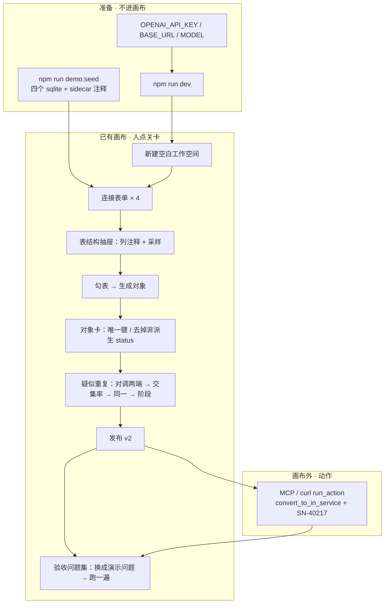
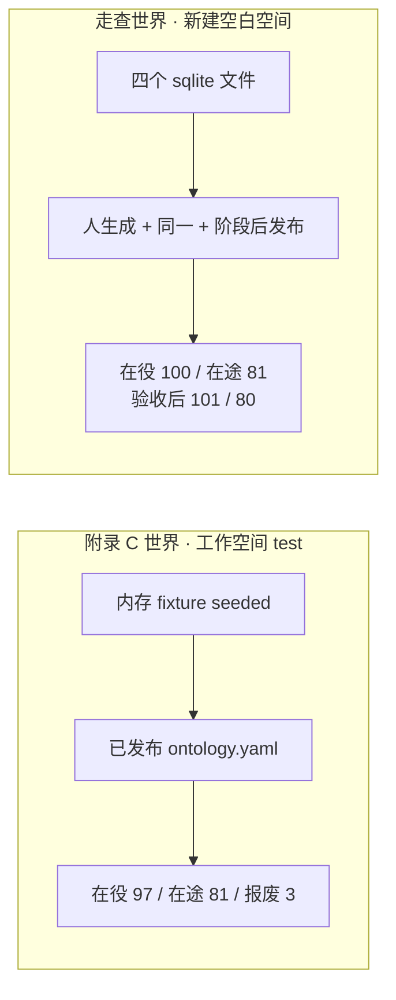

# 可演示的真模型走查（四套源系统 + 人手关卡）

| 字段 | 值 |
|---|---|
| 作者 | TBD |
| 日期 | 2026-08-22 |
| 状态 | Draft |
| 仓库 | `/Users/majiang/Documents/freespace/js/ontos` |
| 产品约束 | 画布仍是唯一工作台；人的点击只留给关卡（连接、选表、生成、改唯一键、裁决、发布、跑问题集）；模型只出现在 `llmSlot` 三个槽位；ReAct / 工具循环留在外部 Agent；页内不新开 Copilot、聊天列、步骤条 |

---

## Overview

上一版（仓库里仍是 `docs/真模型端到端测试.md`）把「完整测试」做成 vitest 自动代人点关卡：测试代码对空对象集发 `POST /api/generate`、代人 `set_identity`、代人 `POST /api/decisions`、代人发布。用户否定了这条作为主路径：

> 这个测试要有可演示性。设计几个系统，我要接入，然后裁决，然后每一步手动执行，自己可观测，就是要有可演示的测试功能才行。

本设计把主路径改成**可演示的走查**：`npm run demo:seed` 写出四个可连接的 SQLite 文件；操作者新建空白工作空间，用连接表单亲手接入；在已有画布上勾表、点「生成对象」、改唯一键、打开「疑似重复」（同一卡：设备在乘号前；阶段卡：采购在乘号前；不对就「对调两端」）点「同一 / 阶段」、发布；验收问题集「换成演示问题」再「全量跑一遍」，成为演示时的对错板。测试代码**不**替人点生成、裁决、发布。

真模型走三个槽位：`draftObjects`（生成对象）、`suggestPairs`（疑似重复建议）、`nlToQuery`（问题集跑批）。动作不走模型：发布后由外部 MCP 或 curl 调 `run_action`。站内不新开问数/动作控制台。

上一版的 API 代人剧本降为非目标。默认 `npm test` 仍必须离线、不进网。live 槽位级用例若保留，只当工程师可选自检，不进 Overview、不进 CI。生产槽位本期仍不设 `temperature: 0`。

---

## Background & Motivation

### 今天两套世界叠在一起，演示接不上「接入」

工作空间 `test` 的 v1 是 `src/server/config/ontology.yaml`（附录 C）。`src/server/engine/load.ts` 的 `getDriverRegistry` **只**给 `TEST_WS` 注入四个内存 fixture 连接（`purchase_sys` / `device_sys` / `asset_sys` / `hr_sys`），调用 `SqliteFixtureDriver.seeded()`。`default` 与新建空间走 `seedYamlFor` 的空对象集分支：空本体、无连接。

在 `test` 上打开画布，操作者看不见「连接数据源」这一关：四个源已经在，本体已经发布。生成对象会与已有类撞名。这套世界适合 `engine.test.ts` 钉附录 C 数字（在役 **97**、在途 81、报废 3），不适合向人演示「我接入、我裁决」。

### 文件 SQLite 今天会丢掉列注释

`seedDemo`（`src/server/engine/fixture.ts`）给内存库调用 `setComments`。`SqliteFixtureDriver.introspect` 把这份注释挂到列上，表结构抽屉显示「设备序列号」，`draftObjects` 的 prompt 把 `comment` 写进字段说明。

连接表单保存 sqlite 文件时，`registerSaved` 只 `registerFile`，**不**调用 `setComments`。SQLite 本身没有列注释。操作者若把同一份种子写成文件再接入，抽屉里的列没有中文说明，生成质量下降。不能在库里加一张注释表：`introspect` 会把 `sqlite_master` 里的用户表都列出来，那张表会冒充业务表。

### 人手关卡已经在画布上，缺的是可连接的系统和一块对错板

| 关卡 | 现成表面 | 实现 |
|---|---|---|
| 新建空白空间 | 左上角下拉「新建工作空间」 | `src/app/page.tsx` → `POST /api/workspaces` |
| 连接 | 工具条「连接数据源」→ `ConnectForm` | `src/components/forms.tsx`；sqlite 的文件路径写在 `db_name`；`test: true` 先内省再保存 |
| 看表 | 底部「表结构」抽屉 | `GET /api/introspect` 已返回列名/类型/主键/注释 + 3 行脱敏采样；抽屉今天只画列，**不画采样**（§4.6 补画） |
| 生成 | 勾表 → 「生成对象」 | `POST /api/generate` → `getSlot().draftObjects` → `import_objects`；toast「已生成对象：…」；抽屉收起 |
| 改唯一键 / 删字段 | 点节点 → 右侧对象卡 | `set_identity` / `remove_property` |
| 疑似重复 | 工具条按钮 → 底中面板 | `GET /api/candidates` → `PairCard`：LLM 建议 + 按需交集率 + 五种结论 |
| 发布 | 工具条「发布 vN+1」 | `POST /api/publish` |
| 对错板 | 「验收问题集」卡 | 今天只能手打问题；`POST /api/questions?run=1` 走 `nlToQuery` |

缺的不只是种子。四个可连接的文件库、列注释在文件连接上活下来、问题集能「换成」**本世界**的题（在役 100，不是附录 C 的 97）——之外，英雄路径在现成控件上还有三处缺口：同一卡 / 阶段卡都不能对调 `class_a`/`class_b`；抽屉不画已经返回的采样；对象卡 ✕ 删对照了列的字段会被「源映射」拦住。

### 上一版主路径为什么不能演示

vitest 代人点关卡，观众看见的是测试绿。操作者自己没有接入、没有点「同一」、没有看交集率。产品方向要求每一步可观测，用的是已有画布，不是新向导。

### 阶段世界的数字不是 97

附录 C 的 `equipment.status` 有三条 `when`（报废优先）。`applyVerdict` 的「阶段」只立两条：采购源有行且设备源无行 → 早阶段；设备源有行 → 晚阶段。fixture 里 3 台设备表 `status='scrapped'` 在这份世界里仍是「设备源有行」，算在役。因此走查发布后：在役 **100**，在途 **81**。验收 `SN-40217` 之后：在役 **101**，在途 **80**。动作名是 `convert_to_${to}`，阶段名填 `in_service` 时即 `convert_to_in_service`，不是附录 C 的 `convert`。

阶段裁决若发现目标类已有非派生 `status` 会抛错（`adjudicate.ts`：「先把它改名或删掉」）。必须在点「阶段」之前，从**将被并进采购的那一类**上拿掉名叫 `status` 的非派生属性（通常是设备对象；同一之后是合并类）。推荐仍在点「同一」之前删，当作稳妥顺序。

画布对象卡的 ✕ 走 `remove_property`，**没有**整份替换按钮。`replaceBlockers` 锁的是 MCP `replace_object`（多源 → 「挂了多个来源」），不是画布 ✕。今天 ✕ 被拒，是因为 `referencesOf` 在**单源时**就会推「源映射 …」。§4.3 让 ✕ 先摘对照：公理/动作/派生若没有引用，同一之后仍能删 `status`，只要还没点「阶段」（阶段会立派生 `status` 和转化关系，之后再删会撞引用）。

---

## Goals & Non-Goals

### Goals

1. **四套可连接的源系统。** 操作者用连接表单接入，不靠 `test` 空间的内存注入。文件由 `npm run demo:seed` 写出，幂等，gitignored。行数、序列号、列注释与 `seedDemo` 同一份函数。
2. **走查剧本是英雄测试。** 文档写出逐步该看见什么。测试代码不替人点生成 / 裁决 / 发布。
3. **每一步可观测。** 观测面只用已有卡片与抽屉，不新开步骤条。表结构抽屉本期补画 `GET /api/introspect` 已经返回的 3 行脱敏采样（空数组写「没有行」）。问题集装入后立刻能看见期望数字；跑完把本次 `results[].detail` 留在题旁。
4. **可演示的测试功能最小切口。** 发布后，验收问题集「换成演示问题」：清空本空间题目，写入本世界四问（在役 100 / 在途 81 / SN-40217 在途 / 人事张三）。人再点「全量跑一遍」。装入**禁止**带 `?run=1`。不自动裁决、不代人生成。
5. **真模型三件套。** 走查从生成对象起到对错板，必须 `OPENAI_API_KEY` / `OPENAI_BASE_URL` / `OPENAI_MODEL` 齐，三个槽位走 `AiSdkSlot`。罐头只保证「连得上、表在、注释在」——`CannedSlot.suggestPairs` 按字段名重合配对，采购 `sn` 与设备 `serial_no` 共享 0，候选对是空的；`nlToQuery` 写死 `equipment`，空白空间的对错板会全红。
6. **默认 `npm test` 零出站。** worker 启动与 `afterEach` 剥掉 `OPENAI_API_KEY` 与 `ONTOS_TOKEN`。live 目录若存在则 `exclude`。不进 CI。
7. **`nlToQuery` prompt 带属性类型与枚举 `values`。** 问题集过滤必须能编出 `in_service` / `in_transit`，不能编成「在役」后静默 0 行。
8. **画布上人必须能完成关卡。** 三件都要落地，不能只写在剧本里：① 对象卡 ✕ 能拿掉对照了列的非派生 `status`（§4.3）；② PairCard 能「对调两端」，**两张卡都要对乘号**——同一卡设备在前（留下）、资产在后（被并掉）；阶段卡采购在前、已合并设备在后（§4.5）；③ 阶段输入框的 placeholder 是 `in_transit` / `in_service`，不是「在途 / 在役」（§4.5）。

### Non-Goals

- vitest 对 `POST /api/decisions` / `POST /api/generate` / `POST /api/publish` 代人走完整剧本（上一版 §5，降级，不进本期实现）。
- Playwright / 浏览器自动点。
- 页内问数控制台、动作控制台、Copilot、聊天列、逐步高亮浮卡、步骤条。
- 把四个文件自动注册进 `test` 或 `default`。
- 改附录 B、新造本体 YAML 键、第四个 NL 槽位、引擎内 ReAct。
- 给生产 `AiSdkSlot` 设 `temperature: 0`（用户 2026-08-22 拍板：先不设）。
- 把 `test:live` 接进 CI（用户 2026-08-22 拍板：不进）。
- 让 `draftObjects` 自动产出附录 C 的三条 `when`、保修卡、`belongs_to`。走查数字按阶段两条规则钉，不拿 97 去卡。
- 改 `seedYamlFor("test")`、不改 `load.ts` 给新建空间偷偷注入 fixture。

---

## Proposed Design

### 总结构



操作者在画布里走完建模与验收。动作演示走已有 MCP 入口。种子命令只写文件，不改元库、不注册连接。

### 两套世界，数字不要混



`engine.test.ts` 继续钉附录 C。走查与「换成演示问题」钉阶段世界。`CannedSlot` 的类名写死 `equipment`，且 `suggestPairs` 按字段名重合配对——空白空间发布后的类名由模型决定，罐头编出来的查询和对会空掉或炸。问题集跑批必须对着**已发布配置**、走真模型编查询，不能假定类名叫 `equipment`。

---

### 1. 四个可连接系统

不发明新领域。数字与 `seedDemo` 同一份，这样引擎 golden 仍是这批种子的判定器。拆成**四个 sqlite 文件**，操作者一个一个接。

| 给人看的名字 | 连接名 | 库文件 | 表 | 这一步该看见 |
|---|---|---|---|---|
| 采购系统 | `purchase_sys` | `<dir>/purchase.db` | `po_item` | 1 张表；121 行量级；列 `sn` 注释「设备序列号」；抽屉采样 3 行能看到 `SN-4xxxx`（按插入顺序是 `SN-40000`…，**不见得是** `SN-40217`，它是第 121 行） |
| 设备台账 | `device_sys` | `<dir>/device.db` | `device`, `department`, `repair`, `assignment` | 4 张表；`device` 100 行；3 台台账状态 `scrapped`；部门 D01–D08 |
| 资产系统 | `asset_sys` | `<dir>/asset.db` | `asset`, `warranty_card` | 2 张表；`asset` **0 行**（验收后才有行）；列 `sn` 注释「设备序列号」 |
| 人事系统 | `hr_sys` | `<dir>/hr.db` | `person`, `appointment` | 2 张表；`person` 有张三 `P001`。用来对照：候选对不该把人和设备裁成同一 |

**为什么是四个。** 采购 × 设备讲「阶段」（同一批东西的不同时期，交集约三分之一）。设备 × 资产讲「同一」（同一类东西、写回要挂这个源；资产表现在 0 行，交集率 0 是可观测的，不是接错了）。人事是对照：名字和字段都可能被模型拿去配对，操作者应裁「仅名称相似」或跳过，证明「名字像」不等于合并。

默认第一场演示就把人事接上。若只接三套设备相关库，对照这一拍看不见，但同一 + 阶段仍能走完。是否把人事裁成可选，见开放问题。

#### 1.1 一份种子，两处消费

从 `fixture.ts` 抽出同一套表结构、INSERT、注释，供内存与文件共用。建议落点：`src/server/engine/fixture.ts` 仍对外导出 `seedDemo` / `SqliteFixtureDriver.seeded()`（`engine.test.ts`、`load.ts` 的 `test` 注入不改调用点）；新增 `writeDemoFiles(dir)` 与 `DEMO_SYSTEMS`。

```ts
export const DEMO_DIR_REL = ".ontos-demo"; // 相对仓库根；gitignored

export const DEMO_SYSTEMS = [
  { title: "采购系统", connection: "purchase_sys", file: "purchase.db" },
  { title: "设备台账", connection: "device_sys", file: "device.db" },
  { title: "资产系统", connection: "asset_sys", file: "asset.db" },
  { title: "人事系统", connection: "hr_sys", file: "hr.db" },
] as const;

/** 连接名 → 表名 → 列名 → 中文注释。内存种子与 sidecar 同一份。 */
export const DEMO_COMMENTS: Record<string, Record<string, Record<string, string>>> = {
  purchase_sys: { po_item: { item_name: "采购条目名称", sn: "设备序列号" } },
  device_sys: {
    device: { name: "设备名称", serial_no: "设备序列号", dept_id: "所属部门编号", status: "台账状态" },
    department: { dept_id: "部门编号", dept_name: "部门名称" },
    repair: { repair_no: "维修单号", serial_no: "设备序列号", started_at: "维修开始时间", ended_at: "维修结束时间" },
    assignment: { asgn_no: "履历编号", sn: "设备序列号", dept_id: "部门编号", valid_from: "生效时间", valid_to: "失效时间" },
  },
  asset_sys: {
    asset: { asset_name: "资产名称", sn: "设备序列号" },
    warranty_card: { card_id: "保修卡号", sn: "设备序列号", expiry: "保修到期时间" },
  },
  hr_sys: {
    person: { person_no: "人员编号", name: "姓名" },
    appointment: { appt_no: "任职编号", person_no: "人员编号", title: "职务", dept_id: "部门编号", valid_from: "生效时间", valid_to: "失效时间" },
  },
};
```

`seedTables(db, connection)` 按连接名执行今天 `seedDemo` 里对应的 `CREATE` / `INSERT`（采购 121 含 `SN-40217`，设备 100 含 3 台 `scrapped`，资产 0 行，人事张三）。禁止第二份行数。

`seedDemo(d)`：对每个 `DEMO_SYSTEMS` 项 `d.register(connection)`（内存），`seedTables`，再按 `DEMO_COMMENTS` 调 `setComments`。

`writeDemoFiles(dir = join(runtime().cwd, DEMO_DIR_REL))`：建目录；每个系统写 `<file>`；再写 sidecar `<file>.comments.json`，内容是该连接在 `DEMO_COMMENTS` 里的表→列 map。已有文件则覆盖。返回 `{ title, connection, path }[]`。命令把**绝对路径**打到 stdout，供连接表单粘贴。

幂等：重复运行覆盖四个 `.db` 与四个 sidecar。若文件被本机 `npm run dev` 的 `DatabaseSync` 锁住，命令失败，文案：「演示库文件被占用，先停掉正在跑的开发服务再播种」。

**不**把这四个文件 `saveConnection` 进任何空间。`load.ts` 的 `test` 注入保持内存 `seeded()`，不动。

#### 1.2 列注释怎么在文件连接上活下来

sidecar **不是**库里的表。`introspect` 继续只读 `sqlite_master` 的用户表，不会把 `.comments.json` 列出来。

sidecar 路径：与库文件同目录、文件名为 `${basename(dbPath)}.comments.json` 不准确——采用 **`${dbPath}.comments.json`**（例如 `.ontos-demo/purchase.db.comments.json`），和库文件成对。

加载注释必须分两条路径，口径对齐今天「一个 sqlite 文件没了不拖垮整份注册表」（`load.ts` `registerSaved` 缺文件只 `console.warn` 并 `return`）。

**`registerFile` 永不因 sidecar 抛错。** 打开 `DatabaseSync(path)` 之后尽力加载注释：

1. 若 `${path}.comments.json` 存在且 JSON 形状合法：按表调用 `setComments`。
2. 若 sidecar 存在但读不出或形状不合法：`console.warn`，**不加注释**，连接仍注册。不回退到 `DEMO_COMMENTS`（坏文件不能被种子注释悄悄盖住）。
3. 若 sidecar 不存在：按 `basename(path)` 在 `DEMO_SYSTEMS[].file` 里找；找到则用对应连接的 `DEMO_COMMENTS`（操作者只拷了 `.db`、没拷 sidecar 时，注释仍在）。
4. 两路都没有：不加注释，连接仍成功。

`getDriverRegistry` 水合走 `registerSaved` → `registerFile`。坏 sidecar **不许**让整个 `getDriverRegistry` throw，另外三套好库必须进得去。该连接仍注册，只是没有列注释。

**`saveConnection` / 连接表单（`test: true`）走严路径。** 在 `registerSaved` 之后、落库之前：若 sidecar 文件存在且不合法，抛 `ConnectionReject`（白话：「演示注释文件读不出：…」），卸掉刚注册的驱动、不落库。卡内能看见错误。sidecar 不存在则允许（走文件名回退）。这样第一次接入坏注释挡在表单，进程重启不会被一份坏 JSON 拖死。

`registerSaved` 不必再按连接名特判。连接名由操作者在表单里填，文件名才是认注释的键。

禁止：在 sqlite 里建 `_ontos_comments` 或任何用户表来存注释。

#### 1.3 命令与连接表单字段

`package.json`：

```json
"demo:seed": "node --experimental-strip-types --no-warnings scripts/demo-seed.ts"
```

`scripts/demo-seed.ts` 只调 `writeDemoFiles`，把表格打到 stdout。不启 Next、不写元库。

连接表单（`ConnectForm`）每套系统填：

| 表单项 | 值 |
|---|---|
| 连接名 | `purchase_sys` / `device_sys` / `asset_sys` / `hr_sys`（必须这个小写名，后面用节点上来源标签认对象） |
| 类型 | `SQLite 文件（演示）` |
| 文件路径 | 播种命令打印的绝对路径，或相对仓库根 `.ontos-demo/purchase.db`（`saveConnection` 按 `runtime().cwd` resolve） |

保存后 toast 现成文案：`已连接 ${name}，读到 ${tables.length} 张表`。四套分别应是 1 / 4 / 2 / 2 张。然后自动打开表结构抽屉。

---

### 2. 走查剧本（英雄测试）

写进将替换 `docs/真模型端到端测试.md` 的正文，并在 README「运行」节给入口。下面每一步写清：人点什么、该看见什么、和种子不一致时怎么判断。

**认对象靠来源标签，不赌类名。** 画布节点标题是模型起的类名（可能是 `po_item`，也可能是 `purchase_item`）。节点下方 tag 是 `${connection}.${table}`（`CanvasPage` 的 `sources.label`）。表结构抽屉勾选键是 `connection.table`。后文「采购对象」= 来源含 `purchase_sys.po_item` 的那个节点。

**没有步骤条。** 空画布已有引导（「点连接数据源接入库」）。本剧本是文档。已有卡片上必做的克制改动见 §4.5（对调两端、阶段 placeholder）与 §4.6（抽屉采样），不是逐步高亮向导。

#### 0. 配环境、起服务、新建空间

```bash
export OPENAI_API_KEY="…"
export OPENAI_BASE_URL="https://api.x.ai/v1"   # 或任何 OpenAI 兼容端点
export OPENAI_MODEL="…"                        # 必须显式
# 不要设 ONTOS_TOKEN：浏览器写请求配不上令牌会 401
npm run dev    # http://localhost:6688
```

左上角下拉 → 「新建工作空间」→ 名字如 `lab`（`^[a-z][a-z0-9_-]*$`）。画布空，出现「画布还是空的」引导卡。

不要用 `test`：那个空间已发布附录 C，并且 `getDriverRegistry` 会注入内存四连。不要假设 `default` 仍是空的——本机若玩过，里面可能有旧连接。

#### 1. 播种文件

另开终端，仓库根：

```bash
npm run demo:seed
```

该看见：四个绝对路径打印出来。目录 `.ontos-demo/` 不进 git。

#### 2–5. 依次连接四套系统

工具条「连接数据源」，按 §1.3 填表，点「测试并保存」。

| 步 | 连接名 | toast | 打开表结构后 |
|---|---|---|---|
| 2 | `purchase_sys` | 读到 1 张表 | `po_item`；列 `sn` 旁有「设备序列号」；表下画出 3 行采样，能看到 `SN-4xxxx`（按插入顺序是 `SN-40000`…；**不要求**出现 `SN-40217`，它是第 121 行） |
| 3 | `device_sys` | 读到 4 张表 | `device` 列 `serial_no` 注释「设备序列号」、`status` 注释「台账状态」；`department` 采样能看到 D01–D08 量级 |
| 4 | `asset_sys` | 读到 2 张表 | `asset` 采样处写「没有行」（0 行）；这是正常的 |
| 5 | `hr_sys` | 读到 2 张表 | `person` 采样有 `P001` / 张三（脱敏规则不打姓名） |

若列注释缺失：sidecar 没跟上或 `registerFile` 没加载。停下来查 `.ontos-demo/purchase.db.comments.json` 是否存在。不要继续生成——字段说明会变差，唯一键更难认。

#### 6. 勾表，点「生成对象」（真模型）

推荐勾选（演示最小集 + 人事对照）：

- `purchase_sys.po_item`
- `device_sys.device`、`device_sys.department`
- `asset_sys.asset`
- `hr_sys.person`

可选：`repair` / `assignment` / `warranty_card` / `appointment`。多勾会多几个对象、多几对候选，不挡主路径。

点「生成对象（N 张表）」。该看见：

- toast「已生成对象：…（草稿，发布后生效）」
- 抽屉收起
- 画布出现节点，带来源 tag
- 字段说明吃到列注释（设备对象的序列号字段说明像「设备序列号」）
- 耗时常见 5～30 秒（一次 `draftObjects`）

失败：toast 为上游文案；`AiSdkSlot` 把原始产出写到 OS 临时目录（§5），进程 `console.error` 一行路径。不要把 key 打进日志。

若两个对象撞了表名以外的类名：用 tag 认。若某张输入表没有任何节点的来源对得上：生成漏表，打开失败产物，删掉这次草稿对象后重勾重生成（`import_objects` 撞已有类名会 422）。

#### 7. 人改关卡（唯一键；非派生 `status` 必须在点「阶段」之前拿掉）

AGENTS.md 写过「有抉择才打断一张唯一键卡」。**今天没有这张卡。** 走查用对象卡，不新做抉择向导。

生成成功后抽屉会收起（`generateFromTables` 里 `setDrawerOpen(false)`）。对象卡「来源」区只显示 `connection.table`，不显示 `fields`。要核对映射，**再点「表结构」**，看每列的映射去向（`columnTarget`）。本期画布没有「拉列进对象」入口——这一点比 AGENTS.md「编辑卡可从任意已连接源拉列」更贴近 `CanvasPage`。

对来源分别为 `purchase_sys.po_item`、`device_sys.device`、`asset_sys.asset` 的三个对象：

1. 点开节点。
2. 「唯一键」下拉：选**对照了列 `sn` 或 `serial_no` 的那个字段**（属性名可能是 `sn` / `serial_no` / 模型另起的名）。已经是该字段则不动。
3. 再打开表结构：对应列应显示映射去向，不是「未映射」。若 `sn` / `serial_no` 仍是「未映射」：模型没把该列收进属性。失败路径：删对象、重生成，或中止走查并打开临时目录里的原始产出。不要手写对照骗过发布闸。

设备对象上的非派生 `status`：

- **必须在点「阶段」之前拿掉。** 阶段裁决要立属性名 `status`。对象卡 ✕ 走 `remove_property`，不是 `replace_object`。今天单源就会被「源映射」拦住；§4.3 落地后，对照不再单独挡住删除。
- 字段列表里若有**非派生**、名叫 `status` 的项（说明常常是「台账状态」）：点 ✕。未对照的其它字段可以顺手清，**不是**关卡顺序——画布 ✕ 删 `status` 只被源映射拦住，不必先清未对照。
- 若模型把列 `status` 收成别的属性名（例如 `mark`），**不要**删那个属性。撞名的是 `properties.status`，不是列名。
- **推荐仍在点「同一」之前删**（设备类还单源、节点还在）。不是因为 `replaceBlockers` 会让画布无解：画布从来没有整份替换；§4.3 之后，同一之后只要还没点「阶段」，公理/动作/派生通常没有引用，✕ 仍能删。点了「阶段」再删会撞派生 `status` 与转化关系。

人事对象唯一键应对 `person_no`（或对照了该列的属性）。不要把它的唯一键改成和设备序列号同一套字段名再裁「同一」。

#### 8. 打开「疑似重复」

工具条「疑似重复」。该看见底中面板「疑似重复的对象（N 处）」。一次 `suggestPairs`。LLM 建议只是建议，面板已有：「建议只是参考——起名像不像会骗人」。

覆盖（按来源 tag 认两端，顺序不限）：

- 采购对象 × 设备对象
- 设备对象 × 资产对象（此时设备、资产都还在，尚未合并）

人事对象 × 设备对象：可能出现，也可能被模型丢掉。出现了就点「仅名称相似」或「跳过」，**不要**点「同一」。不出现也算过——对照的意义是「人看到了也不合并」。

同源不成对：`device` 与 `department` 都来自 `device_sys`，资格闸 `pairEligible` 会滤掉。列表里若仍有，是 bug，停下。

点「算一算交集率」（要先设好唯一键，否则 `overlapOf` 拒：「两边对不上号：有类没设识别字段」）：

| 对 | 该看见 |
|---|---|
| 采购 × 设备 | 约 33%（40 / max(121, 100) = 40/121）。文案「N 条、M 条，其中 40 条对得上号」量级对即可，允许归一化后集合大小与行数差 1 |
| 设备 × 资产 | **0%**，`count_hit === 0`，面板会写「完全对不上，多半不相干」 |

0% 仍裁「同一」是演示要点：资产表此刻没有行，验收后才会插行。「同一」裁的是「同一类东西、合并后挂多个来源」，不是「现在两库已经有同一批行」。剧本必须把这句话写在这一步，避免操作者被面板文案劝退。

#### 9. 先「同一」，再「阶段」

两对的先后强制：先裁设备 × 资产的「同一」，再裁采购 × 已合并设备的「阶段」。先阶段后同一，后一次「同一」会把转化动作吃掉（`mergeInto` 跳过引用将消亡关系的动作）。

同一这张卡的乘号顺序不是随便的。`Verdict.Same` 是 `mergeInto(d, a, b)`：留下的是 `class_a`，`class_b` 被 `dropClass`。源条目按 B 的插入顺序追加到 A。随后阶段用「合并前 A 没有的第一条新源」当 `srcB`。同一若 `mergeInto(资产, 设备)`，留下的类源序是 `asset_sys` 再 `device_sys`；阶段再并入采购时 `srcB = asset_sys`（0 行），`{ [srcB]: true } → in_service` 几乎没人命中，装入包 100/81 必红。阶段卡再对调也救不回已经写进合并类里的源顺序。本期**不**改 `applyVerdict` 去猜晚源。

两张卡都用已有的「对调两端」。模型给的 A/B 常常是反的——这是产品必须接住的事，不是操作纪律。不要靠「放弃草稿」赌下一次模型把顺序换过来：`listCandidates` 不会为裁决重排两端。

1. **同一**：看乘号——**设备对象必须在乘号前**（留下）、**资产对象在后**（被并掉）。不对就对调，再点「同一」。toast：「已裁决 …：同一（进草稿，发布后生效）」。成功信号：资产对象从画布消失，设备对象来源 tag 变成两个（`device_sys.device` 与 `asset_sys.asset`）。若看见设备消失、资产挂两个 tag，是乘号反了，放弃草稿重做这一对（源顺序已经写进留下的类，对调阶段卡救不了）。
2. **阶段**：打开采购 × **已合并设备** 那张卡。看乘号：**采购对象必须在乘号前，已合并设备在后。** 不对就对调，再填阶段名。

阶段行填早 `in_transit`、晚 `in_service`。输入框 placeholder 必须是这两个英文（§4.5），不要填「在途」「在役」——问题集过滤用配置里的字面量。再点「阶段」行定案。toast 会提到加了状态字段和「转为 in_service」动作。

`applyVerdict` 用「合并前 A 没有的第一条新源」当 `srcB`，再立 `{ [srcA]: true, [srcB]: false } → from` 与 `{ [srcB]: true } → to`。同一正确时留下的类源序是 `device_sys` 再 `asset_sys`；采购当阶段 `class_a` 时 `srcB = device_sys`，100 台设备行（含 3 台台账 scrapped）都算在役。阶段对调之后仍反着点：设备独有 60 台会被算成在途，装入包的 100/81 必红。

#### 10. 发布

工具条「发布 v2」（空空间 v1 是注册时的空本体）。toast：「已发布 vN，问数与动作即刻生效」。配置不合法会 422，toast 上游文案。不要改 YAML 硬过闸。

发布后合并类上应有派生 `status`（两条 `when`）、动作 `convert_to_in_service`。对象卡「动作」区能看见这条。问数与动作读的是已发布快照，草稿里没发布的改动它们看不见。

#### 11. 测试功能：换成演示问题，跑一遍

工具条「验收问题集」→ 「换成演示问题」（先清空本空间全部题，再写入四条；**不**带 `?run=1`）→ 列表立刻能看见每条旁边的期望数字 → 人再点「全量跑一遍」。

卡上有一行：「这是空白空间走完阶段裁决后的数字，不要在 test 空间用。」

该看见四条。装入后每条带灰色「期望 100」这类数字。跑完「通过 / 失败」标签旁留下本次 `results[].detail`（例如「期望合计 100，实得 0」或编译失败文案）。这就是演示时的对错板。期望数字是阶段世界、验收前：

| 问句（白话，装入时写死） | expected | 含义 |
|---|---|---|
| 列出所有在役设备 | `100` | 设备源 100 行，含 3 台台账 scrapped |
| 列出所有在途设备 | `81` | 121 − 40 |
| 序列号 SN-40217 且处于在途阶段的设备 | `1` | 主角还在采购源、不在设备源 |
| 名叫张三的人员 | `1` | 人事没被并进设备 |

「通过」= 真模型编出的查询在引擎里跑完，行数或聚合合计对得上（§3.1）。「失败」= 对错板上的红，演示时就讲题旁的明细：映射、唯一键、阶段名、prompt 枚举、类名、limit，哪一步偏了。

不要在这一步代人改本体。人看失败明细，回画布改，再跑。没配三件套时不要走到这一步（罐头会把 `object` 编成 `equipment`，四问全红）。

#### 12. 画布外验收一台，再跑问题集

动作演示不进站内 UI。外部 Agent 用 `skills/ontos-action-run`，或 curl。`?ws=` 填走查空间名，不要抄 skill 里的 `test`。

动作名、类名以发布后对象卡为准（常见 `convert_to_in_service` + 采购并入后仍在的那个类）。`identity` 为 `SN-40217`。转化动作无 `$request`。

```bash
curl -s "http://localhost:6688/api/mcp?ws=lab" \
  -H "Content-Type: application/json" \
  -d '{"jsonrpc":"2.0","id":1,"method":"tools/call","params":{"name":"run_action","arguments":{"action":"convert_to_in_service","object":"<合并类名>","identity":"SN-40217"}}}'
```

MCP 约定 HTTP 一律 200，业务在信封里。成功时看 **`result.structuredContent`**：`ok: true`；`projections` 里至少有一条对 `device` 表的成功 `insert`（`link` 效应给第 3 步没有行、又映射了识别字段的源插行）。`asset` 表 0 行，同一之后资产源对这个序列号也没有行，通常也会插一行。**不**要求保修卡——那是附录 C `convert` 的 `create`，阶段裁决的 `conversionAction` 只有 `- link`。动作名以对象卡为准（`convert_to_<晚阶段>`）；附录 C 的 `convert` 只属于 `test` 空间。

表结构抽屉不取业务行做展示以外的用途。要看写回：打开 sqlite 文件，或 MCP `query`。

然后点「换成验收后问题」（同样先清空本空间全部题再写入四条，不自动跑）再「全量跑一遍」：

| 问句 | expected |
|---|---|
| 列出所有在役设备 | `101` |
| 列出所有在途设备 | `80` |
| 序列号 SN-40217 且处于在役阶段的设备 | `1` |
| 序列号 SN-40217 且处于在途阶段的设备 | `0` |

对错板从 100/81/在途 翻成 101/80/在役，这一拍就是「动作改的是源库、问数读的是同一份文件」。

---

### 3. 可演示的测试功能（最小产品改动）

#### 3.1 推荐方案 C：种子文件 + 验收问题集「换成演示问题」

现成卡：`QuestionsCard`。加两个按钮，白话：

- **换成演示问题** — 验收前四问（100 / 81 / SN-40217 在途 / 张三）
- **换成验收后问题** — 验收后四问（101 / 80 / 该台在役 / 该台不在途）

都不自动跑、不代人生成、不代人裁决。人再点已有的「全量跑一遍」。装入路径**禁止**请求 `?run=1`。

实现：

- 题面与 expected 放在 `src/server/engine/demoQuestions.ts`（或 `fixture.ts` 旁），前后端可 import。禁止在组件里另写一套数字。
- **换成任一套时：先删本空间全部题，再写入四条。** 不要按「同文案删再建」——两套包文案只部分重叠，先装前包再装后包会留下「名叫张三」，观众以为已经切换干净。手打的题一并清掉。实现用现成 `GET` + 逐条 `DELETE` + `POST`，不新增批量路由。
- `POST /api/questions` 带 `expected`（今天 UI 的「加一条」不传 expected，路由已支持）。
- 装入后立刻 `GET` 刷新：`listQuestions` 已有 `expected` 列，列表用灰色小字标「期望 100」，让观众看见判定器。
- 「全量跑一遍」后用**本次响应**的 `results[]` 把每条 `detail` 留在卡上（`setQuestionStatus` 只写 status/version，`detail` 不入库，不必新 DDL）。失败标签旁边就是「期望合计 100，实得 0」或编译失败文案。
- toast：「已换成 4 条演示问题」。
- 按钮旁一行：「这是空白空间走完阶段裁决后的数字，不要在 test 空间用。」不锁流程。

**跑批比对要能当对错板。** 今天 `POST /api/questions?run=1` 只把 `expected` 数字和 `rows.length` 比。模型把「列出所有在役设备」编成无 `group_by` 的 `count` 时，结果是 1 行、`count=100`，会对错板误红。最小改动（不新造 expected 语言）：

```ts
function scoreExpected(query: QueryRequest, rows: Record<string, unknown>[], expected?: string): { ok: boolean; detail: string } {
  if (!expected || !/^\d+$/.test(expected.trim())) return { ok: true, detail: "" };
  const n = Number(expected.trim());
  if (query.aggregate) {
    const metric = query.aggregate.metrics[0];
    const key = Object.keys(metric)[0];
    const total = rows.reduce((s, r) => s + Number(r[key] ?? 0), 0);
    if (total !== n) return { ok: false, detail: `期望合计 ${n}，实得 ${total}` };
    return { ok: true, detail: "" };
  }
  if (query.limit != null && query.limit < n) {
    return { ok: false, detail: `查询带了截断 limit=${query.limit}，不能和期望 ${n} 比` };
  }
  if (rows.length !== n) return { ok: false, detail: `期望 ${n} 行，实得 ${rows.length} 行` };
  return { ok: true, detail: "" };
}
```

`query.ts` 的 `DEFAULT_LIMIT = 200`：请求没写 `limit` 时引擎仍截到 200。上面只把 `query.limit != null && query.limit < n` 当失败。本期期望 100 / 81 / 1 都小于 200，对错板不受影响。若以后装入超过 200 行的题，会静默按 200 比——本期不改引擎，走查文档写明这句即可。

`m4m6.test.ts` 附录 C 世界：「在役设备及其所属部门」罐头编成列表 97 行，expected `97`，仍通过；「还有多少在途设备」故意 expected `1`，列表 81 行，仍失败。聚合合计分支是新口径，旧用例不走。

演示题避免「每个部门多少台」：组数 8 与合计 100 会争 expected。不进装入包。

`nlToQuery` 必须带枚举。否则 `{ status: "在役" }` 过 Zod、引擎 0 行，四问全红。见 §4.2。

SN-40217 那条仍只卡行数。模型若漏了 `status` 过滤，验收前 1 行碰巧对，验收后「在途」那条可能误红或误绿。缓解：问句写死「且处于在途阶段」；prompt 给 `values`；失败时人用 MCP `query` `{ identity: "SN-40217", properties: ["status"] }` 钉死。不在本期把 expected 升级成过滤 JSON。

#### 3.2 方案比较（必须写清为什么不选向导）

| 方案 | 做法 | 采用？ |
|---|---|---|
| A. 只写文档剧本，UI 零改 | 操作者手打四问、手填 expected | 不作为主方案。观众看不见「测试功能」；手填 expected 易抄成 97 |
| B. 走查浮卡逐步高亮 | 底中一张卡：下一步点哪里 | **不采用。** 就是步骤条。违反「没有步骤条」「引导在已有卡片上」。它不是 QuestionsCard 的亲戚：它锁流程、教操作、与空画布引导重复 |
| C. 种子文件 + 换成演示问题 | 接入与裁决仍是人点；问题集变成对错板 | **采用** |
| D. 表结构 / 疑似重复上写长文「演示时你该看见」 | 多段说明当步骤条 | **不采用。** PairCard 阶段 placeholder 从「如：在途」改成 `in_transit` / `in_service` 是必做（§4.5），仍是已有卡片上一句，不锁流程。不要再加长文教操作 |

---

### 4. 走查要能做完的引擎小改

这些不是向导，是关卡在现有控件上走得通。

#### 4.1 默认 suite 剥 key

今天 `vitest.config.ts` 没有 `setupFiles`。`getSlot()` 每次读 `process.env.OPENAI_API_KEY`。开发者 shell 若已导出真 key，`m4m6` 的问题集、`m3` 的 `listCandidates`、`propose_ontology` 会打网。

```ts
// src/tests/setup.offline.ts
import { afterEach } from "vitest";
delete process.env.OPENAI_API_KEY;
delete process.env.ONTOS_TOKEN;
afterEach(() => {
  delete process.env.OPENAI_API_KEY;
  delete process.env.ONTOS_TOKEN;
});
```

`vitest.config.ts`：`setupFiles: ["src/tests/setup.offline.ts"]`；若存在 live 目录，`exclude: [...configDefaults.exclude, "src/tests/live/**"]`（展开默认列表，不要整份覆盖）。

加载时剥一次不够：`m2.test.ts` 写入 `OPENAI_API_KEY=test-key` 测 `getSlot` 分支，fork worker 跨文件复用，假 key 会漏到后面的 `m4m6`。所以 `afterEach` 再剥。`m2` 仍可在用例内写假 key；建议该用例 `try/finally` 自清，不是门闩的替代。

不删 `OPENAI_MODEL` / `OPENAI_BASE_URL`：没 key 时走 `CannedSlot`。

#### 4.2 `nlToQuery` prompt 补类型与枚举

今天只传 `properties: Object.keys(t.properties)`。改成 `{ name, type, values? }[]`，`values` 来自属性定义。三个槽位仍是一次 `generateText` + `Output.object`。不设 `temperature`。

判定器（问题集）不接受中文过滤值当成功——那会 0 行，expected 对不上。

#### 4.3 `remove_property` 顺带摘掉本类源对照

今天对象卡点 ✕ 走 `remove_property`（`CanvasPage.tsx` 字段行）。若 `fields.status` 存在，`referencesOf` 在**单源时**就会推「源映射 …」，操作被拒。画布没有整份替换按钮。`replace_object` / `replaceBlockers` 是 MCP `apply_draft` 的闸，不要写成画布卡住的原因。不改 `remove_property`，走查在点「阶段」之前删不掉对照了列的 `status`。

改 `remove_property`（`configStore.ts`）：

1. 身份字段仍拒（现成）。
2. **先**删本类每一条 `sources.*.fields[prop]`。
3. 再跑 `referencesOf`。公理、关系配对、动作、派生规则里的引用仍拒。
4. 通过则删 `properties[prop]`。

单测必须拆开，不能只改附录 C 的 `mark` 那条指望它变绿：

- `configStore.test.ts` 现成「删 mark 被拒」（约 218 行）：`mark` 还被派生 `status.when` 和报废动作引用。摘掉源映射之后**仍会拒**。这条继续钉「公理/动作/派生引用仍挡住」。
- **另加一条夹具**：只有源映射、没有公理/动作/派生引用的属性。`remove_property` 必须成功，且该类 `fields` 里不再有该键。这才证明「对照不再单独挡住删除」。

不新增「解除对照」op，不新按钮。人点 ✕ 的语义就是「不要这个字段」。未对照字段本来就能删，走查不必先清它们再删 `status`。

#### 4.4 失败落盘（生成 / 候选对 / 问题集）

`AiSdkSlot` 在 `generateText` 抛错或出槽 `parse` 失败时，把原始产出写到 `join(tmpdir(), "ontos-llm-fail", <ISO>)`。三个槽位共用。`console.error` 一行路径。字符串里若出现 `OPENAI_API_KEY` 的字面值，写成 `***`。不入库、不提交。罐头路径不写。

不把落盘绑在 `ONTOS_LIVE_LLM` 上：走查是 `npm run dev`，没有这个测试门闩。

#### 4.5 PairCard「对调两端」+ 阶段 placeholder（英雄路径硬缺口）

`Verdict.Same` 是 `mergeInto(d, a, b)`：留下 `class_a`，丢掉 `class_b`。阶段分支再用「合并前 A 没有的第一条新源」当 `srcB`（`adjudicate.ts` 118–135 行）。因此：

- **同一卡**：POST 的 `class_a` 必须是设备对象（留下），`class_b` 必须是资产对象（被并掉）。反了则留下空的 `asset_sys` 当第一条源，后面阶段的 `srcB` 落到 0 行资产表，100/81 翻掉；阶段卡再对调救不了。
- **阶段卡**：POST 的 `class_a` 必须是采购对象，`class_b` 必须是已合并设备。反了会变成「采购有行 = 在役」，设备独有 60 台算在途，装入包必红。

现成 `PairCard` 把槽位给的 `pair.class_a × pair.class_b` 原样 POST 到 `/api/decisions`，没有对调。`listCandidates` 不重排，资格闸只看跨源。两端顺序来自模型（罐头则是 `i<j` 遍历）。人在画布上无法保证乘号顺序。「放弃草稿重来」也改不了模型给出的 A/B。

**采用：PairCard 加「对调两端」，两张卡共用。** 白话按钮，不锁流程。只改本卡展示与随后 POST 的 `class_a` / `class_b`，不重拉候选、不改 `applyVerdict` 两条 `when` 的语义。走查写：

- 同一这张卡：设备对象在乘号前（留下）、资产对象在后（被并掉），不对就对调。
- 阶段这张卡：采购对象在乘号前、已合并设备在后，不对就对调。

不采用本期：改 `applyVerdict` 猜晚源；给阶段行做「早阶段来源 / 晚阶段来源」选择器（引擎按所选源立 `when`，面更大）。

**对调时已算出的交集率必须跟着类走。** 现成文案是「`{pair.class_a} {rate.count_a} 条、{pair.class_b} {rate.count_b} 条`」；`/api/overlap` 的 `count_a` 跟着请求里的 `class_a`。人先点「算一算」再「对调两端」，若只换标题两个名字，会出现「设备 121 条、采购 100 条」。比率仍对，条数张冠李戴。对调时：按**类名**对齐 `count_a` / `count_b`（响应里已有 `class_a` / `class_b`）；`rate` 与 `count_hit` 不变。对齐不上则清掉本次 `rate`，让人再点「算一算」。不要只改标题。

**阶段输入框 placeholder 必改。** 今天是「如：在途」「如：在役」（`PairCard.tsx` 123–126 行）。阶段名会进 `status.values` 和 `convert_to_${to}`。人按输入框提示填中文，四问全红。改成 `in_transit` / `in_service`（可附极短说明「问数按这里填的字过滤」）。这是已有卡片上一句，不是步骤条。文档覆盖压不住观众看见的输入框。

模型把资产放在同一卡的 `class_a`、或把设备放在阶段卡的 `class_a`，都是**产品必须接住**，不要写进「操作错误」。

#### 4.6 表结构抽屉画出采样

`GET /api/introspect` 已经给每张表挂了最多 3 行脱敏采样（`introspect/route.ts`）。`CanvasPage` 的 `IntrospectResp` 也声明了 `sample?`。抽屉渲染（约 847–898 行）只画列名/类型/主键/注释和 `columnTarget`，**一行采样都没有**。不补画，剧本第 2–5 步的「该看见 SN-4xxxx / 资产没有行 / 张三」全部落空。

**本期补画，不新增采样 API。** 每张表列清单下面：

- `sample` 有行：画出最多 3 行键值；值已经是 `maskValue` 之后的，不再脱敏一次。
- `sample` 是空数组：白话「没有行」（资产表）。
- 缺 `sample` 或连接 `error`：不画采样块。

不把采样送进 `draftObjects` prompt（今天 generate 走 `resolveTableInfos` → `introspect()`，不含采样，保持）。

采购采样按插入顺序是 `SN-40000`…，**不要**写成能看见 `SN-40217`。

---

### 5. 上一版 vitest live 怎么处置

| 上一版条目 | 本期 |
|---|---|
| 默认 `npm test` 剥 key + exclude live | **保留，先做** |
| `nlToQuery` 补 `type` / `values` | **保留，问题集对错板依赖它** |
| 失败落盘、脱敏 | **保留**，改为生产槽位失败即写，不靠 `ONTOS_LIVE_LLM` |
| 生产 `temperature: 0` | **仍不做** |
| live 不进 CI | **仍不进** |
| `setupLiveRuntime` + 测试里 `registry.register(fixture)` | **不做**（与「操作者自己接入」冲突） |
| `playbook.test.ts` 代人 `POST /api/decisions` | **降为非目标**。不要实现。不要让它占 Overview |
| 槽位级 `src/tests/live/slots.test.ts` | **可选工程师自检**，独立 PR，门闩 `ONTOS_LIVE_LLM=1` 且三件套齐才跑。附录 C 世界钉 97；不要用 100 去卡 `test` 空间。缺门闩 skip 不 fail |
| live 问数不走 `/api/questions?run=1` | 走查**正是**走问题集路由。槽位级自检若保留，仍可直接 `callSlot` + `runQuery`，与对错板分开 |

可选 `test:live` 若落地：独立 `vitest.live.config.ts`，`setupFiles: []`，不得继承剥 key。接线测试写在 `skipIf` 外面。这些细节上一版已写清，本期不把它们写进 Overview。

---

### 6. Observability

逐步观测面（失败时先看这一列，再看临时目录）：

| 步 | 表面 | 成功信号 | 若不同 |
|---|---|---|---|
| 播种 | 终端 | 四个绝对路径 | 文件锁、权限 |
| 连接 | toast + 抽屉 | 表数量 1/4/2/2；列注释 | sidecar；路径 resolve |
| 采样 | 抽屉每张表下方（§4.6 补画） | 采购 `SN-4xxxx`（不必是 40217）；资产「没有行」；人事张三 | 抽屉没画出采样 = PR4 未落地，不是库空了 |
| 生成 | toast + 节点 tag | 每张勾选表有来源 tag；字段说明含注释 | 类名不赌；漏表则落盘重生成；没三件套则质量差且第 8 步会空 |
| 唯一键 | 对象卡；**再打开**表结构看映射去向 | `sn`/`serial_no` 不是「未映射」 | 没收到列：重生成，不要手编 |
| 去掉 `status` | 对象卡字段列表 | 设备类无非派生 `status`（推荐同一之前，必须阶段之前） | ✕ 仍报引用：看是否公理/动作；走查生成物通常只有源映射。不是 replaceBlockers |
| 候选对 | 底中面板 | 采购×设备、设备×资产 | 没三件套时列表空（罐头按字段名配对）；人事×设备可有可无，禁止裁同一 |
| 交集率 | PairCard | ~33%；设备×资产 0% | 0% 仍裁同一（写回挂源） |
| 裁决 | toast + 节点合并 + **对调两端** | 先同一后阶段；同一卡设备在乘号前（资产消失、设备 tag 变两个）；阶段卡采购在乘号前；阶段名 `in_transit`/`in_service` | 乘号反了就对调；同一若已裁反（设备消失）只能放弃草稿重做这一对；placeholder 仍是中文 = PR3 未落地 |
| 发布 | toast vN | 对象卡出现派生 `status` 与 `convert_to_in_service` | 422：上游校验文案 |
| 问题集 | 期望数字 + 通过/失败 + **题旁 detail** | 验收前 100/81/1/1 | 看 detail：枚举、类名、阶段名、limit、映射 |
| 动作 | `result.structuredContent` | `ok` + device insert | 前置不满足：该台不是在途；看错信封顶层会以为没返回 |
| 再跑 | 对错板（先「换成验收后问题」清空再写入） | 101/80/在役 1 / 在途 0 | 写回没进走查连的那份文件（连错库、连了 `test` 内存） |

日志：槽位调用可打 `slot=draftObjects name=ai-sdk:… ms=…`。禁止 `console.log(process.env)`。禁止把 Authorization 打进失败 JSON。

告警：无。演示失败 = 对错板红 + toast。

---

## API / Interface Changes

对 MCP 工具列表、草稿 op 判别联合：无新工具、无新 op。`remove_property` 语义收窄「源映射」这一种引用（§4.3），形状不变。

| 变更 | 位置 | 说明 |
|---|---|---|
| `npm run demo:seed` | `package.json` + `scripts/demo-seed.ts` | 写四个文件 + sidecar，打印绝对路径 |
| `.ontos-demo/` | `.gitignore` | 演示库不入库 |
| `writeDemoFiles` / `DEMO_COMMENTS` / `DEMO_SYSTEMS` | `fixture.ts`（或抽出的 `demoSeed.ts`，`seedDemo` 改调它） | 一份种子两处消费 |
| `registerFile` 加载 sidecar / 文件名回退 | `fixture.ts` | 文件连接也有列注释；sidecar 坏了不抛 |
| `saveConnection` 严校验 sidecar | `load.ts` | 表单路径：sidecar 不合法 → `ConnectionReject`，不落库 |
| `nlToQuery` prompt | `llmSlot.ts` | `{ name, type, values? }[]` |
| `AiSdkSlot` 失败落盘 | `llmSlot.ts` | 不绑 `ONTOS_LIVE_LLM` |
| `remove_property` 先摘 `fields[prop]` | `configStore.ts` | 画布 ✕ 能去掉对照了列的 `status` |
| PairCard「对调两端」 | `PairCard.tsx` | 改本卡 POST 的 `class_a`/`class_b`；已有交集率按类名对齐 `count_a`/`count_b`（对齐不上则清掉 `rate`） |
| 阶段 placeholder | `PairCard.tsx` | `in_transit` / `in_service` |
| 抽屉采样 | `CanvasPage.tsx` | 画 introspect 已有的 3 行；空 → 「没有行」 |
| 「换成演示问题」 | `QuestionsCard.tsx` + `demoQuestions.ts` | 先清空本空间题再写入四条，带 expected；跑完留 detail |
| 跑批 `scoreExpected` | `questions/route.ts` | 聚合比合计；列表比行数；过小 limit 不当成功 |
| `setup.offline.ts` | vitest 默认配置 | 剥 key / `ONTOS_TOKEN` |

不新增路由。装入走已有 `POST /api/questions`。连接走已有 `POST /api/connections`。

`ConnectForm` 字段不改。剧本只规定填什么。

---

## Data Model Changes

无 DDL。`ont_question.expected` 已有。不改附录 B。sidecar 是仓库外的 JSON 文件，不是元库表，不是源库表。

`.ontos-demo/*.db` 是演示业务库。验收 `run_action` 会往这些文件里 `insert`。重新 `demo:seed` 会覆盖，走查应从头连接（或接受文件已被写脏）。剧本写明：验收后再播种会丢掉刚插入的设备行。

---

## Alternatives Considered

### 1. 继续用 `test` 空间 + 已发布附录 C

改动最小：打开 `test`，问题集已经能跑 97。

不采用。操作者不能演示接入、生成、裁决。`test` 的连接是内存注入，刷新进程会丢验收写入，和「四个文件我自己接」不是同一件事。在役 97 会把阶段世界的 100 教错。

### 2. 新建空间自动注入 fixture

`ensureWorkspace` 或 `getDriverRegistry` 对非 `test` 也 `seeded()`。操作者一建空间四个源就在。

不采用。产品已定：`default` 与新建空间空白起步。自动注入等于取消「连接数据源」关卡，观众看不见接入。与 AGENTS.md「人的点击只留给关卡——选表、确认、裁决、发布、连接」冲突。

### 3. 本方案：四个文件 + 空白空间 + 人手关卡 + 问题集换成包（采用）

代价：操作者要填四次连接表单；模型质量仍可能让生成漏列。这正是要演示的产品风险。注释 sidecar、`remove_property` 摘对照、PairCard 对调两端、抽屉采样，是为了让关卡在现有控件上走得通，不是代人点。

同一 / 阶段的乘号顺序另两条不采用本期：引擎按所选源立 `when`（改 `applyVerdict`，面更大）；引擎用数据猜晚源（和「A 的旧源 = 早」分叉，且救不了同一已经写进合并类的源顺序）。对调两端最小、不改两条 `when`。同一卡与阶段卡都要对乘号。

### 4. vitest 代人点完整剧本（上一版主路径）

可回归、可进门闩。用户已否定作为主路径：没有可演示性。降为非目标。剥 key 与 prompt 枚举从上一版留下，因为默认 suite 与对错板仍需要。

### 5. 走查浮卡 / 步骤条（方案 B）

见 §3.2。违反「没有步骤条」。

### 6. Playwright 点画布

槽位在服务端。浏览器只多测绑定。本期不采用。走查的观众就是操作者本人。

---

## Security & Privacy Considerations

威胁模型：单用户演示，密钥在操作者 shell，四个文件在本机 gitignored 目录。

1. **密钥进日志 / 失败 JSON。** 落盘前替换 `OPENAI_API_KEY` 字面值。禁止打印 env。
2. **密钥进仓库。** `.ontos-demo/` gitignore。失败 JSON 在 `os.tmpdir()`。
3. **误打网。** 默认 vitest 剥 key。走查是人显式导出三件套后的 `npm run dev`，这是要演示的路径，不是误打。
4. **业务行进 prompt。** `draftObjects` 只序列化 `connection / name / columns`（含 comment，不含 `sample`）。`nlToQuery` 是类名、属性、类型、枚举、关系名。采样 3 行只在抽屉。
5. **写源库。** `run_action` 写的是操作者自己连接的那四个文件，不是客户库、不是 `test` 内存（除非操作者连错）。`requireWriteAuth` 在未设 `ONTOS_TOKEN` 时放行。走查文档要求不要设该变量。
6. **sidecar 不是表。** 避免注释表被当成业务表生成进本体。
7. **路径出网。** `GET /api/connections` 已剥 `db_name`。toast 只报表数量。绝对路径只出现在操作者终端和他自己填的表单里。

---

## Observability

逐步观测面**只以 §6 那张表为准**，此处不复述，避免两份表漂移。

补充（§6 表里没有的运维口径）：

- 不新增 metrics 后端。演示是人在本机跑。
- `withQueryLog` / `withActionLog` 仍会往该空间元库写 `log_query` / `log_action`。对错板不读这两张表。
- 生成/候选对/问题集失败：临时目录 JSON（槽位名、`getSlot().name`、输入摘要、原始 output 或异常）。

---

## Rollout Plan

1. **PR1** 合入后，任何人可 `npm run demo:seed` 得到四个文件；`test` 内存种子行为与数字不变。罐头只保证连得上、表在、注释在。**不要**用罐头走第 8–11 步（候选对空、对错板全红）。
2. **PR2** 合入后，开发者 shell 里有 key 也不会让 `npm test` 打网。
3. **PR3** 合入后，问题集过滤有枚举词汇；画布 ✕ 能删对照了列的 `status`；PairCard 能对调两端（同一卡设备在前、阶段卡采购在前；交集率按类名对齐）；阶段 placeholder 是英文枚举；槽位失败可打开临时文件。
4. **PR4** 合入后，抽屉画出采样；验收问题集「换成演示问题」带期望数字与跑完明细。
5. **PR5** 用本文件替换 `docs/真模型端到端测试.md`，README「运行」增加走查入口。依赖 PR3/PR4 文案落地后再换文档。
6. **CI。** 只跑 `npm test`。不跑 `demo:seed`，不跑 live。
7. **回滚。** 删 `demo:seed` 与 `.ontos-demo` 即去掉文件种子；剥 key 应保留。`remove_property` 语义回滚需谨慎：走查会再次卡住。本期不改生产温度，无该项可回滚。

无功能开关进画布。「换成演示问题」对所有空间可见；装入的是阶段世界数字，在附录 C 的 `test` 空间跑会红（97 ≠ 100）。按钮旁一行说明落到 UI（§3.1），克制，不锁。

---

## Risks

| 严重度 | 风险 | 缓解 |
|---|---|---|
| 高 | 模型没把 `sn` / `serial_no` 收进属性，唯一键关卡无法认 `SN-40217` | 再打开抽屉看「未映射」即中止；落盘；重生成。不手编映射 |
| 高 | 设备类非派生 `status` 卡住阶段裁决 | 第 7 步必须在「阶段」之前删，推荐同一之前；`remove_property` 摘对照；夹具证明只有源映射时能删 |
| 高 | 模型把资产放在同一卡的 `class_a`，或把设备放在阶段卡的 `class_a`，100/81 翻掉 | **产品必须接住**：两张卡都「对调两端」。同一：设备在乘号前（留下）。阶段：采购在乘号前。同一若已裁反，源顺序已经写进留下的类，只能放弃草稿重做这一对。不是操作错误 |
| 高 | 阶段名填成「在途 / 在役」，问题集按 `in_service` 全红 | PairCard placeholder **必改**为 `in_transit` / `in_service`（不是可选提示） |
| 高 | `nlToQuery` 不传枚举，过滤写成「在役」 | PR3 补 `type` / `values`；对错板 0 行即红，题旁留 detail |
| 中 | 没配三件套就走第 8–11 步 | 罐头候选对为空、对错板全红。Rollout：罐头只证明连接/内省/注释 |
| 中 | 操作者在 `test` 空间走查 | 剧本禁止；换成包数字会对 97 红，本身是信号 |
| 中 | 设备 × 资产交集 0%，人不敢点「同一」 | 剧本第 8 步把「0 行资产表」讲成功能，不是故障 |
| 中 | 先阶段后同一，转化动作被 `mergeInto` 跳过 | 剧本写死先同一后阶段 |
| 中 | 类名非法或撞名，`import_objects` 422 | toast 上游文案；按 tag 认；删后重生 |
| 中 | 查询带过小 `limit`，对错板误判 | `scoreExpected` 把过小 limit 记失败；请求没带 limit 时引擎仍可能截到 200（本期期望 < 200） |
| 中 | 文件被 dev 进程锁住，播种覆盖失败 | 命令失败文案；先停 `npm run dev` |
| 中 | sidecar 丢失或损坏 | 丢失：文件名回退；损坏：水合 warn 不加注释、不拖垮注册表；表单严路径不落库 |
| 低 | 人事与设备被模型建议「同一」，人跟着点 | 剧本第 8 步禁止；装入包「张三」那条会怪 |
| 低 | 密钥泄漏 | 剥 key、脱敏、tmp 落盘 |
| 低 | 开发者 `ONTOS_TOKEN` 让浏览器 401 | 走查文档：不要设 |

---

## Open Questions

1. **第一场演示人事是否必接。** 默认含人事（第四套系统的职责是对照：人和设备不要裁成同一）。允许裁成只接三套设备库走完同一 + 阶段，则第 5 步与「名叫张三」那问一并拿掉。实现按默认四套做；裁剪只改走查文档勾选清单和 `demoQuestions` 是否含张三。

已定、不要等拍板：

- 演示库目录：仓库根 `.ontos-demo/`（播种命令打印绝对路径）。
- 装入包做在 `QuestionsCard` 上（「换成演示问题」），不是手打四问。
- 同一 / 阶段乘号：PairCard「对调两端」（同一卡设备在前，阶段卡采购在前），不改 `applyVerdict` 的两条 `when`，不猜晚源。
- 阶段 placeholder：`in_transit` / `in_service`。
- 抽屉补画 introspect 已有采样。

不重开：live 是否进 CI（不进）；生产是否设 `temperature: 0`（先不设）；是否用 vitest 代人点裁决（否，非目标）；是否新开问数/动作控制台（否）；是否做步骤条（否）。

---

## References

- `src/server/engine/fixture.ts` — `seedDemo`、`setComments`、`registerFile`；采购 121、设备 100、重合 40、`SN-40217`；资产 0 行
- `src/server/engine/load.ts` — fixture 只注入 `test`；`saveConnection` / `registerSaved` 对 sqlite 只 `registerFile`
- `src/server/engine/workspace.ts` — `seedYamlFor`：`test` 用演示模板，其余空对象集
- `src/components/forms.tsx` — `ConnectForm`；sqlite 路径在 `db_name`
- `src/components/CanvasPage.tsx` — 连接、表结构抽屉（今日不画采样）、生成对象、发布条、疑似重复入口
- `src/components/PairCard.tsx` — LLM 建议、按需交集率、五种结论、阶段名输入；本期加「对调两端」并改 placeholder
- `src/components/QuestionsCard.tsx` — 验收问题集；今日无换成包、不展示 expected/detail
- `src/server/engine/llmSlot.ts` — 三槽位；`nlToQuery` 今日只传属性名
- `src/server/engine/adjudicate.ts` — `applyVerdict` 阶段两条 `when`、`convert_to_${to}`、`conversionAction`
- `src/server/engine/configStore.ts` — `replaceBlockers`（多源、未对照字段）；`remove_property`
- `src/server/engine/overlap.ts` — 交集率 = \|∩\| / max(\|A\|, \|B\|)
- `src/app/api/questions/route.ts` — `expected` 今日只比 `rows.length`
- `src/app/api/mcp/route.ts` — `run_action` / `query`；`?ws=`
- `src/tests/engine.test.ts` — 附录 C 数字 97 / 81 / 3 / 181
- `docs/Ontology平台MVP设计文档.md` §1 30 分钟演示链路（三个老库；本设计加人事作对照）
- `docs/外部Agent编辑画布.md` — 画布当监视器；关卡不做成 MCP 写工具
- `AGENTS.md` — 人的关卡；没有步骤条；问数主入口是 MCP
- 上一版 `docs/真模型端到端测试.md` — 被本文件替换；API 代人剧本降为非目标

---

## Key Decisions

1. **英雄测试是人手走查，不是 vitest 代点。** 操作者连接、勾表、生成、改唯一键、裁决、发布、跑问题集。测试代码不 `POST /api/decisions`。上一版完整剧本降为非目标。
2. **四个 sqlite 文件 + 新建空白空间。** 不在 `test` 上演示生成/裁决；不给新建空间自动注入 fixture。连接名保持 `purchase_sys` 等 snake_case；给人看的名字用「采购系统」等白话。
3. **一份 `seedDemo` 函数喂内存 `test` 与演示文件。** 行数与注释不得写成第二份。文件旁 sidecar `${db}.comments.json` 不是表。`registerFile` / 水合加载时 sidecar 坏了只 warn、不加注释、不抛。`saveConnection` 对坏 sidecar 拒并留在表单。sidecar 不存在时文件名对得上 `DEMO_SYSTEMS` 才回退 `DEMO_COMMENTS`。禁止注释用户表。
4. **可演示的测试功能 = 验收问题集「换成演示问题」。** 不做步骤条、不做走查浮卡、不做问数控制台。换成任一套时先清空本空间全部题。装入不带 `?run=1`。列表立刻标期望数字；跑完把 `results[].detail` 留在题旁。阶段世界数字：验收前在役 100、在途 81；验收后 101、80。不要拿 97 去卡这条路径。
5. **默认含人事，允许裁。** 第四套系统的职责是对照：人和设备不要裁成同一。开放问题只留「是否必接」；实现按四套做。
6. **先同一再阶段；两张卡都要对乘号。** 同一卡：设备在乘号前（留下的 `class_a`）、资产在后。阶段卡：采购在乘号前、已合并设备在后。模型给反了就「对调两端」。资产当同一卡的 `class_a` 时，阶段 `srcB` 落到空表。不改 `applyVerdict` 猜晚源。阶段名填 `in_transit` → `in_service`；placeholder 必改成这两个英文。动作名 `convert_to_in_service`，不是 `convert`。资产表 0 行、交集率 0% 仍裁同一。
7. **认对象用来源标签 `connection.table`，不赌类名。** 唯一键 = 对照了 `sn` / `serial_no` 的属性。非派生 `status` 必须在点「阶段」之前从将被并进采购的那一类上删掉；推荐仍在「同一」之前删。画布 ✕ 不是 `replace_object`。
8. **`remove_property` 先摘本类 `fields[prop]`，再扫其它引用。** 单源时源映射就已经挡住 ✕。PR3 必须有一条「只有源映射」的夹具证明能删；附录 C 的 `mark` 仍会因派生/动作被拒。不新增解除对照按钮。
9. **`nlToQuery` 传类型与枚举；问题集聚合比合计、列表比行数。** 生产不设 `temperature: 0`。失败原始产出进 tmp，脱敏 key。罐头不能当走查第 8–11 步的主路径。
10. **默认 `npm test` 剥 `OPENAI_API_KEY` 与 `ONTOS_TOKEN`，零出站，进 CI。** 任何 live 用例不进 CI。槽位级 `test:live` 若做，只当工程师可选自检，不占 Overview。
11. **动作演示走 MCP `run_action`（或 curl），`?ws=` 为走查空间。** 成功看 `result.structuredContent`。站内不新开动作 UI。写回看 sqlite 文件或 MCP query，不把抽屉采样当业务行。
12. **sidecar 坏了不拖垮注册表。** `registerFile` / 水合：warn、不加注释、连接仍在。`saveConnection`：sidecar 不合法则 `ConnectionReject`、不落库。
13. **表结构抽屉画出 introspect 已有的 3 行采样。** 空数组写「没有行」。采购采样是 `SN-4xxxx`，不见得是 `SN-40217`。

---

## PR Plan

五个可独立合并的 PR。PR1 无 UI 也能合，且应先合（种子是走查原料）。**不要**先做代人 playbook。本期不做生产 `temperature: 0`。英雄路径缺的控件（对调、placeholder、抽屉采样、题旁 detail）必须进 PR3/PR4，不要为了保持「五」把关卡挤出范围。

### PR1 — 一份种子写出四个可连接文件，注释活下来

- **标题：** feat: seed four connectable sqlite demo databases with comment sidecars
- **依赖：** 无
- **影响文件：**
  - `src/server/engine/fixture.ts` — 抽出 `DEMO_SYSTEMS` / `DEMO_COMMENTS` / `seedTables`；`seedDemo` 改调它们；新增 `writeDemoFiles`；`registerFile` 加载 sidecar 与文件名回退（**sidecar 坏了只 warn，不抛**）
  - `src/server/engine/load.ts` — `saveConnection`：sidecar 存在但不合法 → `ConnectionReject`，卸驱动、不落库
  - `scripts/demo-seed.ts` — 调 `writeDemoFiles`，stdout 打绝对路径与连接表单字段
  - `package.json` — `demo:seed`
  - `.gitignore` — `.ontos-demo/`
  - `src/tests/m1.test.ts` 或新用例 — 写到临时目录：内省含列注释、`sqlite_master` 没有注释表、`seedDemo` 行数仍 121/100/0；**坏 sidecar 不挡其它连接**（`getDriverRegistry` 仍能列出好库）
- **简述：** `test` 空间内存注入行为不变。不 `saveConnection`。操作者可在空白空间用连接表单接入。罐头只证明连得上、表在、注释在，不能当第 8–11 步。

### PR2 — 默认 suite 剥 key，堵住误打网

- **标题：** test: strip OPENAI_API_KEY in default vitest setup
- **依赖：** 无（可与 PR1 并行）
- **影响文件：**
  - `vitest.config.ts` — `setupFiles`；`exclude` 追加 `src/tests/live/**`（展开 `configDefaults.exclude`）
  - `src/tests/setup.offline.ts` — 加载时与 `afterEach` 删除 `OPENAI_API_KEY`、`ONTOS_TOKEN`
  - （可选）`src/tests/m2.test.ts` — getSlot 分支 `try/finally` 清假 key
- **简述：** 合入后开发者 shell 里有真 key 也不会让 `npm test` 打网。不新增 live 用例。

### PR3 — 走查关卡在现有控件上走得通

- **标题：** fix: pair swap, stage placeholders, remove_property mapping, nlToQuery enums
- **依赖：** 无（可与 PR1/PR2 并行）；走查第 7、9、11 步需要它
- **影响文件：**
  - `src/components/PairCard.tsx` — 「对调两端」（白话；同一卡设备在前、阶段卡采购在前；改本卡 POST 的 `class_a`/`class_b`；已有交集率按类名对齐 `count_a`/`count_b`，对齐不上则清掉 `rate`）；阶段 placeholder 改为 `in_transit` / `in_service`
  - `src/server/engine/llmSlot.ts` — `nlToQuery` 的 classes 带 `type` / `values`；`AiSdkSlot` 失败写入 `os.tmpdir()/ontos-llm-fail`，脱敏 key。**不**设 `temperature`
  - `src/server/engine/configStore.ts` — `remove_property` 先删本类 `fields[prop]`，再 `referencesOf`
  - `src/tests/configStore.test.ts` — 附录 C `mark` 仍拒（派生/动作）；**新增只有源映射的夹具，证明对照不再单独挡住删除**
  - `src/tests/m2.test.ts` 或槽位单测 — prompt 序列化含 `values`（可断言送进假 `generateText` 的字符串）
- **简述：** 人能保证同一卡设备在乘号前、阶段卡采购在乘号前；对调后交集率按类名对齐；输入框不再带人填中文；对象卡 ✕ 能去掉对照了列的 `status`；问题集能编英文枚举。

### PR4 — 观测面：抽屉采样 + 对错板

- **标题：** feat: draw introspect samples and load demo questions pack
- **依赖：** PR3（枚举 + 跑批语义）；走查数字依赖 PR1 的种子，但不强依赖代码 import 顺序
- **影响文件：**
  - `src/components/CanvasPage.tsx` — 表结构抽屉每张表下画最多 3 行采样；空数组写「没有行」
  - `src/server/engine/demoQuestions.ts` — 验收前 / 验收后两套四问 + expected（100/81/1/1 与 101/80/1/0）
  - `src/components/QuestionsCard.tsx` — 「换成演示问题」「换成验收后问题」：先清空本空间全部题再 POST 四条，**禁止** `?run=1`；列表标期望数字；跑完把本次 `results[].detail` 留在题旁；按钮旁一行不要在 test 空间用
  - `src/app/api/questions/route.ts` — `scoreExpected`（聚合合计、列表行数、过小 limit）
  - `src/tests/m4m6.test.ts` — 旧的 97 / 故意 1 行仍过；补一条聚合合计用例（可选，短）
- **简述：** 连接后能看见 `SN-4xxxx` 与资产「没有行」。对错板能看见为什么红。不自动跑。

### PR5 — 用走查文档替换上一版 live 设计

- **标题：** docs: replace live LLM playbook with manual demo walkthrough
- **依赖：** PR1 脚本名；**PR3 对调/placeholder 文案、PR4 按钮与采样文案落地后再替换**，以免文档教人去点还不存在的按钮
- **影响文件：**
  - `docs/真模型端到端测试.md` — **整篇替换**为本设计（英雄路径 = 走查；上一版 API 剧本只留「非目标」一节，不保留代人时序当主文）
  - `README.md` — 「运行」增加：三件套（第 8–11 步必须）、`demo:seed`、新建空间、不要用 `test`、不要设 `ONTOS_TOKEN`、罐头只保证连接、`npm test` 始终离线
  - `skills/ontos-action-run/SKILL.md` — 演示段 `?ws=` 不要写死 `test`；动作名用 `convert_to_<晚阶段>`，标明附录 C 的 `convert` 只属于 `test`；成功读 `result.structuredContent`；动作名以对象卡为准
- **简述：** 不锁模型名。写清 97 与 100 分属两套世界。写明资产表 0 行仍裁同一。写明同一卡设备在乘号前、阶段卡采购在乘号前，不对就对调。Playwright 与 vitest playbook 标明非目标。

### 不做 / 另开

- 生产 `temperature: 0`
- `src/tests/live/playbook.test.ts` 代人裁决
- 走查浮卡、步骤条、问数/动作控制台
- CI 跑 live 或 `demo:seed`
- 可选后续：槽位级 `test:live`（附录 C 钉 97，门闩 skip）——不阻塞上述五 PR
