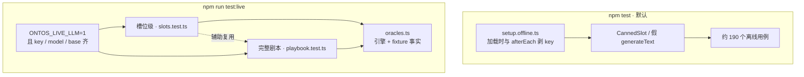
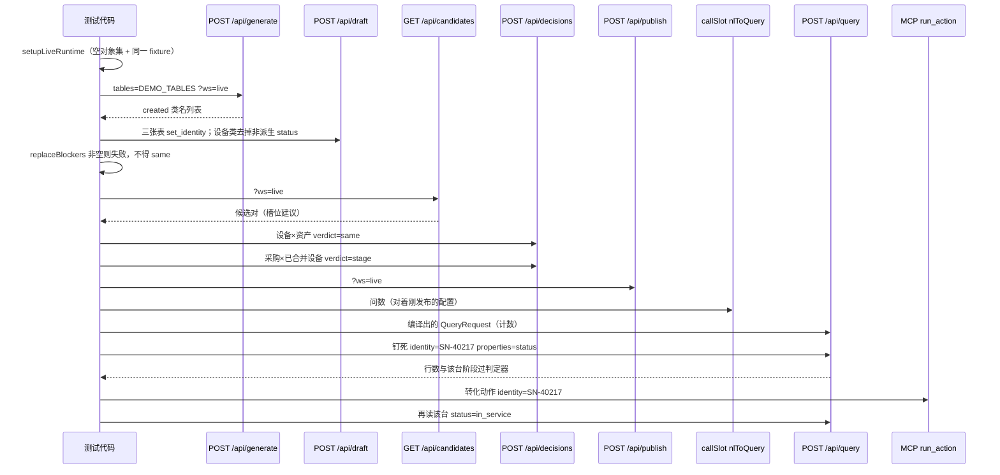

# 接入真实大模型 API 的端到端测试

| 字段 | 值 |
|---|---|
| 作者 | TBD |
| 日期 | 2026-08-22 |
| 状态 | Draft |
| 仓库 | `/Users/majiang/Documents/freespace/js/ontos` |
| 产品约束 | 模型只出现在 `llmSlot` 三个槽位；ReAct / 工具循环留在 Claude Code / Codex；人的关卡（连接、裁决、发布）由测试代码经 API 模拟点击；不对真模型产出做整份 JSON 黄金比对 |

---

## Overview

今天 `npm test` 约 190 个用例全部离线。`CannedSlot` 用正则把演示四问编成固定查询，`AiSdkSlot` 在 `src/tests/m2.test.ts` 里注入假 `generateText`。`POST /api/questions?ws=test&run=1` 也走 `getSlot()`。开发者 shell 里若已有 `OPENAI_API_KEY`，`m4m6.test.ts` 的问题集跑批、`GET /api/candidates`、`propose_ontology` 都会打真网，默认 suite 既贵又不稳。

本设计加一条**显式、可跳过**的 live 路径：人自己配 `OPENAI_API_KEY` / `OPENAI_BASE_URL` / `OPENAI_MODEL`，再设 `ONTOS_LIVE_LLM=1`，跑 `npm run test:live`。真模型产出过 Zod 之后，测试判定（代码里叫 oracle，避免和产品「裁决」撞车）拿引擎和 fixture 的已知事实判对错，不比对查询 JSON 全文。默认 `npm test` 在 worker 启动时、以及每个用例结束后剥掉 `OPENAI_API_KEY`，零花费、不发网。

---

## Background & Motivation

### 模型只在三个槽位

`src/server/engine/llmSlot.ts` 的 `LlmSlot` 只有三个方法。`getSlot()` 有 `OPENAI_API_KEY` 时构造 `AiSdkSlot`（`@ai-sdk/xai` 的 OpenAI 兼容协议），并且必须显式给出 `OPENAI_MODEL`；没 key 时返回 `CannedSlot`。

| 槽位 | 输入 | 出槽后再验 | 调用方 |
|---|---|---|---|
| `nlToQuery` | 自然语言 + 已发布 `OntologyConfig` | `queryRequestSchema` | `src/app/api/questions/route.ts`（问题集跑批） |
| `draftObjects` | 表结构（连接名 + `TableInfo`，列名/类型/主键/注释） | `objectTypeSchema`（包在 `{ object_types }`） | `src/app/api/generate/route.ts`（再 `import_objects`）；MCP `propose_ontology`（只返回、不落草稿） |
| `suggestPairs` | 类名 + 来源连接集合 + 字段名 | `TENDENCIES` | `src/server/engine/pairs.ts` 的 `listCandidates` |

三次调用同构：`generateText({ model, output: Output.object({ schema }), prompt })`。现实现**不设** `temperature`，也没有应用层重试。

`nlToQuery` 今天塞进 prompt 的是 `properties: Object.keys(t.properties)`，**没有类型、没有 `values`**。`queryRequestSchema.filter` 是 `z.record(z.string(), z.unknown())`，`{ status: "在役" }` 过 Zod，引擎跑出来 0 行。live 判定钉的是英文枚举 `in_service` / `in_transit`。本期在 PR2 给生产 prompt 补上类型与枚举值（见 §4.1），判定器仍不接受中文过滤值。

`propose_action` 不是槽位。它走 `src/server/engine/adjudicate.ts` 的 `conversionAction` 或改属性模板，确定性。`runAction` 不走模型。

### 现有测试全是离线的

| 文件 | 实际在测什么 |
|---|---|
| `src/tests/m2.test.ts` | `CannedSlot` 对演示四问 `toEqual` 整份查询；`AiSdkSlot` 注入假 `generateText`；`getSlot()` 用假 key 测分支。该用例写入 `OPENAI_API_KEY=test-key` 后若断言失败、没有 `try/finally`，假 key 会留在被复用的 fork worker 里 |
| `src/tests/engine.test.ts` | 附录 C + `SqliteFixtureDriver.seeded()`：在役 97、在途 81、报废 3、过保 181、按部门 8 组合计 97；`convert` / `SN-40217` |
| `src/tests/m4m6.test.ts` | 真路由 `POST /api/questions?ws=test&run=1`；「在役设备及其所属部门」期望 `"97"`；「还有多少在途设备」**故意**期望 `"1"` 以测失败路径。MCP 九个工具（含已落地的 `list_tables` / `apply_draft`） |
| `src/tests/helpers.ts` | `setupRuntime`：临时目录 + 拷 `ontology.yaml` + `installRuntime(makeRuntime({ cwd: tmp }))`。元库落在临时目录的 `src/server/config/ontos-meta.db`，不碰开发者本机文件 |

`vitest.config.ts` 指定 `pool: "forks"`，因为运行态按进程隔离。今天没有 `setupFiles`，也就没有人在 suite 启动或用例之间剥 key。fork worker 默认跨文件复用。

### 现成漏洞

`getSlot()` 每次调用都读 `process.env.OPENAI_API_KEY`。下列路径在默认 suite 里会进槽位：

- `src/tests/m4m6.test.ts` 的问题集跑批（`nlToQuery`）
- 同文件 MCP `propose_ontology`（`draftObjects`）
- `src/tests/m3.test.ts` 的 `listCandidates`（`suggestPairs`）

开发者若在 shell 里导出了真 key，`npm test` 会打网。罐头黄金（整份 `toEqual`、故意期望 1 行）在真模型下会红。这不是 flaky，是 suite 门闩缺失。只在 worker 启动时剥一次不够：`m2` 的假 key 若未清掉，同一 worker 里后面的 `m4m6` / `m3` 会构造 `AiSdkSlot` 并调用真 `generateText`。

### 演示世界与「从空画布建模」不是同一份配置

工作空间 `test` 的 v1 是 `src/server/config/ontology.yaml`（附录 C）。`src/server/engine/load.ts` 的 `getDriverRegistry` **只**给 `TEST_WS` 注入四个 fixture 连接（`purchase_sys` / `device_sys` / `asset_sys` / `hr_sys`）。`default` 与新建空间空白起步：空本体、无连接。

附录 C 的 `equipment.status` 是三条 `when`（报废优先，然后在途，然后在役），`convert` 的效应是转化 + 建保修卡。`applyVerdict` 的「阶段」结论只立派生 `status` 的**两条**规则，动作名是 `convert_to_${to}`，效应只有 `- link: 关系名`。`draftObjects` 的提示不产 `link_types`。因此：**用真模型从空对象集走完生成→裁决→发布，得不到附录 C 那份 YAML，也不该拿 97 台在役去卡这份新世界。** 问数编译器仍可以、也必须对着附录 C 世界钉死 `engine.test.ts` 的数字。

`pairEligible`（`src/server/engine/eligibility.ts`）= 两边有源 ∧ 无共同连接 ∧ 未定案。**不要求 identity。** 非派生 `status` 也不挡候选对，只挡阶段 `applyVerdict`。`CannedSlot` 对 `device` 表总会把列 `status` 收成属性——真模型同样大概率如此。完整剧本必须把「去掉该属性」当成默认路径，而不是例外。

### 痛点

1. 接上真模型之后，没有一条自动化路径证明三个槽位 + 引擎 + fixture 能串成产品剧本。
2. 默认 suite 会误打网。
3. 真模型同一问可以编出多种合法查询（有无 `expand`、列表 vs 聚合）。罐头那套 `toEqual` 不能当 live 判定器。
4. `ont_question.expected` 只按**行数**比对。聚合问「每个部门多少台」编成 `group_by` 后，行数变成组数 8，不是 97。

---

## Goals & Non-Goals

### Goals

1. **两套门闩分开。** 默认 `npm test` 离线、可进 CI、零花费。`npm run test:live` 打真模型；`ONTOS_LIVE_LLM=1` 且三件套（`OPENAI_API_KEY` / `OPENAI_MODEL` / `OPENAI_BASE_URL`）齐才执行，缺一 `skip`，不 `fail`。
2. **堵住误打网。** 默认 suite 的 vitest `setupFiles` 在模块加载时以及每个用例 `afterEach` 都 `delete process.env.OPENAI_API_KEY`（并剥掉 `ONTOS_TOKEN`，避免开发者 shell 令牌让写端点 401）。
3. **测试判定只认语义。** 过 Zod 之后，用 `runQuery` / 表结构 / 候选对资格判对错。允许 `properties` 多几个、`expand` 有无、列表与聚合两种形状。禁止对真模型产出 `toEqual` 整份查询 JSON，禁止赌中文类名，禁止与附录 C 逐字段相等。禁止把中文过滤值（如 `status: "在役"`）当成过闸。
4. **槽位级 live 与完整剧本分开，后者依赖前者的辅助与判定器。** 槽位级用固定输入，不必每次走发布链。完整剧本是一条 API 级集成用例：空对象集 + fixture 连接 → `POST /api/generate` → 代人关卡（唯一键 + 去掉设备类非派生 `status`）→ `GET /api/candidates` → 测试代码代人 `POST /api/decisions`（先同一、后阶段）→ `POST /api/publish` → 问数过闸 → MCP `run_action` 验收 `SN-40217` → 再问该台已在役。
5. **隔离 runtime。** live 用例继续走临时目录 + `installRuntime`，不写仓库里的 `src/server/config/ontos-meta.db`。
6. **失败可诊断。** Zod 失败或超时把模型原始产出写到 OS 临时目录；日志与产物不含 key。
7. **动作不走模型，但完整剧本必须验收。** 证明问数编译出的世界和 `runAction` 改源库接得上。

### Non-Goals

- 把外部 Agent 的 ReAct 循环做进仓库当自动测试。MCP 工具可测：`propose_ontology` 走真槽位；`query` / `run_action` 仍是确定性引擎。
- live MCP **本期只加 `propose_ontology`**。`list_tables` 与 `apply_draft` **已经落地**（`src/app/api/mcp/route.ts`，`m4m6.test.ts` 有往返）。完整剧本的草稿写入走 REST `POST /api/draft`（与画布同路径），不在 live 里再测一遍 MCP 写草稿。对象卡简单动作表单若仍不完整，不在本期 live 覆盖。
- Playwright / 浏览器。槽位全在服务端。
- 改附录 B、新造本体 YAML 键、第四个 NL 槽位、把重试做成引擎内 ReAct。
- 修改 `POST /api/questions` 的 `expected` 语义（行数 vs 聚合合计）。live 问数不走这条路由。
- 让 `draftObjects` 自动产出附录 C 的派生规则、保修卡、`belongs_to`。完整剧本的数字与附录 C 世界分开钉。
- 为 live 新建工作空间种类或改 `seedYamlFor("test")`。
- 给生产 `AiSdkSlot` 设 `temperature: 0`（用户 2026-08-22 拍板：本期先不设，不做该 PR；测试 PR 也不改生产温度）。

---

## Proposed Design

### 总结构



人在自己的 shell 里导出三件套和门闩。CI 默认只跑离线 suite。缺门闩或缺三件套时，**打模型的** `describe.skipIf` 跳过，进程退出码 0。接线冒烟在 `skipIf` 外面，见 §1。

### 1. 分层与门闩

**默认 suite（`package.json` 的 `test` = `vitest run`）**

`vitest.config.ts` 增加（`exclude` **追加**到 Vitest 默认列表上，不要整份覆盖，以免丢掉 `dist` / 配置文件等默认项）：

```ts
import { defineConfig, configDefaults } from "vitest/config";

test: {
  pool: "forks",
  setupFiles: ["src/tests/setup.offline.ts"],
  exclude: [...configDefaults.exclude, "src/tests/live/**"],
}
```

`src/tests/setup.offline.ts`：

```ts
import { afterEach } from "vitest";

delete process.env.OPENAI_API_KEY;
delete process.env.ONTOS_TOKEN;

afterEach(() => {
  delete process.env.OPENAI_API_KEY;
  delete process.env.ONTOS_TOKEN;
});
```

Vitest 的 `setupFiles` 每个 worker **启动时跑一次**，不会在每个 `it` 之前重跑。`m2.test.ts` 的 getSlot 分支会写入 `OPENAI_API_KEY=test-key`；fork worker 默认跨文件复用。只在加载时剥一次，假 key 会漏到后面的 `m4m6` / `m3`。所以加载时剥、每个用例结束后再剥。`m2` 仍可在用例里写入假 key 测构造（不调用真 `generateText`）；`afterEach` 会清掉。禁止默认 suite 把开发者的真 key 写回去。可选：给 `m2` 该用例加 `try/finally`（既有卫生，不是门闩的替代）。

不删 `OPENAI_MODEL` / `OPENAI_BASE_URL`：没 key 时 `getSlot()` 走 `CannedSlot`，这两个变量不参与分支。

**live suite**

新建 **独立** 的 `vitest.live.config.ts`：自己写 `resolve.alias` 与 `test.pool: "forks"`，**不要** `mergeConfig(defaultConfig, …)` 却不覆盖 `setupFiles`——默认配置的 `setup.offline.ts` 会剥掉 key，`liveReady()` 为假，整份 skip 且退出码 0，和「缺三件套」分不清。

必须写明：

```ts
test: {
  pool: "forks",
  setupFiles: [], // 显式空：不得继承 setup.offline.ts
  include: ["src/tests/live/**/*.test.ts"],
  fileParallelism: false,
  maxWorkers: 1,
  testTimeout: 600_000,  // 10 min：完整剧本是一条 it，常见 2～5 min，180s 会把正常跑完掐死
  hookTimeout: 600_000,  // beforeAll / afterAll 若分担 setup 也要够
}
```

§8 的 2～5 分钟是**常见耗时**，不是超时预算。`callSlot` 重试加上门闩下 30s abort，最坏情况更长。完整剧本那条 `it` 再显式 `{ timeout: 600_000 }`。允许把剧本断言拆成几条共享 `beforeAll` 的 `it`（失败更好定位），每条同样至少 10 分钟；不拆也可以，一条 `it` 用 10 分钟即可。

```json
"test:live": "vitest run --config vitest.live.config.ts"
```

`src/tests/live/gate.ts`：

```ts
export function liveReady(): boolean {
  return (
    process.env.ONTOS_LIVE_LLM === "1" &&
    Boolean(process.env.OPENAI_API_KEY) &&
    Boolean(process.env.OPENAI_MODEL) &&
    Boolean(process.env.OPENAI_BASE_URL)
  );
}
```

**接线测试必须写在 `skipIf(!liveReady())` 外面。** `setup.offline.ts` 只剥 `OPENAI_API_KEY`，不剥 `ONTOS_LIVE_LLM` / `OPENAI_MODEL` / `OPENAI_BASE_URL`。误继承之后 `liveReady()` 为假，整份 `skipIf` 会 skip-绿（退出码 0），冒烟若放在里面永远跑不到。`getSlot().name` 只有 key 还在时才会是 `ai-sdk:`。

```ts
it("live 配置不得继承 setup.offline.ts", () => {
  const intended =
    process.env.ONTOS_LIVE_LLM === "1" &&
    Boolean(process.env.OPENAI_MODEL) &&
    Boolean(process.env.OPENAI_BASE_URL);
  if (!intended) return; // 三件套本就没齐：不是「剥 key」这条故障，让打模型的 skipIf 去 skip
  expect(process.env.OPENAI_API_KEY, "key 被剥掉：live 配置继承了 setup.offline.ts").toBeTruthy();
  expect(getSlot().name.startsWith("ai-sdk:")).toBe(true);
});

describe.skipIf(!liveReady())("槽位级（打模型）", () => {
  // nlToQuery / draftObjects / suggestPairs / propose_ontology
});
```

`describe.skipIf(!liveReady())` **只包打模型的用例**。接线测试始终注册：人设了 `ONTOS_LIVE_LLM`+model+base、key 却被剥掉时必须红。

生产 `getSlot()` **不**要求 `OPENAI_BASE_URL`（缺省走 SDK 默认端点）。live **额外**要求它：避免测试在未声明接入点时打到开发者不打算打的默认地址。文档按已有 `OPENAI_*` 写，不锁模型名。

三层互锁：默认 `exclude` 追加 live 目录（保留 Vitest 默认 exclude）；offline setup 剥 key（加载 + `afterEach`）；打模型的用例 `skipIf`；接线测试在 `skipIf` 外面抓「继承了剥 key」。只开其中一层，另外几层仍能挡住误跑。

### 2. 测试判定（oracle）

纯函数放在 `src/tests/live/oracles.ts`。槽位级与完整剧本共用。真模型产出必须先过与生产相同的 Zod；判定器不重复验形状，只验**业务后果**。

#### 2.1 问数：答案语义，不是查询 JSON

`engine.test.ts` 钉死的 fixture 事实（附录 C 世界、`SqliteFixtureDriver.seeded()`）：

| 事实 | 数字 |
|---|---|
| `status = in_service` 的设备个体 | 97 |
| `status = in_transit` 的设备个体 | 81 |
| `status = scrapped` 的设备个体 | 3 |
| `in_warranty = false` 的设备个体 | 181 |
| 按 `dept` 分组的在役 | 8 组，`count` 合计 97 |
| 验收主角 | 序列号 `SN-40217`，验收前在途 |

`src/server/engine/query.ts` 的 `project()` 只输出 `req.properties`（省略则输出该类全部属性）。结果行上**没有** `identity` 字段；个体键留在 `Individual.key`，不会抄到行上。模型若编译 `properties: ["name"]`，列表里看不到序列号。因此：**禁止从模型编出的列表投影里推断 `SN-40217` 在不在。** 认人一律跑钉死的引擎查询：

```ts
{ object: cls, identity: "SN-40217", properties: ["status"] }
```

同一问允许的合法编译例如下（均算对，前提是未截断）：

- 「还有多少在途设备」编成个体列表 → `rows.length === 81`
- 同一问编成无 `group_by` 的 `count` → 唯一行的 `count === 81`
- 「每个部门多少台在役设备」编成 `group_by: ["dept"]` → 组数 8 且合计 97
- 「在役设备及其所属部门」带或不带 `expand: [{ relation: "belongs_to" }]` → 个体数仍是 97

截断：`DEFAULT_LIMIT = 200`。97 / 100 / 81 / 181 在模型**不写** `limit` 时都装得下。若模型写了 `query.limit` 且该值小于本问期望的 `total`：不要拿截断后的 `total` 去比 97/100/81/181。对该问 `callSlot` 再编一次；仍带过小 `limit` 则失败，文案为「查询带了截断 limit」，不拿 20 行当 97 的反例。

辅助：

```ts
export function answerTotal(
  query: QueryRequest,
  rows: Record<string, unknown>[],
): { total: number; groups?: number } {
  if (query.aggregate) {
    const metric = query.aggregate.metrics[0];
    const key = Object.keys(metric)[0]; // 如 count
    const total = rows.reduce((s, r) => s + Number(r[key] ?? 0), 0);
    return { total, groups: rows.length };
  }
  return { total: rows.length };
}

/** 模型编出的查询若自带过小 limit，不得拿截断后的行数去比期望。 */
export function isTruncated(query: QueryRequest, expected: number): boolean {
  return query.limit != null && query.limit < expected;
}
```

槽位级问数步骤：`callSlot("nlToQuery", question, appendixC)` → 若 `isTruncated` 则按上款重试/失败 → `runQuery(appendixC, fixture, query)` 必须成功（编译出的查询引擎拒了 = 失败）→ 用上表的数字卡 `total` / `groups`。**不对 `query` 做 `toEqual`。** 过滤值必须是配置里的英文枚举（`in_service` 等）；`status: "在役"` 即使过 Zod 也是失败（0 行或合计对不上）。

不走 `POST /api/questions?run=1`。理由见 §7。

#### 2.2 逆向建模：对照输入表，不赌类名

对 `draftObjects` 的每一条产出，用**这次调用的输入表**判定：

1. 类名匹配 `/^[a-z][a-z0-9_]*$/`（否则 `import_objects` 会 `DraftReject`）。
2. 整份过 `objectTypeSchema`（`AiSdkSlot` 已验；判定器再验一遍以防包装漏掉）。
3. `sources` 里至少有一条，其 `connection` 等于输入连接、`table` 等于输入表名。
4. `identity` 若有，必须是该表某一列的列名（或该类 `properties` 的键且 `fields` 能对照到列）。
5. `properties` 的键是输入列名的子集，或 `fields` 的值（列名）是输入列名的子集——允许属性名与列名不同（附录 C 把设备表列 `status` 对照成属性 `mark`），不允许对照到输入里不存在的列。
6. 表主键列不得出现在 `properties` 里，**除非** `identity` 就是该主键（与 `CannedSlot` 对业务编号主键的破格同口径）。

**预期路径，不是例外：** 对照 `device_sys.device` 的类若有非派生属性 `status`（列注释是「台账状态」，`CannedSlot` 与真模型都会收），槽位级只打日志，**不断言**：

```ts
if (hasNonDerivedStatus) {
  console.warn("完整剧本将走去掉 status 的代人关卡");
}
```

禁止 `expect.soft`，也禁止单独一条 `it` 去 `expect` 该属性存在：`expect.soft` 仍会在用例结束时标失败；模型若把该列对照成 `mark`（更接近附录 C）反而会红。槽位级 `draftObjects` **不因此失败**——`pairEligible` 不看 identity、也不看 `status`；挡住的是后面的阶段裁决。identity 缺省也不挡候选对；发布闸在 `validateSemantics`（`fields` 必须有对齐属性）。唯一键关卡见 §5.1。

不判定：中文 `description` 的用词、类名是否等于表名、是否与附录 C 的 `equipment` 逐字段相等、是否产了 `actions` / `link_types`（`import_objects` 本就会剥掉 `actions` / `axioms`）。

#### 2.3 候选对：覆盖演示那两对，同源不成对

演示要覆盖的业务关系（按**源表**认，不按类名）：

- 采购在途 × 设备在役：`purchase_sys.po_item` 与 `device_sys.device`
- 设备 × 资产：`device_sys.device` 与 `asset_sys.asset`

判定：

1. `tendency` ∈ `TENDENCIES`（`same` / `overlap` / `stage` / `name_similar`）。没有 `skip`——与 `verdict.ts` 一致，机器不给「先放着」。
2. 产出必须包含上面两对（两端顺序不限）。解析两端时：槽位级用测试喂进去的类名；完整剧本用草稿里该类 `sources.*.table` 反查。
3. 同源不成对：两端 `sources` 有共同连接则失败。`device_sys.device` 与 `device_sys.department` 不得出现。
4. 倾向不必等于 `CannedSlot` 的字面结果。人仍定案。

`listCandidates` 在槽位之后还会跑 `pairEligible`。槽位级对**槽位原始产出**就卡同源；完整剧本对 `GET /api/candidates` 的返回卡覆盖与同源（资格闸已滤掉非法对，模型若乱给同源对，列表里不应再出现）。

### 3. `setupLiveRuntime`：空对象集 + fixture，不改 `load.ts`

**问题。** fixture 连接只在 `getDriverRegistry` 里给 `ws === "test"` 注入。`test` 的 v1 又是附录 C。对 `test` 调 `POST /api/generate` 会与已有 `equipment` 撞名（`import_objects`：「类已存在」），生成步骤失去意义。

**不采用的改法。**

| 改法 | 为何不用 |
|---|---|
| `seedYamlFor("test")` 在 live 门闩下返回空本体 | 门闩泄漏会让开发者的 `test` 空间丢掉演示模板 |
| `load.ts` 增加第三个「live」空间并注入 fixture | 产品多一个特殊空间名，与「按空间名判断填充」的 `test` 并列，测试方案侵入运行时 |
| 把 `test` 发布成空的 v2 | 历史链从附录 C 起，空间语义被测脏 |

**采用。** 测试辅助 `setupLiveRuntime`（`src/tests/live/helpers.ts`）在 `setupRuntime` 之上做额外的事。**不改** `load.ts`、**不改** `seedYamlFor`。

顺序必须是：`installRuntime` → 剥 `ONTOS_TOKEN` → `ensureWorkspace` → `getDriverRegistry("live")` → `register`。不得在 `register` 之前让别的代码先 `getDriverRegistry("live")`（注册表按空间缓存，空表会被冻住）。

```ts
export const LIVE_WS = "live";

export async function setupLiveRuntime(prefix: string): Promise<{ tmp: string; ws: string }> {
  delete process.env.ONTOS_TOKEN; // 开发者 shell 里的令牌会让 generate/draft/decisions/publish/run_action 全部 401
  const tmp = await setupRuntime(prefix); // 临时目录、拷 ontology.yaml、installRuntime
  const { ensureWorkspace } = await import("@/server/engine/workspace");
  const { getDriverRegistry } = await import("@/server/engine/load");
  const { SqliteFixtureDriver } = await import("@/server/engine/fixture");
  await ensureWorkspace(LIVE_WS); // seedYamlFor("live") 走非 test 分支 → object_types: {}
  const registry = await getDriverRegistry(LIVE_WS);
  const fixture = SqliteFixtureDriver.seeded(); // 同一份内存库
  for (const conn of fixture.connections()) registry.register(conn, fixture);
  return { tmp, ws: LIVE_WS };
}
```

要点：

- `ensureWorkspace("live")` 让 v1 是空对象集。`import_objects` 不再撞附录 C 的类名。
- 四个连接挂**同一个** `SqliteFixtureDriver` 实例。验收写入 `device` / `asset` 表之后，问数读的是同一份内存库。`hr_sys` 挂上不用，无害。
- `getDriverRegistry("live")` 第一次调用时 `ws !== "test"`，注册表为空，随后测试把 fixture 注册进去。本用例进程内不会重建该注册表（`installRuntime` 只在 `beforeEach` / `afterEach`）。
- 槽位级问数**继续用 `ws=test`**：那里既有附录 C 也有 fixture，才能钉 97 / 81 / 3。`setupRuntime` 已够，不必 `setupLiveRuntime`。
- 完整剧本只用 `LIVE_WS`，不读 `test` 的已发布快照。

`cleanupRuntime` 与现网测试相同：换回默认运行态，删临时目录。

### 4. 槽位级 live（`src/tests/live/slots.test.ts`）

每个槽位若干固定输入，独立可跑。

**一个包装：`callSlot`。** 它重试的是 **槽位方法**（`getSlot().nlToQuery` / `draftObjects` / `suggestPairs`），不是注入假 `generateText`。超时、落盘、可重试错误只有这一处口径。完整剧本的问数也走 `callSlot("nlToQuery", …)`。路由里的 `generate` / `candidates` 仍调生产 `getSlot()`；失败落盘靠 `AiSdkSlot` 在 `ONTOS_LIVE_LLM=1` 时写临时文件（见 §6）。live 不为槽位级再搞一套 generateText 注入（那是 `m2.test.ts` 离线测 Zod 的办法）。

`callSlot`：合计最多 2 次槽位调用。只对**可重试**错误再调一次。

可重试（结构化产出没成形、或被 30s abort 掐掉——第一次失败不代表模型不能编）：

| 名字 / 类型 | 来源 |
|---|---|
| `ZodError` | 出槽后 `queryRequestSchema.parse` / `draftSchema.parse` / `pairsSchema.parse` |
| `NoObjectGeneratedError`（`error.name` 也可能是 `AI_NoObjectGeneratedError`） | `ai` 包：`generateText` + `Output.object` 没给出过 schema 的对象 |
| `TimeoutError`、`AbortError` | `AbortSignal.timeout(30_000)` 触发的 `DOMException.name`；手动 abort 同属此类 |

不可重试（立刻失败或门闩 skip）：

- HTTP 401 / 403（含 AI SDK `APICallError` 且 `statusCode` 为 401/403）
- `OPENAI_MODEL` 未设置抛出的 `Error`
- HTTP 400 且正文含 `temperature`：落盘后失败，固定文案指出接入点拒了该参数，**不**静默摘掉该参数

```ts
function isRetryableSlotError(e: unknown): boolean {
  if (e instanceof ZodError) return true;
  const name = e instanceof Error ? e.name : "";
  return (
    name === "NoObjectGeneratedError" ||
    name === "AI_NoObjectGeneratedError" ||
    name === "TimeoutError" ||
    name === "AbortError"
  );
}
```

#### 4.1 `nlToQuery`（附录 C 世界）

**生产 prompt 补词汇（PR2）。** 今天只传属性名。三个槽位是编译器，过滤值必须是配置里的枚举。把 `properties` 改成 `{ name, type, values? }[]`（`values` 来自属性定义）。不接受把判定放宽成中文「在役」。

配置：`configSchema.parse(load(ontology.yaml))`，与 `engine.test.ts` 同一份。驱动：`freshDriver()`。

四问（live 用**正确**期望，与 `m4m6` 那条故意期望 1 行分开）：

| 问题 | 判定 |
|---|---|
| 在役设备及其所属部门 | `runQuery` 成功；未截断；`total === 97` |
| 还有多少在途设备 | 未截断；`total === 81` |
| 哪些设备过保了 | 未截断；`total === 181` |
| 每个部门多少台在役设备 | 未截断；`groups === 8` 且 `total === 97` |

「过保」对齐 `engine.test.ts`：`in_warranty: false` 在未验收任何保修卡时是 181 行。

另加一条：编译结果的 `object` 必须是配置里存在的类；这是 Zod 过了之后引擎仍可能拒的点，`runQuery` 已经覆盖。

#### 4.2 `draftObjects`

输入：对 fixture 内省后的四张演示表。

```ts
export const DEMO_TABLES = [
  { connection: "purchase_sys", table: "po_item" },
  { connection: "device_sys", table: "device" },
  { connection: "device_sys", table: "department" },
  { connection: "asset_sys", table: "asset" },
];
```

调用 `callSlot("draftObjects", infos)`。对每张输入表，在产出 map 里找 `sources.*.table` 对得上的类，跑 §2.2。找不到对应类 = 失败。对照 `device_sys.device` 且含非派生 `status` 时 `console.warn`，不 `expect`。

MCP 同槽位加一条：`tools/call` `propose_ontology`，`tables` 为上述四张（或其中 `department` 一张作冒烟），`?ws=test`（要有连接可内省）。返回体跑同一判定器。**不** `import_objects`。`query` / `run_action` / `apply_draft` / `list_tables` 的确定性用例留在默认 suite，live 不重复。

#### 4.3 `suggestPairs`

输入由测试构造（不必先 generate）：

```ts
[
  { name: "po_item", sources: ["purchase_sys"], fields: ["sn", "item_name"] },
  { name: "device", sources: ["device_sys"], fields: ["serial_no", "name", "dept_id", "status"] },
  { name: "asset", sources: ["asset_sys"], fields: ["sn", "asset_name"] },
  { name: "department", sources: ["device_sys"], fields: ["dept_id", "dept_name"] },
]
```

判定 §2.3：覆盖 `po_item-device` 与 `device-asset`；`device-department` 不成对；倾向落在 `TENDENCIES`。

### 5. 完整剧本（`src/tests/live/playbook.test.ts`）

一条集成用例。API 级。人的关卡由测试代码发与画布相同的 HTTP。模型不定案、不发布。

选表（演示最小集，与 30 分钟剧本一致：采购 / 设备 / 资产，并带上部门表）：`DEMO_TABLES`。

**唯一合法顺序：** generate → 按源表找类 → 代人关卡（三张表设唯一键 + **在「同一」之前**处理设备类的非派生 `status`）→ 确认设备类 `replaceBlockers` 为空 → `GET /api/candidates` → 「同一」（设备 × 资产）→ 「阶段」（采购 = `class_a`，合并后的设备 = `class_b`）→ publish。不得在「同一」之后再 `replace_object`：合并后 `sources.length > 1`，`replaceBlockers` 会推入「挂了多个来源」，`remove_property` / `update_property` 又会被 `referencesOf` 拦住。



#### 5.1 代人关卡（算法，不是一句话）

画布上人会做、引擎也暴露了 API 的，测试才做。做完仍交执行器与判定器。目标类一律 `classByTable(draft, connection, table)`，不按中文/英文类名，也不按「合并之后还叫不叫设备」。

**A. 生成。** `POST /api/generate?ws=live`，body `{ tables: DEMO_TABLES }`。对象进工作副本。这是人点「生成对象」。

**B. 按源表找类。**

```ts
const po = classByTable(draft, "purchase_sys", "po_item");
const device = classByTable(draft, "device_sys", "device");
const asset = classByTable(draft, "asset_sys", "asset");
```

找不到 = 失败（槽位级已要求 `sources.table` 对得上）。

**C. 唯一键（采购 / 设备 / 资产每一张，不论当前 identity 是什么）。**

对 `po`、`device`、`asset` 分别：若某属性的 `fields` 对照到列名 `sn` 或 `serial_no`，`POST /api/draft` `set_identity` 指到该属性（已经是该属性则视为空操作）。这对应 AGENTS.md「有抉择才打断一张卡（唯一键）」，也覆盖模型把 identity 设成 `item_name`、省略 identity、或已设成 `sn` 的情况。`pairEligible` 不要求 identity；`validateSemantics` 发布时要求每条源的 `fields` 含对齐属性。阶段之后活下来的是采购类（`class_a`）；`convert` / `identity: "SN-40217"` 认的是**那个类**的 identity。若采购仍停在 `po_id`，`mergeInto` 会把设备的 `serial_no` 改写到 `po_id` 上，序列号认人会落空。

列 `sn` / `serial_no` 没被收进 `properties`/`fields`：不编造对照，剧本失败并落盘。

发布前断言：活下来的合并类 `identity` 仍是对照序列号列的那个属性。

**D. 去掉设备类非派生 `status`（必须在「同一」之前）。** 这是默认路径：设备表有列 `status`，生成器会收成同名非派生属性；`applyVerdict` 阶段在合并后若类上已有非派生 `status` 会抛错。附录 C 把该列对照成属性 `mark`；测试不手写 `mark`，只把挡路的 `status` 拿掉。

只对 **B 找出的 `device` 类**执行，且必须在 `same` 之前——这是该类仍单源、`replace_object` 还能用的最后窗口。`same` 之后 `sources.length > 1`，「挂了多个来源」锁定，没有任何现有 op 能再删 `status` 及其 `fields` 行。

算法（必须按这个序号；`replace_object` 看的是**当前**类，锁着时发了只会得到含糊的 `DraftReject`）：

1. `mapped = ∪ sources.*.fields 的键`。对每个非派生、不是 identity、且名字不在 `mapped` 里的属性：`POST /api/draft` `remove_property`。未对照字段**不会**打中 `referencesOf` 的「源映射」（只有 `fields[prop]` 存在才打中），所以这条 op 能解开 `replaceBlockers` 的「含有未对照到表列的字段」。
2. 若此时 `replaceBlockers(device, publishedHas=false)` 仍非空：落盘当前草稿并失败。文案带上 blockers 列表。不得发 `replace_object`，不得发 `same`。本期不新增「解除对照」草稿 op。
3. 若 `status` 仍是非派生属性：`POST /api/draft` `replace_object`，`def` 是当前类体的克隆，并且：
   - 删除 `properties.status`
   - 删除每一条 `sources.*.fields.status`  
   两条必须一起做。`applyOp` 每步跑 `validateSemantics`：只删属性、留下 `fields.status`，会抛「fields 指向不存在的属性」，整步回退。
4. `same` 之前再断言一次：`replaceBlockers(device, false)` 为空。关不上就失败，不继续裁决。

不做：手写附录 C 的三条 `when`、补 `belongs_to`、补 `warranty_card`、补 `in_warranty`、把类改名为 `equipment`。

#### 5.2 裁决顺序与结论

与演示剧本一致，结论由测试写死，不听槽位倾向。§5.1 全部完成且设备类 `replaceBlockers` 为空之后：

1. `POST /api/decisions`：`class_a` = `device`，`class_b` = `asset`，`verdict: "same"`（此时两个类都还在，设备类仍单源）。
2. `POST /api/decisions`：`class_a` = `po`（采购），`class_b` = 合并后仍在的设备类（`classByTable(..., "device_sys", "device")` 此时应仍能找到，源里已有 `device_sys` 与 `asset_sys`），`verdict: "stage"`，`stage_names: { from: "in_transit", to: "in_service" }`。阶段名用附录 C 的英文枚举，问数才能与 `in_service` / `in_transit` 对上。

`class_a` 必须是采购、`class_b` 必须是已合并的设备：`applyVerdict` 用「合并前 A 没有的第一条新源」当 `srcB`。这样 `srcB` 是设备源，不是资产源；每条设备表行（含 3 台台账标记报废）都算在役。

没有「同一之后再去掉 status」这一步。那一步在 `replaceBlockers` 下不可实现。

发布：`POST /api/publish?ws=live`。配置不合法必须 422 失败，不在测试里改 YAML 硬过闸。发布前断言合并类 identity 仍是序列号属性。

#### 5.3 问数：这份新世界的数字，不是 97

阶段裁决只立两条 `when`：采购有行且设备无行 → `in_transit`；设备有行 → `in_service`。fixture 里 3 台设备表 `status='scrapped'` 在这份世界里仍是「设备源有行」，算在役。因此：

| 问 | 验收前 | 验收 `SN-40217` 后 |
|---|---|---|
| 在役（个体或合计） | **100** | **101** |
| 在途 | **81** | **80** |
| 该台钉死查询 `identity=SN-40217` `properties=["status"]` | `status=in_transit` | `status=in_service` |

这不是放宽：100 = 设备源 100 行，81 = 121 − 40，与 `fixture.ts` 注释同一批种子。97 只属于附录 C 那条报废规则，槽位级 `nlToQuery` 钉它。

完整剧本的四问（过闸且行数对）。计数走模型编译 + `POST /api/query`；**序列号是否在途/在役不看模型列表投影**，另跑钉死的 identity 查询（§2.1）。`callSlot("nlToQuery", question, published)` 编计数问。

1. 「在役设备及其所属部门」→ 未截断；`total === 100`。允许无 `expand`（`draftObjects` 不产 `belongs_to`；模型若编了配置里没有的关系，`runQuery` 拒绝，`callSlot` 再编一次仍拒绝则失败）。
2. 「还有多少在途设备」→ 未截断；`total === 81`。该序列号是否在途：钉死 `{ object: 合并类, identity: "SN-40217", properties: ["status"] }`，期望 `in_transit`。不从列表行上找 `serial_no` / `sn` / `identity`。
3. 「每个部门多少台在役设备」——决策树，按顺序只走一条：
   1. 合并类**没有任何**属性的 `fields` 值是列 `dept_id` → 记「缺口」：用例仍过，产物目录写一句原因。不再编、不再跑。
   2. 否则（有 `dept_id` 对照）：编译出的查询必须**全部**成立，缺一条即整剧失败：
      - `runQuery` / `POST /api/query` 执行成功；
      - 不是 `isTruncated`（相对期望 100）；
      - `filter.status === "in_service"`（严格等值；`status: "在役"` 或根本没有这条过滤 = 失败，不是缺口）；
      - `answerTotal.total === 100`。  
      `group_by` 落在 `name` 上只要过滤对、合计 100 仍算过。不许把「编错过滤」收成缺口。
4. 「序列号 SN-40217 现在处于什么阶段」→ **忽略模型编出的形状**。只跑钉死 identity 查询，验收前 `status === "in_transit"`。过保问放在槽位级（附录 C 才有 `in_warranty`），不放进建模剧本。

不走问题集跑批。

#### 5.4 验收动作

动作不走模型。测试从已发布配置里找：落在合并类上、效应含 `{ link: ... }` 的那一条（阶段裁决产的 `convert_to_in_service`）。经 MCP `tools/call` `run_action`，`?ws=live`：

```json
{ "action": "<上一步解析出的动作名>", "object": "<合并类名>", "identity": "SN-40217" }
```

期望：`ok === true`；投影里至少有一条对 `device` 表的成功 `insert`（`link` 效应会给第 3 步没有行、又映射了识别字段的源插行）。`seedDemo` 的 `asset` 表是 0 行，同一之后资产源对 `SN-40217` 也没有行，资产表通常也会插一行。不要求保修卡（那是附录 C `convert` 的 `create`，阶段裁决的 `conversionAction` 没有这条效应）。

然后钉死查询：`identity: "SN-40217"`，`properties: ["status"]`，期望 `in_service`。再跑在途计数问，未截断则 `total === 80`。

这证明：问数用的派生 `status` 与动作写回的源行是同一份 fixture。

### 6. 重试、超时、temperature、失败产物

| 项 | 决定 |
|---|---|
| 结构化产出 / 解析失败 | `callSlot` 对 `ZodError`、`NoObjectGeneratedError` / `AI_NoObjectGeneratedError` 再调一次，合计最多 2 次。不在引擎里循环，不是 ReAct |
| 401 / 403 / 缺模型名 | 不重试，立即失败（或门闩 `skip`） |
| 400 且正文含 `temperature` | 落盘后失败，不重试。不静默摘掉该参数 |
| 单次 `generateText` 超时 | **仅当 `ONTOS_LIVE_LLM===1`**，`AiSdkSlot` 才传 `abortSignal: AbortSignal.timeout(30_000)`。`TimeoutError` / `AbortError` 可再试一次。生产路径（未开门闩）**不** 30s 掐断——那是 vitest 的事，不是画布「生成对象」的预算。若产品以后要挂起上限，另开 PR、用更大预算（例如 120s） |
| 用例超时 | live `testTimeout` 与 `hookTimeout` 均为 **600_000**（10 min）。§8 的 2～5 分钟是常见耗时，不是这条预算。完整剧本那条 `it` 再写 `{ timeout: 600_000 }` |
| `temperature` | **本期不设。** 测试 PR 不改生产三次 `this.gen`。用户 2026-08-22 拍板：不做生产 `temperature: 0`（原 PR2b 不在本期范围）。live 与生产同一口径（都不传该参数）。若将来有人加上而接入点 400 且正文含该词，按上款落盘失败、不重试 |
| 失败产物 | `join(tmpdir(), "ontos-live-llm", <ISO 时间>)` 写 JSON：槽位名、`getSlot().name`、输入摘要（表名/问题/类名）、原始 `output` 或异常信息。不入库、不提交。默认 suite 不写 |

落盘：`AiSdkSlot` 在 `ONTOS_LIVE_LLM=1` 时，`generateText` 抛错或出槽 `parse` 失败把原始产出写入上述目录。路由（generate / candidates）与 `callSlot` 共用这一处。默认 `npm test` 已剥 key，进不了 `AiSdkSlot`，这个分支不执行。产物路径打到 `console.error` 一行，便于打开。

对字符串做一次脱敏：若 `OPENAI_API_KEY` 非空，从写入文件和错误信息里替换成 `***`。

### 7. 问题集：live 不走 `/api/questions?run=1`

`src/app/api/questions/route.ts`：`expected` 为纯数字时按 `rows.length` 比对。聚合问会变成「组数」。`m4m6.test.ts` 把在途的期望写成 `"1"`，测的是跑批失败路径，不是查询正确性。

live 选定：测试里 `callSlot("nlToQuery", …)` + `runQuery` / `POST /api/query`，用 §2.1 的 `answerTotal`。不复用问题集路由，也不在本期改 `expected` 语义。

`m4m6` 的故意 1 行原样留在默认 suite，继续用 `CannedSlot`。

### 8. 花费与时间

按一次 live 全绿（槽位级 + 完整剧本）、每槽最多 2 次调用估算：

| 调用 | 次数（含 1 次重试上限） |
|---|---|
| `nlToQuery` 槽位级四问 | 4～8 |
| `draftObjects` 槽位级 + MCP `propose_ontology` | 2～4 |
| `suggestPairs` 槽位级 | 1～2 |
| 完整剧本 `draftObjects`（generate） | 1～2 |
| 完整剧本 `suggestPairs`（candidates） | 1～2 |
| 完整剧本 `nlToQuery` 计数问 + 验收后再问 | 若干；另加钉死 identity 查询（不走模型） |

合计约 **14～28** 次结构化输出。单次延迟按兼容端点常见 2～15 秒，串行、`maxWorkers: 1`：槽位级大约 1～3 分钟，完整剧本大约 **2～5 分钟（常见）**，整趟大约 **3～8 分钟**。这是耗时估计，**不是** vitest 超时。live 配置与剧本 `it` 的超时是 **10 分钟**（600_000 ms），避免把一次正常但偏慢的剧本判成超时失败。

费用随模型而变。量级：每次数千 token，整趟约 10^5 token 内。内部网关可能不计费。默认 `npm test` **零花费、零出站**。

### 9. 密钥与数据

- 日志只打 `getSlot().name`（形如 `ai-sdk:${model}`）、耗时、重试次数。不打 env、不打 Authorization。
- 失败产物脱敏 key。
- `draftObjects` 的 prompt 只序列化 `connection / name / columns`（见 `llmSlot.ts`），不含 `sample`。`GET /api/introspect` 的 3 行脱敏采样不进槽位。
- `nlToQuery` 的 prompt 是类名、属性名、类型、枚举值、关系名，不是业务行。
- 源库始终是进程内 fixture。live 测试不连开发者的 MySQL/PG。
- `setup.offline.ts` 与 `setupLiveRuntime` 都剥 `ONTOS_TOKEN`。运行手册写明：live 不使用该令牌；开发者 shell 里若有，测试进程会删掉，不写回。

### 10. 运行手册

复制即用（模型名由运行者填，文档不锁）：

```bash
export OPENAI_API_KEY="…"
export OPENAI_BASE_URL="https://api.x.ai/v1"   # 或任何 OpenAI 兼容端点
export OPENAI_MODEL="…"                        # 必须显式；与生产 getSlot 同一变量
export ONTOS_LIVE_LLM=1
# 不要依赖 ONTOS_TOKEN：setupLiveRuntime 会删掉它
npm run test:live
```

只跑槽位级：

```bash
npx vitest run --config vitest.live.config.ts src/tests/live/slots.test.ts
```

只跑完整剧本：

```bash
npx vitest run --config vitest.live.config.ts src/tests/live/playbook.test.ts
```

缺门闩或三件套缺一：全部 skip，退出码 0。需要确认「今天这套密钥能打通」时，看 vitest 报告里是 skip 还是 pass；冒烟 `getSlot().name` 以 `ai-sdk:` 开头则说明没有误走罐头。

失败时看进程打出的产物目录，以及 `tmp` 下隔离 runtime（用例 `afterEach` 会删；需要留草稿时临时注释 `cleanupRuntime`，不提交）。

`npm test` 与是否导出了 `OPENAI_*` 无关，始终离线。默认流水线只跑 `npm test`。`test:live` **不进 CI**，只在运行者本机导出密钥后手动跑。

---

## API / Interface Changes

对外部 Agent、画布 REST、MCP 工具列表：无破坏性变化。PR2 给 `nlToQuery` 的 prompt 多传属性类型与枚举值（仍是同一槽位、同一 Zod）。

| 变更 | 位置 | 说明 |
|---|---|---|
| `npm run test:live` | `package.json` | 新脚本 |
| `ONTOS_LIVE_LLM` | 进程环境 | 测试门闩；`AiSdkSlot` 仅用它做失败落盘与 30s abort（生产未开门闩不 abort） |
| `nlToQuery` prompt 含 `type` / `values` | `llmSlot.ts` | 编译器需要过滤词汇；判定器仍只认英文枚举 |
| `vitest.config.ts` `setupFiles` / `exclude` | 测试配置 | 剥 key 与 `ONTOS_TOKEN`；`exclude: [...configDefaults.exclude, "src/tests/live/**"]` |
| `vitest.live.config.ts` | 测试配置 | **独立**配置，`setupFiles: []`，`testTimeout`/`hookTimeout` 600_000 |

不给生产三次 `generateText` 加 `temperature: 0`（本期不做）。不在未开门闩的生产路径上加 30s `abortSignal`。

不新增路由。完整剧本复用已有：

- `POST /api/generate`
- `GET /api/candidates`
- `POST /api/draft`（`set_identity` / `remove_property` / `replace_object`）
- `POST /api/decisions`
- `POST /api/publish`
- `POST /api/query`
- `POST /api/mcp` `tools/call` `run_action` / `propose_ontology`

仓库里没有 REST `run_action`；验收走 MCP，与 `m4m6.test.ts` 同口径。`apply_draft` 已落地，live 不重复测（草稿关卡走 REST）。

---

## Data Model Changes

无。不改元库 DDL，不改附录 B，不把模型原文写入 `log_query` / `log_action` 以外的表。`log_query` 现有字段已能记下 `query_json`；live 不依赖去读它。

失败 JSON 只在 OS 临时目录。工作空间 `live` 只出现在测试的临时元库里，不会注册进开发者本机 `ontos-meta.db`。

---

## Alternatives Considered

### A. 只把现有 questions 跑批接到真模型

改动最小：`ONTOS_LIVE_LLM=1` 时不剥 key，再跑 `POST /api/questions?run=1`。

不采用。原因：

1. `expected` 只有行数。聚合问变成组数，真模型一旦编对聚合，跑批会记失败。
2. `m4m6` 故意期望在途 1 行。接到真模型会把「测失败路径」变成「测模型」。
3. 不覆盖 `draftObjects` / `suggestPairs` / 发布链 / 验收。
4. 仍在 `test` 空间上跑，测的是附录 C，不是「从空对象集生成」。

### B. 录音 / 回放固定模型字节

第一次打网把 `generateText` 的字节存成夹具，之后 replay。

不采用作为**主**方案。原因：

1. 本任务要测的是「换一家兼容端点、换一个模型，产品还能否过闸」，不是字节级回归。
2. 夹具会把某次偶然合法的 JSON 冻成金牌，与「允许 properties 多几个」相冲突。
3. 接入点协议稍变（`Output.object` 包装）夹具全废。
4. 可作为以后的可选加速器（PR 范围外），不能代替判定器。

### C. 本方案：oracle + 隔离 live suite（采用）

默认剥 key；live 显式门闩；判定器认引擎事实；空对象集剧本与附录 C 编译器测试分开钉数字。

代价：要写判定器与 `setupLiveRuntime`；完整剧本对模型质量敏感（唯一键猜错、类名非法会红）。这正是要测的产品风险，不是测试写错。

### D. Playwright 从画布点「生成对象」

槽位在服务端。浏览器只多测一层 UI 绑定。本期不采用。画布关卡已经有 REST。后续切片。

### E. 完整剧本直接 `runAction`，不走 HTTP

引擎单测已经这样测附录 C。完整剧本要证明**路由 + 工作空间 + 注册表里那份 fixture**接得上，所以 generate / decisions / publish / query 走 REST，验收走 MCP。

---

## Security & Privacy Considerations

威胁模型（单用户 demo，密钥在运行者 shell）：

1. **密钥进日志 / 失败 JSON。** 落盘前替换 `OPENAI_API_KEY` 的字面值。禁止 `console.log(process.env)`。vitest 失败摘要若带 err.message，包装层先脱敏再抛。
2. **密钥进仓库。** 产物在 `os.tmpdir()`。不新增 fixture 文件。`.gitignore` 现有规则不需要为 tmp 改。
3. **误打生产网关。** 默认剥 key（加载 + `afterEach`）；live 还要 `OPENAI_BASE_URL`。两道门。
4. **业务行进 prompt。** 现有三个 prompt 都不含采样行。live 测试不调用 `sample`。fixture 种子本身是演示数据，不是客户数据。
5. **写源库。** 验收只打隔离 fixture。`requireWriteAuth` 在未设 `ONTOS_TOKEN` 时放行。live 与默认 suite **主动剥掉**该变量，避免开发者 shell 里的令牌让剧本全部 401。
6. **污染本机元库。** `makeRuntime({ cwd: tmp })`，`MetaStore` 打开的是临时目录下的 `ontos-meta.db`（见 `src/server/meta/store.ts`）。
7. **prompt 注入。** 输入是测试写死的中文问句与内省列。不把外部文本拼进 live prompt。

---

## Observability

- 每个槽位调用打一行：`slot=nlToQuery name=ai-sdk:… ms=… retry=0/1`。
- 失败：`console.error` 产物路径。
- 不新增 metrics 后端。live 是人在本机跑的 opt-in。
- 与现有 `withQueryLog` / `withActionLog` 不冲突；HTTP 问数与 MCP 动作仍会往隔离元库写 `log_query` / `log_action`。断言不读这两张表。

告警：无。失败 = vitest 红。

---

## Rollout Plan

1. **PR1** 合入后，所有人的 `npm test` 立刻停止误打网。无 live 用例也能合。
2. **PR2** 合入后，有密钥的人可以在本机跑槽位级，验证判定器与门闩。含 `nlToQuery` prompt 补枚举、门闩下的 abort/落盘。不改生产温度。
3. **PR3** 合入后，完整剧本可跑。允许因模型质量红；那是产品信号。设备类 `replaceBlockers` 在 `same` 前非空则失败，不继续。
4. **PR4** 把运行手册写进 README，本设计进 `docs/`。
5. **CI。** 用户 2026-08-22 拍板：**不进 CI**。默认流水线只 `npm test`。不另开 nightly / manual job。`test:live` 只在运行者本机导出密钥后手动跑。
6. **回滚。** 删 `test:live` 与 `src/tests/live/` 即去掉打网路径；PR1 的剥 key 应保留。本期不改生产 `temperature`，无该项可回滚。
7. **本期不做：** 生产 `AiSdkSlot` 设 `temperature: 0`（原设想的 PR2b，用户拍板先不做）。

无功能开关进画布。`ONTOS_LIVE_LLM` 不是给浏览器的。

---

## Risks

| 严重度 | 风险 | 缓解 |
|---|---|---|
| 高 | 模型没把 `sn` / `serial_no` 收进属性，完整剧本不能用 `SN-40217` 认人 | 三张表只要对照了该列就 `set_identity`；没收进属性则失败落盘 |
| 高 | 设备类属性 `status` 卡住阶段裁决 | **预期路径**：`same` 前先 `remove_property` 未对照字段，**再查** `replaceBlockers`，空了才 `replace_object` 同时删属性与 `fields.status`；blockers 非空则失败，不发 `same` |
| 高 | 生产 `nlToQuery` 不传枚举值，模型写 `status: "在役"`，Zod 过、行数 0 | PR2 给 prompt 补 `type` / `values`；判定器不接受中文过滤值 |
| 中 | 类名不是小写下划线，`import_objects` 422 | 槽位级先卡类名；提示词已要求小写下划线形 |
| 中 | 「及其所属部门」编了配置里没有的 `expand` | `callSlot` 再编一次；仍失败则红。槽位提示只列出配置里的关系 |
| 中 | 模型给查询加上过小 `limit` | `isTruncated`：不拿截断行数比期望；重试一次仍截断则失败 |
| 中 | 接入点拒绝 `temperature` | 本期生产不设该参数（用户拍板先不设）。若将来有人加上而 400 正文含该词：落盘、失败、不重试 |
| 中 | 配额 / 限流 | `maxWorkers: 1`、门闩下 30s abort、1 次重试；429 视为失败不空转 |
| 中 | live vitest 误继承 `setup.offline.ts` | 独立配置 + 显式 `setupFiles: []`；接线测试写在 `skipIf` **外面**（`ONTOS_LIVE_LLM`+model+base 已设则断言 key 仍在且 `getSlot().name` 以 `ai-sdk:` 开头） |
| 低 | `setupLiveRuntime` 注册的 fixture 在 `installRuntime` 后丢失 | 每个用例 `beforeEach` 重新 setup |
| 低 | 密钥泄漏 | 剥 key（加载 + afterEach）、脱敏、tmp 落盘 |
| 低 | 开发者 `ONTOS_TOKEN` 让剧本 401 | `setupLiveRuntime` 与 `setup.offline.ts` 都删除该变量 |

---

## Open Questions

1. **是否把 `test:live` 接进 CI。** 已拍板（用户，2026-08-22）：**不进 CI**。默认流水线只跑离线 `npm test`。不另开 nightly / manual job。`test:live` 只在运行者本机导出密钥后手动跑。
2. **运行者用哪家兼容端点、哪个 `OPENAI_MODEL`。** 不是设计决策。运行者填环境变量，本文不锁模型名。
3. **生产槽位要不要设 `temperature: 0`。** 已拍板（用户，2026-08-22）：**先不设。** 本期不做该变更（原设想的 PR2b 不在本期范围）。测试 PR 不改生产温度。

不列为开放问题的（设计已拍板）：是否剥 key、是否要求 `OPENAI_BASE_URL` 才跑 live、是否复用 questions 跑批、是否改 `load.ts`、是否对真模型 `toEqual` 整份 JSON、是否用 Playwright、是否在未开门闩的生产路径上 30s abort、是否在 `same` 之后再剥 `status`、是否从列表投影推断序列号、是否接受中文过滤值、是否把 live 接进 CI、本期是否给生产槽位设 `temperature: 0`。

---

## References

- `src/server/engine/llmSlot.ts` — 三槽位、`getSlot`、`CannedSlot` / `AiSdkSlot`；`nlToQuery` 今日只传属性名
- `src/server/engine/load.ts` — fixture 只注入 `test`
- `src/server/engine/workspace.ts` — `seedYamlFor`：`test` 用演示模板，其余空对象集
- `src/server/engine/fixture.ts` — 采购 121、设备 100、重合 40、`SN-40217`；`asset` 表 0 行
- `src/server/engine/adjudicate.ts` — `applyVerdict` 阶段两条 `when`、`conversionAction`
- `src/server/engine/configStore.ts` — `replaceBlockers`（多源、未对照字段）；`replace_object` / `remove_property`
- `src/server/engine/eligibility.ts` — `pairEligible` 不要求 identity
- `src/server/engine/query.ts` — `project()` 只输出点名的属性；`DEFAULT_LIMIT = 200`
- `src/server/engine/pairs.ts` — `listCandidates` / `decide`
- `src/app/api/generate/route.ts`、`questions/route.ts`、`mcp/route.ts`（九个工具，含已落地的 `list_tables` / `apply_draft`）
- `src/tests/helpers.ts`、`m2.test.ts`、`m4m6.test.ts`、`engine.test.ts`
- `docs/Ontology平台MVP设计文档.md` §1 30 分钟演示链路
- `docs/外部Agent编辑画布.md` — `apply_draft` / `list_tables` 已按该设计落地；live 仍只加 `propose_ontology`（范围，不是「工具不存在」）
- `AGENTS.md` — 人的关卡；模型一次 `generateObject`；问数主入口是 MCP `query`

---

## Key Decisions

1. **默认 `npm test` 与 `test:live` 分成两份 vitest 配置。** 默认 `setupFiles` 在加载时与 `afterEach` 剥掉 `OPENAI_API_KEY` 和 `ONTOS_TOKEN`，`exclude` **追加** `src/tests/live/**`（展开 `configDefaults.exclude`，不覆盖默认列表）。live 配置**独立**（`setupFiles: []`，`testTimeout`/`hookTimeout` 600_000）。打模型的用例 `skipIf(!liveReady())`；接线测试在 `skipIf` 外面：`ONTOS_LIVE_LLM`+model+base 已设则断言 key 仍在且 `getSlot().name` 以 `ai-sdk:` 开头。缺三件套 skip 不 fail。**CI 只跑离线 `npm test`**（用户 2026-08-22）：不另开 nightly / manual；`test:live` 只在运行者本机手动跑。
2. **判定器认引擎事实，不认查询 JSON 全文。** 问数用 `answerTotal` 对齐已钉数字；截断 `limit` 不得拿去比期望。认人只用钉死的 `{ identity: "SN-40217", properties: ["status"] }`，不从列表投影猜序列号。建模用表/列约束；候选对按源表覆盖演示两对。过滤值只认英文枚举。
3. **附录 C 世界与空对象集世界分开钉数字。** 槽位级 `nlToQuery` 对着已发布附录 C 钉 97 / 81 / 181 / 8 组合计 97。完整剧本从空对象集生成，在役钉 100（无报废第三条 `when`），不拿 97 去卡阶段裁决的产物。
4. **`setupLiveRuntime` 用新建空间 `live` + 测试里 `registry.register(fixture)`。** 不改 `load.ts`，不改 `seedYamlFor`。同一 `SqliteFixtureDriver` 实例既给内省也给写回。
5. **人的关卡由测试发 API，模型不定案。** `same` **之前**必须：三张表凡对照了 `sn`/`serial_no` 就 `set_identity`；设备类先 `remove_property` 未对照字段，**再查** `replaceBlockers`，空了才 `replace_object` 同时删 `properties.status` 与 `fields.status`，最后再断言 blockers 为空。阶段：`class_a` = 采购，`class_b` = 已合并设备。
6. **live 问数不走 `/api/questions?run=1`。** `expected` 只有行数；`m4m6` 故意期望 1 行必须留在离线 suite。
7. **`callSlot` 对结构化失败与 abort/timeout 重试槽位方法 1 次。** 可重试：`ZodError`、`NoObjectGeneratedError` / `AI_NoObjectGeneratedError`、`TimeoutError`、`AbortError`。不重试 401/403、缺模型名、400+`temperature`。生产槽位仍一次用户可见调用，不是 ReAct。30s abort 与失败落盘只在 `ONTOS_LIVE_LLM=1` 时进入 `AiSdkSlot`。生产 `temperature: 0` 不进测试 PR；用户 2026-08-22 拍板本期也不做单独的生产温度 PR（原 PR2b 不做）。
8. **验收走 MCP `run_action`，动作名从已发布配置解析，不写死 `convert`。** 阶段裁决产的是 `convert_to_in_service`。不要求保修卡投影。
9. **MCP live 只加 `propose_ontology`。** `apply_draft` / `list_tables` 已经落地；不重复测，草稿关卡走 REST。不把外部 Agent 循环做进仓库。
10. **失败产物进 `os.tmpdir()`，脱敏 key，不入库。** 默认 suite 零花费。
11. **PR2 给生产 `nlToQuery` prompt 补属性类型与枚举 `values`。** 判定器不接受 `status: "在役"`。

---

## PR Plan

四个可独立合并的 PR。PR1 无 live 用例也能合，且应先合。**PR3 不得在 §5.1–5.2 的关卡顺序写清之前落地；剧本在 `same` 前 `replaceBlockers` 非空必须失败。** 本期不做生产 `temperature: 0`，PR 清单里不列该项。

### PR1 — 默认 suite 剥 key，堵住误打网

- **标题：** test: strip OPENAI_API_KEY in default vitest setup
- **依赖：** 无
- **影响文件：**
  - `vitest.config.ts` — `setupFiles: ["src/tests/setup.offline.ts"]`；`exclude: [...configDefaults.exclude, "src/tests/live/**"]`
  - `src/tests/setup.offline.ts` — 模块加载时以及 `afterEach` 删除 `OPENAI_API_KEY` 与 `ONTOS_TOKEN`
  - （可选）`src/tests/m2.test.ts` — getSlot 分支 `try/finally` 清假 key
- **简述：** worker 启动即剥 key，每个用例后再剥一次，避免 `m2` 假 key 漏到同一 fork 里的 `m4m6` / `listCandidates` / `propose_ontology`。`m2.test.ts` 仍可在用例内写入假 key 测构造。不新增用例。合入后开发者 shell 里有真 key 也不会让 `npm test` 打网。

### PR2 — live 门闩 + 槽位级 + 判定器

- **标题：** test: add gated live LLM slot tests with engine oracles
- **依赖：** PR1
- **影响文件：**
  - `package.json` — `test:live`
  - `vitest.live.config.ts` — **独立**配置：拷 alias 与 `pool: "forks"`，`setupFiles: []`，`include` live 目录，`maxWorkers: 1`，`testTimeout`/`hookTimeout` **600000**，`fileParallelism: false`
  - `src/tests/live/gate.ts` — `liveReady()`
  - `src/tests/live/oracles.ts` — `answerTotal` / `isTruncated` / 建模约束 / 候选对覆盖 / 钉死 identity 查询辅助
  - `src/tests/live/helpers.ts` — `callSlot`（`isRetryableSlotError`：ZodError / NoObjectGeneratedError / TimeoutError / AbortError；脱敏落盘）
  - `src/tests/live/slots.test.ts` — **接线测试在 `skipIf` 外面**（LIVE+model+base 已设则断言 key 仍在且 `ai-sdk:`）；打模型的用例包在 `skipIf(!liveReady())`；device 非派生 `status` 只 `console.warn`
  - `src/server/engine/llmSlot.ts` — `nlToQuery` prompt 增加属性 `type` / `values`；**仅当** `ONTOS_LIVE_LLM=1` 时 30s `abortSignal` 与失败落盘。**不**设生产 `temperature`
- **简述：** 附录 C 上四问钉 97 / 81 / 181 / 8×97（截断则失败）；`draftObjects` 按列与表判定；`suggestPairs` 覆盖演示两对且同源不成对。缺门闩时打模型的用例 skip。误继承 offline setup 时，接线测试在 `skipIf` 外面红。

### PR3 — 完整剧本

- **标题：** test: live playbook empty ontology to convert SN-40217
- **依赖：** PR2（判定器、`callSlot`、gate、独立 live vitest 配置、prompt 枚举）
- **影响文件：**
  - `src/tests/live/helpers.ts` — 增加 `setupLiveRuntime`（剥 `ONTOS_TOKEN`）、`classByTable`、代人关卡算法、HTTP 小封装（与 `routes.test.ts` 同风格）
  - `src/tests/live/playbook.test.ts` — 一条 `it`（`{ timeout: 600_000 }`；可选拆成共享 `beforeAll` 的几条，每条同样 10 min）：空对象集 → generate → 唯一键 + **same 前**去掉设备类 `status`（先 `remove_property`，再查 blockers，空了才 `replace_object`）→ 同一（设备×资产）→ 阶段（采购 = `class_a`，已合并设备 = `class_b`）→ publish → 四问（在役 100、在途 81、Q3 决策树、钉死 identity 查询该台 `in_transit`）→ MCP 转化 → 该台 `in_service`、在途 80
- **简述：** 不改 `load.ts` / `seedYamlFor`。空间名 `live`。人的关卡只发已有 REST。模型不定案。禁止在 `same` 之后 `replace_object`。

### PR4 — 文档

- **标题：** docs: live LLM test runbook
- **依赖：** PR2（脚本名已存在）；PR3 合入后补完整剧本小节更完整，但 README 命令在 PR2 后即可写
- **影响文件：**
  - `README.md` — 「运行」节增加 live 小节：导出三件套 + `ONTOS_LIVE_LLM=1` + `npm run test:live`；写明 `npm test` 始终离线、进默认流水线；`test:live` 不进 CI；写明测试会剥 `ONTOS_TOKEN`
  - `docs/真模型端到端测试.md` — 本设计正文入仓
- **简述：** 不锁模型名。写清附录 C 数字与空对象集数字为何不同。写明 `apply_draft` / `list_tables` 已落地、live MCP 只加 `propose_ontology` 是范围选择。Playwright 为后续切片。
