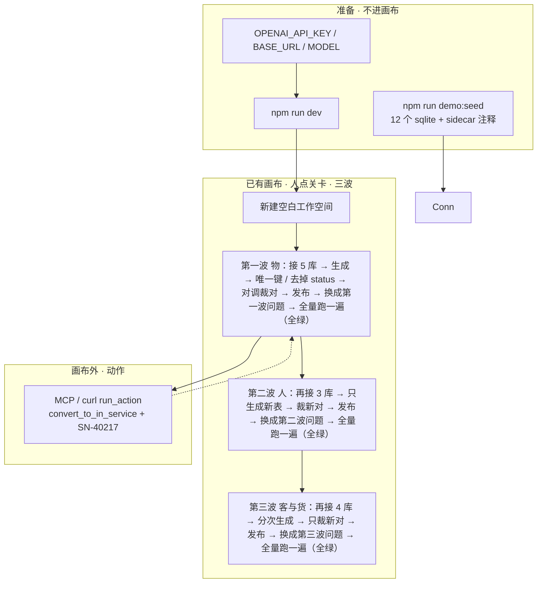
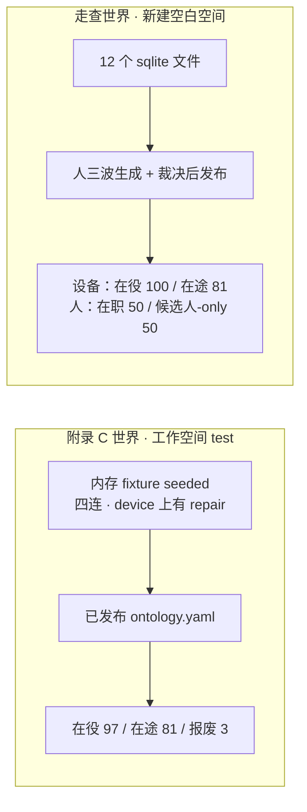
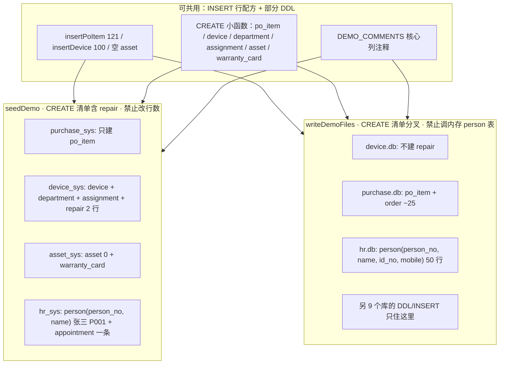

# 可演示的真模型走查（一家公司 · 三波接入 · 十二套源系统）

> **历史评审记录**：本文档是早期迭代的评审结论，代码路径与 API 形态随重构变化。
> 现行结构见 `README.md`「代码结构」与 `AGENTS.md`。历史名对照：`configStore.ts` → `features/ontology/`（editDraft / commit / ops 的旧称）、
> `llmSlot.ts` → `infra/llm/slot.ts`、`load.ts` → `infra/connections.ts`、`fixture.ts` → `infra/fixture.ts`、
> `adjudicate.ts` → `features/integrate/applyVerdict.ts`、`pairs.ts` → `features/integrate/candidates.ts`、
> `demoQuestions.ts` → 验收问题集数据现写在 `src/tests` 的用例里（无独立数据文件）；
> 工作空间从 `?ws=` / `x-ontos-ws` 改为路径段 `/api/<空间名>/…`（`workspaceOf`）。


| 字段 | 值 |
|---|---|
| 作者 | TBD |
| 日期 | 2026-08-22 |
| 状态 | Draft（未落地：`demo:seed` 与十二套文件种子尚未进仓库；现行演示仍是 `test` 空间四个内存 fixture） |
| 仓库 | `/Users/majiang/Documents/freespace/js/ontos` |
| 产品约束 | 画布仍是唯一工作台；人的点击只留给关卡（连接、选表、生成、改唯一键、裁决、发布、跑问题集）；模型只出现在 `llmSlot` 三个槽位；ReAct / 工具循环留在外部 Agent；页内不新开 Copilot、聊天列、步骤条 |

---

## Overview

上一版把走查收成**四套源、一场坐下来生成**。设备线能把「同一 / 阶段」走完，但五种裁法只亮了两三种；人事只有一个张三，当对照不够当生命周期；客货线缺席。用户拍板把范围改成：

> 一家公司、三波接入、约十套系统。第三条业务线用这四个：CRM、销售订单、仓库、应收发票。

本设计把主路径仍定为**可演示的人手走查**（不是 vitest 代人点关卡）：`npm run demo:seed` 写出 **12** 个可连接的 SQLite 文件；操作者**新建空白工作空间**（不要用 `test`），按三波接入——每波只生成这一波的表、只裁决新出现的疑似重复、发布、换成这一波问题再跑。产品已定「随时可加数据源，只裁决新对」，走查按这个节奏演，不在一次勾选里吞掉十二套。

设备是**其中一条业务线**，不是整场戏。三波合在一起才把五种裁法、人的生命周期、以及设备以外的客货线演全。

真模型走三个槽位：`proposeObjects`（生成对象）、`proposePairs`（疑似重复建议）、`nlToQuery`（问题集跑批）。动作不走模型：第一波发布后由外部 MCP 或 curl 调 `run_action`（`convert_to_in_service` + `SN-40217`）。站内不新开问数/动作控制台。第二波不发明「录用」写库动作——只问数。

**两套世界不许混数字。** 附录 C / `test` / `engine.test.ts` 仍是在役 **97**。走查阶段世界（两条 `when`、没有报废规则）在役 **100**。人的阶段世界同样只立两条 `when`：在职 **50**，仍停在候选人、人事还没有行的 **50**。

测试代码**不**替人点生成、裁决、发布。默认 `npm test` 仍必须离线、不进网。生产槽位本期仍不设 `temperature: 0`。罐头只保证连得上、表在、注释在——第一波起的生成 / 裁决 / 问题集必须真模型。

---

## Background & Motivation

### 今天两套世界叠在一起，演示接不上「接入」

工作空间 `test` 的 v1 是 `src/server/config/ontology.yaml`（附录 C）。`src/server/infra/connections.ts` 的 `getDriverRegistry` **只**给 `TEST_WS` 注入四个内存 fixture 连接（`purchase_sys` / `device_sys` / `asset_sys` / `hr_sys`），调用 `SqliteFixtureDriver.seeded()`。`default` 与新建空间走 `seedYamlFor` 的空对象集分支：空本体、无连接。

在 `test` 上打开画布，操作者看不见「连接数据源」这一关：四个源已经在，本体已经发布。生成对象会与已有类撞名。这套世界适合 `engine.test.ts` 钉附录 C 数字（在役 **97**、在途 81、报废 3），不适合向人演示「我接入、我裁决」。

### 四套文件只够一条设备线

上一版走查用采购 / 设备 / 资产 / 人事四套。它能钉：

- 采购 × 设备 = 阶段（交集约三分之一）
- 设备 × 资产 = 同一（资产 0 行、交集率 0% 仍合并）
- 人事张三当对照（人和设备不要裁成同一）

它钉不住的：

| 缺口 | 为什么四套不够 |
|---|---|
| 五种裁法 | 「部分重叠」没有硬数据对；「仅名称相似」只靠人事对照，表名并不撞 |
| 系统像真的老系统 | 人事只有一个张三；维修挂在设备库里，不像独立工单系统 |
| 人的生命周期 | 没有招聘源，裁不出候选人 → 在职的两条 `when` |
| 设备以外的客货线 | 没有客户、销售单、库存、发票；采购表名 `order` 也没人跟它撞 |

设备线仍要保留，而且 **`po_item` / `device` / `asset` 的行数必须与 `seedDemo` 同一份**（121 含 `SN-40217`、100 台、40 台序列号重合、3 台台账 scrapped、资产 0 行），这样引擎 golden 仍是这批种子的判定器。多出来的系统，行配方只写在 `writeDemoFiles`，不进 `seedDemo()`。

### 文件 SQLite 今天会丢掉列注释

`seedDemo`（`src/server/infra/fixture.ts`）给内存库调用 `setComments`。`SqliteFixtureDriver.introspect` 把这份注释挂到列上，表结构抽屉显示「设备序列号」，`proposeObjects` 的 prompt 把 `comment` 写进字段说明。

连接表单保存 sqlite 文件时，`registerSaved` 只 `registerFile`，**不**调用 `setComments`。SQLite 本身没有列注释。操作者若把同一份种子写成文件再接入，抽屉里的列没有中文说明，生成质量下降。不能在库里加一张注释表：`introspect` 会把 `sqlite_master` 里的用户表都列出来，那张表会冒充业务表。

### 人手关卡已经在画布上，缺的是十二套可连接系统、三波节奏、三套对错板

| 关卡 | 现成表面 | 实现 |
|---|---|---|
| 新建空白空间 | 左上角下拉「新建工作空间」 | `src/app/page.tsx` → `POST /api/workspaces` |
| 连接 | 工具条「连接数据源」→ `ConnectForm` | `src/components/forms.tsx`；sqlite 的文件路径写在 `db_name`；`test: true` 先内省再保存 |
| 看表 | 底部「表结构」抽屉 | `GET /api/list_tables` 已返回列名/类型/主键/注释 + 3 行脱敏采样；抽屉今天只画列，**不画采样**（§4.6 补画） |
| 生成 | 勾表 → 「生成对象」 | `POST /api/propose_objects` → `apply_draft` `{ op: import_objects }`；toast「已生成对象：…」；抽屉收起 |
| 改唯一键 / 删字段 | 点节点 → 右侧对象卡 | `set_identity` / `remove_property` |
| 疑似重复 | 工具条按钮 → 底中面板 | `GET /api/list_candidates` → `PairCard`：LLM 建议 + 按需交集率 + 五种结论；本期加「对调两端」 |
| 发布 | 工具条「发布 vN+1」 | `POST /api/publish` |
| 对错板 | 「验收问题集」卡 | 今天只能手打问题；`POST /api/questions?run=1` 走 `nlToQuery` |

缺的不只是种子。十二个可连接文件、列注释在文件连接上活下来、问题集能「换成」**这一波世界**的题——之外，英雄路径在现成控件上还有三处缺口：同一卡 / 阶段卡都不能对调 `class_a`/`class_b`；抽屉不画已经返回的采样；对象卡 ✕ 删对照了列的字段会被「源映射」拦住。

### 阶段世界的数字不是 97，人的阶段世界也不是「再发明第三条 when」

附录 C 的 `equipment.status` 有三条 `when`（报废优先）。`applyVerdict` 的「阶段」只立两条（`src/server/features/integrate/applyVerdict.ts` 132–135 行）：

```ts
{ when: { [srcA]: true, [srcB]: false }, value: from },
{ when: { [srcB]: true }, value: to },
```

`srcB` = 合并前 A 没有的第一条新源。`whenKeyHolds`（`individual.ts` 87–91 行）：`true` = 该源有行，`false` = 该源无行。列表从上到下第一条命中。

因此走查发布后设备：在役 **100**（设备源有行，含 3 台台账 `scrapped`），在途 **81**（121 − 40）。验收 `SN-40217` 之后：在役 **101**，在途 **80**。动作名是 `convert_to_${to}`，阶段名填 `in_service` 时即 `convert_to_in_service`，不是附录 C 的 `convert`。

人的阶段用**同一套两条规则**，不发明第三条「两边都有」：

- 乘号前 = 候选人（早，`from = candidate`），乘号后 = 员工（晚，`to = employed`）
- `srcA = recruit_sys`，`srcB = hr_sys`
- 招聘有行、人事无行 → `candidate`（50 人）
- 人事有行 → `employed`（50 人，含 30 个两边都有身份证的；两边都有算晚阶段，与设备重合序列号算在役同一口径）

阶段裁决若发现目标类已有非派生 `status` 会抛错（`adjudicate.ts`：「先把它改名或删掉」）。必须在点「阶段」之前，从**将被并进早阶段那一类的晚阶段类**上拿掉名叫 `status` 的非派生属性（设备对象；同一之后是合并类）。推荐仍在点「同一」之前删，当作稳妥顺序。人的对象通常没有台账 `status` 列；若模型造了同名属性，同一纪律。

画布对象卡的 ✕ 走 `remove_property`，**没有**整份替换按钮。`replaceBlockers` 锁的是 MCP `replace_object`（多源 → 「挂了多个来源」），不是画布 ✕。今天 ✕ 被拒，是因为 `referencesOf` 在**单源时**就会推「源映射 …」。§4.3 让 ✕ 先摘对照：公理/动作/派生若没有引用，同一之后仍能删 `status`，只要还没点「阶段」（阶段会立派生 `status` 和转化关系，之后再删会撞引用）。

---

## Goals & Non-Goals

### Goals

1. **十二套可连接的源系统，一家公司，三波接入。** 操作者用连接表单接入，不靠 `test` 空间的内存注入。文件由 `npm run demo:seed` 写出，幂等，gitignored。设备核心 **INSERT**（`po_item` / `device` / `asset` 行数）与 `seedDemo` 共用函数；CREATE 清单按内存/文件分叉；多出来的系统只写在 `writeDemoFiles`。
2. **走查剧本是英雄测试。** 文档写出每一波该看见什么。测试代码不替人点生成 / 裁决 / 发布。
3. **五种裁法都有硬对。** 同一（设备 × 资产）、阶段（采购 × 设备，以及候选人 × 员工）、部分重叠（点检 × **尚未并进采购的设备类**，同一之后、阶段之前；以及办公账号 × 员工、客户档案 × 销售客户）、仅名称相似（维修工单、采购办公订单 × 销售订单）、跳过（发票 × 销售订单；阶段之后的幸存者新对，可与仅名称相似并列）。公共属性必须同名；问数不要问 `shared_*`。
4. **每一步可观测。** 观测面只用已有卡片与抽屉，不新开步骤条。表结构抽屉本期补画 `GET /api/list_tables` 已经返回的 3 行脱敏采样（空数组写「没有行」）。问题集装入后立刻能看见期望数字；跑完把本次 `results[].detail` 留在题旁。
5. **可演示的测试功能最小切口。** 每波发布之后、进下一波之前，必须走验收问题集两步：「换成第 N 波问题」→「全量跑一遍」。对错板**全绿才能进下一波**（或去做验收动作）。装入**禁止**带 `?run=1`。不自动裁决、不代人生成。这一关同时测问题集自己：装入后立刻看见期望数字、跑完题旁有通过/失败和明细、换成会清掉上一波的题。
6. **真模型三件套。** 走查从生成对象起到对错板，必须 `OPENAI_API_KEY` / `OPENAI_BASE_URL` / `OPENAI_MODEL` 齐，三个槽位走 `AiSdkSlot`。罐头只保证「连得上、表在、注释在」——`CannedSlot.proposePairs` 按字段名重合配对，采购 `sn` 与设备 `serial_no` 共享 0，候选对是空的；`nlToQuery` 写死 `equipment`，空白空间的对错板会全红。
7. **默认 `npm test` 零出站。** worker 启动与 `afterEach` 剥掉 `OPENAI_API_KEY` 与 `ONTOS_TOKEN`。live 目录若存在则 `exclude`。不进 CI。
8. **`nlToQuery` prompt 带属性类型与枚举 `values`。** 问题集过滤必须能编出 `in_service` / `in_transit` / `candidate` / `employed`，不能编成「在役」「在职」后静默 0 行。
9. **画布上人必须能完成关卡。** 不能只写在剧本里：① 对象卡 ✕ 能拿掉对照了列的非派生 `status`；改名把本类 `fields` 旧键换成新键（§4.3），部分重叠才能「改名再裁」；② PairCard 能「对调两端」，同一卡、设备阶段卡、人的阶段卡都要对乘号（§4.5）；③ 阶段输入框 placeholder 是 `in_transit` / `in_service`；④ 跨次生成撞名在 `import_objects` 之前加 `connection_table` 前缀（§4.7），不要教人改 YAML。对调后 POST 的 `class_a`/`class_b` 对调，交集率按类名对齐。
10. **认对象靠来源标签 `connection.table`，不赌类名。** 画布节点标题是模型起的类名。

### Non-Goals

- vitest 对 `POST /api/decide` / `POST /api/propose_objects` / `POST /api/publish` 代人走完整剧本（上一版 API 代人路径，降级，不进本期实现）。
- Playwright / 浏览器自动点。
- 页内问数控制台、动作控制台、Copilot、聊天列、逐步高亮浮卡、步骤条。
- 把十二个文件自动注册进 `test` 或 `default`。
- 改附录 B、新造本体 YAML 键、第四个 NL 槽位、引擎内 ReAct。
- 给生产 `AiSdkSlot` 设 `temperature: 0`（用户 2026-08-22 拍板：先不设）。
- 把 `test:live` 接进 CI（用户 2026-08-22 拍板：不进）。
- 让 `proposeObjects` 自动产出附录 C 的三条 `when`、保修卡、`belongs_to`。走查数字按阶段两条规则钉，不拿 97 去卡。
- 改 `seedYamlFor("test")`、不改 `load.ts` 给新建空间偷偷注入 fixture。
- 改 `seedDemo()` / `SqliteFixtureDriver.seeded()` 的四个内存连接与表（`po_item`、`device`+`department`+`repair`+`assignment`、`asset`+`warranty_card`、`person`+`appointment`）。`engine.test.ts` 黄金数字不动。
- 走查设备库里保留 `repair`（维修独立成 `repair_sys`）。内存 fixture 的 `repair` 仍挂在 `device_sys`。
- 第二波发明「录用」写库动作或补全表单。超出简单转化的人事写入本期不做。
- 为客货线新造第四、第五种 `when`，或把交集 30 写成问数行数（问数看到的是并集或单源，不是 PairCard 的 `count_hit`）。

---

## Proposed Design

### 总结构



操作者在画布里走完建模与验收。动作演示走已有 MCP 入口。种子命令只写文件，不改元库、不注册连接。三波之间不断开服务、不换空间。

### 两套世界，数字不要混



`engine.test.ts` 继续钉附录 C。走查与「换成第 N 波问题」钉阶段世界。`CannedSlot` 的类名写死 `equipment`，且 `proposePairs` 按字段名重合配对——空白空间发布后的类名由模型决定，罐头编出来的查询和对会空掉或炸。问题集跑批必须对着**已发布配置**、走真模型编查询，不能假定类名叫 `equipment`。

### 种子架构：内存四连不动，文件十二套另写



硬约束（CREATE 清单按目标分叉，**不要**写一个按连接名复用 `seedDemo` 全套 `CREATE`/`INSERT` 的 `seedTables`）：

- `seedDemo()` / `SqliteFixtureDriver.seeded()` 仍是今天这四个连接、这些表。`load.ts` 给 `TEST_WS` 的注入不改。`engine.test.ts` 黄金数字不改。
- **可共用的只有设备核心 INSERT**（采购 121、设备 100、资产 0 行）以及 `po_item` / `device` / `department` / `assignment` / `asset` 的 CREATE 小函数。`DEMO_COMMENTS` 核心列注释可共用。
- 内存 `device_sys` 的 CREATE 清单**含** `repair`，插入今天那 2 行。`writeDemoFiles` 的 `device.db` **不建** `repair`（维修在 `repair_sys`）。
- 人事两套 DDL / INSERT：内存 `person(person_no, name)` 只有张三；走查 `hr.db` 是 `person(person_no, name, id_no, mobile)` 50 行。**禁止** `writeDemoFiles` 调用内存那张 `person` 表的建表/插入函数。
- 走查 `purchase.db` 多一张 `order` 表，内存 `seedDemo` 不加这张表。`order` 的 CREATE/INSERT 只住 `writeDemoFiles`。
- 点检 / 招聘 / 办公账号 / 客货 / 维修 15 行：DDL 与 INSERT 全部只住 `writeDemoFiles`，不进 `seedDemo`。

---

### 1. 十二套可连接系统（一家公司）

连接名一律 snake_case（节点来源标签靠它认对象）。给人看的名字一律大白话。文件相对仓库根 `.ontos-demo/`。

#### 1.1 总表

| 波 | 给人看的名字 | 连接名 | 库文件 | 表 | 保存后 toast 表数 |
|---|---|---|---|---|---|
| 1 物 | 采购系统 | `purchase_sys` | `purchase.db` | `po_item`，`order` | 2 |
| 1 物 | 设备台账 | `device_sys` | `device.db` | `device`，`department`，`assignment` | 3（内存仍是 4，因为有 `repair`） |
| 1 物 | 资产系统 | `asset_sys` | `asset.db` | `asset`，`warranty_card` | 2 |
| 1 物 | 维修工单 | `repair_sys` | `repair.db` | `repair` | 1 |
| 1 物 | 点检系统 | `inspect_sys` | `inspect.db` | `instrument` | 1 |
| 2 人 | 招聘系统 | `recruit_sys` | `recruit.db` | `candidate` | 1 |
| 2 人 | 人事系统 | `hr_sys` | `hr.db` | `person`，`appointment` | 2 |
| 2 人 | 办公账号 | `oa_sys` | `oa.db` | `account` | 1 |
| 3 客货 | 客户档案 | `crm_sys` | `crm.db` | `customer` | 1 |
| 3 客货 | 销售系统 | `sales_sys` | `sales.db` | `customer`，`order` | 2 |
| 3 客货 | 仓库系统 | `wms_sys` | `wms.db` | `stock` | 1 |
| 3 客货 | 应收发票 | `ar_sys` | `ar.db` | `invoice` | 1 |

#### 1.2 第一波 · 物（5 个）

**采购系统 `purchase_sys` → `purchase.db`**

- `po_item(po_id PK, item_name, sn)` — 与 `seedDemo` 同一份：120 行 `SN-40000`…`SN-40119` + 主角 `SN-40217`，共 **121** 行。列注释：`item_name`「采购条目名称」，`sn`「设备序列号」。
- `order(order_id PK, order_no, supplier_name, amount)` — **约 25 行**办公采购（打印纸、文具），**没有**序列号。只写在 `writeDemoFiles`。给第三波「采购订单 × 销售订单仅名称相似」埋伏。
- **第一波生成时不要勾 `purchase_sys.order`。** 仍连接这个库（toast 2 张表），勾选清单里把 `order` 留到第三波。若操作者勾了：会多一个对象，这一波不要把它和设备裁成同一；放到第三波再跟销售订单对。

**设备台账 `device_sys` → `device.db`**

- 与今天相同：`device` **100** 行（`SN-40080`…`SN-40119` 共 40 台与采购重合，其中 `i<83` 的 3 台 `status='scrapped'` 即 `SN-40080`/`SN-40081`/`SN-40082`；另 60 台 `SN-60000`…`SN-60059` 设备独有）。部门 D01–D08。履历 `assignment`：`SN-40090` → D02。
- **没有 `repair` 表。**

**资产系统 `asset_sys` → `asset.db`**

- `asset` **0 行**，`warranty_card` 空。与设备裁「同一」（写回要挂这个源；0 行、交集率 0% 是功能，不是接错了）。

**维修工单 `repair_sys` → `repair.db`（独立库）**

- `repair(repair_no PK, serial_no, symptom, started_at, ended_at)` — **15** 行，序列号全部来自在役设备（不含 3 台 scrapped）。
- 建议 15 个序列号：`SN-40085`、`SN-40090`（与内存种子那两单同一台，便于眼熟）+ `SN-40083`、`SN-40084`、`SN-40086`…`SN-40093` 再补 `SN-60000`…`SN-60003`，凑满 15。`started_at` / `ended_at` 仍是 UTC Unix 秒。其中一条 `ended_at` 空（未结束），与内存那条未结束维修同形。
- 这是**事件**，不是设备。走查：疑似重复若出现，裁「仅名称相似」或「跳过」，**禁止同一 / 阶段**。
- 内存 `device_sys.repair` 仍是今天的 2 行，不改成 15。

**点检系统 `inspect_sys` → `inspect.db`**

- `instrument(id, name, serial_no, inspect_cycle_days, last_inspect_at)` — **60** 行。
- `serial_no`：40 台与设备重合（`SN-40080`…`SN-40119`，含 3 台台账 scrapped，点检不管报废）+ 20 台点检独有（`SN-80000`…`SN-80019`）。
- 与设备 **部分重叠**，裁的是**尚未并进采购的设备类**（同一之后、阶段之前）。`computeOverlap` 会把一类上**每一个源条目**的识别列读进同一个 `Set`（`overlap.ts` 27–40 行）。同一只并进资产（0 行，空串不算标识），集合仍是 100，命中 40 → `40 / max(100, 60) = 40/100 = 0.40`。若拖到阶段之后再算，采购 121 + 设备 100 并集 **181**（与 `engine.test.ts` 无保修过滤的 181 同一口径），变成 `40 / 181 ≈ 0.22`，面板约 181 条、60 条、40 条对得上号——人会以为种子错了。阶段之后若再出「点检 × 采购合并类」，只准跳过或仅名称相似。
- 公共属性必须是**同名**的非识别字段（通常两边都叫 `name`）；序列号是识别字段，复制不移动，不进「公共」集合。点检独有是巡检周期（以及上次点检时间）。归一化走 `serial` 规则（去横杠、统一大写）。

第一波必裁（顺序强制）：

| 对（用来源 tag 认） | 结论 | 何时 |
|---|---|---|
| `device_sys.device` × `asset_sys.asset` | 同一 | 最先。设备在乘号前（留下），资产在后（被并掉） |
| `inspect_sys.instrument` × **同一之后仍在的设备类** | 部分重叠 | **同一之后、阶段之前。** 算一算约 40%。公共属性同名 `name` |
| `purchase_sys.po_item` × 已合并设备 | 阶段 | 点检部分重叠之后。采购在乘号前；早 `in_transit`、晚 `in_service` |
| 阶段之后新出的「点检 × 采购合并类」 | 跳过或仅名称相似 | `dropClass` 之后幸存者换了类名，会再出一对。**禁止同一 / 阶段** |
| `repair_sys.repair` × 设备（若出现） | 仅名称相似或跳过 | 随时。禁止同一 / 阶段 |

对调规则与上一版相同：`mergeInto` 留下 `class_a`；阶段的 `srcB` = 合并前 A 没有的第一条新源。对调时已算出的交集率按**类名**对齐 `count_a` / `count_b`。

第一波发布后（验收动作之前）：在役 **100**，在途 **81**。然后可选 MCP 转化 `SN-40217` → 101 / 80。

#### 1.3 第二波 · 人（3 个）

**招聘系统 `recruit_sys` → `recruit.db`**

- `candidate(candidate_no, name, mobile, id_no)` — **80** 行。`candidate_no` = `C001`…`C080`。
- `id_no`：18 位形，供 `id_card` 规则命中。`C001`…`C030` 与人事前 30 人相同；`C031`…`C080` 招聘独有。
- `mobile` 故意脏，配方见 §1.6。主路径唯一键是身份证，不是手机号。

**人事系统 `hr_sys` → `hr.db`（比内存富，允许）**

- `person(person_no, name, id_no, mobile)` — **50** 行。其中 **30** 人 `id_no` 与候选人相同（阶段命中）。`P001` 张三保留，且张三是这 30 人里的第一个（招聘 `C001` 同名同身份证），便于「名叫张三」与「这人现在是否在职」同一条身份。
- 其余 20 人只有人事行、招聘没有（老员工没走过这套招聘库）——两条 `when` 下他们算在职，不另立第三种状态。
- `appointment`：每人一条在任履历；`dept_id` 用**同一套 D01–D08**（与设备部门撞号）。走查：这是同一套组织编码。`pairEligible` 只挡同一连接，`hr_sys.appointment` × `device_sys.department` 会过闸。任职 × 部门、人员 × 部门若出现，裁「仅名称相似」或跳过，**不要裁成阶段或同一**。
- 内存 `hr_sys.person` 仍只有张三、没有 `id_no` / `mobile` 列。走查文件才是宽表。`writeDemoFiles` 禁止调用内存那张 `person` 表。

**办公账号 `oa_sys` → `oa.db`**

- 任务给定列：`account(login, person_no, email, is_contractor)` — **40** 行：35 个 `person_no` 对得上人事 `P001`…`P035`，5 个外包只有账号（`is_contractor=1`，`person_no` 如 `CX01`…`CX05`，对不上人事）。
- **额外一列 `name`（只写在 `writeDemoFiles`）。** `applyVerdict` 的部分重叠要求「识别字段除外至少还有一个公共属性」，否则抛「两类没有公共属性（识别字段除外），立不了上位对象」（`adjudicate.ts` 157 行）。35 个对得上的账号姓名与人事相同。不加这一列，办公账号 × 员工的「部分重叠」在引擎里走不通。

第二波必裁：

| 对 | 结论 | 说明 |
|---|---|---|
| 办公账号 × 员工 | 部分重叠 | **先裁**（员工还是 50 行，唯一键临时用 `person_no`）。公共属性必须同名 `name`；识别字段 `person_no` 复制不移动。账号独有：登录名 / 是否外包；员工独有：身份证 / 手机 |
| 候选人 × 员工 | 阶段（身份证） | 部分重叠之后。乘号前候选人、乘号后员工；早 `candidate`、晚 `employed` |
| 阶段之后新出的「账号 × 已合并人员」 | 跳过或仅名称相似 | `dropClass` 员工后，账号与合并类仍跨源，会再出一对。**禁止同一 / 阶段** |
| 人 × 设备（若出现） | 仅名称相似或跳过 | 禁止同一 / 阶段 |
| 任职 × 部门、候选人 × 账号（若出现） | 仅名称相似或跳过 | 候选人与账号都有 `name`，模型可能建议部分重叠/同一。禁止同一 / 阶段 |

人的阶段世界数字（必须用两条 `when` 算，禁止发明第三条）：

| 集合 | 行数 | 阶段值 |
|---|---|---|
| 招聘 80 ∩ 人事 50 | 30 | 人事有行 → `employed` |
| 招聘有、人事无 | 80 − 30 = **50** | `{recruit: true, hr: false}` → `candidate` |
| 人事有（含 30 个两边都有 + 20 个只有人事） | **50** | `{hr: true}` → `employed` |
| 个体并集 | 50 + 30 + 20 = 100 | 对错板不拿 100 去卡「在职」 |

所以：列出在职 → **50**；列出仍停在候选人、人事还没有行的 → **50**。张三在 30 个交集里 → 在职。

#### 1.4 第三波 · 客与货（用户拍板的四个）

**客户档案 `crm_sys` → `crm.db`**

- `customer(customer_no, name, phone, owner_login)` — **40** 行。`customer_no` = `CUST-001`…`CUST-040`。
- 姓名钉死：`CUST-001`…`CUST-030` 的 `name` 为 `客户-001`…`客户-030`，与销售系统客户表同号同名；`CUST-031`…`CUST-040` 为档案独有，`name` 为 `档案客户-031`…`档案客户-040`（不要跟销售独有客户撞名）。

**销售系统 `sales_sys` → `sales.db`**

- `customer(cust_no, name, payment_term)` — **40** 行。前 **30** 个 `cust_no` = `CUST-001`…`CUST-030`，`name` 与档案相同（`客户-001`…）；另外 10 个销售独有：`cust_no` = `SALE-031`…`SALE-040`，`name` = `销售客户-031`…`销售客户-040`。CRM 有负责人 `owner_login`，销售有账期 `payment_term`。
- 唯一键：档案对照列 `customer_no`，销售客户对照列 `cust_no`（列名不同没关系，`keyColumn` 各自读）。算一算才是 `30 / max(40, 40) = 0.75`。模型若把唯一键设成 `name` 或漏掉编号列，命中不是 30。
- 推荐裁 **部分重叠**。引擎里能挪到上位对象的公共属性只有**同名**的 `name`（客户编号是识别字段，属性名还不同，不进 `common`）。档案独有负责人，销售独有账期。裁「同一」也可以讲「同一批客户挂两个源」，但问数行数会变成并集 **50**。第三波对错板题面写白话「销售系统客户表里的客户有多少」（expected 40）；含义里用来源标签认销售客户那一类，**不要问上位对象**。
- `order(order_id, order_no, cust_no, sku, amount)` — **60** 行。表名 `order` 与采购的 `order` 撞名 → **仅名称相似**。第三波必须分次生成（同一次不能两张 `order`）；跨次类名占用见 §4.7。

**仓库系统 `wms_sys` → `wms.db`**

- `stock(sku, qty, warehouse)` — **30** 个 sku。其中 **20** 个与销售单用到的 sku 重合（销售 60 行订单使用 25 种 sku：20 种在仓库、5 种销售独有；仓库另 10 种只在库里）。
- 推荐裁法：**库存不是订单，禁止与 `order` 同一。** 若模型只生成了库存对象、销售系统没有单独的物料对象：库存保持独立（跳过或仅名称相似）。若两边都生成了「物料」对象（来源 tag 分别是 `wms_sys.stock` 与从销售订单拆出的物料），再裁部分重叠。交集率仅在「两边都是物料、唯一键都是 sku」时有意义：`20 / max(30, 25) = 20/30 ≈ 0.67`。公共属性仍须同名。

**应收发票 `ar_sys` → `ar.db`**

- `invoice(invoice_no, customer_no, order_no, amount, due_date)` — **40** 行。`order_no` 能对上部分销售单，但这**不是**销售订单那一类。走查：跳过或仅名称相似，**禁止同一**。

第三波还要生成第一波故意没勾的 `purchase_sys.order`（25 行），专门跟 `sales_sys.order` 撞名。

#### 1.5 一份注释，两条加载路径

`DEMO_SYSTEMS` 扩成 12 项（给人看的名字 + 连接名 + 文件名）。`DEMO_COMMENTS` 核心四连的列注释与今天一致；`device_sys.repair` 的注释仍给**内存** `seedDemo` 用。走查文件的维修注释写在 `repair_sys` 下。

建议形状：

```ts
export const DEMO_DIR_REL = ".ontos-demo"; // 相对仓库根；gitignored

export const DEMO_SYSTEMS = [
  { title: "采购系统", connection: "purchase_sys", file: "purchase.db" },
  { title: "设备台账", connection: "device_sys", file: "device.db" },
  { title: "资产系统", connection: "asset_sys", file: "asset.db" },
  { title: "维修工单", connection: "repair_sys", file: "repair.db" },
  { title: "点检系统", connection: "inspect_sys", file: "inspect.db" },
  { title: "招聘系统", connection: "recruit_sys", file: "recruit.db" },
  { title: "人事系统", connection: "hr_sys", file: "hr.db" },
  { title: "办公账号", connection: "oa_sys", file: "oa.db" },
  { title: "客户档案", connection: "crm_sys", file: "crm.db" },
  { title: "销售系统", connection: "sales_sys", file: "sales.db" },
  { title: "仓库系统", connection: "wms_sys", file: "wms.db" },
  { title: "应收发票", connection: "ar_sys", file: "ar.db" },
] as const;
```

不要实现「按连接名执行今天 `seedDemo` 全套 CREATE/INSERT」的单一 `seedTables`。那会把 `repair` 写进走查 `device.db`，或把走查人事压成内存窄表，或反过来弄脏 golden。

`seedDemo(d)`：对内存四连 `d.register(connection)`；调用**内存**那份 CREATE 清单（`device_sys` 含 `repair` 2 行；`person(person_no, name)` 张三）；设备核心 INSERT 可与文件共用；再按 `DEMO_COMMENTS` 调 `setComments`。

`writeDemoFiles(dir = join(runtime().cwd, DEMO_DIR_REL))`：建目录；每个系统按**文件**那份 CREATE 清单建表（`device.db` 不建 `repair`；`hr.db` 用宽表 `person`；`purchase.db` 另建 `order`）；设备核心三表的 INSERT 调用共用函数；其余系统的 INSERT 只写在这个函数里。再写 sidecar `${dbPath}.comments.json`。已有文件则覆盖。返回 `{ title, connection, path }[]`。命令把**绝对路径**和连接表单该填的字段打到 stdout。**禁止**调用内存 `person` 的建表/插入。

幂等：重复运行覆盖 12 个 `.db` 与 12 个 sidecar。若文件被本机 `npm run dev` 的 `DatabaseSync` 锁住，命令失败，文案：「演示库文件被占用，先停掉正在跑的开发服务再播种」。

**不**把这些文件 `saveConnection` 进任何空间。`load.ts` 的 `test` 注入保持内存 `seeded()`，不动。

#### 1.6 列注释怎么在文件连接上活下来

sidecar **不是**库里的表。`introspect` 继续只读 `sqlite_master` 的用户表，不会把 `.comments.json` 列出来。

sidecar 路径采用 **`${dbPath}.comments.json`**（例如 `.ontos-demo/purchase.db.comments.json`），和库文件成对。不要写成 `${basename(dbPath)}.comments.json` 那种丢掉目录的拼法。

加载注释必须分两条路径，口径对齐今天「一个 sqlite 文件没了不拖垮整份注册表」（`load.ts` `registerSaved` 缺文件只 `console.warn` 并 `return`）。

**`registerFile` 永不因 sidecar 抛错。** 打开 `DatabaseSync(path)` 之后尽力加载注释：

1. 若 `${path}.comments.json` 存在且 JSON 形状合法：按表调用 `setComments`。
2. 若 sidecar 存在但读不出或形状不合法：`console.warn`，**不加注释**，连接仍注册。不回退到 `DEMO_COMMENTS`（坏文件不能被种子注释悄悄盖住）。
3. 若 sidecar 不存在：按 `basename(path)` 在 `DEMO_SYSTEMS[].file` 里找；找到则用对应连接的 `DEMO_COMMENTS`（操作者只拷了 `.db`、没拷 sidecar 时，注释仍在）。
4. 两路都没有：不加注释，连接仍成功。

`getDriverRegistry` 水合走 `registerSaved` → `registerFile`。坏 sidecar **不许**让整个 `getDriverRegistry` throw，另外十一套好库必须进得去。该连接仍注册，只是没有列注释。

**`saveConnection` / 连接表单（`test: true`）走严路径。** 在 `registerSaved` 之后、落库之前：若 sidecar 文件存在且不合法，抛 `ConnectionReject`（白话：「演示注释文件读不出：…」），卸掉刚注册的驱动、不落库。卡内能看见错误。sidecar 不存在则允许（走文件名回退）。这样第一次接入坏注释挡在表单，进程重启不会被一份坏 JSON 拖死。

`registerSaved` 不必再按连接名特判。连接名由操作者在表单里填，文件名才是认注释的键。

禁止：在 sqlite 里建 `_ontos_comments` 或任何用户表来存注释。

#### 1.7 手机号怎么脏，交集率仍能对上号

现成规则在 `src/server/features/integrate/normalize.ts`。`overlap.ts` 用两端识别列各读出来的值，`pickRule` 看「A 扁平成串的前 20 条 + B 扁平成串的前 20 条」（最多 40 个样本），命中比例 ≥ 60% 才选该规则。空串不算标识。

| 规则名 | 样本怎样才算命中 | 洗法 |
|---|---|---|
| `serial` | ≥60% 像 `SN-40080` 这种「字母 + 可选分隔 + 数字」 | 去横杠/空格，统一大写。`SN-40217` → `SN40217` |
| `phone` | ≥60% 在去掉横杠/空格之后像 `(\+?86)?1[3-9]\d{9}` | **先**去横杠/空格，**再**剥开头的 `+86` / `86`。`+86 138-0000-1111` → `13800001111`（`m3.test.ts` 64 行已钉） |
| `id_card` | ≥60% 去掉空格后像 17 位数字 + 数字或 X | 去空格，X 大写。`id_card` **不去横杠**——身份证不要写成带横杠，否则可能掉进 `plain` |
| `email` | 含 `@` | 去首尾空格，小写 |
| `plain` | 兜底 | 只去首尾空格 |

招聘 80 个手机号全部能被 `phone` 规则洗成 `13800000000`…`13800000079`（11 位，`1[3-9]` 打头）。脏法按行号轮换，保证前 20 条样本里脏号也过 `match`（`match` 本身会先去掉横杠/空格再测）：

| 行号 `i % 3` | 写入招聘 `mobile` | 洗完 |
|---|---|---|
| 0 | `+86 138-0000-00XX` | `138000000XX` |
| 1 | `138-0000-00XX` | 同上 |
| 2 | `138000000XX`（干净） | 同上 |

人事前 30 人（与招聘重合）写入**干净**的同一串 11 位。人事独有的 20 人用 `13900000000` 起头，避免有人误把唯一键改成手机号时出现幻影交集。

主路径唯一键是 `id_no`。点「算一算」时 `pickRule` 走 `id_card`：候选人 × 员工命中 **30**，`30 / max(80, 50) = 30/80 = 0.375`（面板约 **38%**）。这和采购 × 设备的「约三分之一」同一量级，好讲。办公账号 × 员工的唯一键是 `person_no`（`P001`…）：`serial` 规则的 match 是 `^[A-Za-z]{1,4}[-\s]?\d{3,}`，`P001` 会命中 `serial` 而不是 `plain`（`serial` 排在 `plain` 前面）。洗完仍是 `P001`，命中 35、比率 0.70 **不变**。不要把规则名当关卡，面板认条数和命中即可。

若有人把唯一键改成手机号：`phone` 规则仍会把脏号洗成同一串，30 个对得上号的人仍然对得上（命中 30 / 80 = 0.375）。走查不靠这条；脏号是为了让招聘库像真的老系统，并证明归一化不是摆设。

身份证写入：`C001`/`P001` 张三 = `11010119900101000X`；`C002`…`C030` 与 `P002`…`P030` 共用 `11010119900101001X`…`029X`；招聘独有 `030X`…`079X`；人事独有 `11010119910101000X`…`019X`。不要夹横杠。抽样里最多夹空格（`id_card` 去空格）。

脱敏：`maskValue` 的敏感列名正则是 `id_?card|idcard|phone|mobile|身份证|手机|邮箱|email`（`driver.ts` 78 行）。列名 `mobile` / `phone` / `email` 会脱敏；列名 `id_no` **不会**。抽屉里能看见完整身份证、脱敏手机号、明文姓名「张三」。剧本不要写成「身份证被打码」——那不是这条正则的行为。

#### 1.8 命令与连接表单字段

`package.json`：

```json
"demo:seed": "node --experimental-strip-types --no-warnings scripts/demo-seed.ts"
```

`scripts/demo-seed.ts` 只调 `writeDemoFiles`，把表格打到 stdout（给人看的名字、连接名、类型「SQLite 文件（演示）」、绝对路径）。不启 Next、不写元库。

连接表单（`ConnectForm`）每套系统填：

| 表单项 | 值 |
|---|---|
| 连接名 | 上表的 snake_case（必须这个小写名，后面用节点上来源标签认对象） |
| 类型 | `SQLite 文件（演示）` |
| 文件路径 | 播种命令打印的绝对路径，或相对仓库根 `.ontos-demo/purchase.db`（`saveConnection` 按 `runtime().cwd` resolve） |

保存后 toast 现成文案：`已连接 ${name}，读到 ${tables.length} 张表`。然后自动打开表结构抽屉。

---

### 2. 走查剧本（英雄测试）

写进将替换 `docs/真模型端到端测试.md` 的正文，并在 README「运行」节给入口。下面每一波写清：人点什么、该看见什么、和种子不一致时怎么判断。

**认对象靠来源标签，不赌类名。** 画布节点标题是模型起的类名（可能是 `po_item`，也可能是 `purchase_item`）。节点下方 tag 是 `${connection}.${table}`（`CanvasPage` 的 `sources.label`）。表结构抽屉勾选键是 `connection.table`。后文「采购对象」= 来源含 `purchase_sys.po_item` 的那个节点。

**没有步骤条。** 空画布已有引导（「点连接数据源接入库」）。本剧本是文档。已有卡片上必做的克制改动见 §4.5（对调两端、阶段 placeholder）与 §4.6（抽屉采样），不是逐步高亮向导。

**每波固定以问题集收口，不是发布后的可选收尾。** 发布只让问数读到新快照。对错板（换成题 → 全量跑一遍 → 全绿）才是这一波「建模裁对没有」的测试。红了停在这一波：看题旁明细，回画布改，再发布再跑。不要没跑题就去接下一波的库。

**不是一次接十二套再一次生成。** 产品：随时可加数据源，只裁决新对。`listCandidates` 已定案对用无序 `pairKey(class_a, class_b)` 滤掉（`version !== -1`）。跨波加源时，旧类名对不会再出。同一波里 `Same`/`Stage` 会 `dropClass` 掉 `class_b`：旧对消失，但幸存者换了类名后，**另一侧未定案的类会再出一对**（账号 × 已合并人员、点检 × 采购合并类）。这些新对只准跳过或仅名称相似，禁止同一 / 阶段。

#### 0. 配环境、起服务、新建空间

```bash
export OPENAI_API_KEY="…"
export OPENAI_BASE_URL="https://api.x.ai/v1"   # 或任何 OpenAI 兼容端点
export OPENAI_MODEL="…"                        # 必须显式
# 不要设 ONTOS_TOKEN：浏览器写请求配不上令牌会 401
npm run dev    # http://localhost:6688
```

另开终端，仓库根：

```bash
npm run demo:seed
```

该看见：十二个绝对路径打印出来，并带上连接表单该填的连接名。目录 `.ontos-demo/` 不进 git。

左上角下拉 → 「新建工作空间」→ 名字如 `lab`（`^[a-z][a-z0-9_-]*$`）。画布空，出现「画布还是空的」引导卡。

不要用 `test`：那个空间已发布附录 C，并且 `getDriverRegistry` 会注入内存四连。不要假设 `default` 仍是空的——本机若玩过，里面可能有旧连接。

---

#### 第一波 · 物

##### 接 5 个库，看抽屉

工具条「连接数据源」，按 §1.8 填表，点「测试并保存」。

| 连接名 | toast | 打开表结构后 |
|---|---|---|
| `purchase_sys` | 读到 2 张表 | `po_item` 列 `sn` 旁有「设备序列号」；表下画出 3 行采样，能看到 `SN-4xxxx`（按插入顺序是 `SN-40000`…；**不要求**出现 `SN-40217`，它是第 121 行）。另有一张 `order`，采样是办公采购，没有序列号 |
| `device_sys` | 读到 3 张表 | `device` 列 `serial_no` 注释「设备序列号」、`status` 注释「台账状态」；`department` 采样能看到 D01–D08 量级。**没有** `repair` |
| `asset_sys` | 读到 2 张表 | `asset` 采样处写「没有行」（0 行）；这是正常的 |
| `repair_sys` | 读到 1 张表 | `repair` 采样能看到维修单号 / 症状；序列号是 `SN-4xxxx` 或 `SN-6xxxx` |
| `inspect_sys` | 读到 1 张表 | `instrument` 采样序列号从 `SN-40080` 起（按插入顺序，前 3 行不见得是点检独有的 `SN-80000`） |

若列注释缺失：sidecar 没跟上或 `registerFile` 没加载。停下来查 `.ontos-demo/purchase.db.comments.json` 是否存在。不要继续生成——字段说明会变差，唯一键更难认。

##### 勾表，点「生成对象」（真模型）

推荐勾选（第一波最小集）：

- `purchase_sys.po_item`（**不要勾** `purchase_sys.order`）
- `device_sys.device`、`device_sys.department`
- `asset_sys.asset`
- `repair_sys.repair`
- `inspect_sys.instrument`

可选：`assignment` / `warranty_card`。多勾会多几个对象、多几对候选，不挡主路径。

点「生成对象（N 张表）」。该看见：

- toast「已生成对象：…（草稿，发布后生效）」
- 抽屉收起
- 画布出现节点，带来源 tag
- 字段说明吃到列注释（设备对象的序列号字段说明像「设备序列号」）
- 每个新对象自带一条 `set_fields` 动作（对象卡「动作」区能看见：更新字段，唯一键与派生属性不在里头）
- 耗时常见 5～30 秒（一次 `proposeObjects`）

失败：toast 为上游文案；`AiSdkSlot` 把原始产出写到 OS 临时目录（§4.4），进程 `console.error` 一行路径。不要把 key 打进日志。

若两个对象撞了表名以外的类名：用 tag 认。若某张输入表没有任何节点的来源对得上：生成漏表，打开失败产物，删掉这次草稿对象后重勾重生成。跨次生成若 toast「类已存在：…」，是 §4.7 的缺口（草稿里已有同名类，`import_objects` 整批拒）；**不要改 YAML**。PR3 落地后会按 `connection_table` 自动加前缀再导入。

##### 人改关卡（唯一键；非派生 `status` 必须在点「阶段」之前拿掉）

AGENTS.md 写过「有抉择才打断一张唯一键卡」。**今天没有这张卡。** 走查用对象卡，不新做抉择向导。

生成成功后抽屉会收起（`generateFromTables` 里 `setDrawerOpen(false)`）。对象卡「来源」区只显示 `connection.table`，不显示 `fields`。要核对映射，**再点「表结构」**，看每列的映射去向（`columnTarget`）。本期画布没有「拉列进对象」入口——这一点比 AGENTS.md「编辑卡可从任意已连接源拉列」更贴近 `CanvasPage`。

对来源分别为 `purchase_sys.po_item`、`device_sys.device`、`asset_sys.asset`、`inspect_sys.instrument` 的对象（点检部分重叠和算一算都要先有唯一键，`computeOverlap` 缺识别字段会拒）：

1. 点开节点。
2. 「唯一键」下拉：选**对照了列 `sn` 或 `serial_no` 的那个字段**（属性名可能是 `sn` / `serial_no` / 模型另起的名）。已经是该字段则不动。点检、设备、采购、资产四边都要对上序列号列。
3. 再打开表结构：对应列应显示映射去向，不是「未映射」。若 `sn` / `serial_no` 仍是「未映射」：模型没把该列收进属性。失败路径：删对象、重生成，或中止走查并打开临时目录里的原始产出。不要手写对照骗过发布闸。
4. 点检与设备的名称属性必须同名（都叫 `name`），否则部分重叠抛「两类没有公共属性（识别字段除外）」。不同名就在对象卡把其中一边**改名**成 `name` 再裁（§4.3：改名会改写本类 `fields` 的键，对照不断）。序列号是识别字段，复制不移动，不算公共属性。不要 ✕ 掉起错名的字段——画布没有拉列，对照补不回来。

维修对象唯一键用维修单号（对照了 `repair_no`），不要改成设备序列号再裁「同一」。

设备对象上的非派生 `status`：

- **必须在点「阶段」之前拿掉。** 阶段裁决要立属性名 `status`。对象卡 ✕ 走 `remove_property`，不是 `replace_object`。今天单源就会被「源映射」拦住；§4.3 落地后，对照不再单独挡住删除。
- 字段列表里若有**非派生**、名叫 `status` 的项（说明常常是「台账状态」）：点 ✕。未对照的其它字段可以顺手清，**不是**关卡顺序。
- 若模型把列 `status` 收成别的属性名（例如 `mark`），**不要**删那个属性。撞名的是 `properties.status`，不是列名。
- **推荐仍在点「同一」之前删**（设备类还单源、节点还在）。点了「阶段」再删会撞派生 `status` 与转化关系。

**可选检查点。** 唯一键改完、非派生 `status` 拿掉之后，可以先点一次工具条「发布」。空空间此时会变成 v2（有对象、还没裁）。后面同一若裁反再放弃，`discard` 回到**上次已发布快照**，对象还在。不检查点就放弃：v1 是空本体，画布清空，必须重新勾表生成。放弃不是「只重裁这一对」——对调只能发生在 POST 之前，裁完再对调救不了已经写进留下的类的源顺序。

##### 打开「疑似重复」，按强制顺序裁

工具条「疑似重复」。该看见底中面板「疑似重复的对象（N 处）」。一次 `proposePairs`。LLM 建议只是建议，面板已有：「建议只是参考——起名像不像会骗人」。

同源不成对：`device` 与 `department` 都来自 `device_sys`，资格闸 `pairEligible` 会滤掉。列表里若仍有，是 bug，停下。

点「算一算交集率」（要先设好唯一键，否则 `computeOverlap` 拒：「两边对不上号：有类没设识别字段」）：

| 对 | 该看见 |
|---|---|
| 采购 × 设备 | 约 33%（40 / max(121, 100) = 40/121）。文案「N 条、M 条，其中 40 条对得上号」量级对即可，允许归一化后集合大小与行数差 1 |
| 设备 × 资产 | **0%**，`count_hit === 0`，面板会写「完全对不上，多半不相干」 |
| 点检 × **同一之后、尚未并进采购的设备类** | **40%**（40 / max(100, 60) = 0.40）。文案应是 100 条、60 条（或对调后 60、100），其中 40 条对得上号。同一只并进 0 行资产，集合仍是 100。若已经点过「阶段」再算，会变成约 22%（40/181），停下来：顺序错了 |

0% 仍裁「同一」是演示要点：资产表此刻没有行，验收后才会插行。「同一」裁的是「同一类东西、合并后挂多个来源」，不是「现在两库已经有同一批行」。剧本必须把这句话写在这一步，避免操作者被面板文案劝退。

先后强制：① 设备 × 资产「同一」→ ② 点检 × 设备「部分重叠」（对着还没并进采购的设备类）→ ③ 采购 × 已合并设备「阶段」。先阶段后同一，后一次「同一」会把转化动作吃掉（`mergeInto` 跳过引用将消亡关系的动作）。点检若放在阶段之后，`computeOverlap` 并上采购源，比率变成 40/181，不是 40%。维修随时可裁仅名称相似，不要等。

同一这张卡的乘号顺序不是随便的。`Verdict.Same` 是 `mergeInto(d, a, b)`：留下的是 `class_a`，`class_b` 被 `dropClass`。源条目按 B 的插入顺序追加到 A。随后阶段用「合并前 A 没有的第一条新源」当 `srcB`。同一若 `mergeInto(资产, 设备)`，留下的类源序是 `asset_sys` 再 `device_sys`；阶段再并入采购时 `srcB = asset_sys`（0 行），`{ [srcB]: true } → in_service` 几乎没人命中，装入包 100/81 必红。阶段卡再对调也救不回已经写进合并类里的源顺序。本期**不**改 `applyVerdict` 去猜晚源。

同一卡、阶段卡、人的阶段卡都用「对调两端」。模型给的 A/B 常常是反的——这是产品必须接住的事，不是操作纪律。不要靠「放弃草稿」赌下一次模型把顺序换过来：`listCandidates` 不会为裁决重排两端。放弃回到上次发布（没检查点就是空 v1），不是只重裁这一对。

1. **同一**：看乘号——**设备对象必须在乘号前**（留下）、**资产对象在后**（被并掉）。不对就对调，再点「同一」。toast：「已裁决 …：同一（进草稿，发布后生效）」。成功信号：资产对象从画布消失，设备对象来源 tag 变成两个（`device_sys.device` 与 `asset_sys.asset`）。若看见设备消失、资产挂两个 tag，是乘号反了：对调已经救不了。点「放弃」会回到**上次已发布**——若还没做过检查点发布，画布清空，要重新勾表生成再裁；若生成后发过一版，放弃只退到「已生成、未裁决」。
2. **部分重叠（点检 × 同一之后的设备类，必须在阶段之前）**：两边唯一键已对照序列号列；公共属性同名 `name`。点「部分重叠」。成功信号：画布多一个上位对象（类名形如 `shared_*`）；点检对象还在；设备类还在（不是被并掉）；识别字段仍在原类上。失败 toast「没有公共属性」：在对象卡把两边名称**改名**成同一个 `name` 再裁（§4.3 改写 `fields`）。不要人手改 YAML，也不要 ✕ 掉对照了列的字段。**不要**对上位对象跑第一波问题集（它没有派生 `status`，问数会编失败或把点检与设备的并集当成设备）。
3. **阶段**：打开采购 × **已合并设备** 那张卡。看乘号：**采购对象必须在乘号前，已合并设备在后。** 不对就对调，再填阶段名。

阶段行填早 `in_transit`、晚 `in_service`。输入框 placeholder 必须是这两个英文（§4.5），不要填「在途」「在役」——问题集过滤用配置里的字面量。再点「阶段」行定案。toast 会提到加了状态字段和「转为 in_service」动作。

`applyVerdict` 用「合并前 A 没有的第一条新源」当 `srcB`，再立 `{ [srcA]: true, [srcB]: false } → from` 与 `{ [srcB]: true } → to`。同一正确时留下的类源序是 `device_sys` 再 `asset_sys`；采购当阶段 `class_a` 时 `srcB = device_sys`，100 台设备行（含 3 台台账 scrapped）都算在役。阶段对调之后仍反着点：设备独有 60 台会被算成在途，装入包的 100/81 必红。

4. **阶段之后新出的「点检 × 采购合并类」**：已定案的类名对不再出现；被并掉的设备类会换成幸存者再出一对。点「跳过」或「仅名称相似」。**禁止同一 / 阶段**（再并一次会把 100/81 翻掉）。
5. **维修**：仅名称相似或跳过。配置不动，条目从面板消失即是反馈（这两种结论不弹「已裁决」toast，见 `PairCard.tsx` 34 行）。

部分重叠会把同名公共字段（`name`）挪到上位对象。第一波对错板问的是设备（阶段后是采购并进来的那个类）上派生 `status` 的行数，**不要问上位对象**。问句用白话「一共多少台」且过滤在役/在途；若走聚合必须带 `group_by`（见 §3.1）。操作者认类靠节点下来源标签，题面不写连接名。

##### 发布

工具条「发布 vN+1」（空空间 v1 是注册时的空本体；若生成后做过检查点，这是 v3）。toast：「已发布 vN，问数与动作即刻生效」。配置不合法会 422，toast 上游文案。不要改 YAML 硬过闸。发布闸要求每个源有认行依据（类 `identity` 或源条目 `key`，且 `fields` 含该键）。

发布后合并类上应有派生 `status`（两条 `when`）、动作 `convert_to_in_service`。对象卡「动作」区能看见这条。问数与动作读的是已发布快照，草稿里没发布的改动它们看不见。**发布不等于这一波测完。** 下一节才是对错板。

##### 问题集关卡（第一波必跑，全绿才能进第二波或去做验收）

这一节测两件事：本体裁得对不对；验收问题集自己能不能装、能跑、失败说得清。

1. 工具条打开「验收问题集」。第一波此时应是空列表（本空间还没装过题）。
2. 点「换成第一波问题」。装入**禁止**带 `?run=1`，不自动跑。toast：「已换成 N 条第一波问题」。列表立刻出现四条（加软题则五条），**每条旁边已经能看见期望数字**（100 / 81 / 1 / 15）。看不见期望 = 装入包或列表没把 `expected` 画出来，停在这里修问题集卡，不要先跑。
3. 卡上有一行：「这是空白空间走完这一波裁决后的数字，不要在 test 空间用。」
4. 人再点「全量跑一遍」。该看见：每条变成「通过」或「失败」；失败的旁边留下本次 `results[].detail`（期望合计 100、实得 0 这类白话），不是只 toast「N 条失败」。
5. **全绿才能离开第一波。** 红了不要去接招聘库。人看明细，回画布改（唯一键、阶段名、误裁），再发布，再跑。不要在这一步代人改本体。没配三件套时不要走到这一步。

「通过」= 真模型编出的查询在引擎里跑完，行数或聚合合计对得上（§3.1）。「失败」= 对错板上的红。演示时就讲题旁的明细：映射、唯一键、阶段名、prompt 枚举、类名、limit，哪一步偏了。

第一波期望（验收动作之前，阶段世界）：

| 问句（白话，装入时写死） | expected | 含义 |
|---|---|---|
| 在役设备一共多少台 | `100` | **题面只写白话。** 判定：节点下来源标签含设备台账那张表（阶段后是采购并进来的类）且 `status=in_service`，不是上位对象。设备源 100 行，含 3 台台账 scrapped。若模型走聚合，必须带 `group_by`（可按 `status` 一组），合计列名见 §3.1 |
| 在途设备一共多少台 | `81` | 121 − 40；同样不要问上位对象 |
| 序列号 SN-40217 且处于在途阶段的设备 | `1` | 主角还在采购源、不在设备源 |
| 维修工单有多少条 | `15` | 独立库 15 行；若误把维修裁成同一，维修类消失或行数并进设备，此条红 |

点检「不要并进设备」可软：另加白话「点检仪器有多少台」expected `60`。判定用来源标签认点检那张表，不是上位对象。误裁同一后仪器类消失，此条红；裁对了 60。不是硬闸，演示时能讲即可。连接名只写在含义/注释里，不写进观众看见的问句。

人事张三题**移到第二波**，第一波不要装。

##### 画布外验收一台（可选，可放到三波之后）

动作演示不进站内 UI。外部 Agent 用 `skills/ontos-action-run`，或 curl。路径段 `/api/<空间名>/…` 填走查空间名，不要抄 skill 里的 `test`。

动作名、类名以发布后对象卡为准（常见 `convert_to_in_service` + 采购并入后仍在的那个类）。`identity` 为 `SN-40217`。转化动作无 `$request`。

```bash
curl -s "http://localhost:6688/api/lab/mcp" \
  -H "Content-Type: application/json" \
  -d '{"jsonrpc":"2.0","id":1,"method":"tools/call","params":{"name":"run_action","arguments":{"action":"convert_to_in_service","object":"<合并类名>","identity":"SN-40217"}}}'
```

MCP 约定 HTTP 一律 200，业务在信封里。成功时看 **`result.structuredContent`**：`ok: true`；`projections` 里至少有一条对 `device` 表的成功 `insert`（`link` 效应给第 3 步没有行、又映射了识别字段的源插行）。`asset` 表 0 行，同一之后资产源对这个序列号也没有行，通常也会插一行。**不**要求保修卡——那是附录 C `convert` 的 `create`，阶段裁决的 `conversionAction` 只有 `- link`。动作名以对象卡为准（`convert_to_<晚阶段>`）；附录 C 的 `convert` 只属于 `test` 空间。

表结构抽屉不取业务行做展示以外的用途。要看写回：打开 sqlite 文件，或 MCP `query`。

验收动作成功之后，再走一遍问题集关卡（测的是「写回源库之后问数跟得上」，不是再裁一次）：

1. 「换成验收后问题」（先清空本空间全部题再写入，不自动跑）。列表立刻换成 101 / 80 / 1 / 0 的期望。
2. 「全量跑一遍」。全绿才算验收拍结束。

验收后期望：

| 问句 | expected |
|---|---|
| 在役设备一共多少台 | `101` |
| 在途设备一共多少台 | `80` |
| 序列号 SN-40217 且处于在役阶段的设备 | `1` |
| 序列号 SN-40217 且处于在途阶段的设备 | `0` |

对错板从 100/81/在途 翻成 101/80/在役，这一拍就是「动作改的是源库、问数读的是同一份文件」。

若把验收放到三波之后，数字同样成立（转化只改设备/资产文件，不问人、不问客货）。

---

#### 第二波 · 人

##### 再接 3 个库，只生成新表

连接 `recruit_sys` / `hr_sys` / `oa_sys`。toast 表数 1 / 2 / 1。

抽屉该看见：

- 招聘 `candidate` 采样：姓名明文；`mobile` 脱敏成 `1380******` 或 `+86 ******` 这种头尾（列名命中 `mobile`）；`id_no` **不**脱敏。
- 人事 `person` 采样有 `P001` / 张三。
- 办公账号采样能看到 `login`、`is_contractor`。

勾选**只勾新表**：

- `recruit_sys.candidate`
- `hr_sys.person`（`appointment` 可选）
- `oa_sys.account`

不要重勾第一波已经生成过的表：`import_objects` 撞已有类名会 422。

点「生成对象」。已定案的类名对不再出现（第一波采购 × 设备不会再出）。被并掉的类会换成幸存者再出一对——若还挂着「点检 × 采购合并类」，只准跳过/仅名称相似。

##### 唯一键与裁法顺序

| 对象（来源 tag） | 唯一键对照的列 |
|---|---|
| 招聘 `candidate` | `id_no` |
| 人事 `person` | 先 `person_no`（给办公账号那一对），裁完部分重叠再改回 `id_no` |
| 办公账号 `account` | `person_no` |

顺序强制：**先**办公账号 × 员工部分重叠，**再**把员工唯一键改回 `id_no`，**再**候选人 × 员工阶段。

原因：阶段合并后留下的类身份是候选人的 `id_no`。招聘源没有 `person_no` 列。若先阶段再把唯一键改成 `person_no`，招聘源条目 `fields` 对不上对齐属性，`keyColumn` 会拒。办公账号表任务没有 `id_no` 列，阶段之后用身份证去跟账号算交集，命中是 0，35 人对得上号的硬证据就没了。

1. 员工唯一键 = 对照了 `person_no` 的字段；办公账号同。两边名称属性必须同名 `name`。点「算一算」：命中 35，`35 / max(50, 40) = 35/50 = 0.70`（约 **70%**）。`P001` 会命中 `serial` 规则，不是 `plain`；洗完仍是 `P001`，条数不变，不要卡规则名。点「部分重叠」。成功信号：多一个上位对象 `shared_*`；账号对象还在，`is_contractor` 还在账号上；`name` 被挪到上位对象，识别字段仍在原类。失败「没有公共属性」：对象卡把名称**改名**成同名 `name` 再裁（§4.3），不要改 YAML、不要 ✕ 掉对照。张三在 35 个对得上的人里，且招聘对象也有张三——后面阶段合并后，招聘源仍供得上姓名，「名叫张三」问的是合并人员类，期望仍是 1。**不要问账号与员工的上位对象。**
2. 把员工唯一键改回对照了 `id_no` 的字段。候选人唯一键已经是 `id_no`。点「算一算」：命中 30，约 38%，规则名 `id_card`。
3. **阶段**：看乘号——**候选人必须在乘号前，员工在后。** 不对就对调。早填 `candidate`、晚填 `employed`（不要填「候选人 / 在职」）。输入框示例仍是 `in_transit` / `in_service`，人的阶段卡要手改这两个词。点「阶段」。toast 会提到加了状态字段和「转为 employed」动作。
4. **阶段之后新出的「账号 × 已合并人员」**：跳过或仅名称相似。禁止同一 / 阶段。
5. 人 × 设备、任职 × 部门、候选人 × 账号若出现：仅名称相似或跳过。不要把任职和部门裁成阶段。

阶段乘号反了的数字（不要当期望，当失败信号）：留下员工、并进招聘时 `srcB = recruit_sys`，`{hr: true, recruit: false} → candidate` 变成 20 个只有人事的人，`{recruit: true} → employed` 变成 80。装入包的在职 50 必红。

##### 发布

发布 vN+1（若第一波生成时发过检查点，版本号会比「空 v1 → 裁完发一版」多一档，不要写死 v3）。对象卡应出现派生 `status`（`candidate` / `employed`）与 `convert_to_employed`。本期**不跑**这条动作——录用若要补全入职表单、下发考勤，超出简单转化，第二波只问数不写库。

##### 问题集关卡（第二波必跑，全绿才能进第三波）

这一步还测「换成」会不会清掉上一波的题：列表里不应再出现「在役设备一共多少台」。

1. 「换成第二波问题」（先清空全部题，不自动跑）。toast 已换成第二波。期望数字立刻可见。
2. 「全量跑一遍」。全绿才能去接 CRM。红了回画布改，再发布再跑。

第二波期望：

| 问句 | expected | 含义 |
|---|---|---|
| 在职人员一共多少人 | `50` | **题面只写白话。** 判定：来源标签含人事人员表的合并类（阶段后是候选人留下的类），不是上位对象。`{hr: true}`，含 30 个两边都有身份证的 |
| 仍停在候选人阶段、人事还没有行的人一共多少 | `50` | `{recruit: true, hr: false}` |
| 名叫张三的人员 | `1` | 张三在交集里，招聘源供姓名；对象是合并人员类 |
| 身份证 11010119900101000X 且处于在职阶段的人员 | `1` | 张三的身份证；阶段名是 `employed` |
| 身份证 11010119900101030X 且处于候选人阶段的人员 | `1` | `C031`，人事没有这行 |

不要问「两边都有的 30 人」当行数——两条 `when` 不立这种值，问数也拼不出「两个源都有行」除非新造派生，本期不造。

---

#### 第三波 · 客与货

##### 再接 4 个库，分次生成（禁止一次吃两张 `customer`、两张 `order`）

连接 `crm_sys` / `sales_sys` / `wms_sys` / `ar_sys`。toast 表数 1 / 2 / 1 / 1。

两件不同的事不要混：

1. **同一次** `proposeObjects`：JSON 对象不能有两个 `order` 键；真模型还常把两张同名表合成一个类（一个节点挂两个源，等于还没裁就已经「同一」）。所以必须分次勾。
2. **跨次** `import_objects`：草稿里已经有 `customer` / `order` 时，下一步再生成同表名，今天会整批 422「类已存在：customer」。画布没有改类名的 op。罐头只在同一次调用里给第二张表加前缀，单独生成 CRM 时前缀帮不上。**这不是种子错，是 §4.7 的产品缺口。不要人手改 YAML，也不要删掉刚生成的销售客户给档案腾名。** PR3 落地后：prompt 带已有类名，落地前撞名改成 `crm_sys_customer` / `purchase_sys_order` 再导入。

**写死分次生成**（每次勾完点「生成对象」，等节点上画布再勾下一拨）：

1. `sales_sys.customer` + `sales_sys.order`
2. `crm_sys.customer`（PR3 之后类名多半是 `crm_sys_customer`；认对象靠来源标签）
3. `purchase_sys.order`（第一波故意没勾的那张；类名多半是 `purchase_sys_order`）
4. `wms_sys.stock` + `ar_sys.invoice`

成功信号：四个独立节点，来源标签分别对应销售客户、客户档案、销售订单、采购办公订单。**没有任何节点同时挂两张 `order` 或两张 `customer`。** 若同一次合成（一个节点两个源），删掉该节点、按上面顺序重生成，不要用同一去「补裁」。若跨次 422「类已存在」且 PR3 未落地：记下是这条缺口，停在这一波或等 PR 合入后再生成档案/采购订单。

##### 唯一键

| 对象（来源 tag） | 唯一键对照的列 |
|---|---|
| 客户档案 `crm_sys.customer` | `customer_no`（`CUST-001`…`CUST-040`） |
| 销售客户 `sales_sys.customer` | `cust_no`（前 30 个 `CUST-001`…`CUST-030` 与档案同号同名） |
| 销售订单 `sales_sys.order` | `order_no`（不要改成 sku 再跟库存裁同一） |
| 采购办公订单 `purchase_sys.order` | `order_no` |
| 库存 `wms_sys.stock` | `sku` |
| 发票 `ar_sys.invoice` | `invoice_no` |

两边名称属性必须同名 `name`，否则客户部分重叠抛「没有公共属性」——对象卡把名称**改名**成 `name` 再裁（§4.3 改写 `fields`），不要改 YAML。`computeOverlap` 要先设唯一键。

##### 裁法

| 对 | 推荐结论 | 不要 |
|---|---|---|
| 客户档案 × 销售客户（用来源标签认） | 部分重叠 | 公共只有同名 `name`（编号是识别字段，不进 `common`）。对错板问销售系统客户表那一类 → 40；**不要问上位对象**（并集 50）。若裁同一，并集 50，客户题会红 |
| `purchase_sys.order` × `sales_sys.order` | 仅名称相似 | **禁止同一**。同一之后「销售订单多少条」会吃进 25 条办公采购，变成 85 |
| 库存 × 销售订单 | 跳过或仅名称相似 | **禁止同一**（库存不是订单） |
| 两边若都生成了物料对象 | 部分重叠 | 唯一键都是 sku；公共属性同名才立得了上位；命中 20，约 67% |
| `ar_sys.invoice` × 销售订单 | 跳过或仅名称相似 | **禁止同一** |

客户对点「算一算」：命中 30，`30 / 40 = 0.75`。**30 是交集率 `count_hit`，不是问数行数。** 问数看到的是单源 40 或同一之后的并集 50。对错板不设 expected=30 的客户题。

##### 发布

发布 vN+1。

##### 问题集关卡（第三波必跑）

换成时应清掉第二波的「在职人员一共多少人」。

1. 「换成第三波问题」（先清空，不自动跑）。期望数字立刻可见。
2. 「全量跑一遍」。全绿才算三波走查结束（若还没做设备验收，可回头去做，再换成验收后问题跑一遍）。

第三波期望：

| 问句 | expected | 卡住什么 |
|---|---|---|
| 销售订单有多少条 | `60` | **题面只写白话。** 判定：来源标签是销售订单那张表。采购办公订单被裁成同一 → 85；同一次生成合成两类 → 同样 85 |
| 仓库里有多少种 sku | `30` | 判定：来源标签是库存表。库存被并进订单 |
| 应收发票有多少张 | `40` | 判定：来源标签是发票表 |
| 销售系统客户表里的客户有多少 | `40` | 判定：来源标签是销售客户表，**不是**上位对象。与客户档案裁成同一后并集 50 |

「采购办公订单不要当成销售订单」的判定就是第一行：跑完行数是 60 还是 85，用来源 tag 核对，不要赌模型把类叫 `sales_order`。

---

### 3. 可演示的测试功能（最小产品改动）

#### 3.1 种子文件 + 验收问题集「换成第 N 波问题」

现成卡：`QuestionsCard`。加按钮，白话：

- **换成第一波问题** — 物：100 / 81 / SN-40217 在途 / 维修 15
- **换成第二波问题** — 人：在职 50 / 候选人-only 50 / 张三 / 两条身份证
- **换成第三波问题** — 客货：销售单 60 / sku 30 / 发票 40 / 销售系统客户表 40
- **换成验收后问题** — 转化 `SN-40217` 之后：101 / 80 / 该台在役 / 该台不在途

都不自动跑、不代人生成、不代人裁决。人再点已有的「全量跑一遍」。装入路径**禁止**请求 `?run=1`。

实现：

- 题面与 expected 放在 `src/server/engine/demoQuestions.ts`（或 `fixture.ts` 旁），前后端可 import。禁止在组件里另写一套数字。
- **换成任一套时：先删本空间全部题，再写入这一波。** 不要按「同文案删再建」——各包文案只部分重叠，先装第一波再装第二波会留下「在役 100」，观众以为已经切换干净。手打的题一并清掉。实现用现成 `GET` + 逐条 `DELETE` + `POST`，不新增批量路由。
- `POST /api/questions` 带 `expected`（今天 UI 的「加一条」不传 expected，路由已支持）。
- 装入后立刻 `GET` 刷新：`listQuestions` 已有 `expected` 列，列表用灰色小字标「期望 100」，让观众看见判定器。
- 「全量跑一遍」后用**本次响应**的 `results[]` 把每条 `detail` 留在卡上（`setQuestionStatus` 只写 status/version，`detail` 不入库，不必新 DDL）。失败标签旁边就是「期望合计 100，实得 0」或编译失败文案。
- toast：「已换成 N 条第 X 波问题」。
- 按钮旁一行：「这是空白空间走完这一波裁决后的数字，不要在 test 空间用。」不锁流程。

**跑批比对要能当对错板。** 今天 `POST /api/questions?run=1` 只把 `expected` 数字和 `rows.length` 比。补聚合合计时必须用**引擎列名**，不能拿运算符名去 `rows` 里取。引擎列名是 `field === "*" ? op : \`${op}_${field}\``（`query.ts` 190 行）：`{ count: "*" }` → 列 `count`；`{ count: "status" }` → 列 `count_status`。`aggregateSchema.group_by` 是 `.nonempty()`（`schema/request.ts` 9 行），模型编不出「无分组的 count」。「一共多少台」若走聚合，必须带 `group_by`（例如按 `status` 分成一组，过滤已钉在役时就是一行），合计仍是 100。

```ts
function metricColumn(metric: Record<string, string>): string {
  const [op, field] = Object.entries(metric)[0];
  return field === "*" ? op : `${op}_${field}`;
}

function scoreExpected(query: QueryRequest, rows: Record<string, unknown>[], expected?: string): { ok: boolean; detail: string } {
  if (!expected || !/^\d+$/.test(expected.trim())) return { ok: true, detail: "" };
  const n = Number(expected.trim());
  if (query.aggregate) {
    const key = metricColumn(query.aggregate.metrics[0]);
    const total = rows.reduce((s, r) => s + Number(r[key] ?? 0), 0);
    if (total !== n) return { ok: false, detail: `期望合计 ${n}，实得 ${total}` };
    return { ok: true, detail: "" };
  }
  if (query.limit != null && query.limit < n) {
    return { ok: false, detail: `查询带了截断 limit=${query.limit}，不能和期望 ${n} 比` };
  }
  if (rows.length !== n) return { ok: false, detail: `期望 ${n} 行，实得 ${rows.length} 行` };
  return { ok: true, detail: "" };
}
```

只认引擎列名。本期对错板以 `{ count: "*" }`（列 `count`）为主；若模型写成 `{ count: "status" }`，合计走 `count_status`。`query.ts` 的 `DEFAULT_LIMIT = 200`：请求没写 `limit` 时引擎仍截到 200。上面只把 `query.limit != null && query.limit < n` 当失败。本期期望最大 100 / 81 / 60 / 50，都小于 200，对错板不受影响。若以后装入超过 200 行的题，会静默按 200 比——本期不改引擎，走查文档写明这句即可。

`m4m6.test.ts` 附录 C 世界：「在役设备及其所属部门」罐头编成列表 97 行，expected `97`，仍通过；「还有多少在途设备」故意 expected `1`，列表 81 行，仍失败。聚合合计分支是新口径，旧用例不走。

演示题避免「每个部门多少台」：组数 8 与合计 100 会争 expected。不进装入包。

`nlToQuery` 必须带枚举。否则 `{ status: "在役" }` 过 Zod、引擎 0 行，四问全红。见 §4.2。

SN-40217 那条仍只卡行数。模型若漏了 `status` 过滤，验收前 1 行碰巧对，验收后「在途」那条可能误红或误绿。缓解：问句写死「且处于在途阶段」；prompt 给 `values`；失败时人用 MCP `query` `{ identity: "SN-40217", properties: ["status"] }` 钉死。不在本期把 expected 升级成过滤 JSON。

#### 3.2 方案比较（必须写清为什么不选向导）

| 方案 | 做法 | 采用？ |
|---|---|---|
| A. 只写文档剧本，UI 零改 | 操作者手打各波问题、手填 expected | 不作为主方案。观众看不见「测试功能」；手填 expected 易抄成 97 |
| B. 走查浮卡逐步高亮 | 底中一张卡：下一步点哪里 | **不采用。** 就是步骤条。违反「没有步骤条」「引导在已有卡片上」。它不是 QuestionsCard 的亲戚：它锁流程、教操作、与空画布引导重复 |
| C. 种子文件 + 换成第 N 波问题 | 接入与裁决仍是人点；问题集变成对错板 | **采用** |
| D. 表结构 / 疑似重复上写长文「演示时你该看见」 | 多段说明当步骤条 | **不采用。** PairCard 阶段 placeholder 从「如：在途」改成 `in_transit` / `in_service` 是必做（§4.5），仍是已有卡片上一句，不锁流程。不要再加长文教操作 |

---

### 4. 走查要能做完的引擎小改

这些不是向导，是关卡在现有控件上走得通。与上一版相同的三件（对调、摘对照、抽屉采样）仍然是硬缺口；问题集从两套四问扩成三波 + 验收后。

#### 4.1 默认 suite 剥 key

今天 `vitest.config.ts` 没有 `setupFiles`。`getSlot()` 每次读 `process.env.OPENAI_API_KEY`。开发者 shell 若已导出真 key，`m4m6` 的问题集、`m3` 的 `listCandidates`、`propose_objects` 会打网。

```ts
// src/tests/setup.offline.ts
import { afterEach } from "vitest";
delete process.env.OPENAI_API_KEY;
delete process.env.ONTOS_TOKEN;
afterEach(() => {
  delete process.env.OPENAI_API_KEY;
  delete process.env.ONTOS_TOKEN;
});
```

`vitest.config.ts`：`setupFiles: ["src/tests/setup.offline.ts"]`；若存在 live 目录，`exclude: [...configDefaults.exclude, "src/tests/live/**"]`（展开默认列表，不要整份覆盖）。

加载时剥一次不够：`m2.test.ts` 写入 `OPENAI_API_KEY=test-key` 测 `getSlot` 分支，fork worker 跨文件复用，假 key 会漏到后面的 `m4m6`。所以 `afterEach` 再剥。`m2` 仍可在用例内写假 key；建议该用例 `try/finally` 自清，不是门闩的替代。

不删 `OPENAI_MODEL` / `OPENAI_BASE_URL`：没 key 时走 `CannedSlot`。

#### 4.2 `nlToQuery` prompt 补类型与枚举

今天只传 `properties: Object.keys(t.properties)`（`llmSlot.ts` 160 行）。改成 `{ name, type, values? }[]`，`values` 来自属性定义。三个槽位仍是一次 `generateText` + `Output.object`。不设 `temperature`。

判定器（问题集）不接受中文过滤值当成功——那会 0 行，expected 对不上。

#### 4.3 `remove_property` / `update_property` 改名：源对照跟着走

今天对象卡点 ✕ 走 `remove_property`（`CanvasPage.tsx` 字段行）。「编辑」改名走 `update_property` + `new_name`。两条路都先跑 `referencesOf`：单源时 `fields` 就会推「源映射 …」，操作被拒。`configStore.test.ts` 约 116–117 行已经钉：`equipment.name` 改名被拒。画布没有整份替换按钮，也没有拉列。不改这两条，走查删不掉对照了列的 `status`，部分重叠失败时也**改不成**同名 `name`。

**采用：两条 op 都先处理本类 `fields`，再扫其它引用。** 不新增「解除对照」按钮。不要改成「名称不同名则删对象重生成」——那会丢掉唯一键和已裁的对。

`remove_property`（`configStore.ts`）：

1. 身份字段仍拒（现成）。
2. **先**删本类每一条 `sources.*.fields[prop]`。
3. 再跑 `referencesOf`。公理、关系配对、动作、派生规则里的引用仍拒。
4. 通过则删 `properties[prop]`。

`update_property` 改名（`new_name` 且不同于旧名）：

1. 新名格式、不撞已有属性：现成。
2. **先**改写本类每一条 `sources.*.fields`：有 `fields[旧名]` 则写成 `fields[新名]` 并删旧键；源条目 `key === 旧名` 则改成新名。
3. 再跑 `referencesOf`（旧名）。源映射已经改写，不再挡。公理 / 关系配对 / 派生 / 动作仍挡。
4. 通过则移动 `properties`；**唯一键指针现成会跟**（`configStore.ts` 161 行，保持）。

**回退走 `applyDraft`，不要写成 `mutateDraft`。** 画布改名 / ✕ 都走 `applyDraft`（102 行起）。`mutateDraft` 只给裁决（345 行）。`applyDraft` 的 `backup` 今日只在 switch **之后**的 `validateSemantics` catch 里写回（307–309 行）；switch 里抛 `DraftReject` **不会**走那条 catch。今天改名是先 `referencesOf` 再改草稿，拒的时候还没动 `fields`。按上面先改写 `fields` 再 `referencesOf`，派生/动作仍拒时：源上已是新键、`properties` 仍是旧名，草稿半截脏着。

**采用：`applyDraft` 把 switch 与随后的结构/语义校验放进同一个 try；任何抛出都 `state.draft = backup` 再包装成 `DraftReject`。** 这是 `applyDraft` 自己的闸，与「每步操作后立即语义校验，不合法整体回退」那句注释对齐。不要把画布路径说成 `mutateDraft`。不要只在本 case 里手工把 `fields`/`key` 改回去——容易漏源条目 `key`，也救不了 `remove_property` 先摘对照再拒的同一半截。

单测必须拆开：

- `configStore.test.ts` 现成「删 mark 被拒」（约 218 行）：摘掉源映射之后**仍会拒**。继续钉公理/动作/派生挡住删除。**拒完后 `fields` 仍有旧键**（半截摘对照不许留下）。
- 现成「`equipment.name` 改名被拒」**改口径**：只有源映射时改名必须成功，且 `fields` 里旧键换成新键、`identity` 若指向它则跟着走。另加一条：改名若还被派生/动作引用，仍拒，且**拒完后 `fields` 仍是旧键**。
- **另加一条夹具**：只有源映射、没有公理/动作/派生引用的属性。`remove_property` 必须成功，且该类 `fields` 里不再有该键。

人点 ✕ 的语义仍是「不要这个字段」。人改名的语义是「这个字段换个名字，对照跟着走」。走查部分重叠失败路径靠改名，不靠 ✕。

#### 4.4 失败落盘（生成 / 候选对 / 问题集）

`AiSdkSlot` 在 `generateText` 抛错或出槽 `parse` 失败时，把原始产出写到 `join(tmpdir(), "ontos-llm-fail", <ISO>)`。三个槽位共用。`console.error` 一行路径。字符串里若出现 `OPENAI_API_KEY` 的字面值，写成 `***`。不入库、不提交。罐头路径不写。

不把落盘绑在 `ONTOS_LIVE_LLM` 上：走查是 `npm run dev`，没有这个测试门闩。

#### 4.5 PairCard「对调两端」+ 阶段 placeholder（英雄路径硬缺口）

`Verdict.Same` 是 `mergeInto(d, a, b)`：留下 `class_a`，丢掉 `class_b`。阶段分支再用「合并前 A 没有的第一条新源」当 `srcB`（`adjudicate.ts` 118–135 行）。因此：

- **同一卡**：POST 的 `class_a` 必须是设备对象（留下），`class_b` 必须是资产对象（被并掉）。反了则留下空的 `asset_sys` 当第一条源，后面阶段的 `srcB` 落到 0 行资产表，100/81 翻掉；阶段卡再对调救不了。
- **设备阶段卡**：POST 的 `class_a` 必须是采购对象，`class_b` 必须是已合并设备。反了会变成「采购有行 = 在役」，设备独有 60 台算在途，装入包必红。
- **人的阶段卡**：POST 的 `class_a` 必须是候选人，`class_b` 必须是员工。反了则在职变成 80、候选人-only 变成 20。

现成 `PairCard` 把槽位给的 `pair.class_a × pair.class_b` 原样 POST 到 `/api/decide`，没有对调。`listCandidates` 不重排，资格闸只看跨源。两端顺序来自模型（罐头则是 `i<j` 遍历）。人在画布上无法保证乘号顺序。`discard` 回到上次已发布快照（没检查点就是空 v1），也改不了模型给出的 A/B。

**采用：PairCard 加「对调两端」，设备同一卡、设备阶段卡、人的阶段卡共用。** 白话按钮，不锁流程。只改本卡展示与随后 POST 的 `class_a` / `class_b`，不重拉候选、不改 `applyVerdict` 两条 `when` 的语义。走查写：

- 同一这张卡：设备对象在乘号前（留下）、资产对象在后（被并掉），不对就对调。
- 设备阶段这张卡：采购对象在乘号前、已合并设备在后，不对就对调。
- 人的阶段这张卡：候选人在乘号前、员工在后，不对就对调。

不采用本期：改 `applyVerdict` 猜晚源；给阶段行做「早阶段来源 / 晚阶段来源」选择器（引擎按所选源立 `when`，面更大）。

**对调时已算出的交集率必须跟着类走。** 现成文案是「`{pair.class_a} {rate.count_a} 条、{pair.class_b} {rate.count_b} 条`」；`/api/compute_overlap` 的 `count_a` 跟着请求里的 `class_a`。人先点「算一算」再「对调两端」，若只换标题两个名字，会出现「设备 121 条、采购 100 条」。比率仍对，条数张冠李戴。对调时：按**类名**对齐 `count_a` / `count_b`（响应里已有 `class_a` / `class_b`）；`rate` 与 `count_hit` 不变。对齐不上则清掉本次 `rate`，让人再点「算一算」。不要只改标题。

**阶段输入框 placeholder 必改。** 今天是「如：在途」「如：在役」（`PairCard.tsx` 123–126 行）。阶段名会进 `status.values` 和 `convert_to_${to}`。人按输入框提示填中文，四问全红。改成 `in_transit` / `in_service`（可附极短说明「问数按这里填的字过滤」）。这是已有卡片上一句，不是步骤条。文档覆盖压不住观众看见的输入框。人的阶段卡示例仍是这一组英文；走查写明改填 `candidate` / `employed`。

模型把资产放在同一卡的 `class_a`、或把设备放在阶段卡的 `class_a`，都是**产品必须接住**，不要写进「操作错误」。

#### 4.6 表结构抽屉画出采样

`GET /api/list_tables` 已经给每张表挂了最多 3 行脱敏采样（`introspect/route.ts`）。`CanvasPage` 的 `IntrospectResp` 也声明了 `sample?`。抽屉渲染（约 847–898 行）只画列名/类型/主键/注释和 `columnTarget`，**一行采样都没有**。不补画，剧本「该看见 SN-4xxxx / 资产没有行 / 张三」全部落空。

**本期补画，不新增采样 API。** 每张表列清单下面：

- `sample` 有行：画出最多 3 行键值；值已经是 `maskValue` 之后的，不再脱敏一次。
- `sample` 是空数组：白话「没有行」（资产表）。
- 缺 `sample` 或连接 `error`：不画采样块。

不把采样送进 `proposeObjects` prompt（今天 generate 走 `resolveTableInfos` → `introspect()`，不含采样，保持）。

采购 `po_item` 采样按插入顺序是 `SN-40000`…，**不要**写成能看见 `SN-40217`。

#### 4.7 跨次生成撞名：落地前加 `connection_table` 前缀

分次生成躲开了同一次 JSON 里两个 `order` 键。它**躲不开**跨次 `import_objects`：草稿已有 `customer` 时，再生成客户档案，真模型仍按「类名=表名」产出 `customer`，`configStore.ts` 259 行整批拒，「类已存在：customer」。画布没有改类名的 op。罐头只看**这一次** `out[table.name]`（`llmSlot.ts` 88 行），单独一次调用时 `out` 是空的。走查不要教人改 YAML，也不要删掉已生成的销售客户。

**采用：generate 路径在 `import_objects` 之前消解撞名。** 形状不变、无新 op、无新 YAML 键。

1. `proposeObjects` 增加可选第二参 `occupied: string[]`（草稿里已有类名）。省略 = 空。`CannedSlot` / `AiSdkSlot` 都认。
2. Prompt（`AiSdkSlot`）列出已占用类名，规定：表名已被占用则类名写成 `{connection}_{table}`（小写下划线，如 `crm_sys_customer`）。不要把两张表合成一个类。
3. `CannedSlot`：表名已在 `occupied` 或本次 `out` 里，用 `${connection}_${table}`，与今天同一次撞名同款。
4. **落地前硬闸**（`POST /api/propose_objects` 返回前）：对槽位产出的每个键，若已在 `occupied` 或本次已收下的键里，改名为该类第一条源的 `{connection}_{table}`；仍撞则再加 `_2`。改名只改记录的键，不改编类体。然后才 `apply_draft` `{ op: import_objects }`。返回的 `object_types` 键是改名后的。
5. MCP `propose_objects` 不落地，可不改；画布走查走 generate。不要在 `import_objects` 里静默改名（MCP 直接 apply 仍应 422，避免外部 Agent 以为类名还是 `customer`）。

辅助函数与罐头同前缀规则，放在 `llmSlot.ts`（或 generate 路由旁的小函数），不新脚手架类。`LlmSlot.proposeObjects` 第二参可选，旧测试不传仍过。

单测：

- 草稿已有 `customer` 时，再 `proposeObjects` 一张 `crm_sys.customer`：产出键不是 `customer`，是 `crm_sys_customer`（罐头 + 落地前硬闸各一条）。
- 硬闸：槽位故意返回 `{ customer: … }` 且 occupied 含 `customer`，导入后草稿里是 `crm_sys_customer`，没有 422。
- 不占用时仍用表名 `po_item`，不乱加前缀。

走查：PR3 未落地时，第三波第 2、3 步若 422「类已存在」，就是这条缺口，不是种子错。合入后认对象靠来源标签，类名带连接前缀是正常的。

---

### 5. 上一版 vitest live 怎么处置

| 上一版条目 | 本期 |
|---|---|
| 默认 `npm test` 剥 key + exclude live | **保留，先做** |
| `nlToQuery` 补 `type` / `values` | **保留，问题集对错板依赖它** |
| 失败落盘、脱敏 | **保留**，改为生产槽位失败即写，不靠 `ONTOS_LIVE_LLM` |
| 生产 `temperature: 0` | **仍不做** |
| live 不进 CI | **仍不进** |
| `setupLiveRuntime` + 测试里 `registry.register(fixture)` | **不做**（与「操作者自己接入」冲突） |
| `playbook.test.ts` 代人 `POST /api/decide` | **降为非目标**。不要实现。不要让它占 Overview |
| 槽位级 `src/tests/live/slots.test.ts` | **可选工程师自检**，独立 PR，门闩 `ONTOS_LIVE_LLM=1` 且三件套齐才跑。附录 C 世界钉 97；不要用 100 去卡 `test` 空间。缺门闩 skip 不 fail |
| live 问数不走 `/api/questions?run=1` | 走查**正是**走问题集路由。槽位级自检若保留，仍可直接 `callSlot` + `query`，与对错板分开 |

可选 `test:live` 若落地：独立 `vitest.live.config.ts`，`setupFiles: []`，不得继承剥 key。接线测试写在 `skipIf` 外面。这些细节上一版已写清，本期不把它们写进 Overview。

---

## API / Interface Changes

对 MCP 工具列表、草稿 op 判别联合：无新工具、无新 op。`remove_property` / `update_property` 改名：源对照跟着走（§4.3），形状不变。`proposeObjects` 第二参可选。无新 YAML 键。

| 变更 | 位置 | 说明 |
|---|---|---|
| `npm run demo:seed` | `package.json` + `scripts/demo-seed.ts` | 写 **12** 个文件 + sidecar，打印绝对路径与连接表单字段 |
| `.ontos-demo/` | `.gitignore` | 演示库不入库 |
| `writeDemoFiles` / `DEMO_COMMENTS` / `DEMO_SYSTEMS` | `fixture.ts`（或抽出的 `demoSeed.ts`，`seedDemo` 改调核心 INSERT） | 设备核心 INSERT 共用；CREATE 清单分叉；人事两套 DDL；额外系统配方只住 `writeDemoFiles` |
| `registerFile` 加载 sidecar / 文件名回退 | `fixture.ts` | 文件连接也有列注释；sidecar 坏了不抛 |
| `saveConnection` 严校验 sidecar | `load.ts` | 表单路径：sidecar 不合法 → `ConnectionReject`，不落库 |
| `nlToQuery` prompt | `llmSlot.ts` | `{ name, type, values? }[]` |
| `AiSdkSlot` 失败落盘 | `llmSlot.ts` | 不绑 `ONTOS_LIVE_LLM` |
| `remove_property` 先摘 `fields[prop]` | `configStore.ts` | 画布 ✕ 能去掉对照了列的 `status` |
| `update_property` 改名改写 `fields` | `configStore.ts` | 部分重叠失败时能把名称改成同名再裁 |
| `applyDraft` switch 内抛也回 `backup` | `configStore.ts` | 先改 `fields` 再 `referencesOf` 拒时，草稿不半截脏。画布路径不是 `mutateDraft` |
| `proposeObjects(tables, occupied?)` + generate 落地前加前缀 | `llmSlot.ts` + `generate/route.ts` | 跨次生成撞名用 `connection_table`，不 422 |
| PairCard「对调两端」 | `PairCard.tsx` | 改本卡 POST 的 `class_a`/`class_b`；已有交集率按类名对齐 `count_a`/`count_b`（对齐不上则清掉 `rate`） |
| 阶段 placeholder | `PairCard.tsx` | `in_transit` / `in_service` |
| 抽屉采样 | `CanvasPage.tsx` | 画 introspect 已有的 3 行；空 → 「没有行」 |
| 「换成第 N 波问题」 | `QuestionsCard.tsx` + `demoQuestions.ts` | 先清空本空间题再写入该包，带 expected；跑完留 detail |
| 跑批 `scoreExpected` | `questions/route.ts` | 聚合比合计；列表比行数；过小 limit 不当成功 |
| `setup.offline.ts` | vitest 默认配置 | 剥 key / `ONTOS_TOKEN` |

不新增路由。装入走已有 `POST /api/questions`。连接走已有 `POST /api/connections`。

`ConnectForm` 字段不改。剧本只规定填什么。`demo:seed` 的 stdout 就是十二套的填表答案。

---

## Data Model Changes

无 DDL。`ont_question.expected` 已有。不改附录 B。sidecar 是仓库外的 JSON 文件，不是元库表，不是源库表。

`.ontos-demo/*.db` 是演示业务库。验收 `run_action` 会往设备 / 资产文件里 `insert`。重新 `demo:seed` 会覆盖，走查应从头连接（或接受文件已被写脏）。剧本写明：验收后再播种会丢掉刚插入的设备行。

走查 `hr.db` / `recruit.db` 等比内存 fixture 更宽、行更多，**不**回写进 `seedDemo`，也不进 `test` 空间。

办公账号表比任务口头四列多一列 `name`：这是部分重叠引擎约束，不是新的本体键。

---

## Alternatives Considered

### 1. 继续只用四个文件（采购 / 设备 / 资产 / 人事）

改动最小：上一版走查几乎原样。

不采用。四种裁法里「部分重叠」没有硬对；人事只有一个张三，裁不出候选人 → 在职；客货线缺席；维修挂在设备库里，不像独立老系统。用户已拍板一家公司、三波、客货四个系统。

### 2. 十二个文件一次接完、一次生成

操作者填十二次连接表单，勾上全部表，一次 `proposeObjects`。

不采用。产品已定「随时可加数据源，只裁决新对」。一次生成会让模型同时看见设备、人、客户、两张 `order`，候选对爆炸、同名表合成一类（一个节点挂两个源）、`import_objects` 422、五种裁法的顺序（点检部分重叠必须在阶段之前、账号部分重叠必须在人的阶段之前）无法按波讲清。第三波即使单独一场，也必须分次生成（同一次 JSON 不能有两个 `order` 键），并靠 §4.7 处理跨次类名占用。

### 3. 三套互不相干的行业包（设备一套、人事一套、销售一套，三个空白空间）

每种裁法更干净，数字不会串。

不采用。用户要的是**一家公司**里三条业务线共用组织编码（D01–D08 部门撞号）、采购订单和销售订单撞表名、人与设备可能被模型建议「同一」——这些对照只在同一画布、同一空间里发生。三个空间等于三次「连接 → 生成 → 发布」，观众看不见「加源、只裁新对」。

### 4. 本方案：一家公司、三波接入、十二个文件（采用）

代价：操作者要填十二次连接表单；每一波都要真模型；人的阶段卡要手填 `candidate` / `employed`（输入框示例是设备那一组）。这正是要演示的产品节奏。设备核心行数与 `seedDemo` 同一份，附录 C 世界不被走查文件拖着改。

同一 / 阶段的乘号顺序另两条不采用本期：引擎按所选源立 `when`（改 `applyVerdict`，面更大）；引擎用数据猜晚源（和「A 的旧源 = 早」分叉，且救不了同一已经写进合并类的源顺序）。对调两端最小、不改两条 `when`。设备同一卡、设备阶段卡、人的阶段卡都要对乘号。

### 5. vitest 代人点完整剧本（更早一版的主路径）

可回归、可进门闩。用户已否定作为主路径：没有可演示性。降为非目标。剥 key 与 prompt 枚举留下，因为默认 suite 与对错板仍需要。

### 6. 走查浮卡 / 步骤条（方案 B）

见 §3.2。违反「没有步骤条」。

### 7. Playwright 点画布

槽位在服务端。浏览器只多测绑定。本期不采用。走查的观众就是操作者本人。

---

## Security & Privacy Considerations

威胁模型：单用户演示，密钥在操作者 shell，十二个文件在本机 gitignored 目录。

1. **密钥进日志 / 失败 JSON。** 落盘前替换 `OPENAI_API_KEY` 字面值。禁止打印 env。
2. **密钥进仓库。** `.ontos-demo/` gitignore。失败 JSON 在 `os.tmpdir()`。
3. **误打网。** 默认 vitest 剥 key。走查是人显式导出三件套后的 `npm run dev`，这是要演示的路径，不是误打。
4. **业务行进 prompt。** `proposeObjects` 只序列化 `connection / name / columns`（含 comment，不含 `sample`）。`nlToQuery` 是类名、属性、类型、枚举、关系名。采样 3 行只在抽屉。招聘手机号在抽屉里按 `maskValue` 脱敏；身份证列名 `id_no` 不在敏感正则里，演示库用的是假号。
5. **写源库。** `run_action` 写的是操作者自己连接的那些文件，不是客户库、不是 `test` 内存（除非操作者连错）。`requireWriteAuth` 在未设 `ONTOS_TOKEN` 时放行。走查文档要求不要设该变量。第二波不跑录用写库。
6. **sidecar 不是表。** 避免注释表被当成业务表生成进本体。
7. **路径出网。** `GET /api/connections` 已剥 `db_name`。toast 只报表数量。绝对路径只出现在操作者终端和他自己填的表单里。

---

## Observability

逐步观测面（失败时先看这一列，再看临时目录）：

| 步 | 表面 | 成功信号 | 若不同 |
|---|---|---|---|
| 播种 | 终端 | 十二个绝对路径 + 连接表单字段 | 文件锁、权限 |
| 连接 | toast + 抽屉 | 表数量见 §1.1；列注释 | sidecar；路径 resolve |
| 采样 | 抽屉每张表下方（§4.6 补画） | 采购 `SN-4xxxx`（不必是 40217）；资产「没有行」；人事张三；招聘手机号脱敏、`id_no` 不脱敏 | 抽屉没画出采样 = PR4 未落地，不是库空了 |
| 生成 | toast + 节点 tag | 每张勾选表有来源 tag；字段说明含注释。第三波分次生成后四个独立节点；撞名类带 `connection_table` 前缀是正常的 | 类名不赌。同一次两张同名表 = 合成一类，删掉重来。跨次 422「类已存在」= §4.7 未落地，不是种子错，不要改 YAML |
| 唯一键 | 对象卡；**再打开**表结构看映射去向 | 设备/点检 `sn`/`serial_no` 不是「未映射」；人的阶段用 `id_no`；账号用 `person_no`；档案 `customer_no`、销售客户 `cust_no` | 没收到列：重生成，不要手编。部分重叠前必须设好，否则 `computeOverlap` 拒 |
| 去掉 `status` | 对象卡字段列表 | 设备类无非派生 `status`（推荐同一之前，必须阶段之前） | ✕ 仍报引用：看是否公理/动作；走查生成物通常只有源映射。不是 replaceBlockers |
| 候选对 | 底中面板 | 已定案类名对不再出现。被并掉的类会换成幸存者再出一对（点检 × 采购合并类、账号 × 已合并人员）→ 只跳过/仅名称相似 | 没三件套时列表空（罐头按字段名配对） |
| 交集率 | PairCard | 采购×设备 ~33%；设备×资产 0%；点检×**未并进采购的设备类** 40%（100 条、60 条、命中 40）；候选人×员工 ~38%；账号×员工 70%（`P001` 走 `serial` 规则，不要卡 `plain`）；客户 ~75% | 点检若已阶段再算 ≈22%（40/181）= 顺序错了。0% 仍裁同一。客户 30 是 `count_hit` 不是问数行数 |
| 裁决 | toast + 节点合并 + **对调两端** | 同一 → 点检部分重叠 → 阶段；同一卡设备在乘号前；设备阶段卡采购在乘号前；人的阶段卡候选人在乘号前；阶段名英文枚举；`shared_*` 多一个且原类还在 | 乘号反了就对调；同一若已裁反：放弃回到上次发布（没检查点=空 v1，要重新生成）；placeholder 仍是中文 = PR3 未落地；「没有公共属性」= 把名称改成同名再裁 |
| 发布 | toast vN | 对象卡出现派生 `status` 与 `convert_to_in_service` / `convert_to_employed` | 422：上游校验文案 |
| 问题集 | 期望数字 + 通过/失败 + **题旁 detail** | 第一波 100/81/1/15；第二波 50/50/1/1/1；第三波 60/30/40/40 | 看 detail：枚举、类名、阶段名、limit、映射 |
| 动作 | `result.structuredContent` | `ok` + device insert | 前置不满足：该台不是在途；看错信封顶层会以为没返回 |
| 再跑验收后 | 对错板（先清空再写入） | 101/80/在役 1 / 在途 0 | 写回没进走查连的那份文件（连错库、连了 `test` 内存） |

日志：槽位调用可打 `slot=proposeObjects name=ai-sdk:… ms=…`。禁止 `console.log(process.env)`。禁止把 Authorization 打进失败 JSON。

告警：无。演示失败 = 对错板红 + toast。

不新增 metrics 后端。演示是人在本机跑。`withQueryLog` / `withActionLog` 仍会往该空间元库写 `log_query` / `log_action`。对错板不读这两张表。生成/候选对/问题集失败：临时目录 JSON（槽位名、`getSlot().name`、输入摘要、原始 output 或异常）。

---

## Rollout Plan

1. **PR1** 合入后，任何人可 `npm run demo:seed` 得到十二个文件；`test` 内存种子行为与数字不变。罐头只保证连得上、表在、注释在。**不要**用罐头走生成之后的关卡（候选对空、对错板全红）。
2. **PR2** 合入后，开发者 shell 里有 key 也不会让 `npm test` 打网。
3. **PR3** 合入后，问题集过滤有枚举词汇；画布 ✕ 能删对照了列的 `status`，改名能改写 `fields`；PairCard 能对调两端（三张卡；对调后 POST 对调，交集率按类名对齐）；阶段 placeholder 是英文枚举；跨次生成撞名自动加前缀；槽位失败可打开临时文件。
4. **PR4** 合入后，抽屉画出采样；验收问题集三波 + 验收后包带期望数字与跑完明细。
5. **PR5** 用本文件替换 `docs/真模型端到端测试.md`，README「运行」增加走查入口，列出 `demo:seed` 打印的十二套连接表单字段。依赖 PR3/PR4 文案落地后再换文档。
6. **CI。** 只跑 `npm test`。不跑 `demo:seed`，不跑 live。
7. **回滚。** 删 `demo:seed` 与 `.ontos-demo` 即去掉文件种子；剥 key 应保留。`remove_property` 语义回滚需谨慎：走查会再次卡住。本期不改生产温度，无该项可回滚。

无功能开关进画布。「换成第 N 波问题」对所有空间可见；装入的是阶段世界数字，在附录 C 的 `test` 空间跑会红（97 ≠ 100）。按钮旁一行说明落到 UI（§3.1），克制，不锁。

---

## Risks

| 严重度 | 风险 | 缓解 |
|---|---|---|
| 高 | 模型没把 `sn` / `serial_no` / `id_no` 收进属性，唯一键关卡无法认个体 | 再打开抽屉看「未映射」即中止；落盘；重生成。不手编映射 |
| 高 | 设备类非派生 `status` 卡住阶段裁决 | 必须在「阶段」之前删，推荐同一之前；`remove_property` 摘对照；夹具证明只有源映射时能删 |
| 高 | 模型把资产放在同一卡的 `class_a`，或把设备/员工放在阶段卡的 `class_a`，100/81 或 50/50 翻掉 | **产品必须接住**：对调两端（POST 之前）。同一：设备在乘号前。设备阶段：采购在乘号前。人的阶段：候选人在乘号前。裁反后放弃回到上次发布（没检查点=空 v1，须重新勾表生成）。不是操作错误 |
| 高 | 点检部分重叠拖到阶段之后，交集率变成 40/181 | 剧本：同一之后、阶段之前，对着设备类裁。阶段后再出「点检 × 采购合并类」只跳过/仅名称相似 |
| 高 | 阶段名填成「在途 / 在役 / 在职」，问题集按英文枚举全红 | PairCard placeholder **必改**为 `in_transit` / `in_service`；人的阶段卡走查写明填 `candidate` / `employed` |
| 高 | `nlToQuery` 不传枚举，过滤写成「在役」 | PR3 补 `type` / `values`；对错板 0 行即红，题旁留 detail |
| 高 | 先阶段后同一，或人的阶段先于账号部分重叠 | 剧本写死顺序；账号在阶段之后对不上 `person_no` |
| 中 | 没配三件套就走生成之后 | 罐头候选对为空、对错板全红。Rollout：罐头只证明连接/内省/注释 |
| 中 | 操作者在 `test` 空间走查 | 剧本禁止；换成包数字会对 97 红，本身是信号 |
| 中 | 设备 × 资产交集 0%，人不敢点「同一」 | 剧本把「0 行资产表」讲成功能，不是故障 |
| 中 | 第一波勾了 `purchase_sys.order` 并和设备裁成同一 | 推荐默认不勾；勾了也不许同一。第三波「销售订单 60」仍能红 |
| 中 | 部分重叠把 `name` 挪走上位对象，问数选了上位对象 | 题面白话；含义里用来源标签认类，禁止问上位对象。聚合必须带 `group_by`，合计用引擎列名 `count` / `count_status` |
| 中 | 办公账号不加 `name`，或点检/客户两边名称不同名，部分重叠抛「没有公共属性」 | 种子加 `name`；走查：改成同名再裁 |
| 中 | 第三波一次生成两张 `customer`、两张 `order`，合成一类 | 分次生成躲开同一次 JSON 撞键 |
| 高 | 分次生成第二步仍 422「类已存在：customer」 | §4.7：prompt 带已有类名；落地前硬闸改成 `connection_table`。走查：这是产品缺口，不是种子错，不要改 YAML |
| 中 | 部分重叠「改名再裁」被源映射拦住 | §4.3 扩到 `update_property` 改写 `fields`。不要 ✕ 掉对照 |
| 中 | 阶段之后对幸存者新对再点同一/阶段 | 走查写死：账号 × 合并人员、点检 × 采购合并类 → 跳过/仅名称相似 |
| 中 | 查询带过小 `limit`，对错板误判 | `scoreExpected` 把过小 limit 记失败；请求没带 limit 时引擎仍可能截到 200（本期期望 < 200） |
| 中 | 文件被 dev 进程锁住，播种覆盖失败 | 命令失败文案；先停 `npm run dev` |
| 中 | sidecar 丢失或损坏 | 丢失：文件名回退；损坏：水合 warn 不加注释、不拖垮注册表；表单严路径不落库 |
| 中 | 一次接十二套再一次生成 | 剧本按三波写；产品「只裁决新对」本身不禁止一次生成，但本走查不演那条 |
| 低 | 人事与设备被模型建议「同一」，人跟着点 | 剧本禁止；第二波「张三」会怪 |
| 低 | 维修 / 发票被裁成同一 | 剧本禁止；维修 15 / 发票 40 / 销售单 60 会红 |
| 低 | 密钥泄漏 | 剥 key、脱敏、tmp 落盘 |
| 低 | 开发者 `ONTOS_TOKEN` 让浏览器 401 | 走查文档：不要设 |

---

## Open Questions

只留还需要用户拍板的事。下列**不要重开**：live 是否进 CI（不进）；生产是否设 `temperature: 0`（先不设）；PairCard 对调两端（已定）；第三波领域（已定：CRM / 销售 / 仓库 / 应收发票）；是否用 vitest 代人点裁决（否，非目标）；是否新开问数/动作控制台（否）；是否做步骤条（否）。

本期没有必须等用户的开放问题。

已定、不要等拍板（推荐默认，不当开放问题）：

- 第一波生成**不勾** `purchase_sys.order`（仍连接该库）。第三波**分次**生成躲开同一次 JSON 撞键；跨次撞名走 §4.7 前缀，不要改 YAML。
- 部分重叠失败时对象卡改名（`fields` 跟着走），不要 ✕ 掉对照。
- 问题集题面白话；来源标签只写在含义/注释里。
- 点检部分重叠对着设备类、同一之后、阶段之前。阶段后幸存者新对只跳过/仅名称相似。
- 生成并改完唯一键后可先发布当检查点。放弃回到上次发布，不是「重做这一对」。
- 演示库目录：仓库根 `.ontos-demo/`（播种命令打印绝对路径）。
- 装入包做在 `QuestionsCard` 上（「换成第一波 / 第二波 / 第三波问题」），不是手打。
- 同一 / 阶段乘号：PairCard「对调两端」，不改 `applyVerdict` 的两条 `when`，不猜晚源。
- 阶段 placeholder：`in_transit` / `in_service`。人的阶段名手填 `candidate` / `employed`。
- 抽屉补画 introspect 已有采样。
- 办公账号种子加 `name` 列，否则部分重叠引擎拒。
- 第二波不跑录用写库。
- 客户 30 对得上号写在 PairCard，不写进问数 expected。

---

## References

- `src/server/infra/fixture.ts` — `seedDemo`、`setComments`、`registerFile`；采购 121、设备 100、重合 40、`SN-40217`；资产 0 行；内存 `device_sys.repair` 2 行
- `src/server/infra/connections.ts` — fixture 只注入 `test`；`saveConnection` / `registerSaved` 对 sqlite 只 `registerFile`
- `src/server/infra/workspace.ts` — `seedYamlFor`：`test` 用演示模板，其余空对象集
- `src/server/features/integrate/normalize.ts` — `serial` / `phone`（先剥分隔符再剥 `+86`）/ `id_card`（不去横杠）
- `src/server/features/integrate/overlap.ts` — 交集率 = \|∩\| / max(\|A\|, \|B\|)；一类上每个源条目的识别列并进同一个 Set；空串不算标识；`pickRule` 用两端前 20 条
- `src/server/features/integrate/applyVerdict.ts` — `mergeInto` 留下 `class_a`；阶段两条 `when`、`convert_to_${to}`、`conversionAction`；部分重叠要有非识别公共属性
- `src/server/features/query/individual.ts` — `whenKeyHolds`：`true` = 该源有行；`keyColumn` 要求源条目 `fields` 含对齐属性
- `src/server/features/integrate/candidates.ts` / `eligibility.ts` — 已定案对滤掉；同源不成对
- `src/components/forms.tsx` — `ConnectForm`；sqlite 路径在 `db_name`
- `src/components/CanvasPage.tsx` — 连接、表结构抽屉（今日不画采样）、生成对象、发布条、疑似重复入口；来源 tag = `connection.table`
- `src/components/PairCard.tsx` — LLM 建议、按需交集率、五种结论、阶段名输入；本期加「对调两端」并改 placeholder
- `src/components/QuestionsCard.tsx` — 验收问题集；今日无换成包、不展示 expected/detail
- `src/server/infra/llm/slot.ts` — 三槽位；`nlToQuery` 今日只传属性名；`proposeObjects` 今日不接收已有类名；罐头只在同一次 `out` 里加前缀
- `src/server/engine/configStore.ts` — `applyDraft`（画布）`backup` 今日只在 switch 之后的校验 catch 写回；`mutateDraft` 只给裁决；`remove_property` / `update_property` 改名今日被源映射挡住；`import_objects` 撞名 422；`discard` 回到已发布快照
- `src/app/api/propose_objects/route.ts` — 今日只建议，不传已有类名；落地由画布再发 `apply_draft` `{ op: import_objects }`
- `src/server/features/query/query.ts` — `DEFAULT_LIMIT = 200`；聚合列名 `field === "*" ? op : op_field`；`group_by` nonempty
- `src/app/api/questions/route.ts` — `expected` 今日只比 `rows.length`
- `src/app/api/mcp/route.ts` — `run_action` / `query`；工作空间在路径段 `/api/<空间名>/…`
- `src/app/api/list_tables/route.ts` — 每表最多 3 行脱敏采样
- `src/server/infra/driver.ts` — `maskValue` 敏感列正则（`id_no` 不在其中）
- `src/tests/engine.test.ts` — 附录 C 数字 97 / 81 / 3 / 181
- `src/tests/m3.test.ts` — 采购×设备 40/121；`phone` 洗 `+86 138-0000-1111`
- `docs/Ontology平台MVP设计文档.md` §1 30 分钟演示链路
- `docs/外部Agent编辑画布.md` — 画布当监视器；关卡不做成 MCP 写工具
- `AGENTS.md` — 人的关卡；没有步骤条；问数主入口是 MCP；五关系类型 UI 文案
- 上一版 `docs/真模型端到端测试.md` — 被本文件替换；四套源走查过薄；API 代人剧本仍为非目标

---

## Key Decisions

1. **英雄测试是人手走查，不是 vitest 代点。** 操作者连接、勾表、生成、改唯一键、裁决、发布、跑问题集。测试代码不 `POST /api/decide`。更早的 API 剧本降为非目标。
2. **一家公司、三波接入、十二个 sqlite 文件。** 设备是其中一条业务线。不在 `test` 上演示生成/裁决；不给新建空间自动注入 fixture。连接名 snake_case；给人看的名字用「采购系统」「客户档案」这类白话。
3. **`seedDemo()` 内存四连与行数不动。CREATE 清单分叉。** 可共用的是设备核心 INSERT（121/100/0）和部分 CREATE 小函数。内存 `device_sys` 仍建 `repair` 2 行；`writeDemoFiles` 的 `device.db` 不建 `repair`。人事两套 DDL：内存窄表张三，走查宽表 50 行。**禁止** `writeDemoFiles` 调内存 `person` 表。不要做一个按连接名复用 `seedDemo` 全套 CREATE/INSERT 的 `seedTables`。
4. **sidecar `${db}.comments.json` 不是表。** `registerFile` / 水合加载时 sidecar 坏了只 warn、不加注释、不抛。`saveConnection` 对坏 sidecar 拒并留在表单。sidecar 不存在时文件名对得上 `DEMO_SYSTEMS` 才回退 `DEMO_COMMENTS`。禁止注释用户表。
5. **可演示的测试功能 = 每波的问题集关卡。** 发布之后、进下一波之前：换成第 N 波问题 → 全量跑一遍 → **全绿才能走**。可选「换成验收后问题」接在转化动作之后，同样要跑一遍。不做步骤条、不做走查浮卡、不做问数控制台。换成任一套时先清空本空间全部题。装入不带 `?run=1`。列表立刻标期望数字；跑完把 `results[].detail` 留在题旁。阶段世界数字：验收前在役 100、在途 81；验收后 101、80。人：在职 50、候选人-only 50。不要拿 97 去卡这条路径。
6. **五种裁法都有硬对。** 同一 = 设备 × 资产；阶段 = 采购 × 设备，以及候选人 × 员工；部分重叠 = 点检 × **尚未并进采购的设备类**（同一之后、阶段之前，40/100=0.40），以及办公账号 × 员工、客户档案 × 销售客户；仅名称相似 = 维修工单、采购 `order` × 销售 `order`；跳过 = 发票 × 销售订单，以及阶段之后的幸存者新对。维修、发票、库存禁止同一。公共属性必须同名 `name`；识别字段复制不移动；问数不要问 `shared_*`。
7. **先同一，再点检部分重叠，再阶段；三张卡都要对乘号。** 同一卡：设备在乘号前（留下的 `class_a`）、资产在后。设备阶段卡：采购在乘号前、已合并设备在后。人的阶段卡：候选人在乘号前、员工在后。模型给反了就「对调两端」（POST 之前）。裁反后放弃回到上次发布，不是「重做这一对」。不改 `applyVerdict` 猜晚源。设备阶段名 `in_transit` → `in_service`；人的阶段名 `candidate` → `employed`。placeholder 必改成设备那一组英文。动作名 `convert_to_in_service`，不是 `convert`。资产表 0 行、交集率 0% 仍裁同一。
8. **人的阶段只用两条 `when`。** 招聘有行、人事无行 → `candidate`（50）；人事有行 → `employed`（50，含 30 个两边都有身份证的）。不发明「两边都有」第三种值。办公账号 × 员工的部分重叠必须在人的阶段之前裁（唯一键临时用 `person_no`）。阶段之后「账号 × 已合并人员」只跳过/仅名称相似。任职 × 部门、候选人 × 账号同。
9. **认对象用来源标签 `connection.table`，不赌类名。** 设备唯一键 = 对照了 `sn` / `serial_no` 的属性。人的阶段唯一键 = 对照了 `id_no` 的属性。非派生 `status` 必须在点「阶段」之前删掉；推荐仍在「同一」之前删。画布 ✕ 不是 `replace_object`。
10. **`remove_property` 先摘本类 `fields[prop]`；`update_property` 改名先把 `fields[旧]` 写成 `fields[新]`。** 再扫其它引用。单源时源映射不再单独挡住 ✕ 或改名。画布走 `applyDraft`：switch 内抛也回 `backup`，拒完 `fields` 仍是旧键。不要写成 `mutateDraft`。PR3 夹具：只有源映射时能删、能改名；被派生/动作挡住时拒完后 `fields` 仍是旧键。不新增解除对照按钮。部分重叠失败路径是改名，不是 ✕。
11. **`nlToQuery` 传类型与枚举；问题集聚合比合计、列表比行数。** `scoreExpected` 用引擎列名（`count` / `count_status`），不是运算符名。聚合必须带非空 `group_by`。生产不设 `temperature: 0`。失败原始产出进 tmp，脱敏 key。罐头不能当生成之后的主路径。第一波起的生成 / 裁决 / 问题集必须真模型。
12. **默认 `npm test` 剥 `OPENAI_API_KEY` 与 `ONTOS_TOKEN`，零出站，进 CI。** 任何 live 用例不进 CI。槽位级 `test:live` 若做，只当工程师可选自检，不占 Overview。
13. **动作演示走 MCP `run_action`（或 curl），路径段为走查空间。** 成功看 `result.structuredContent`。站内不新开动作 UI。写回看 sqlite 文件或 MCP query，不把抽屉采样当业务行。第二波只问数不写库。
14. **第一波生成不勾 `purchase_sys.order`。** 仍连接采购库。第三波分次生成躲开同一次 JSON 撞键。跨次撞名由 §4.7 在 `import_objects` 之前加 `connection_table` 前缀；422「类已存在」在 PR3 前是产品缺口，不是种子错，不要改 YAML。成功信号：四个独立节点（认来源标签）。
15. **办公账号种子加 `name`。** 否则部分重叠没有非识别公共属性，引擎拒。客户唯一键：档案对照 `customer_no`，销售客户对照 `cust_no`；`CUST-001`…`030` 两边同号同名。客户 30 对得上号是 PairCard 的 `count_hit`，不是问数 expected。`P001` 命中 `serial` 规则，不要卡 `plain`。
16. **表结构抽屉画出 introspect 已有的 3 行采样。** 空数组写「没有行」。采购采样是 `SN-4xxxx`，不见得是 `SN-40217`。
17. **手机号按现成 `phone` 规则造脏数据。** 先去横杠/空格再剥 `+86`。主路径唯一键仍是身份证；`pickRule` 样本阈值 60%。`id_card` 不去横杠。工号 `P001` 会命中 `serial`，不要把规则名当关卡。
18. **`discard` 回到上次已发布。** 空空间 v1 是空本体。可选：生成并改完唯一键后先发布当检查点。对调只能在 POST 之前。

---

## PR Plan

五个可独立合并的 PR。PR1 无 UI 也能合，且应先合（种子是走查原料）。**不要**先做代人 playbook。本期不做生产 `temperature: 0`。英雄路径缺的控件（对调、placeholder、抽屉采样、题旁 detail）必须进 PR3/PR4，不要为了保持「五」把关卡挤出范围。

### PR1 — 一份核心种子写出十二个可连接文件，注释活下来

- **标题：** feat: seed twelve connectable sqlite demo databases with comment sidecars
- **依赖：** 无
- **影响文件：**
  - `src/server/infra/fixture.ts` — 抽出 `DEMO_SYSTEMS`（12 项）/ `DEMO_COMMENTS`；**设备核心 INSERT 共用**（121/100/0），CREATE 清单分叉：内存 `device_sys` 含 `repair` 2 行，文件 `device.db` 不建 `repair`；人事两套 DDL（内存窄表张三 / 文件宽表 50 行），**禁止 `writeDemoFiles` 调内存 `person` 表**；不要按连接名复用 `seedDemo` 全套 CREATE；`purchase.db` 多 `order` ~25 行；额外系统 INSERT 只住 `writeDemoFiles`；`registerFile` 加载 sidecar 与文件名回退（**sidecar 坏了只 warn，不抛**）
  - `src/server/infra/connections.ts` — `saveConnection`：sidecar 存在但不合法 → `ConnectionReject`，卸驱动、不落库
  - `scripts/demo-seed.ts` — 调 `writeDemoFiles`，stdout 打绝对路径与连接表单字段（给人看的名字、连接名、类型、路径）
  - `package.json` — `demo:seed`
  - `.gitignore` — `.ontos-demo/`
  - `src/tests/m1.test.ts` 或新用例 — 写到临时目录：内省含列注释、`sqlite_master` 没有注释表、**`seedDemo` 行数仍 121/100/0**、内存 `device_sys` 仍有 `repair`、内存 `person` 仍是 `(person_no, name)` 张三；`writeDemoFiles` 得到 12 个文件、走查 `device` 无 `repair` 表、`hr.db` 的 `person` 有 `id_no`/`mobile` 且 50 行、`repair.db` 15 行、`inspect` 60 行、坏 sidecar 不挡其它连接（`getDriverRegistry` 仍能列出好库）
- **简述：** `test` 空间内存注入行为不变。不 `saveConnection`。操作者可在空白空间用连接表单接入。罐头只证明连得上、表在、注释在，不能当生成之后的关卡。

### PR2 — 默认 suite 剥 key，堵住误打网

- **标题：** test: strip OPENAI_API_KEY in default vitest setup
- **依赖：** 无（可与 PR1 并行）
- **影响文件：**
  - `vitest.config.ts` — `setupFiles`；`exclude` 追加 `src/tests/live/**`（展开 `configDefaults.exclude`）
  - `src/tests/setup.offline.ts` — 加载时与 `afterEach` 删除 `OPENAI_API_KEY`、`ONTOS_TOKEN`
  - （可选）`src/tests/m2.test.ts` — getSlot 分支 `try/finally` 清假 key
- **简述：** 合入后开发者 shell 里有真 key 也不会让 `npm test` 打网。不新增 live 用例。

### PR3 — 走查关卡在现有控件上走得通

- **标题：** fix: pair swap, mapping-aware rename, generate class-name prefix, nlToQuery enums
- **依赖：** 无（可与 PR1/PR2 并行）；走查改唯一键、对调、第三波分次生成、问题集需要它
- **影响文件：**
  - `src/components/PairCard.tsx` — 「对调两端」（白话；同一卡设备在前、设备阶段卡采购在前、**人的阶段卡候选人在前**；改本卡 POST 的 `class_a`/`class_b`；已有交集率按类名对齐 `count_a`/`count_b`，对齐不上则清掉 `rate`）；阶段 placeholder 改为 `in_transit` / `in_service`
  - `src/server/infra/llm/slot.ts` — `nlToQuery` 的 classes 带 `type` / `values`；`proposeObjects(tables, occupied?)`：prompt 列出已占用类名，规定撞名用 `{connection}_{table}`；罐头认 `occupied`；`disambiguateClassNames` 落地前硬闸。失败写入 `os.tmpdir()/ontos-llm-fail`，脱敏 key。**不**设 `temperature`
  - `src/app/api/propose_objects/route.ts` — 读草稿已有类名传入 `occupied`；槽位返回后、交还给调用方前跑硬闸。MCP `propose_objects` 同槽位；不在 `import_objects` 里静默改名
  - `src/server/engine/configStore.ts` — `applyDraft` 的 switch 与语义校验同一 try，抛出回 `backup`（不要写成 `mutateDraft`）；`remove_property` 先删本类 `fields[prop]`；`update_property` 改名先把 `fields[旧]→fields[新]`（源条目 `key` 跟着走），再 `referencesOf`；唯一键指针现成会跟
  - `src/tests/configStore.test.ts` — 附录 C `mark` 仍拒（派生/动作），**拒完 `fields` 仍是旧键**；只有源映射时能删、**能改名且 fields 换键**；改名若还被派生/动作引用仍拒，且拒完 `fields` 仍是旧键。现成 `equipment.name` 改名被拒那条改口径
  - `src/tests/m2.test.ts` 或槽位单测 — prompt 序列化含 `values`；occupied 含 `customer` 时罐头/硬闸产出 `crm_sys_customer`；不占用时仍用表名
  - PairCard 单测（或组件测）— 对调后随后 POST 的 `class_a`/`class_b` 对调；已有 `rate` 按类名对齐；走查验收：人的阶段卡候选人在乘号前
- **简述：** 对调三张卡；✕ 与改名都不再被源映射单独挡住；第三波分次生成不会 422「类已存在」；问题集能编英文枚举。不教人改 YAML。

### PR4 — 观测面：抽屉采样 + 三波对错板

- **标题：** feat: draw introspect samples and load three-wave question packs
- **依赖：** PR3（枚举 + 跑批语义）；走查数字依赖 PR1 的种子，但不强依赖代码 import 顺序
- **影响文件：**
  - `src/components/CanvasPage.tsx` — 表结构抽屉每张表下画最多 3 行采样；空数组写「没有行」
  - `src/server/engine/demoQuestions.ts` — 第一波 / 第二波 / 第三波 / 验收后四套题 + expected（100/81/1/15；50/50/1/1/1；60/30/40/40；101/80/1/0）。**题面白话**（不要写 `sales_sys.customer` 进观众看见的问句）；含义/注释里用来源标签认类、禁止问上位对象。聚合题允许 `group_by: ["status"]`
  - `src/components/QuestionsCard.tsx` — 「换成第一波问题」「换成第二波问题」「换成第三波问题」「换成验收后问题」：先清空本空间全部题再 POST，**禁止** `?run=1`；列表标期望数字；跑完把本次 `results[].detail` 留在题旁；按钮旁一行不要在 test 空间用
  - `src/app/api/questions/route.ts` — `scoreExpected`（聚合合计用引擎列名 `count` / `count_status`，不是运算符名；列表比行数；过小 limit）
  - `src/tests/m4m6.test.ts` — 旧的 97 / 故意 1 行仍过；补一条聚合合计用例（可选，短）
- **简述：** 连接后能看见 `SN-4xxxx` 与资产「没有行」。对错板能看见为什么红。不自动跑。

### PR5 — 用走查文档替换上一版四套源设计

- **标题：** docs: replace four-source walkthrough with three-wave twelve-system demo
- **依赖：** PR1 脚本名；**PR3 对调/改名改写 fields/生成前缀、PR4 按钮与采样文案落地后再替换**，以免文档教人去点还不存在的按钮，或教人在 422 时改 YAML
- **影响文件：**
  - `docs/真模型端到端测试.md` — **整篇替换**为本设计（英雄路径 = 三波走查；上一版 API 剧本只留「非目标」一节，不保留代人时序当主文）
  - `README.md` — 「运行」增加：三件套（生成之后必须）、`demo:seed` 打印的十二套连接表单字段、新建空间、不要用 `test`、不要设 `ONTOS_TOKEN`、罐头只保证连接、`npm test` 始终离线
  - `skills/ontos-action-run/SKILL.md` — 演示段路径段不要写死 `test`；动作名用 `convert_to_<晚阶段>`，标明附录 C 的 `convert` 只属于 `test`；成功读 `result.structuredContent`；动作名以对象卡为准
- **简述：** 不锁模型名。写清 97 与 100 分属两套世界。写明资产表 0 行仍裁同一。写明点检部分重叠在阶段之前、对着设备类。写明同一卡设备在乘号前、设备阶段卡采购在乘号前、人的阶段卡候选人在乘号前，不对就对调。写明放弃回到上次发布。Playwright 与 vitest playbook 标明非目标。

### 不做 / 另开

- 生产 `temperature: 0`
- `src/tests/live/playbook.test.ts` 代人裁决
- 走查浮卡、步骤条、问数/动作控制台
- CI 跑 live 或 `demo:seed`
- 改 `seedDemo` 行数或把 `repair` 从内存 `device_sys` 拆走
- 第二波录用写库
- 可选后续：槽位级 `test:live`（附录 C 钉 97，门闩 skip）——不阻塞上述五 PR
