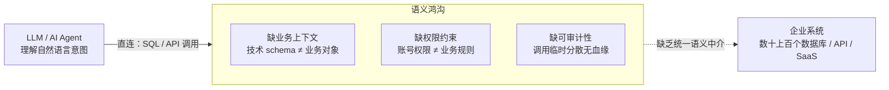
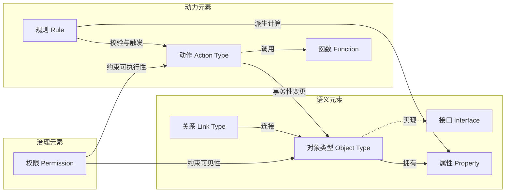
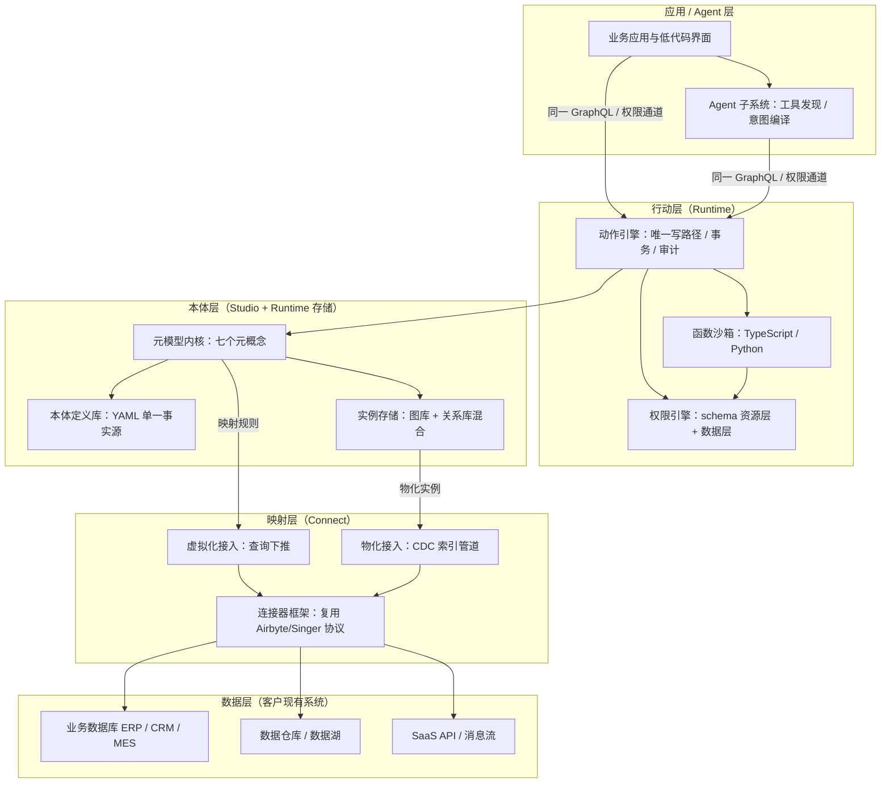
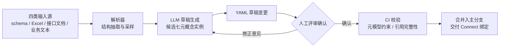
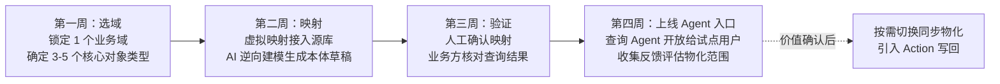
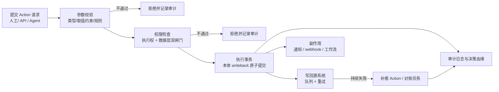
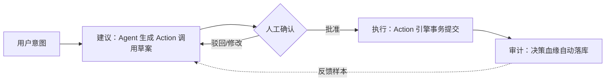

# 通用 Ontology 平台：产品与技术架构设计

> 版本：V1.0（2026-08-05）

## 1. 为什么是现在：Ontology 的复兴与 AI 落地的鸿沟

### 1.1 企业 AI 落地的真实瓶颈

#### 1.1.1 大模型能力过剩与企业数据"不可理解"之间的矛盾

过去两年，大语言模型（Large Language Model, LLM）的推理与生成能力快速提升，但企业侧的生产级落地并未同步加速。将推理过程拆开看，瓶颈不在模型一侧，而在模型所面对的企业系统一侧：LLM 直接对接数据库与 API 时，拿到的是表名、字段名与接口签名这类技术符号，而非业务概念。"CUST_STATUS = 3" 对模型而言只是一个枚举值，它既不知道该字段对应"客户生命周期阶段"，也不知道修改它意味着什么业务后果。由此产生三重结构性缺失：其一是业务上下文缺失，模型无法将技术 schema 映射到"客户、订单、合同"等真实世界对象，推理建立在猜测之上；其二是权限约束缺失，数据库账号的表级权限无法表达"该用户只能查看本区域客户的非敏感属性"这类业务规则，模型一旦直连数据即绕过了整个治理体系；其三是可审计性缺失，模型生成的 SQL 或 API 调用分散、临时、无统一语义入口，事后无法回答"AI 依据什么业务规则做了这个操作"。

上图所示的鸿沟解释了为什么"LLM + 数据库直连"在演示中可行、在生产中失效：演示场景的数据模型由演示者自己设计，业务语义早已内置于提示词；生产场景的语义沉淀在系统文档、IT 人员经验与历史流程中，机器无法直接消费。

#### 1.1.2 数据孤岛与系统林立

鸿沟的另一侧是企业 IT 的存量现实。中型以上企业通常运行数十至上百个业务系统——ERP、CRM、MES、自研系统与各类 SaaS 并存，同一"客户"在多个系统中以不同字段、不同编码、不同更新频率存在。数据集成工具解决了"搬运"问题，却没有解决"理解"问题：数据只有 IT 懂、业务看不懂，业务人员提出的需求仍需数据工程师逐条翻译成查询。当 AI Agent 被引入这一环境时，它面对的是与业务人员相同的困境，且没有"找 IT 问一下"的退路。因此问题可以精确表述为：企业缺少一个机器可读、业务可懂、且带有权限与动作语义的中介层，而非再增加一个数据仓库或又一个聊天机器人。

### 1.2 Ontology 从学术概念到产业基础设施

#### 1.2.1 Palantir 的范式定义

上述中介层在产业界已有命名。Palantir 将其 Foundry 平台中的 Ontology 定义为"组织的运营层（operational layer）"：位于已接入平台的数字资产之上，将数据集、虚拟表与模型映射到现实世界的对应物，多数场景下即"组织的数字孪生"；其构成同时包含语义元素（objects、properties、links）与动力元素（actions、functions、dynamic security）[^1^]。这一定义的关键之处在于把 Ontology 从传统的"知识建模"扩展为"运营建模"：语义元素回答"企业里有什么、它们如何关联"，动力元素回答"谁被允许对它们做什么、动作如何执行与审计"。Palantir 官方进一步将本体定位为"代表企业中的决策而非仅仅是数据"，每个运营决策由数据、逻辑、动作、安全四个要素构成[^7^]。在 AI 侧，其 AIP（Artificial Intelligence Platform）让 LLM 驱动的函数直接以本体数据为后盾，可编辑本体、包装为受治理的动作，并复用平台同一安全模型约束 LLM 的访问范围[^9^]——即 1.1 节所述的上下文、权限、可审计三重缺失，在同一层语义基础设施内被系统性补齐。

#### 1.2.2 产业跟进与趋势确认

微软的跟进印证了这一方向的普适性。Fabric IQ（截至预览版）在 Fabric 数据平台中引入本体项，覆盖对象类型（实体）、关系、属性、规则与动作，可由 Power BI 语义模型一键生成本体，并配 Operations Agent 在实时数据上"采取受治理的行动"[^12^]。两家路线不同的厂商在同一时间点把"本体层"推入各自的数据栈，说明该层正从单一厂商的产品差异化演变为下一代企业数据栈的标准组件。与此同时，Palantir 方案封闭昂贵、Fabric IQ 处于预览且绑定微软生态，面向更广泛企业（尤其是需要私有化部署与存量系统低成本改造的中文企业市场）的通用 Ontology 平台仍是一个开放的窗口——这是"现在"的第二层含义。

### 1.3 本文档目标与读者

#### 1.3.1 文档范围与结构

本文档定义一个通用 Ontology 平台的产品形态、元模型、技术架构与落地路径，同时覆盖两类需求："数据建模"（新业务从零建立本体）与"现有系统改造"（将存量数据库与应用低成本映射纳入本体）。全文共十二章：第 2 章给出产品定位与核心价值，第 3 章扫描竞品格局与市场空白，第 4 章定义元模型（语义、动力、治理三类元素），第 5 章给出总体技术架构，第 6 至 9 章展开四个子系统（建模工作台 Studio、连接与映射引擎 Connect、本体运行时 Runtime、Agent 层），第 10 至 12 章讨论 MVP 路线图与演进、风险应对与结语。目标读者为创始人及产品与技术决策者，阅读后应能独立判断平台的能力边界、关键技术取舍与落地节奏。

## 2. 产品定位与核心价值

### 2.1 一句话定位

本平台的定位可以压缩为一句话：**AI 时代的本体底座——让企业用业务语言建模整个组织，让数据、应用与 AI Agent 在同一语义层上协同**。

这一定位包含三个不可拆分的成分。第一是"用业务语言建模"：Ontology（本体）在此不是学术意义上的知识表示，而是组织的运营层——把数据库表、接口、模型等数字资产映射为业务人员可理解的对象（Object）、属性（Property）与关系（Link），构成组织的数字孪生[^1^][^8^]。第二是"数据、应用与 Agent 协同"：同一套本体定义同时服务三类消费者——分析查询、应用开发与 AI Agent，避免每个系统各自维护一份语义副本。第三是"底座"：平台不替代数据仓库、业务系统或 Agent 框架，而是位于它们之上的语义基础设施层，向下连接存量系统，向上暴露统一接口。

定位的参照系来自标杆实践。Palantir 将 Ontology 定义为"代表企业中的决策而非仅仅是数据"，每个运营决策由数据（Data）、逻辑（Logic）、动作（Action）、安全（Security）四要素构成[^7^]。这一"决策中心"视角揭示了本平台的本质边界：交付的不是更好的数据字典，而是可执行、可治理的组织模型——查询、操作与授权都发生在同一个语义对象上。

### 2.2 通用的正确含义：元模型通用 + 模板垂直

"通用平台"是一个需要严格界定的承诺。经验表明，通用性若落在错误的抽象层上，会导致"什么都能做、什么都不好用"的陷阱：平台内建大量行业无关的功能点，但每个行业客户仍需从零完成语义建模，冷启动成本抵消了通用性的全部收益。

本设计采用的界定是**元模型通用、行业语义模板化**。平台内核只内建七个元概念——对象类型、属性、关系、接口、动作（Action Type）、函数、权限——这七个概念足以表达任意行业的运营模型，但平台本身不预设任何行业词汇（规则不作为独立元概念，而是编译为动作校验与函数，详见第 4 章）。行业语义（如"工单""批次""保单"）全部通过模板（Template）与实例化承载：模板是对七个元概念的一组预配置组合，附带典型映射规则与示例 Action。

在此界定下，行业模板市场承担两个功能。其一是冷启动引擎：新客户选择与自身行业最接近的模板，经 AI 辅助建模（第 6 章）适配为本体草稿，将"从零建模"转化为"从 80 分草稿修订"。其二是网络效应引擎：模板由社区与合作伙伴贡献、被后续客户复用改进，平台能力随装机量增长。这一结构把"通用"从功能声明转化为生态机制，是避免通用平台陷阱的结构性手段。

### 2.3 三类核心价值

平台的价值主张面向三类角色分别成立，每类价值都对应一组具体的平台能力，而非泛泛的效率宣称。

| 核心价值 | 目标客户痛点 | 对应平台能力 |
|---|---|---|
| 数据团队：语义统一与低成本系统改造 | 同一业务概念在各系统口径不一；改造存量系统通常意味着数据迁移与 ETL 重建，成本高、风险大 | 七元概念元模型统一语义；虚拟映射/同步物化双模式映射存量系统，数据可不搬家；Ontology-as-Code 支持版本化演进 |
| 业务团队：用业务对象直接提问与操作 | 只能看报表，发现异常后无法在同一界面触发处置；操作依赖跨系统人工流转 | 对象级查询接口（GraphQL/REST）；Action 引擎将业务操作建模为受治理的对象动作，实现"看见即可处置"的决策闭环 |
| AI 应用：Agent 经本体获得上下文、权限与工具 | Agent 直连数据库缺业务上下文，易幻觉；权限绕行导致越权读写 | 本体为 Agent 提供对象、关系与术语上下文；Action 作为受控工具集；Agent 与应用走同一权限通道，权限继承至属性粒度 |

表格中的三类价值共享同一份本体资产，这是设计的关键意图而非巧合。数据团队建设的语义模型直接被业务界面与 Agent 消费，无需二次翻译；反过来，Agent 产生的 Action 调用又复用数据团队维护的权限与映射。三类价值之间存在复用飞轮：任何一类客户的采用都会增强另两类的可用性。这也解释了为什么单点产品（只做语义层、只做 BI、只做 Agent 框架）难以覆盖这一价值组合——价值来自三者的交集而非任一单点。

三类价值中，对 AI 应用的价值是本轮产品周期的差异化支点。行业基准显示，Agent 经语义层获取上下文后回答准确率接近 100%，而直连原始数据的方案显著更低[^13^]；其原因在于语义层同时提供了术语定义、口径约束与受控访问路径。本平台将这一结论从"分析问答"扩展到"业务操作"：Agent 不仅能基于本体回答，还能在权限约束下调用 Action 执行业务动作，把语义层从 Agent 的"知识来源"升级为"知识与行动的双重底座"。

### 2.4 不是什么：与数据中台、知识图谱、BI 的边界划分

定位的清晰度同样取决于边界的清晰度。本平台与三类相邻产品的区别如下。

**不是数据中台。**数据中台的核心命题是数据汇聚与治理，其前提是数据先迁入统一存储；本平台的核心命题是语义统一，数据可不搬家——存量系统通过虚拟映射接入本体，同步物化仅在性能必要时作为优化手段（三模式详见第 7 章）。两者可共存：中台解决"数据在哪"，本平台解决"数据意味着什么、能对它做什么"。

**不是知识图谱。**知识图谱产品的能力边界普遍停留在"构建—分析—问答"的只读闭环，缺乏业务写回能力。本平台的 Action 引擎将业务操作建模为本体的一等公民：动作有类型、有参数校验、有权限约束、有执行审计。语义（对象/属性/关系）加动力（动作/规则/函数）、外置治理（权限/安全）的结构，是与知识图谱划清界限的命门——没有 Action 的本体平台会退化为又一个图谱项目。

**不是 BI。**BI 回答"发生了什么"，输出止于报表与仪表盘；本平台在本体之上同时支撑查询与操作，目标是决策闭环——业务人员与 Agent 在同一语义对象上完成从发现到处置的全过程。BI 可以成为本体的消费者之一，但只是三种消费方式（分析、应用、Agent）中的一种。

这一边界划分为第 3 章的竞品分析提供了框架：数据中台厂商缺语义建模与 Agent 消费，知识图谱厂商缺 Action，BI 与语义层厂商缺写回与运营语义，三类竞品各覆盖本平台能力集的真子集。

## 3. 竞品格局与市场空白

第 2 章将平台定位为"AI 时代的本体底座"，并划定了与数据中台、知识图谱、BI 的三类边界。本章以竞品扫描验证该定位的市场空间：先考察国际阵营的四类产品与国内阵营的两类产品，再用一张"能力×厂商"矩阵证明——四块关键能力各自有主，但其交集无人覆盖。该交集即本平台的定位锚点，也直接决定第 4 章元模型必须内建的能力清单。

### 3.1 国际阵营

#### 3.1.1 Palantir Foundry：能力最完整，但封闭且数据须迁入

Palantir Foundry 是目前唯一将 Ontology 做成完整运行时（Runtime）的商用平台：本体同时包含对象类型（Object Type）、关系、动作（Action）与函数，AIP、Workshop、OSDK 等上层产品均围绕本体构建，并已通过模型上下文协议（Model Context Protocol，MCP）向外部 Agent 开放，是"Agent 原生消费本体"的现有标杆[^15^]。其局限同样明确：深度绑定 Foundry 自有生态，数据须经管道迁入索引而非就地查询，实施依赖高价的前线部署工程师（Forward Deployed Engineer，FDE）模式，封闭且昂贵[^15^]。对要求数据不搬家、私有化部署的目标市场而言，其模式技术上可参照、商业上不可复制。

#### 3.1.2 Microsoft Fabric IQ：方向正确，但处预览期且锁定微软生态

Fabric IQ 在 Fabric 内新增本体项，支持对象类型（实体）、关系、属性、规则与动作定义，可由 Power BI 语义模型一键生成本体，并配备 Operations Agent 监控实时数据、执行"受治理的行动"——与"Agent 经本体读语义、经受治理的 Action 写回"的闭环设想方向一致[^12^]。但截至 2026 年初预览版，其数据绑定限制较多（仅支持托管 Lakehouse 表，Import/DirectQuery 模式受限），功能仍可能快速变化，且强绑微软生态[^12^]。它验证了方向，但尚未构成可用的通用产品。

#### 3.1.3 语义层三杰 dbt/Cube/AtScale：只读指标语义，无对象模型与 Action

dbt Semantic Layer、Cube、AtScale 代表另一类思路：将指标语义层（Semantic Layer）经 API 或 MCP 暴露给 BI 与 AI Agent。dbt 的 MetricFlow 已以 Apache 2.0 开源，官方基准显示 Agent 经语义层取数准确率接近 100%，证明"语义层是 Agent 可靠性地基"[^13^]；AtScale 支持 SQL/MDX/DAX 多协议并以 MCP Server 向 LLM 暴露语义模型[^21^]。三者的共同边界是：语义对象仅为只读指标，没有对象/关系模型，更没有 Action 写回[^13^][^21^]。

#### 3.1.4 知识图谱系 Stardog/Neo4j/Ontotext/TopQuadrant：强存储推理，无业务写回

知识图谱阵营以存储、映射与推理见长。Stardog 采用基于本体的数据访问（Ontology-Based Data Access，OBDA）范式，经 R2RML 映射实现数据虚拟化与联邦查询，但读写面向 RDF 图谱本身，缺乏面向业务系统的 Action 框架，AI 消费需自建[^14^]；Neo4j 的 GraphRAG 生态最成熟，但本质是数据库而非本体平台，无业务对象建模与写回编排[^22^]；Ontotext GraphDB 与 TopQuadrant EDG 分别侧重 RDF 存储加 OWL 推理、本体与词表治理，同样无 Action 与 Agent 消费设计[^14^][^22^]。

表 3-1 汇总国际阵营四类代表产品。

**表 3-1 国际竞品对比表**

| 厂商/产品 | 类别 | 核心能力 | Agent 消费路径 | 关键差距 |
|---|---|---|---|---|
| Palantir Foundry | 运营决策平台 | 对象+关系+Action+函数全栈本体 | AIP/MCP 原生消费 | 封闭昂贵；数据须迁入索引；FDE 实施[^15^] |
| Microsoft Fabric IQ | 云厂商本体服务 | 本体建模+受治理行动 | Operations Agent | 预览期（截至 2026 年初）；锁微软生态[^12^] |
| dbt / Cube / AtScale | 指标语义层 | YAML 化指标语义、多协议 API | API/MCP 供 Agent 取数 | 只读指标；无对象模型与 Action[^13^][^21^] |
| Stardog / Neo4j 等 | 知识图谱 | 图存储、OBDA 虚拟化、推理治理 | GraphRAG/自建 | 无业务写回；无 Agent 原生消费[^14^][^22^] |

表 3-1 呈现一个结构性规律：能力沿"语义完整性"与"行动能力"两个维度分布，没有厂商同时占据两端。拥有 Action 的两家分别以生态封闭、预览成熟度为代价；打通 Agent 消费链路的语义层厂商把语义收窄为只读指标，主动放弃了写回；图谱厂商积累最深却始终停留在"读"的一侧。各自的差距是定位选择的结果——它们分别优化了运营闭环、云生态整合、分析可信度与图谱推理，没有一家以"通用本体中枢"为设计目标。这意味着市场空间真实存在，而非竞争对手的暂时疏忽。

### 3.2 国内阵营

#### 3.2.1 知识图谱厂商：停留在图谱构建与分析，无 Action 概念

国内本体的产业化主要以知识图谱形态推进。星环科技 Sophon KG 提供覆盖蓝图拖拽构图、本体定义、NLP 抽取与万亿边存储（StellarDB）的全生命周期图谱平台，并通过信通院评测，但定位是图谱构建与分析，无 Action 概念，AI 结合停留在"图谱+大模型问答"[^16^]。明略科技以行业知识图谱与企业知识中台见长，海致星图以自研分布式图数据库加图谱平台服务金融反欺诈等场景；二者公开资料有限，相关判断基于第三方评测、置信度中等，但现有资料同样未见通用本体运行时与 Action 写回。总体上，国内厂商的"本体"服务于构图，是一次性建模资产而非运行时语义基础设施。

#### 3.2.2 云厂商图谱服务与 DataWorks 逆向建模：回应了存量改造，但产出是数仓模型

华为云、百度智能云的知识图谱服务支持本体（概念/关系）编辑、信息抽取与图谱问答，但本体仅作为构图工具链的一环，无运行时对象与动作语义[^18^]。阿里云 DataWorks 的逆向建模可将存量物理表反向生成模型，直接回应"现有系统低成本纳入"的需求——但产出是维度建模（Kimball 范式）下的数仓表模型，不含对象/关系/动作语义，也不供 Agent 消费[^17^]。国内市场对存量系统改造的需求已被识别并部分满足，只是满足方式停留在数据中台范式内，尚未上升为本体范式。

### 3.3 市场空白：四能力交集无人覆盖

将扫描结果投影到四块关键能力——通用本体建模、存量系统映射、Action 写回、Agent 原生消费——得表 3-2。

**表 3-2 能力×厂商覆盖矩阵（● 原生完整支持　◐ 部分/间接支持　○ 不支持）**

| 厂商 | 通用本体建模 | 存量系统映射 | Action 写回 | Agent 原生消费 |
|---|:---:|:---:|:---:|:---:|
| Palantir Foundry | ● | ◐（须迁入索引） | ● | ● |
| Microsoft Fabric IQ | ● | ◐（绑定受限，预览期） | ●（预览） | ●（预览） |
| dbt / Cube / AtScale | ◐（仅指标语义） | ◐（面向数仓） | ○ | ● |
| Stardog | ● | ●（OBDA 虚拟化） | ○ | ○ |
| Neo4j / Ontotext / TopQuadrant | ◐（图谱本体） | ◐ | ○ | ◐（GraphRAG） |
| 国内 KG 厂商（星环/明略/海致） | ◐（构图本体） | ◐（项目制集成） | ○ | ○ |
| DataWorks 逆向建模 | ○（数仓模型） | ●（逆向生成） | ○ | ○ |

矩阵的读法有三层。第一，没有任何一行出现四个●：Palantir 与 Fabric IQ 最接近，但二者的存量映射都附加苛刻前提——前者要求数据迁入自有索引，后者限定托管表且处预览期[^12^][^15^]。第二，"Action 写回"是全矩阵最稀疏的一列，国内外图谱厂商集体缺席，印证 Action 层是与传统图谱划清界限的命门，也是最难被既有产品线"顺手补齐"的能力。第三，国产阵营在后两列整体为空，即使计入国内厂商信息置信度中等的限定，这一结构性缺口也不依赖单一厂商的细节。三层读法共同指向：空白不是单点能力缺失，而是四能力交集缺失；填补它需要以本体为中枢的原生设计，而非在图谱或语义层产品上叠加模块。

#### 3.3.1 定位锚点：四能力交集

由此，本平台的定位锚定为一个具体交集：以通用本体（对象+关系+动作）为中枢，既能把存量业务系统低成本映射、逆向纳入本体，又能让 Agent 经本体读取语义、并通过受治理的 Action 写回业务系统形成闭环。这要求平台在元模型层即内建四类能力而非事后集成——第 4 章的元模型设计按此清单展开。

#### 3.3.2 国产化与私有化部署：额外的机会窗口

交集之外还有一个结构性窗口：能力最完整的 Palantir 与国产化、私有化部署无缘，方向正确的 Fabric IQ 锁定微软公有云生态[^12^][^15^]；而对数据不出域、信创适配有刚性需求的行业（金融、政务、能源等），目前只能买到"图谱构建+分析"产品。开放连接任意系统、数据可不搬家、可私有化交付——三项与四能力交集叠加，构成本平台相对国内外竞品的完整差异化空间。

## 4. 元模型设计：平台的灵魂

第 2 章确立了"通用 = 元模型通用 + 模板垂直"的产品定位，第 3 章进一步给出元模型必须原生内建的能力清单（通用本体建模、存量系统映射、Action 写回、Agent 原生消费），本章回答随之而来的核心设计问题：元模型（meta-model，即定义模型本身的模型）应当包含哪些概念，才能用最少、最稳定的一组构件承载任意行业的运营语义。设计结论先行：平台只内建七个元概念——**对象类型、属性、关系、接口、动作、函数、权限**，一切行业语义（客户、订单、设备、工单、理赔）都是这七个元概念的实例化，行业差异沉淀在模板层而非内核层。

分类框架参照 Palantir 官方对本体的二分法——语义元素（objects、properties、links）与动力元素（actions、functions、dynamic security）[^1^]，但作一处结构性调整：将安全与权限从动力元素中抽出，单列为**治理元素**。理由有二：其一，权限的约束对象不仅是动态行为，还包括静态数据的可见性，归入"动力"在概念上不闭合；其二，治理独立成维度，才能在架构上落实"Agent 与人类走同一权限通道"。下表给出七个元概念的全景定义，后续小节逐个展开设计决策。

**表 4-1 七个元概念定义表**

| 元概念 | 定义 | 类比（工程师心智模型） | 示例 |
| --- | --- | --- | --- |
| 对象类型（Object Type） | 业务实体或事件的模式定义，单个实例为对象 | 数据库表的 schema；数据集 | "客户""订单""设备告警事件" |
| 属性（Property） | 对象类型上的字段，带类型、单位、约束与敏感级别 | 数据集的列 | 客户.信用额度（decimal，≥0，敏感级=机密） |
| 关系（Link Type） | 对象类型之间带基数、方向与语义化命名的连接 | 外键 + 图边 | 客户—"下单"→订单（1:N） |
| 接口（Interface） | 描述对象类型形状与能力的多态抽象 | 面向对象编程中的接口 | "可赔付对象"：保单、工单均可实现 |
| 动作（Action Type） | 对对象/属性/关系的一组事务性变更，含参数、校验与副作用 | 存储过程 + 表单提交 | "批准理赔"（金额参数、限额校验、写回） |
| 函数（Function） | 读写本体的服务端代码逻辑 | 服务端函数 / UDF | 计算客户终身价值（遍历订单关系聚合） |
| 权限（Permission） | schema 资源层与数据层两层授权，粒度可达具体属性值 | RBAC + 行级/列级安全 | 华东区销售仅可见华东客户及其非敏感属性 |

这张表承载两个关键取舍。第一，**为什么是七个而不是更多**：每增加一个元概念，内核的存储、API、权限校验、Agent 工具协议都要同步扩展，边际成本极高；而七概念已覆盖"描述世界（对象/属性/关系）—抽象复用（接口）—改变世界（动作/函数）—约束改变（权限）"的完整闭环；规则不占用元概念名额，而是编译为动作的校验项与函数（见 4.2.3），避免内核执行体膨胀。与学术本体语言（OWL/RDF）相比，本设计主动放弃逻辑完备性，换取工程可实现性——"类比"一列并非修辞，而是设计意图：每个元概念都复用工程师已有的心智模型。第二，**与知识图谱的分野**：国内外知识图谱产品的概念体系通常止步于"实体—关系"两个概念，缺少动作、函数与规则三类动力元素，只能回答"世界是什么"而不能表达"对世界做什么"。动作层进入元模型内核，正是本平台与知识图谱划清界限的命门。

### 4.1 语义元素

#### 4.1.1 对象类型（Object Type）

对象类型是现实世界中实体或事件的模式定义；其单个实例称为对象，实例集合称为对象集。与数据集存在严格的结构对应：Dataset→Object Type、Row→Object、Column→Property、Join→Link Type[^2^]。这一对应关系在平台上的价值在于：存量关系型系统中的表结构可以近乎机械地映射为对象类型草稿，为第 7 章 Connect 的自动化映射提供了形式化基础。

设计决策之一：对象类型同时覆盖"实体"（客户、设备）与"事件"（告警、交易流水），不拆分为两个元概念。拆分虽能让事件携带不可变性等专属语义，但关系、动作、权限的定义都要为两类概念各写一遍，内核复杂度近似翻倍；而两类实例的差异可由属性表达——事件对象带时间戳属性且动作集通常为空（只读）——统一不损失表达力。

#### 4.1.2 属性（Property）

属性是对象类型上的字段，其定义包含四要素：类型系统（原始类型、枚举、对另一对象的引用、时序序列）、单位（金额币种、物理量纲）、约束（取值范围、必填、格式）、敏感级别标记。其中敏感级别是治理挂钩而非装饰：4.3 节的权限模型在数据层可精确到具体属性值[^5^]，敏感级别因此必须落在属性定义本身而非散落在独立策略文件中，否则权限引擎在运行时无法稳定定位其判定依据。这一"约束内生于模式"的原则同样适用于单位与取值约束，它们是 Runtime 校验与 Agent 生成可靠查询的共同依据。

#### 4.1.3 关系（Link Type）

关系描述对象类型之间的连接，定义包含基数（1:1、1:N、M:N）、方向与双向语义化命名——例如"客户—下单→订单"的反向命名为"订单—属于→客户"。语义化命名是一个容易被低估的设计点：它使图遍历路径可以被直接翻译为自然语言（"找出该客户近 90 天**下单**的订单"），这是第 9 章 Agent 将用户意图编译为遍历查询时无需额外词汇表的前提。取舍方面，平台允许关系携带轻量属性（如下单时间），但在模板规范中明确克制使用——关系属性的滥用会滑向 RDF 具体化（reification）的复杂度，使遍历语义与权限判定的实现成本陡增。

#### 4.1.4 接口（Interface）

接口是描述对象类型形状与能力的本体类型，为多态提供机制[^1^]。候选方案有三：将公共属性复制到各对象类型（schema 随类型数量线性膨胀，公共逻辑无法复用）、单继承（一个对象类型常同时属于多个分类维度，单继承无法表达）、接口式多态。选择接口的依据不仅是表达力，更在于它是**模板复用的载体**：行业模板以接口为单位交付（定义"可赔付对象"应有的属性、关系与可用动作），企业将自己的保单、工单等对象类型声明为实现该接口，模板中的函数、规则与动作即刻生效，无需逐类型改造。

### 4.2 动力元素

#### 4.2.1 动作（Action Type）

动作的官方参照定义是：用户对对象、属性值、关系（links）所做的一组变更的定义，构成单个事务；包含提交时的副作用（通知、webhook）、参数、规则与提交校验，编辑写入 writeback 数据集[^3^]。本平台的元模型继承该定义，并追加一条强约束：**Action 是对本体数据的唯一写路径**。所有修改——无论来自人工界面、外部 API 还是 Agent——都必须经由某个已定义的 Action 提交。这条约束是平台治理能力的总开关：权限校验、审计日志、决策血缘（见 4.4）全部挂在 Action 这一单一锚点上，任何一个写操作都无法绕开治理面。第 3 章调研显示，原生支持 Action 写回的本体产品在业界屈指可数，动作引擎因此被列为平台三大自研差异化模块之一。

#### 4.2.2 函数（Function）

函数是运行在服务端隔离环境中、以本体为一等公民的代码逻辑，可直接读取属性、遍历关系、编辑本体，实现语言为 TypeScript 与 Python[^4^]。在元模型中，函数承担"逻辑复用单位"的角色：派生计算、复杂校验、跨对象聚合都以函数实现，再被动作、规则或其他函数调用。函数与动作能力上有重叠（都能改变本体），但语义定位不同，二者不可合并，对比如下。

**表 4-2 动作（Action）与函数（Function）对比**

| 维度 | 动作（Action Type） | 函数（Function） |
| --- | --- | --- |
| 定位 | 声明式的变更意图，治理锚点 | 命令式的计算逻辑，复用单位 |
| 触发方式 | 用户表单、外部 API、Agent 直接提交 | 被动作、规则或其他函数调用 |
| 事务性 | 单事务原子提交，失败整体回滚 | 无独立事务，读写即时生效于调用上下文 |
| 副作用 | 内建通知、webhook 等提交后副作用 | 无内建副作用机制 |
| 权限语义 | 独立授权对象（"谁可执行此动作"） | 继承调用者权限，不单独授权 |
| 返回值 | 无（语义上是命令，非查询） | 有（对象、标量、聚合结果） |
| 典型实现 | 参数化配置 + 校验规则，可零代码定义 | TypeScript/Python 沙箱代码 |

对比揭示了两者的分工逻辑：动作回答"允许谁在什么条件下对世界做什么改变"，函数回答"如何计算"。若允许函数作为独立写路径，审计链会在函数内部断裂——平台无法回答"这次变更对应哪个业务意图"。因此平台规定：函数内的本体编辑必须以某个 Action 的名义提交才能持久化，与业界"逻辑函数可包装为 Action Type 执行"的成熟做法一致[^9^]。反向组合同样常见：动作把复杂校验委托给函数，声明式外壳包裹命令式内核。这一分工直接决定了 Runtime 的模块边界——动作引擎管事务与治理，函数沙箱管计算。

#### 4.2.3 规则（Rule）

规则覆盖三类语义：约束（数据进入本体前必须满足的条件）、派生属性（由其他数据计算而来，如"客户等级 = f(年消费额)"）、自动化触发条件（对象满足条件时自动执行某动作）。设计决策是：规则不引入独立运行时引擎，而是编译为已有构件——约束编译为动作提交时的校验项，派生属性编译为函数，自动化规则编译为事件监听加动作调用。这一取舍使内核只维护动作引擎与函数沙箱两个执行体，降低行为语义分裂的风险；代价是复杂规则编排的表达力受限，留待流程编排层补足。

### 4.3 治理元素

#### 4.3.1 两层权限模型

权限模型采用两层结构：本体资源层管控对象类型、关系类型、动作类型等 schema 资源的可见与可管理性；数据层管控对象与关系实例本身，粒度可达具体属性值[^5^]。在此基础上平台将执行粒度细化为对象、属性、动作三级，并坚持一条架构原则：**Agent 与普通应用走同一权限通道**。Agent 调用工具时继承其代表用户的权限上下文，安全控制只授予完成任务所必需的访问权限——该模式已被 Palantir 官方作为约束 LLM 的核心机制公开确认[^11^]。这一原则旨在消除"AI 旁路"：若 Agent 拥有独立的高权限通道，整个权限模型在 AI 场景下形同虚设；统一通道使"AI 只能做你被授权做的事"成为系统性质而非产品承诺。

#### 4.3.2 版本管理与 Ontology-as-Code

本体定义以 YAML 为单一事实源（single source of truth），纳入 Git 管理，支持 diff、回滚与 CI 校验，统称 Ontology-as-Code。候选方案有三：UI 优先（代码仅作导出存档）、代码优先（放弃图形建模）、双写同步（UI 与代码均可编辑）。选择"YAML 为源、UI 生成与修改 YAML"的折中形态：UI 降低建模门槛，但每次保存即提交 YAML 变更，规避双写方案的状态一致性问题。该决策构成对标杆产品的直接差异化——Palantir 的平台 API 对本体的 Object/Action/Link 定义仅支持 GET/LIST 读取，创建仍需经由 UI（Ontology Manager）完成[^10^]，其本体定义难以纳入标准软件工程流程。Ontology-as-Code 同时为 AI 辅助建模提供落点：LLM 生成的本体草稿本质就是一份待评审的 YAML 变更，可直接进入 diff 评审与 CI 校验。

### 4.4 决策四要素框架

元模型的七个概念不是一份平铺的功能清单，而是恰好构成一个运营决策的最小完备集。Palantir 官方将本体定位为"代表企业中的**决策**而非仅仅是数据"：每个运营决策由四要素构成——Data、Logic、Action、Security，并支持决策血缘（decision lineage）的自动捕获[^7^]。四要素与元概念的映射是直接的：Data 对应对象、属性与关系（决策依据），Logic 对应函数与规则（决策推理），Action 对应动作（决策执行），Security 对应两层权限（决策的合法性边界）。

这一框架使 4.2.1 的"唯一写路径"约束获得完整回报：每次变更都经由 Action 提交，平台即可在执行点自动捕获"谁在什么权限下、依据哪些数据、经过什么逻辑、执行了什么动作"，决策血缘无需事后埋点。审计合规、决策回放与人机协同的责任划分因此成为元模型的派生能力而非附加模块；本章定义的七个元概念也由此构成后续 Studio、Connect、Runtime、Agent 各层共同的数据契约——各层只操作这七个元概念，层间不再有私有语义。

## 5. 总体技术架构

第 4 章定义的七个元概念是平台的静态契约，本章回答其动态承载问题：这七个元概念落在怎样的分层结构上运行，存储、接入、API、部署四个横切面上各有哪些不可逆的技术选型。设计结论先行：平台采用"数据层—映射层—本体层—行动层—应用/Agent 层"五层架构，以开源组件承担通用能力（连接器、图存储、API 生成、指标语义），自研集中在元模型内核、AI 辅助建模与动作引擎三个差异化模块；该边界划分同时构成第 6–9 章 Studio、Connect、Runtime、Agent 四个子系统的模块切分依据。

### 5.1 五层架构总览

分层的第一原则是**数据可以不搬家**。客户现有业务系统（ERP、CRM、MES、数据仓库）保留原位，平台通过映射层将其表结构映射为对象类型，语义在本体层汇聚为第 4 章的七元概念实例，行动层承接动作（Action）与函数（Function）的执行并写回源系统，最上层由人类应用与 Agent 经同一 API 与权限通道消费本体。各层职责与所属子系统的对应关系如下。

图中有三条结构性约束需要说明。其一，**读路径分岔、写路径收敛**：读查询既可走物化索引（低延迟遍历）也可下推至源系统（数据不出域），但所有写操作必须经由行动层的动作引擎提交——这是第 4 章"Action 是唯一写路径"约束在架构层的落实，权限引擎与审计日志因此只需挂在动作引擎一个锚点上。其二，**本体定义与实例分离**：本体定义库以 YAML 文件为单一事实源（Ontology-as-Code），实例存储是可重建的派生物，二者变更节奏与容灾等级完全不同，合库会把 schema 迁移与数据迁移耦合为高风险操作。其三，**Agent 无专用旁路**：应用与 Agent 共享同一 API 入口与权限通道，Agent 子系统的独特性仅体现在意图编译与工具发现，不体现在任何数据访问特权上。

### 5.2 关键设计决策

下表汇总四个对后续子系统设计有约束力的选型决策，均按"候选选项—选择—理由"展开。

**表 5-1 关键设计决策表**

| 决策 | 候选选项 | 选择 | 理由 |
| --- | --- | --- | --- |
| 实例存储 | 纯图库；纯关系库；图库与关系库混合 | 混合：NebulaGraph 存关系与遍历，关系库存属性与事务 | 关系遍历（多跳路径查询）在关系库上需递归 JOIN，性能随跳数指数衰减；而属性的等值/范围过滤与聚合在关系库上成熟稳定。NebulaGraph 为国产开源分布式图库，契合信创要求 |
| 本体定义与实例存储 | 同库管理；分离管理 | 分离：定义入 YAML/Git，实例入存储引擎 | 定义变更走代码评审与 CI（Ontology-as-Code），实例是定义经接入管道生成的派生物，可重建、可独立扩缩容；合库会使 schema 迁移锁死数据服务 |
| 数据接入模式 | 全物化（数据一律迁入索引）；全虚拟化（一律查询下推）；按对象类型双模可选 | 双模：虚拟化为默认，物化用于热路径 | 虚拟化（OBDA 范式，R2RML 映射与联邦查询下推）保证数据不出域、无同步滞后[^14^]；但高频遍历与全文检索场景下虚拟化延迟不可控，需物化索引兜底，参考 Palantir 以批/流两类管道将数据索引进对象存储的机制[^6^] |
| 读 API 形态 | 手写 REST；由本体自动生成 GraphQL；暴露 SQL | 自动生成 GraphQL | Hasura/PostGraphile 已验证"由 schema 即时生成含权限与订阅的 GraphQL"的工程可行性[^20^]；本体即 schema，手写 API 意味着每新增对象类型都要重复开发，与"通用"定位矛盾 |
| 通用能力自研边界 | 全自研；全集成开源；分层取舍 | 连接器复用 Airbyte/Singer 协议，指标语义借鉴 MetricFlow，自研聚焦三模块 | Airbyte 生态已有 600+ 连接器与开源 CDK[^19^]，自研连接器是无差异化的重复投入；MetricFlow（Apache 2.0）的 YAML/Git 化指标定义可直接复用为指标属性的语义规范[^13^]；自研集中于元模型内核、AI 辅助建模、动作引擎三个市场空白点 |

表 5-1 的五项决策之间存在内在一致性：它们共同执行"自研预算向差异化模块集中"的资源策略。存储与接入选择成熟开源组件，是因为这两层的优劣取决于工程成熟度而非概念创新，后发者无法在图遍历性能上追赶成熟图库的十年积累；而动作引擎、AI 建模无人可抄，必须自研。双模接入是其中唯一增加内核复杂度的决策——映射层需为每个对象类型维护"虚拟/物化"标志并保证两路径的查询语义一致——但这是"数据不搬家"承诺的必要成本：纯物化路线（Palantir 模式）要求客户先迁数据再建本体，在数据合规敏感的国内政企市场构成准入门槛[^6^]；纯虚拟化则无法支撑 Agent 高频遍历的延迟要求。GraphQL 自动生成与权限引擎存在一处联动：API 层生成的每个字段解析器都需嵌入权限判定，第 8 章将展开这一"权限内生于 API"的实现。

### 5.3 部署形态

平台提供两种部署形态。**SaaS 多租户**面向中小客户：本体定义库按租户隔离，实例存储按租户分片，动作引擎与函数沙箱按租户配额限流；虚拟化接入在此形态下要求客户源系统开放只读账户或部署就地代理（on-premise agent）反向回连，避免客户数据库暴露公网。**私有化部署**面向政企与合规敏感客户，提供单机（POC 与小规模）与集群两种规格：图库、关系库、消息队列均以容器化交付，支持离线安装。

私有化形态需完成信创适配：操作系统兼容麒麟、统信，CPU 兼容鲲鹏、海光，数据库适配层允许以国产关系库（openGauss、达梦）替代默认关系库，图库本身即为国产开源组件。信创适配不是简单的兼容性测试，而是对 5.2 选型的反向约束——关系库存储层必须将 SQL 方言差异收敛在适配层内部，本体层及以上不得感知底层数据库品牌，否则每次适配都会向上层泄漏为开发成本。两种形态共享同一镜像仓库与配置体系，功能差异仅以许可证（license）开关控制，避免出现"SaaS 版与私有版功能分叉"的维护陷阱。

## 6. 子系统一：建模工作台 Studio

第 5 章将平台切分为 Studio、Connect、Runtime、Agent 四个子系统，其中 Studio 是建模态的统一入口，负责产出第 4 章定义的七元概念模型；其产出的本体草稿交由第 7 章 Connect 完成与存量系统的映射绑定。Studio 要回答的设计问题只有一个：如何同时服务两类画像迥异的用户——习惯图形操作的业务建模者，与习惯代码与 Git 的工程团队——并把建模这一本体落地中人力最密集的环节压缩一个数量级。本章给出四个相互咬合的设计：可视化建模降低门槛，AI 建模助手承担初稿生产，模板市场沉淀复用，Ontology-as-Code 提供工程化交付通道。

### 6.1 可视化建模体验

建模画布支持以拖拽方式定义对象类型、属性、关系与接口实现关系，并在侧栏以图谱形式实时渲染：用样例实例数据把"客户—下单→订单（1:N）"这类抽象定义可视化为具体的对象与边。这一预览并非装饰——基数错误与语义化命名缺失是建模期最高频的两类缺陷，唯有让建模者"看见"实例级效果，才能在进入 Connect 绑定之前暴露它们。

多人协作参照 WebProtégé 的成熟模式：该编辑器已验证并发编辑、变更评论与版本历史三件套对本体建模场景的适用性[^23^]。锁粒度上存在两个候选方案：模型级全局锁（实现简单，但两人修改不同对象类型也要串行排队）与对象类型级乐观锁（并发度高，需处理跨类型引用冲突）。平台选择后者：对象类型是天然的协作边界，跨类型冲突（如一方删除被另一方引用的关系）由保存时的引用完整性校验拦截，而非由锁预防。需要明确的是，UI 内的版本历史不是独立存储，而是 6.4 节 Git 提交流的投影——版本事实只有一个来源，避免 UI 历史与代码历史分裂为两套真相。

### 6.2 AI 建模助手：核心差异化

建模成本是本体平台普及的首要障碍。标杆厂商的落地模式依赖高价的前线部署工程师（Forward Deployed Engineer，FDE）驻场实施，且其平台 API 对本体的对象、动作、关系定义仅提供 GET/LIST 只读访问，创建必须经由 UI 完成[^10^]——这意味着建模环节在技术上就无法被自动化，只能以人月计价。Studio 的设计反其道而行：以大语言模型（Large Language Model，LLM）承担本体初稿的自动生产，人只做确认与修正，目标是将单个业务域的建模周期从月级压缩到天级。

助手接受四路异构输入，各路解析策略与人工介入点不同，汇总如下。

**表 6-1 AI 建模助手的输入类型、生成产物与人工确认点**

| 输入类型 | 解析策略 | 生成产物 | 人工确认点 |
| --- | --- | --- | --- |
| 数据库 schema（DDL/信息模式） | 表→对象类型、列→属性、外键→关系的机械映射 | 对象类型、属性、关系草稿 | 基数（1:1/1:N/M:N）判定、关系的双向语义化命名、属性敏感级别标注 |
| Excel/CSV 样例数据 | 列采样推断类型、枚举值与单位 | 属性定义（类型、枚举、约束） | 类型推断纠错、主键属性选择、单位与取值约束 |
| 接口文档（OpenAPI 等） | 端点语义归类为读写意图 | 动作草稿（参数、校验规则） | 事务边界划分、副作用（通知/webhook）确认、写路径合法性 |
| 业务描述文本 | LLM 抽取候选概念并归并 | 候选对象类型、接口、关系命名 | 同义概念去重归并、术语与企业词表对齐 |

四路输入覆盖的自动化程度存在明显梯度。数据库 schema 一路确定性最高：第 4 章已确立数据集到本体的严格结构对应（见 4.1.1），映射近乎机械，LLM 仅用于命名语义化与基数推断；这一路的工程先驱是阿里云 DataWorks 的逆向建模——从存量物理表反向生成模型[^17^]，区别在于其产出止步于数仓表模型，而本平台继续生成关系、接口与动作语义。业务描述文本一路确定性最低，LLM 产出的候选概念必然包含冗余与歧义，因此人工确认点也最重。四路输入共享同一条设计底线：**助手只生成草稿，从不直接落库**——所有产出以 YAML 变更形式进入评审队列，确认权始终在人。

这一人机分工的取舍依据是错误成本的不对称：建模期漏检的错误会在 Connect 绑定与 Runtime 运行阶段被指数级放大，而 LLM 当前的可靠性不足以独立承担 schema 决策；反之，若全程人工，则回到 FDE 模式的成本结构。"机器起草、人确认、Git 留痕"的三段式由此成为 Studio 的不可协商约束。

### 6.3 模板市场

模板复用的技术载体是接口（Interface）：如 4.1.4 所述，行业模板以接口为单位交付一类业务对象应具备的属性、关系与动作，企业将自有对象类型声明为实现该接口，模板逻辑即刻生效。Studio 内置三类种子模板——制造（基于 ISA-95 企业-控制系统集成模型的设备、工单、物料层级）、零售（会员、订单、权益）、金融风控（账户、交易、风险事件）——并提供发布、fork 与二次创作机制：企业从模板分叉出私有副本，改造后可回投市场。治理上的取舍在于开放度：全开放社区模式增长快但质量参差，纯官方认证模式质量可控但供给不足。V1 选择官方认证制，仅接受通过 CI 校验（元模型合规、含样例数据与文档）的投稿，以供给收缩换取模板可信度——模板市场的冷启动阶段，低质模板对信任的破坏大于供给不足的损失。

### 6.4 Ontology-as-Code

4.3.2 已确立"YAML 为单一事实源、UI 生成 YAML"的折中形态，本节展开其工程链路。链路是双向同步的：画布上的每次保存即生成一次 YAML 提交，反向地，工程师在 Git 仓库中手工修改 YAML 并合并后，Studio 重新加载模型并刷新画布，两条通道以仓库为唯一交汇点、不产生第二份模型副本。YAML 提交进入分支—评审—CI—合并的标准流程：CI 校验覆盖元模型约束（属性类型合法、关系两端类型存在）、权限引用完整性（权限定义指向的对象类型与动作必须存在）与模板接口契约（声明实现某接口的对象类型必须具备全部必需属性）。环境迁移由此退化为 Git 操作：开发环境向生产的发布即分支合并加差异应用，变更可 diff、可回滚、可审计。这一链路与 AI 建模助手形成闭环——LLM 草稿天然是待评审的 YAML 变更，直接复用同一套评审与 CI 通道，无需为 AI 产出单设治理流程。对照竞品，标杆平台的本体定义因 API 只读而难以纳入标准软件工程流程[^10^]，Ontology-as-Code 因此同时是工程效率特性与差异化论据：它使本体模型第一次可以被当作代码资产进行全生命周期管理。

## 7. 子系统二：连接与映射引擎 Connect——改造现有系统

第 6 章 Studio 解决的是"本体如何被建模出来"，本章的 Connect 子系统回答客户落地时最先提出的问题：本体与企业已有的数十个业务系统如何对接，改造代价有多大。设计结论先行：Connect 不追求发明新的数据集成技术，而是把工程重点放在两处——复用成熟开源连接器生态解决"连得上"的问题[^19^]，自研语义映射层解决"连上之后数据以何种本体语义被消费"的问题。这一分工与第 5 章"数据接入双模"的架构决策直接衔接：虚拟化查询下推与物化 CDC 索引在 Connect 层被具体化为三种可选的映射模式，客户按系统逐一选择，而非一次性全量迁移。

### 7.1 连接器框架

连接器（Connector）是与源系统建立物理连接的插件，负责抽取 schema 元数据与数据记录。候选方案有三：全自研连接器、复用单一集成引擎、以插件接口兼容开源生态。选择第三种的依据是成本结构：Airbyte 已提供 600 余个开源连接器与连接器开发套件（CDK），Singer 则以 tap/target 协议形成了另一套可编排的事实标准[^19^]；连接器的价值在于覆盖广度而非技术深度，自研无法在长尾系统（各类国产 ERP、行业专用软件）上与生态竞争。Connect 因此定义统一的连接器插件接口，将 Airbyte/Singer 连接器封装为可插拔适配器，自研投入集中于两类生态空白：国产数据库与信创环境适配、企业 Excel/CSV 文件的语义化接入。

连接器并非均匀重要。基于目标客户系统的出现频率与试点路径的依赖关系，Connect 按三个优先级梯队规划连接器交付，如下表所示。

**表 7-1 连接器优先级清单**

| 优先级 | 连接器类别 | 典型源系统 | 纳入依据 |
| --- | --- | --- | --- |
| P0（首期必须） | 关系型数据库、Excel/CSV | MySQL、PostgreSQL、Oracle、SQL Server | 试点客户数据主体所在；虚拟映射与 AI 逆向建模的最小输入 |
| P1（二期跟进） | ERP/CRM、REST API | SAP、用友、金蝶、Salesforce | 核心业务对象（客户、订单、工单）的权威来源，决定本体覆盖面 |
| P2（按需扩展） | 消息队列、数据仓库、国产数据库 | Kafka、RocketMQ、达梦、人大金仓 | 支撑流式物化与信创交付，生态已有可复用实现[^19^] |

该优先级排序反映的是"改造现有系统"诉求下的务实次序：P0 锁定关系库与 Excel，是因为这两类承载了试点阶段可快速验证的映射链路——schema 规整、无接口谈判成本，AI 辅助映射（7.3 节）在其上的自动化程度也最高。P1 的 ERP/CRM 决定了本体能否覆盖真正的业务对象而非边缘数据，但接入往往需要客户 IT 配合开放接口，周期不可控，故列于试点验证之后。P2 中的消息队列是同步物化模式（7.2.2）的流式管道前提，国产数据库则是私有化与信创商务机会的入场券；二者生态均已有成熟实现，自研风险低，按需启用即可。清单的治理含义在于：每新增一类连接器，映射层的类型系统、CDC 适配与权限元数据抽取都要同步验证，优先级梯队实质是验证工作量的排期。

### 7.2 语义映射三模式

物理连接之上，Connect 的核心设计是语义映射：声明源系统中的表、列、外键如何对应本体的对象类型、属性、关系。第 4 章已确立数据集到本体的严格结构对应（见 4.1.1），映射因此可以被形式化表达与自动化生成。但"数据放在哪里"仍需按系统逐个决策。Connect 提供三种映射模式，对应不同的数据驻留位置与一致性保证，如下表所示。

**表 7-2 语义映射三模式对比**

| 模式 | 机制 | 适用场景 | 侵入性 | 一致性等级 |
| --- | --- | --- | --- | --- |
| 虚拟映射 | 数据留在源系统，本体作为语义视图，查询时按映射规则下推（参考 OBDA 范式[^14^]） | 快速试点、只读分析、源系统不可动的场景 | 极低：仅需只读账号 | 实时强一致（直读源端） |
| 同步物化 | CDC 捕获变更，经批/流管道同步入本体存储并建索引（参考 Object Data Funnel[^6^]） | 跨系统联合查询、图遍历计算、源库负载敏感 | 中：需开启 CDC 日志与同步管道 | 秒级至分钟级最终一致 |
| 本体原生 | 新对象直接持久化于本体存储，源系统不再持有该数据 | 新建应用、老系统渐进退役后的数据接管 | 高：新系统须以本体 API 开发 | 强一致（本体即事实源） |

三模式并非互斥选型，而是同一客户内按对象类型粒度共存的组合策略，这正是"数据可不搬家"承诺的技术形态。虚拟映射的价值在于把试点门槛压到最低——客户只需提供一个只读账号即可在数天内看到本体视图，其代价是查询性能受源系统制约且无法做图计算；Stardog 以 OBDA 范式验证了该路线的工程可行性，但其读写语义停留在图谱本身[^14^]，本平台则将虚拟映射限定为过渡形态。同步物化是跨系统价值的主战场：Palantir 的 Object Data Funnel 以分批与流式两类管道将源数据索引进对象存储[^6^]，证明 CDC 物化是支撑图遍历与低延迟查询的必经路径，代价是引入最终一致性与对账运维负担。本体原生面向增量而非存量：新建应用直接以本体 API 开发，从第一天起就享受 Action 唯一写路径与完整审计，并为老系统退役提供数据承接面。三模式的组合构成一条清晰的演进坡道——虚拟映射入场、物化扩展、原生接管，客户在任一阶段都不必推翻前一阶段的工作。

### 7.3 AI 辅助映射

映射工作的历史成本集中在人工逐表逐字段的语义判断。Connect 将该环节重构为"机器建议、人工确认"的两步流程。第一步是 Schema 自动发现：连接器抽取源库的表、列、主外键、约束与采样数据。第二步由 LLM 生成映射建议——表到对象类型、列到属性、外键到关系的对应在结构上是机械的，LLM 的增量价值在于语义消歧：依据列名、注释与采样值推断"cust_lvl"应映射为"客户.等级"枚举属性，以及两张表的外键应命名为"下单"还是"属于"。建议以 YAML 变更形式进入 Ontology-as-Code 的 diff 评审流，人工确认后生效，与第 6 章 AI 建模助手共用同一确认机制——LLM 输出永远不可直接落库，这是平台对幻觉风险的统一兜底。

逆向建模（Reverse Modeling）是 AI 辅助映射的批量形态：对存量系统整库反推，产出一套本体草稿而非逐表手工映射。此处存在明确的对标与差异化坐标：阿里云 DataWorks 的逆向建模同样从存量物理表反向生成模型，直接回应了"现有系统改造"需求，但其产出是数仓维度模型（表与指标），不含对象、关系与动作语义，产出物亦不供 Agent 消费[^17^]。Connect 的逆向建模产出七元概念实例化的本体草稿——对象类型天然携带可注册的动作、可遍历的关系与可授权的权限，从反推完成的一刻起即可被 Runtime 查询与被 Agent 消费。同一自动化技术，产出物的语义层级差异决定了改造工作的终局是"又一个数仓"还是"可行动的运营层"。

### 7.4 改造实施方法论

技术能力之外，Connect 附带一条标准化的四周试点路径，将"改造现有系统"从大型项目压缩为可验证的短周期工程。路径的不变量是：全程不动存量系统——只读接入、旁路验证，价值确认后才引入写路径。

该路径的设计取舍体现在三处。其一，首周只做"选域"不做接入——试点失败的常见原因是范围蔓延而非技术障碍，对象类型收敛到 3-5 个可使验证标准明确。其二，第二周固定使用虚拟映射而非物化，以最低侵入性换取最早的可见产出；物化决策推迟到第四周之后、由真实查询负载驱动，避免为未知需求预先承担同步运维成本。其三，第四周的交付物是 Agent 入口而非报表，试点判据是业务用户以自然语言完成了此前需要 IT 取数的问题——这直接验证本平台区别于数据中台的价值主张。四周之后，客户按 7.2 节的演进坡道自主决定各对象类型的模式升级，Connect 的使命从"接入"转入"持续映射治理"。

## 8. 子系统三：本体运行时 Runtime

本章回答：定义好的本体（元模型见第 4 章，建模与映射见第 6、7 章）如何被安全地查询与改变。Runtime 是本体从"静态 schema"变成"在线服务"的一层，包含查询服务、Action 引擎、权限与审计、开发者接口四个模块，设计主线只有一条：所有读写流量收敛到同一权限通道，所有写流量收敛到 Action 这一唯一写路径。

### 8.1 查询服务

#### 8.1.1 由本体自动生成查询 API

查询服务的第一个决策是 API 从哪来。候选方案有三：手写 API 层（与本体演进不同步）、私有查询 DSL（无生态）、由本体 schema 自动生成标准协议 API。选择第三种：以 GraphQL 为主、REST 为辅，由对象类型、属性、关系定义直接生成对象 CRUD、图遍历与聚合接口。依据有二：GraphQL 类型系统与"对象类型—属性—关系"结构同构，嵌套选择即 N 跳遍历；Hasura、PostGraphile 等开源项目已证明"由 schema 生成 GraphQL 且内嵌行级/列级权限"成熟可行，V1 可站在该生态之上[^20^]。

权限内嵌是关键机制：行级/列级权限不由独立网关"先取回再过滤"（无权数据会短暂离开存储层，存在外溢窗口），而是编译为权限谓词随查询计划下推到存储层，成为查询本身的组成部分。取舍方面，深层遍历与聚合混合查询易退化为 N+1 问题，平台默认限制遍历深度（3 跳），更深的分析导向函数（Function）在服务端沙箱内完成。

### 8.2 Action 引擎：与知识图谱划清界限的命门

#### 8.2.1 执行链路设计

第 3 章调研显示，原生支持 Action 写回的本体产品屈指可数，知识图谱厂商集体止步于"图谱构建—分析—问答"，Action 引擎因此是 Runtime 的一等公民。第 4 章已定其语义：对对象、属性、关系的一组事务性变更，含参数、提交校验与副作用，写入 writeback 数据集[^3^]，且是唯一写路径。其完整执行链路如下。

链路前两环是治理闸门：参数校验依据参数类型、取值约束与由规则编译的校验项，在进入事务前拒绝非法输入；权限检查为双闸门——先查执行者是否有该动作类型（Action Type）的执行权，再查变更涉及的对象与属性实例是否在数据层对其可见可改[^5^]，拥有"批准理赔"执行权不等于可批准任意保单。执行环节将变更原子写入本体 writeback 层；副作用异步派发，不阻塞主事务；每个环节——包括两次拒绝——都写入审计日志，审计链在失败路径上同样不断裂。

#### 8.2.2 事务与补偿

写回源系统是跨系统分布式写入，存量系统普遍不支持两阶段提交，全局原子性不可得。排除强一致分布式事务（源系统不支持）与异步双写（不一致窗口不可控）后，平台选择"本体单事务原子提交 + 写回队列 + 补偿与对账"：写回失败先重试，持续失败则以另一个普通 Action 的名义提交反向变更作为补偿——"撤销"同样经过权限检查与审计，是受治理操作而非后台暗箱；周期对账任务再比对 writeback 记录与源系统状态，捕获遗漏的漂移。代价是源系统存在最终一致窗口，模板规范要求相关 Action 显式声明该窗口。

### 8.3 权限与审计

#### 8.3.1 三级粒度与同一权限通道

两层权限模型[^5^]在 Runtime 落地为对象、属性、Action 三级执行粒度，由单一策略执行点（Policy Enforcement Point，PEP）统一判定：所有模块与开发者接口调用同一判定服务，权限上下文随请求贯穿链路，不存在模块级旁路。Agent 与人类用户走同一权限通道——Agent 调用工具时继承其代表用户的权限上下文，该机制已被 Palantir 官方确认为约束大模型的核心机制[^11^]。"AI 只能做你被授权做的事"由此成为系统性质：即便 Agent 构造出越权意图，也会在 PEP 被以与人类越权完全相同的方式拒绝。

#### 8.3.2 全量审计与决策血缘

审计日志按第 4 章决策四要素框架组织：谁在什么权限下、依据哪些数据、经过什么逻辑、执行了什么动作。唯一写路径约束使血缘在执行点自动捕获，无需事后埋点；审计流作为只读对象类型暴露，访问需独立审计角色。

### 8.4 开发者接口

#### 8.4.1 多语言 SDK 与 MCP Server

开发者接口对标 Palantir OSDK：由本体定义代码生成类型安全的 TypeScript/Python/Java 客户端绑定，本体变更后重新生成，编译器即可暴露调用方的不兼容[^10^]。鉴权借鉴其"token 限定可访问的本体资源、叠加用户权限"模式并作强化：token 声明可触及的对象类型与 Action 集合，运行时有效权限 = token 声明范围 ∩ 终端用户权限——取交集而非并集，应用无法借 token 放大终端用户权限。MCP Server 将对象查询、Action 与函数包装为模型上下文协议（Model Context Protocol，MCP）工具供外部 Agent 消费本体；每个工具调用在内部被翻译为普通查询或 Action 提交、经过同一 PEP，这是第 9 章 Agent 层的消费面。

**表 8-1 Runtime 对外接口清单**

| 接口 | 协议/形式 | 主要消费者 | 权限约束 |
| --- | --- | --- | --- |
| GraphQL 查询 API | GraphQL over HTTPS，由本体自动生成 | 前端应用、BI 工具、脚本 | 行级/列级谓词下推至查询计划 |
| REST API | RESTful 资源端点（CRUD 子集） | 传统系统集成方 | 与 GraphQL 同策略，按资源映射 |
| Action 提交端点 | GraphQL mutation / REST POST | 业务界面、外部系统、Agent | 执行权 + 数据层双闸门 |
| 函数沙箱调用 | 内部 RPC，经 Action/规则间接触达 | 平台内部模块 | 继承调用者权限，无独立授权 |
| 多语言 SDK | TS/Python/Java 代码生成客户端 | 应用开发者 | token 声明范围 ∩ 用户权限 |
| MCP Server | MCP 标准工具协议 | 外部 AI Agent | 继承代表用户的权限上下文 |
| 审计与血缘接口 | 只读 API + 批量导出 | 合规与审计团队 | 独立审计角色，与业务权限隔离 |

这张表暴露两条结构性规律。第一，接口虽多，写路径唯一：七个接口中仅 Action 提交端点能直接改变本体，其余要么只读，要么（函数沙箱、MCP）被翻译为 Action 提交——治理面只需守住一个入口，审计链无绕行可能。第二，权限约束全部收敛为"继承用户权限"与"范围取交集"两种形态，没有接口拥有独立高权限通道。由此获得可扩展性：新增接口只需实现"翻译为内部请求并携带权限上下文"一个契约，PEP 单点判定把新增消费面的安全成本降为零，为第 9 章 Agent 层预留了通道。

## 9. 子系统四：Agent 层——本体之上的 AI

第 1 章指出企业 AI 落地的瓶颈不在模型一侧，而在语义、权限与审计缺失的中介层；第 4 至 8 章构建的元模型、Studio、Connect 与 Runtime 已将该中介层落成引擎本体。随之而来的问题是：AI 在这座引擎之上以何种形态工作？本章的回答是**引擎为体，Agent 为用**——Agent 层不是一个新的子系统内核，而是 Runtime 能力的一类特殊消费者，它与人工用户、外部应用一样，只能通过第 8 章的查询 API、Action 引擎与同一权限通道访问本体。这一定位是刻意的架构克制：Agent 不拥有任何旁路能力，其全部可靠性来自下层引擎而非自身，这恰是"受治理的 AI"得以成立的结构性前提。

### 9.1 三类 Agent 角色

Agent 层按"对本体做什么"划分为三类角色，分别消费元模型的不同侧面，对应平台生命周期的三个阶段——建模期、使用期、运营期。

#### 9.1.1 建模 Agent

建模 Agent 的输入是源系统 schema、数据字典与业务文档，输出是本体草稿与映射建议——对象类型、属性、关系的候选定义，以及它们与源表字段的对应关系。其可行性有形式化基础：第 4 章确立的数据集—本体结构对应（见 4.1.1），使 schema 到本体草稿的翻译接近机械映射，LLM 只需承担语义命名、关系推断与歧义消解等真正需要语言理解的部分。产出物是 Ontology-as-Code 框架下的 YAML 变更（见 4.3.2），天然进入 diff 评审与 CI 校验，因此建模 Agent 的人工确认点设在"草稿合并前"，而非事后审计。

#### 9.1.2 查询 Agent

查询 Agent 将自然语言问数编译为本体约束下的图查询。与普通 Text-to-SQL 的本质区别在于编译目标的语义化：关系的双向语义化命名（见 4.1.3）使"该客户近 90 天下单的订单"可以直接翻译为遍历路径，无需额外词汇表；属性上的类型、单位与取值约束则为生成结果提供校验依据。生成的查询经第 8 章查询 API 在调用用户权限内执行——Agent 继承其代表用户的权限上下文，越权数据在引擎层即被过滤，而非依赖提示词约束。

#### 9.1.3 行动 Agent

行动 Agent 把自然语言意图（"批准这笔理赔"）编译为对某个 Action Type 的参数化调用，是三类角色中治理要求最高的一类。参照机制来自 Palantir AIP Logic：LLM 函数以本体对象为输入，通过可配置的 Apply Action 工具编辑本体，执行可以自动化完成，也可以暂存（stage）等待人工审核[^9^]。本平台继承这一机制并叠加第 4 章的"唯一写路径"约束：行动 Agent 只能提交已定义的 Action，事务校验、权限判定与副作用全部复用 Action 引擎，Agent 自身不实现任何写入逻辑。

**表 9-1 三类 Agent 角色对比**

| 维度 | 建模 Agent | 查询 Agent | 行动 Agent |
| --- | --- | --- | --- |
| 输入 | 源系统 schema、数据字典、业务文档 | 自然语言问题 | 自然语言操作意图 |
| 核心能力 | 生成本体草稿与字段映射建议 | 生成权限内的图遍历查询 | 生成参数化 Action 调用 |
| 依赖模块 | Connect 连接器、Ontology-as-Code（Git/CI） | Runtime 查询 API、语义化关系命名、属性约束 | Runtime Action 引擎、两层权限模型 |
| 写入面 | 仅产出 YAML 草稿，不触碰实例数据 | 只读 | 经 Action 事务写回 |
| 人工确认点 | 草稿合并前 diff 评审 | 通常无需；敏感查询按策略提示 | 默认暂存确认，白名单内可自动化 |

三类角色的治理强度呈明显梯度：建模 Agent 只影响 schema 且产出可被 Git 流程完全拦截，风险最低；查询 Agent 触及数据但只读，风险由权限通道收敛；行动 Agent 直接改变业务状态，必须默认经过人工确认，仅对低风险、可逆的 Action 开放自动化白名单。这一梯度设计的启示在于：Agent 的自动化程度不应由模型能力决定，而应由其写入面的可逆性与影响半径决定——平台的职责是让"暂存—确认"路径足够低成本，使默认谨慎不损害体验。三者在依赖模块上的分工也再次验证了元模型的完备性：七元概念恰好覆盖三类 Agent 所需的全部工具面，Agent 层无需引入任何私有语义。

### 9.2 Agent 可靠性的本体根基

LLM 直接对接数据库的可靠性缺陷——幻觉字段、口径漂移、越权访问——其根源是缺少一个机器可读的业务语义与治理层。本体恰好从四个方向补齐这一缺口。其一，**实体消歧**：对象类型与关系为"客户""订单"等词提供唯一指称，LLM 不再需要在数十张同义词表之间猜测。其二，**可用工具清单**：Action 与 Function 的注册表构成 Agent 的封闭工具集，模型只能"选择并填参"，无法发明平台不存在的操作。其三，**权限边界**：AIP 复用治理整个平台的同一安全模型来约束 LLM，只授予完成任务所必需的访问权限——这是 Palantir 官方确认的机制[^9^][^11^]；本平台以"Agent 与普通应用走同一权限通道"（见 4.3.1）实现同等约束，越权在引擎层被拒绝而非在提示词层被劝告。其四，**审计轨迹**：唯一写路径使每次 Agent 发起的变更都落在 Action 提交点上，天然可追溯。

这一"语义层提升 Agent 可靠性"的判断有独立证据：dbt 官方基准测试显示，Agent 经由语义层消费数据的回答准确率接近 100%[^13^]。需要说明的是，dbt 语义层仅覆盖只读指标语义，不包含对象关系模型与写路径；本平台的本体是更厚的语义层，其可靠性收益理应覆盖查询之外的行动场景，但行动场景的量化收益目前缺乏公开基准，此判断置信度中等。

### 9.3 人机协同决策闭环

行动 Agent 的默认形态不是自主执行，而是嵌入一个四步人机协同闭环：**建议—确认—执行—审计**。

四步的分工是：Agent 负责"建议"，将意图编译为带参数、校验预检结果与影响预览的 Action 草案；人负责"确认"，这是行动场景的默认闸门，白名单内低风险 Action 方可跳过；Action 引擎负责"执行"，保证事务性与副作用；平台负责"审计"，在执行点自动捕获决策血缘——谁在什么权限下、依据哪些数据、经过什么逻辑、执行了什么动作[^7^]。审计环节的输出同时回流为反馈样本：被驳回或修改的草案记录了人类偏好的修正方向，可用于后续提示词与工具配置的调优。

该闭环与第 4 章的决策四要素（Data+Logic+Action+Security）严格同构：建议阶段消费 Data 与 Logic，确认阶段是人的 Security 判断，执行与审计由 Action 锚定。这并非巧合，而是"本体代表决策而非数据"[^7^]这一定位在 Agent 层的直接投影——当决策的四要素都已在元模型中显式建模，人机协同就不需要外挂的工作流系统，而只是对本体现有构件的编排。对第 10 章 MVP 路线图而言，这条闭环链路的完整落地随 Action 引擎在 V2 实现；V1 演示的终端体验是其只读子集——查询 Agent 的自然语言问数链路（自然语言→权限内图查询→结果可解释），先展示语义与治理两个价值主张，行动价值与完整闭环留作 V2 的升级钩子。

## 10. MVP 路线图与演进

第 5–9 章完成了四个子系统设计，但它们不应同版交付。本章按"验证假设的紧迫度"将模块全集分期：版本规划的本质不是功能排期，而是"四能力交集"定位（第 3 章）的落地顺序——每版只纳入验证该阶段核心假设的最小模块集，其余能力以架构预留而非代码实现的方式存在。

### 10.1 V1 验证链路与范围裁剪

V1 的核心假设只有一个：**AI 辅助建模能否把"从数据库到可问数本体"的单链路成本压到 30 分钟量级**——完整业务域的建模周期目标为天级（见第 6 章），30 分钟是单链路演示的刻度。这是对 Palantir 高价 FDE 人肉实施模式的成本革命主张[^15^]，若不成立，平台的差异化即告失效。围绕该假设，V1 收敛为单链路：**连接数据库 → AI 生成本体草稿 → 人工确认 → 自动生成查询 API + 查询 Agent**。模块最小集为：Connect 仅交付 P0 连接器与虚拟映射模式，物化所需的 CDC 与索引运维[^6^]后置；Studio 交付 AI 建模助手与 Ontology-as-Code 评审流；Runtime 仅交付查询服务与权限引擎，Action 引擎整体后置；Agent 层仅交付查询 Agent，行动 Agent 随 Action 引擎在 V2 落地。

取舍需说明两处。其一，**Action 后置是有代价的主动选择**：Action 是与知识图谱划清界限的命门（见第 4、8 章），但其事务、写回与审计的工程量与治理风险均为全平台之最，在建模假设未验证前投入属于风险叠加；V1 以只读形态存在，演示叙事从"自动执行业务"调整为"30 分钟获得可信的问数入口"，写路径留作 V2 的价值升级钩子。其二，**模板市场与多租户后置**：二者依赖可复用本体的沉淀，零客户阶段构建只会产出无验证的假设模板。

### 10.2 V2/V3 演进

V2 的核心假设是**写路径的治理闭环能否被业务方接受**：行动 Agent 的"建议—确认—执行—审计"闭环（9.3 节）默认人工确认[^9^]，V2 需在真实客户处验证该摩擦是否可承受。交付物包括 Action 引擎、函数沙箱、同步物化模式、行动 Agent 与私有化部署——向核心系统写回的场景几乎必然落在政企客户，私有化是 V2 商业化的入场券而非可选项。V3 转向规模化假设：**行业模板能否把交付周期再压缩一个量级**。当 V1/V2 沉淀出可复用行业本体后，模板市场、多租户 SaaS 与本体原生模式成为横向扩张杠杆，并开放 Ontology SDK 允许第三方在本体上构建应用[^10^]。

**表 10-1 版本规划表**

| 版本 | 范围（交付模块） | 验证假设 | 不做清单 | 标志性交付物 |
| --- | --- | --- | --- | --- |
| V1（MVP） | Connect：P0 连接器 + 虚拟映射；Studio：AI 建模助手 + Ontology-as-Code；Runtime：查询服务 + 权限引擎；Agent：查询 Agent | 30 分钟从数据库到可问数的本体（AI 建模成本革命假设[^15^]） | Action 引擎、物化管道、模板市场、多租户、私有化 | 单链路演示：连接数据库→本体草稿→人工确认→查询 API + 查询 Agent |
| V2 | Action 引擎、函数沙箱、同步物化模式、行动 Agent、私有化部署 | 写路径治理闭环（暂存—确认）在真实业务中可被接受[^9^] | 模板市场、多租户 SaaS、本体原生模式 | 首个 Action 写回标杆案例；"建议—确认—执行—审计"闭环上线 |
| V3 | 模板市场、多租户 SaaS、本体原生模式、Ontology SDK 开放 | 行业模板可将交付周期再压缩一个量级 | 自研长尾连接器（继续复用 Airbyte 生态[^19^]） | 1–2 个行业模板包上架；第三方应用经 SDK 接入 |

表 10-1 揭示三个递进关系。其一，**假设的风险等级逐版递增**：V1 验证技术可行性，V2 验证组织接受度，V3 验证商业模式，商业风险被押后到技术风险出清之后。其二，**不做清单与交付范围同等重要**：V1 排除的每一项都是工程量高地，任一前移都会使 MVP 周期失控；不做清单同时构成第 11 章风险清单的直接输入。其三，**演进坡道保证无返工**：V1 的虚拟映射客户在 V2 升级物化、V3 部分对象转本体原生，每版交付物都是下一版的输入而非被替换的中间态，与第 7 章"虚拟映射入场、物化扩展、原生接管"的客户侧坡道严格同构。

### 10.3 商业化路径

商业化采用"通用引擎 + 行业标杆"双层结构：引擎层保持行业中性，叙事为 AI 时代的语义基础设施；破局层集中打透 1–2 个行业标杆，选择标准是数据密集、存量系统割裂且有明确写回诉求的领域（如制造工单协同、保险理赔）——这类场景同时调动四能力交集，竞品无法以单点产品对标。标杆案例的产出须是可上架 V3 模板市场的行业本体包，项目投入由此转化为可复用资产，这是模板驱动横向扩张的前提。

开源策略存在"开源核心 + 企业版"选项，需明确权衡。支持开源的理由是分发效率：开发者试用门槛趋近于零，且差异化模块（AI 建模、Action 引擎）难以被逆向复制。反对的理由是目标客户结构：政企客户的采购逻辑是私有化交付与服务合同而非社区采用度，且治理功能恰是企业版主要收费点，开源边界划分易引发社区与商业的冲突。综合判断为**有限开源**：连接器适配层与 Ontology-as-Code 工具链开源，作为开发者入口与信创生态信号；元模型内核、AI 建模与 Action 引擎闭源，以私有化 license 与行业模板为主要收入形态。该判断置信度中等，其目标客户结构假设属第 11 章需跟踪的风险项。

## 11. 风险与应对

第 10 章的 MVP 路线图建立在若干核心假设之上：客户愿意为通用平台付费、Action 与 Agent 叙事能占领心智、技术兜底足以控制交付质量、竞争窗口仍然敞开。本章检验这些假设失败的情形，按产品、技术与交付、竞争三类展开，汇总登记表见表 11-1。

### 11.1 产品风险

#### 11.1.1 冷启动悖论：客户买的是问题解决而非平台

通用平台面临结构性悖论：平台价值随模板数量增长，但首批客户在模板库为空时不会为"平台"付费——客户购买的是被解决的具体问题。Palantir 的解法是以高价 FDE 人肉实施换取首个场景落地[^15^]，此路径对初创团队不可复制。本平台的应对是第 6 章模板市场与第 10 章"1-2 个行业标杆案例"的组合：以自建标杆项目沉淀首批种子模板（制造、零售、金融风控），在前 3-5 个客户期间把"平台销售"实质降级为"解决方案销售"，待模板密度足以覆盖新客户大部分核心对象类型时，平台叙事才成立。该判据应量化管理：模板复用率未达阈值前禁止扩大行业面——扩张先于模板沉淀是通用平台最常见的失败次序。

#### 11.1.2 沦为"又一个知识图谱"

国内外知识图谱厂商集体停留在"图谱构建+分析+问答"，无业务写回[^16^][^18^]，市场对"本体"一词的第一联想即此。第 10 章将 Action 后置的裁剪放大了这一风险：若早期用户只见到建模与问数，将按知识图谱的参照系为平台定位与定价，叙事一旦固化极难翻转。应对有二：其一，V1 演示虽以查询 Agent（自然语言问数）收尾（行动 Agent 与 Action 引擎在 V2 落地，见 10.1 节），但演示叙事必须以"这是闭环的只读半场"为框架——同场以原型或预录形式呈现 9.3 节"建议—确认—执行—审计"闭环的完整形态并明确 V2 交付承诺，使"可行动的语义层"在首个客户心智中占位；其二，全部对外物料以"决策—行动闭环"而非"图谱"为叙事主线，9.3 节的人机协同闭环即为标准演示形态。

### 11.2 技术与交付风险

#### 11.2.1 三项技术风险与既有兜底

**映射复杂度爆炸**。客户系统的数量与异构性可使映射工作量非线性增长。第 7 章三模式是结构性应对：虚拟映射把入场成本压到只读账号级别，物化决策按对象类型粒度逐个推进，连接器层复用 Airbyte 生态[^19^]；四周试点将首个业务域限定为 3-5 个对象类型，把复杂度约束在可交付边界之内。

**写回一致性**。Action 跨系统写回的典型失败模式是部分成功。第 4 章唯一写路径与第 8 章补偿机制（8.2.2）已构成对策：全部写回经 Action 事务提交，副作用失败进入补偿与重试队列。残余风险集中在不支持事务接口的遗留系统，应对是在 Action 定义中显式声明幂等性与补偿动作，不满足者不进入自动化白名单。

**LLM 建模质量**。底线已在第 6、7 章确立：LLM 只产草稿，人工确认不可省。需承认该兜底意味着人工成本并未归零，AI 建模的真实价值是把逐表建模压缩为评审与修正；若客户预期"全自动建模"，交付必然失望。应对是在售前明确"草稿+评审"的工作形态，并以评审通过率作为建模质量的内部度量。

### 11.3 竞争风险

#### 11.3.1 巨头跟进与大模型厂商下沉

压力来自两个方向。其一，巨头正面跟进：微软 Fabric IQ 已将本体（实体、关系、动作）与"采取受治理行动"的 Agent 纳入 Fabric，但截至 2026 年初仍处预览版，数据绑定限制较多且强锁微软生态[^12^]；Palantir 形态最完整但封闭昂贵，数据须经管道迁入索引[^15^]。预览期是窗口，窗口同时验证了赛道方向——两个判断并不矛盾。应对回到三点差异化：开放（数据可不搬家、连接任意系统）、国产可私有化、Agent 原生，恰是两家巨头在生态约束下难以快速补齐的结构性弱点。其二，大模型厂商下沉语义层，可能绕过独立平台。应对是把壁垒放在模型能力之外的资产上——治理语义、Action 写回闭环、权限与审计；同时保持模型中立，模型越强，建模与查询 Agent 成本越低，挤压反而转化为顺风。

**表 11-1 风险登记表**

| 风险 | 类别 | 可能性 | 影响 | 应对策略 |
| --- | --- | --- | --- | --- |
| 冷启动悖论：无模板时平台卖不动 | 产品 | 高 | 高 | 标杆项目沉淀种子模板；前期按解决方案销售；复用率达标后再扩行业 |
| 叙事固化为"又一个知识图谱" | 产品 | 中 | 高 | V1 演示以原型展示行动闭环并锚定 V2 承诺；叙事以决策—行动闭环为主线 |
| 映射复杂度随系统数量爆炸 | 技术/交付 | 高 | 中 | 三模式渐进接入；首域限定 3-5 个对象类型；复用开源连接器[^19^] |
| 写回部分失败导致数据不一致 | 技术/交付 | 中 | 高 | 唯一写路径与补偿机制；遗留系统 Action 须声明幂等与补偿动作 |
| LLM 建模产出不达预期 | 技术/交付 | 中 | 中 | LLM 只产草稿、人工确认不可省；以评审通过率度量并管理预期 |
| 巨头结束预览期正面竞争 | 竞争 | 中 | 高 | 卡位开放、国产可私有化、Agent 原生三点差异化[^12^][^15^] |
| 大模型厂商下沉语义层 | 竞争 | 中 | 中 | 壁垒置于治理语义与写回闭环；保持模型中立承接模型进步 |

可能性与影响的组合揭示了应对资源的分配次序：两个"高影响"风险均属产品与市场侧而非技术侧，说明平台最大的不确定性不在能否建成，而在能否被正确定位与购买。技术类风险可能性多为"中"，且均已有结构性对策在第 4、6、7、8 章落地，残余敞口集中在客户预期管理而非机制缺失，属交付纪律问题。竞争类风险附有明确时间条件：Fabric IQ 的预览状态为窗口提供了约一至两年的刻度[^12^]，窗口关闭前若未完成 2-3 个私有化标杆案例，差异化叙事将失去事实支撑。登记表的整体启示在于三类风险相互耦合：行业标杆案例既是冷启动的解法，也是竞争窗口关闭前必须积累的资产——第 10 章"1-2 个行业标杆"因此不只是商业策略，而是同时对冲三类风险的枢纽动作。

## 12. 结语

### 12.1 平台宣言

#### 12.1.1 让每一家企业都能用业务语言描述自己，并让 AI 安全地在这个描述之上工作

回到第 1 章提出的问题：大模型的能力已经就绪，阻塞企业 AI 落地的是语义——模型面对的不是"客户、订单、工单"，而是表名、字段与接口签名。这条鸿沟不会因模型继续变强而自动消失，因为它不长在模型一侧；它需要一个专门的工程对象来承接——一份机器可读、业务可懂、权限内生的组织描述。这是本平台的全部主张。

全文的设计可归结为一条主线：语义鸿沟（第 1 章）定义问题，"AI 时代的本体底座"（第 2 章）给出定位，四能力交集的空白（第 3 章）证明该位置无人占据，七元概念元模型与四子系统（第 4–9 章）提供工程结构，V1 单链路起步与风险应对（第 10–11 章）把叙事压缩为可执行、可失败、可修正的路径。这条主线受同一条纪律约束：查询、操作与授权发生在同一个语义对象上。企业的每个运营决策由数据、逻辑、动作、安全四要素构成[^7^]，本平台所做的，是让这四要素不再散落于数十个系统，而是收敛为一处定义、处处生效。

这一纪律指向的终局，不是又一个数据工具，而是组织运行方式的一次重写。当对象、规则与权限在语义层收敛为单一定义，业务人员第一次能用母语描述组织，AI Agent 第一次能在治理边界内安全行动，"决策—行动闭环"从咨询话术变为默认工作方式。那时的 Ontology 不再是功能名称，而是企业的基础设施——像数据库之于记录，像网络之于连接。

平台的成败最终不取决于架构是否优雅，而取决于两个承诺是否兑现：模板是否厚到让下一家客户不必从零建模，Action 是否快到让第一位用户就相信这是可行动的语义层而非又一张图谱。守住这两点，其余皆是工程问题。

让每一家企业都能用业务语言描述自己，并让 AI 安全地在这个描述之上工作——这不是宣传语，而是检验每一个设计决策的最终标尺。

## 参考文献

> 编号与正文 [^N^] 标记一一对应。来源层级：T1 = 官方文档/官网；T2 = 分析文章/第三方评测。引用日期：2026-08-05。

[1] Palantir. Overview: Ontology[EB/OL]. [2026-08-05]. https://www.palantir.com/docs/foundry/ontology/overview/. 【T1】

[2] Palantir. Ontology: Core concepts[EB/OL]. [2026-08-05]. https://palantir.com/docs/foundry/ontology/core-concepts/. 【T1】

[3] Palantir. Action types: Overview[EB/OL]. [2026-08-05]. https://www.palantir.com/docs/foundry/action-types/overview/. 【T1】

[4] Palantir. Functions: Overview[EB/OL]. [2026-08-05]. https://www.palantir.com/docs/foundry/functions/overview/. 【T1】

[5] Palantir. Object permissioning: Overview[EB/OL]. [2026-08-05]. https://www.palantir.com/docs/foundry/object-permissioning/overview/. 【T1】

[6] Palantir. Object indexing: Overview[EB/OL]. [2026-08-05]. https://www.palantir.com/docs/foundry/object-indexing/overview/. 【T1】

[7] Palantir. Why create an Ontology?[EB/OL]. [2026-08-05]. https://www.palantir.com/docs/foundry/ontology/why-ontology/. 【T1】

[8] Palantir. Palantir Ontology（产品页）[EB/OL]. [2026-08-05]. https://www.palantir.com/platforms/ontology/. 【T1】

[9] Palantir. AIP Logic: Overview[EB/OL]. [2026-08-05]. https://palantir.com/docs/foundry/logic/overview/. 【T1】

[10] Palantir. Ontology SDK: Overview[EB/OL]. [2026-08-05]. https://www.palantir.com/docs/foundry/ontology-sdk/overview/. 【T1】

[11] Palantir. AIP features[EB/OL]. [2026-08-05]. https://www.palantir.com/docs/foundry/aip/aip-features/. 【T1】

[12] Microsoft. Fabric IQ overview[EB/OL]. [2026-08-05]. https://learn.microsoft.com/en-us/fabric/iq/overview. 【T1】

[13] dbt Labs. dbt Semantic Layer[EB/OL]. [2026-08-05]. https://docs.getdbt.com/docs/use-dbt-semantic-layer/dbt-sl. 【T1】

[14] Stardog. 企业知识图谱与 OBDA 虚拟化（学术论文）[EB/OL]. [2026-08-05]. https://arxiv.org/pdf/2304.09029. 【T2】

[15] PuppyGraph. Palantir Ontology 分析[EB/OL]. [2026-08-05]. https://www.puppygraph.com/blog/palantir-ontology. 【T2】

[16] 星环科技. Sophon KG 产品页[EB/OL]. [2026-08-05]. https://www.transwarp.cn/subproduct/sophon-kg. 【T1】

[17] 阿里云. DataWorks 逆向建模[EB/OL]. [2026-08-05]. https://help.aliyun.com/zh/dataworks/user-guide/reverse-modeling. 【T1】

[18] 华为云. 知识图谱用户手册[EB/OL]. [2026-08-05]. https://support.huaweicloud.com/usermanual-kg/kg_01_0045.html. 【T1】

[19] Airbyte. ELT 工具与连接器生态（分析文章）[EB/OL]. [2026-08-05]. https://airbyte.com/top-etl-tools-for-sources/elt-tools. 【T2】

[20] PkgPulse. Grafbase vs Hasura vs PostGraphile：即时 GraphQL API 对比[EB/OL]. [2026-08-05]. https://www.pkgpulse.com/blog/grafbase-vs-hasura-vs-postgraphile-instant-graphql-apis-2026. 【T2】

[21] AtScale. Universal Semantic Layer（产品页）[EB/OL]. [2026-08-05]. https://www.atscale.com/use-cases/universal-semantic-layer/. 【T1】

[22] Neo4j. Build a Context-Aware GraphRAG Agent[EB/OL]. [2026-08-05]. https://neo4j.com/blog/genai/build-context-aware-graphrag-agent/. 【T2】

[23] Stanford University. Protégé 开源本体编辑器[EB/OL]. [2026-08-05]. https://protege.stanford.edu/software/. 【T1】
