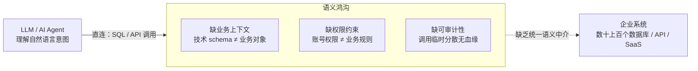

# 1. 为什么是现在：Ontology 的复兴与 AI 落地的鸿沟

## 1.1 企业 AI 落地的真实瓶颈

### 1.1.1 大模型能力过剩与企业数据"不可理解"之间的矛盾

过去两年，大语言模型（Large Language Model, LLM）的推理与生成能力快速提升，但企业侧的生产级落地并未同步加速。将推理过程拆开看，瓶颈不在模型一侧，而在模型所面对的企业系统一侧：LLM 直接对接数据库与 API 时，拿到的是表名、字段名与接口签名这类技术符号，而非业务概念。"CUST_STATUS = 3" 对模型而言只是一个枚举值，它既不知道该字段对应"客户生命周期阶段"，也不知道修改它意味着什么业务后果。由此产生三重结构性缺失：其一是业务上下文缺失，模型无法将技术 schema 映射到"客户、订单、合同"等真实世界对象，推理建立在猜测之上；其二是权限约束缺失，数据库账号的表级权限无法表达"该用户只能查看本区域客户的非敏感属性"这类业务规则，模型一旦直连数据即绕过了整个治理体系；其三是可审计性缺失，模型生成的 SQL 或 API 调用分散、临时、无统一语义入口，事后无法回答"AI 依据什么业务规则做了这个操作"。

上图所示的鸿沟解释了为什么"LLM + 数据库直连"在演示中可行、在生产中失效：演示场景的数据模型由演示者自己设计，业务语义早已内置于提示词；生产场景的语义沉淀在系统文档、IT 人员经验与历史流程中，机器无法直接消费。

### 1.1.2 数据孤岛与系统林立

鸿沟的另一侧是企业 IT 的存量现实。中型以上企业通常运行数十至上百个业务系统——ERP、CRM、MES、自研系统与各类 SaaS 并存，同一"客户"在多个系统中以不同字段、不同编码、不同更新频率存在。数据集成工具解决了"搬运"问题，却没有解决"理解"问题：数据只有 IT 懂、业务看不懂，业务人员提出的需求仍需数据工程师逐条翻译成查询。当 AI Agent 被引入这一环境时，它面对的是与业务人员相同的困境，且没有"找 IT 问一下"的退路。因此问题可以精确表述为：企业缺少一个机器可读、业务可懂、且带有权限与动作语义的中介层，而非再增加一个数据仓库或又一个聊天机器人。

## 1.2 Ontology 从学术概念到产业基础设施

### 1.2.1 Palantir 的范式定义

上述中介层在产业界已有命名。Palantir 将其 Foundry 平台中的 Ontology 定义为"组织的运营层（operational layer）"：位于已接入平台的数字资产之上，将数据集、虚拟表与模型映射到现实世界的对应物，多数场景下即"组织的数字孪生"；其构成同时包含语义元素（objects、properties、links）与动力元素（actions、functions、dynamic security）[^1^]。这一定义的关键之处在于把 Ontology 从传统的"知识建模"扩展为"运营建模"：语义元素回答"企业里有什么、它们如何关联"，动力元素回答"谁被允许对它们做什么、动作如何执行与审计"。Palantir 官方进一步将本体定位为"代表企业中的决策而非仅仅是数据"，每个运营决策由数据、逻辑、动作、安全四个要素构成[^7^]。在 AI 侧，其 AIP（Artificial Intelligence Platform）让 LLM 驱动的函数直接以本体数据为后盾，可编辑本体、包装为受治理的动作，并复用平台同一安全模型约束 LLM 的访问范围[^9^]——即 1.1 节所述的上下文、权限、可审计三重缺失，在同一层语义基础设施内被系统性补齐。

### 1.2.2 产业跟进与趋势确认

微软的跟进印证了这一方向的普适性。Fabric IQ（截至预览版）在 Fabric 数据平台中引入本体项，覆盖对象类型（实体）、关系、属性、规则与动作，可由 Power BI 语义模型一键生成本体，并配 Operations Agent 在实时数据上"采取受治理的行动"[^12^]。两家路线不同的厂商在同一时间点把"本体层"推入各自的数据栈，说明该层正从单一厂商的产品差异化演变为下一代企业数据栈的标准组件。与此同时，Palantir 方案封闭昂贵、Fabric IQ 处于预览且绑定微软生态，面向更广泛企业（尤其是需要私有化部署与存量系统低成本改造的中文企业市场）的通用 Ontology 平台仍是一个开放的窗口——这是"现在"的第二层含义。

## 1.3 本文档目标与读者

### 1.3.1 文档范围与结构

本文档定义一个通用 Ontology 平台的产品形态、元模型、技术架构与落地路径，同时覆盖两类需求："数据建模"（新业务从零建立本体）与"现有系统改造"（将存量数据库与应用低成本映射纳入本体）。全文共十二章：第 2 章给出产品定位与核心价值，第 3 章扫描竞品格局与市场空白，第 4 章定义元模型（语义、动力、治理三类元素），第 5 章给出总体技术架构，第 6 至 9 章展开四个子系统（建模工作台 Studio、连接与映射引擎 Connect、本体运行时 Runtime、Agent 层），第 10 至 12 章讨论 MVP 路线图与演进、风险应对与结语。目标读者为创始人及产品与技术决策者，阅读后应能独立判断平台的能力边界、关键技术取舍与落地节奏。
