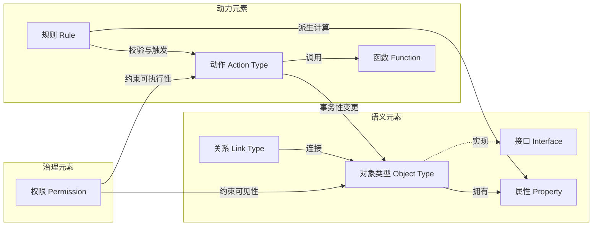

# 4. 元模型设计：平台的灵魂

第 2 章确立了"通用 = 元模型通用 + 模板垂直"的产品定位，第 3 章进一步给出元模型必须原生内建的能力清单（通用本体建模、存量系统映射、Action 写回、Agent 原生消费），本章回答随之而来的核心设计问题：元模型（meta-model，即定义模型本身的模型）应当包含哪些概念，才能用最少、最稳定的一组构件承载任意行业的运营语义。设计结论先行：平台只内建七个元概念——**对象类型、属性、关系、接口、动作、函数、权限**，一切行业语义（客户、订单、设备、工单、理赔）都是这七个元概念的实例化，行业差异沉淀在模板层而非内核层。

分类框架参照 Palantir 官方对本体的二分法——语义元素（objects、properties、links）与动力元素（actions、functions、dynamic security）[^1^]，但作一处结构性调整：将安全与权限从动力元素中抽出，单列为**治理元素**。理由有二：其一，权限的约束对象不仅是动态行为，还包括静态数据的可见性，归入"动力"在概念上不闭合；其二，治理独立成维度，才能在架构上落实"Agent 与人类走同一权限通道"。下表给出七个元概念的全景定义，后续小节逐个展开设计决策。

**表 4-1 七个元概念定义表**

| 元概念 | 定义 | 类比（工程师心智模型） | 示例 |
| --- | --- | --- | --- |
| 对象类型（Object Type） | 业务实体或事件的模式定义，单个实例为对象 | 数据库表的 schema；数据集 | "客户""订单""设备告警事件" |
| 属性（Property） | 对象类型上的字段，带类型、单位、约束与敏感级别 | 数据集的列 | 客户.信用额度（decimal，≥0，敏感级=机密） |
| 关系（Link Type） | 对象类型之间带基数、方向与语义化命名的连接 | 外键 + 图边 | 客户—"下单"→订单（1:N） |
| 接口（Interface） | 描述对象类型形状与能力的多态抽象 | 面向对象编程中的接口 | "可赔付对象"：保单、工单均可实现 |
| 动作（Action Type） | 对对象/属性/关系的一组事务性变更，含参数、校验与副作用 | 存储过程 + 表单提交 | "批准理赔"（金额参数、限额校验、写回） |
| 函数（Function） | 读写本体的服务端代码逻辑 | 服务端函数 / UDF | 计算客户终身价值（遍历订单关系聚合） |
| 权限（Permission） | schema 资源层与数据层两层授权，粒度可达具体属性值 | RBAC + 行级/列级安全 | 华东区销售仅可见华东客户及其非敏感属性 |

这张表承载两个关键取舍。第一，**为什么是七个而不是更多**：每增加一个元概念，内核的存储、API、权限校验、Agent 工具协议都要同步扩展，边际成本极高；而七概念已覆盖"描述世界（对象/属性/关系）—抽象复用（接口）—改变世界（动作/函数）—约束改变（权限）"的完整闭环；规则不占用元概念名额，而是编译为动作的校验项与函数（见 4.2.3），避免内核执行体膨胀。与学术本体语言（OWL/RDF）相比，本设计主动放弃逻辑完备性，换取工程可实现性——"类比"一列并非修辞，而是设计意图：每个元概念都复用工程师已有的心智模型。第二，**与知识图谱的分野**：国内外知识图谱产品的概念体系通常止步于"实体—关系"两个概念，缺少动作、函数与规则三类动力元素，只能回答"世界是什么"而不能表达"对世界做什么"。动作层进入元模型内核，正是本平台与知识图谱划清界限的命门。

## 4.1 语义元素

### 4.1.1 对象类型（Object Type）

对象类型是现实世界中实体或事件的模式定义；其单个实例称为对象，实例集合称为对象集。与数据集存在严格的结构对应：Dataset→Object Type、Row→Object、Column→Property、Join→Link Type[^2^]。这一对应关系在平台上的价值在于：存量关系型系统中的表结构可以近乎机械地映射为对象类型草稿，为第 7 章 Connect 的自动化映射提供了形式化基础。

设计决策之一：对象类型同时覆盖"实体"（客户、设备）与"事件"（告警、交易流水），不拆分为两个元概念。拆分虽能让事件携带不可变性等专属语义，但关系、动作、权限的定义都要为两类概念各写一遍，内核复杂度近似翻倍；而两类实例的差异可由属性表达——事件对象带时间戳属性且动作集通常为空（只读）——统一不损失表达力。

### 4.1.2 属性（Property）

属性是对象类型上的字段，其定义包含四要素：类型系统（原始类型、枚举、对另一对象的引用、时序序列）、单位（金额币种、物理量纲）、约束（取值范围、必填、格式）、敏感级别标记。其中敏感级别是治理挂钩而非装饰：4.3 节的权限模型在数据层可精确到具体属性值[^5^]，敏感级别因此必须落在属性定义本身而非散落在独立策略文件中，否则权限引擎在运行时无法稳定定位其判定依据。这一"约束内生于模式"的原则同样适用于单位与取值约束，它们是 Runtime 校验与 Agent 生成可靠查询的共同依据。

### 4.1.3 关系（Link Type）

关系描述对象类型之间的连接，定义包含基数（1:1、1:N、M:N）、方向与双向语义化命名——例如"客户—下单→订单"的反向命名为"订单—属于→客户"。语义化命名是一个容易被低估的设计点：它使图遍历路径可以被直接翻译为自然语言（"找出该客户近 90 天**下单**的订单"），这是第 9 章 Agent 将用户意图编译为遍历查询时无需额外词汇表的前提。取舍方面，平台允许关系携带轻量属性（如下单时间），但在模板规范中明确克制使用——关系属性的滥用会滑向 RDF 具体化（reification）的复杂度，使遍历语义与权限判定的实现成本陡增。

### 4.1.4 接口（Interface）

接口是描述对象类型形状与能力的本体类型，为多态提供机制[^1^]。候选方案有三：将公共属性复制到各对象类型（schema 随类型数量线性膨胀，公共逻辑无法复用）、单继承（一个对象类型常同时属于多个分类维度，单继承无法表达）、接口式多态。选择接口的依据不仅是表达力，更在于它是**模板复用的载体**：行业模板以接口为单位交付（定义"可赔付对象"应有的属性、关系与可用动作），企业将自己的保单、工单等对象类型声明为实现该接口，模板中的函数、规则与动作即刻生效，无需逐类型改造。

## 4.2 动力元素

### 4.2.1 动作（Action Type）

动作的官方参照定义是：用户对对象、属性值、关系（links）所做的一组变更的定义，构成单个事务；包含提交时的副作用（通知、webhook）、参数、规则与提交校验，编辑写入 writeback 数据集[^3^]。本平台的元模型继承该定义，并追加一条强约束：**Action 是对本体数据的唯一写路径**。所有修改——无论来自人工界面、外部 API 还是 Agent——都必须经由某个已定义的 Action 提交。这条约束是平台治理能力的总开关：权限校验、审计日志、决策血缘（见 4.4）全部挂在 Action 这一单一锚点上，任何一个写操作都无法绕开治理面。第 3 章调研显示，原生支持 Action 写回的本体产品在业界屈指可数，动作引擎因此被列为平台三大自研差异化模块之一。

### 4.2.2 函数（Function）

函数是运行在服务端隔离环境中、以本体为一等公民的代码逻辑，可直接读取属性、遍历关系、编辑本体，实现语言为 TypeScript 与 Python[^4^]。在元模型中，函数承担"逻辑复用单位"的角色：派生计算、复杂校验、跨对象聚合都以函数实现，再被动作、规则或其他函数调用。函数与动作能力上有重叠（都能改变本体），但语义定位不同，二者不可合并，对比如下。

**表 4-2 动作（Action）与函数（Function）对比**

| 维度 | 动作（Action Type） | 函数（Function） |
| --- | --- | --- |
| 定位 | 声明式的变更意图，治理锚点 | 命令式的计算逻辑，复用单位 |
| 触发方式 | 用户表单、外部 API、Agent 直接提交 | 被动作、规则或其他函数调用 |
| 事务性 | 单事务原子提交，失败整体回滚 | 无独立事务，读写即时生效于调用上下文 |
| 副作用 | 内建通知、webhook 等提交后副作用 | 无内建副作用机制 |
| 权限语义 | 独立授权对象（"谁可执行此动作"） | 继承调用者权限，不单独授权 |
| 返回值 | 无（语义上是命令，非查询） | 有（对象、标量、聚合结果） |
| 典型实现 | 参数化配置 + 校验规则，可零代码定义 | TypeScript/Python 沙箱代码 |

对比揭示了两者的分工逻辑：动作回答"允许谁在什么条件下对世界做什么改变"，函数回答"如何计算"。若允许函数作为独立写路径，审计链会在函数内部断裂——平台无法回答"这次变更对应哪个业务意图"。因此平台规定：函数内的本体编辑必须以某个 Action 的名义提交才能持久化，与业界"逻辑函数可包装为 Action Type 执行"的成熟做法一致[^9^]。反向组合同样常见：动作把复杂校验委托给函数，声明式外壳包裹命令式内核。这一分工直接决定了 Runtime 的模块边界——动作引擎管事务与治理，函数沙箱管计算。

### 4.2.3 规则（Rule）

规则覆盖三类语义：约束（数据进入本体前必须满足的条件）、派生属性（由其他数据计算而来，如"客户等级 = f(年消费额)"）、自动化触发条件（对象满足条件时自动执行某动作）。设计决策是：规则不引入独立运行时引擎，而是编译为已有构件——约束编译为动作提交时的校验项，派生属性编译为函数，自动化规则编译为事件监听加动作调用。这一取舍使内核只维护动作引擎与函数沙箱两个执行体，降低行为语义分裂的风险；代价是复杂规则编排的表达力受限，留待流程编排层补足。

## 4.3 治理元素

### 4.3.1 两层权限模型

权限模型采用两层结构：本体资源层管控对象类型、关系类型、动作类型等 schema 资源的可见与可管理性；数据层管控对象与关系实例本身，粒度可达具体属性值[^5^]。在此基础上平台将执行粒度细化为对象、属性、动作三级，并坚持一条架构原则：**Agent 与普通应用走同一权限通道**。Agent 调用工具时继承其代表用户的权限上下文，安全控制只授予完成任务所必需的访问权限——该模式已被 Palantir 官方作为约束 LLM 的核心机制公开确认[^11^]。这一原则旨在消除"AI 旁路"：若 Agent 拥有独立的高权限通道，整个权限模型在 AI 场景下形同虚设；统一通道使"AI 只能做你被授权做的事"成为系统性质而非产品承诺。

### 4.3.2 版本管理与 Ontology-as-Code

本体定义以 YAML 为单一事实源（single source of truth），纳入 Git 管理，支持 diff、回滚与 CI 校验，统称 Ontology-as-Code。候选方案有三：UI 优先（代码仅作导出存档）、代码优先（放弃图形建模）、双写同步（UI 与代码均可编辑）。选择"YAML 为源、UI 生成与修改 YAML"的折中形态：UI 降低建模门槛，但每次保存即提交 YAML 变更，规避双写方案的状态一致性问题。该决策构成对标杆产品的直接差异化——Palantir 的平台 API 对本体的 Object/Action/Link 定义仅支持 GET/LIST 读取，创建仍需经由 UI（Ontology Manager）完成[^10^]，其本体定义难以纳入标准软件工程流程。Ontology-as-Code 同时为 AI 辅助建模提供落点：LLM 生成的本体草稿本质就是一份待评审的 YAML 变更，可直接进入 diff 评审与 CI 校验。

## 4.4 决策四要素框架

元模型的七个概念不是一份平铺的功能清单，而是恰好构成一个运营决策的最小完备集。Palantir 官方将本体定位为"代表企业中的**决策**而非仅仅是数据"：每个运营决策由四要素构成——Data、Logic、Action、Security，并支持决策血缘（decision lineage）的自动捕获[^7^]。四要素与元概念的映射是直接的：Data 对应对象、属性与关系（决策依据），Logic 对应函数与规则（决策推理），Action 对应动作（决策执行），Security 对应两层权限（决策的合法性边界）。

这一框架使 4.2.1 的"唯一写路径"约束获得完整回报：每次变更都经由 Action 提交，平台即可在执行点自动捕获"谁在什么权限下、依据哪些数据、经过什么逻辑、执行了什么动作"，决策血缘无需事后埋点。审计合规、决策回放与人机协同的责任划分因此成为元模型的派生能力而非附加模块；本章定义的七个元概念也由此构成后续 Studio、Connect、Runtime、Agent 各层共同的数据契约——各层只操作这七个元概念，层间不再有私有语义。
