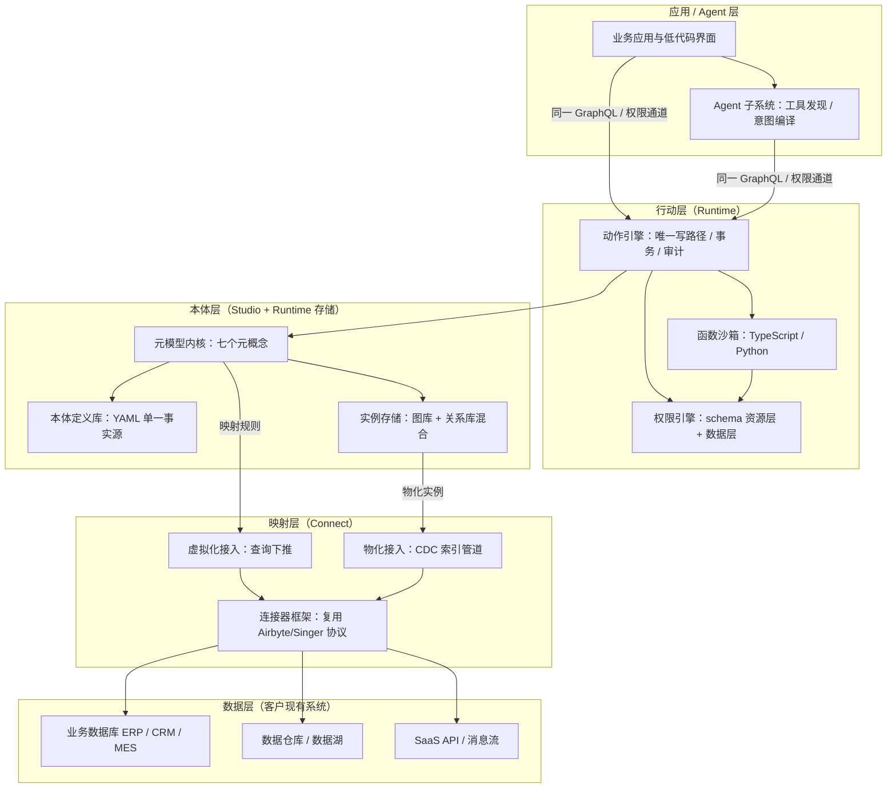

# 5. 总体技术架构

第 4 章定义的七个元概念是平台的静态契约，本章回答其动态承载问题：这七个元概念落在怎样的分层结构上运行，存储、接入、API、部署四个横切面上各有哪些不可逆的技术选型。设计结论先行：平台采用"数据层—映射层—本体层—行动层—应用/Agent 层"五层架构，以开源组件承担通用能力（连接器、图存储、API 生成、指标语义），自研集中在元模型内核、AI 辅助建模与动作引擎三个差异化模块；该边界划分同时构成第 6–9 章 Studio、Connect、Runtime、Agent 四个子系统的模块切分依据。

## 5.1 五层架构总览

分层的第一原则是**数据可以不搬家**。客户现有业务系统（ERP、CRM、MES、数据仓库）保留原位，平台通过映射层将其表结构映射为对象类型，语义在本体层汇聚为第 4 章的七元概念实例，行动层承接动作（Action）与函数（Function）的执行并写回源系统，最上层由人类应用与 Agent 经同一 API 与权限通道消费本体。各层职责与所属子系统的对应关系如下。

图中有三条结构性约束需要说明。其一，**读路径分岔、写路径收敛**：读查询既可走物化索引（低延迟遍历）也可下推至源系统（数据不出域），但所有写操作必须经由行动层的动作引擎提交——这是第 4 章"Action 是唯一写路径"约束在架构层的落实，权限引擎与审计日志因此只需挂在动作引擎一个锚点上。其二，**本体定义与实例分离**：本体定义库以 YAML 文件为单一事实源（Ontology-as-Code），实例存储是可重建的派生物，二者变更节奏与容灾等级完全不同，合库会把 schema 迁移与数据迁移耦合为高风险操作。其三，**Agent 无专用旁路**：应用与 Agent 共享同一 API 入口与权限通道，Agent 子系统的独特性仅体现在意图编译与工具发现，不体现在任何数据访问特权上。

## 5.2 关键设计决策

下表汇总四个对后续子系统设计有约束力的选型决策，均按"候选选项—选择—理由"展开。

**表 5-1 关键设计决策表**

| 决策 | 候选选项 | 选择 | 理由 |
| --- | --- | --- | --- |
| 实例存储 | 纯图库；纯关系库；图库与关系库混合 | 混合：NebulaGraph 存关系与遍历，关系库存属性与事务 | 关系遍历（多跳路径查询）在关系库上需递归 JOIN，性能随跳数指数衰减；而属性的等值/范围过滤与聚合在关系库上成熟稳定。NebulaGraph 为国产开源分布式图库，契合信创要求 |
| 本体定义与实例存储 | 同库管理；分离管理 | 分离：定义入 YAML/Git，实例入存储引擎 | 定义变更走代码评审与 CI（Ontology-as-Code），实例是定义经接入管道生成的派生物，可重建、可独立扩缩容；合库会使 schema 迁移锁死数据服务 |
| 数据接入模式 | 全物化（数据一律迁入索引）；全虚拟化（一律查询下推）；按对象类型双模可选 | 双模：虚拟化为默认，物化用于热路径 | 虚拟化（OBDA 范式，R2RML 映射与联邦查询下推）保证数据不出域、无同步滞后[^14^]；但高频遍历与全文检索场景下虚拟化延迟不可控，需物化索引兜底，参考 Palantir 以批/流两类管道将数据索引进对象存储的机制[^6^] |
| 读 API 形态 | 手写 REST；由本体自动生成 GraphQL；暴露 SQL | 自动生成 GraphQL | Hasura/PostGraphile 已验证"由 schema 即时生成含权限与订阅的 GraphQL"的工程可行性[^20^]；本体即 schema，手写 API 意味着每新增对象类型都要重复开发，与"通用"定位矛盾 |
| 通用能力自研边界 | 全自研；全集成开源；分层取舍 | 连接器复用 Airbyte/Singer 协议，指标语义借鉴 MetricFlow，自研聚焦三模块 | Airbyte 生态已有 600+ 连接器与开源 CDK[^19^]，自研连接器是无差异化的重复投入；MetricFlow（Apache 2.0）的 YAML/Git 化指标定义可直接复用为指标属性的语义规范[^13^]；自研集中于元模型内核、AI 辅助建模、动作引擎三个市场空白点 |

表 5-1 的五项决策之间存在内在一致性：它们共同执行"自研预算向差异化模块集中"的资源策略。存储与接入选择成熟开源组件，是因为这两层的优劣取决于工程成熟度而非概念创新，后发者无法在图遍历性能上追赶成熟图库的十年积累；而动作引擎、AI 建模无人可抄，必须自研。双模接入是其中唯一增加内核复杂度的决策——映射层需为每个对象类型维护"虚拟/物化"标志并保证两路径的查询语义一致——但这是"数据不搬家"承诺的必要成本：纯物化路线（Palantir 模式）要求客户先迁数据再建本体，在数据合规敏感的国内政企市场构成准入门槛[^6^]；纯虚拟化则无法支撑 Agent 高频遍历的延迟要求。GraphQL 自动生成与权限引擎存在一处联动：API 层生成的每个字段解析器都需嵌入权限判定，第 8 章将展开这一"权限内生于 API"的实现。

## 5.3 部署形态

平台提供两种部署形态。**SaaS 多租户**面向中小客户：本体定义库按租户隔离，实例存储按租户分片，动作引擎与函数沙箱按租户配额限流；虚拟化接入在此形态下要求客户源系统开放只读账户或部署就地代理（on-premise agent）反向回连，避免客户数据库暴露公网。**私有化部署**面向政企与合规敏感客户，提供单机（POC 与小规模）与集群两种规格：图库、关系库、消息队列均以容器化交付，支持离线安装。

私有化形态需完成信创适配：操作系统兼容麒麟、统信，CPU 兼容鲲鹏、海光，数据库适配层允许以国产关系库（openGauss、达梦）替代默认关系库，图库本身即为国产开源组件。信创适配不是简单的兼容性测试，而是对 5.2 选型的反向约束——关系库存储层必须将 SQL 方言差异收敛在适配层内部，本体层及以上不得感知底层数据库品牌，否则每次适配都会向上层泄漏为开发成本。两种形态共享同一镜像仓库与配置体系，功能差异仅以许可证（license）开关控制，避免出现"SaaS 版与私有版功能分叉"的维护陷阱。
