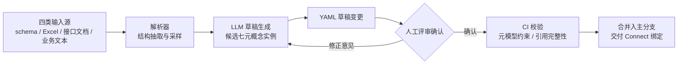

# 6. 子系统一：建模工作台 Studio

第 5 章将平台切分为 Studio、Connect、Runtime、Agent 四个子系统，其中 Studio 是建模态的统一入口，负责产出第 4 章定义的七元概念模型；其产出的本体草稿交由第 7 章 Connect 完成与存量系统的映射绑定。Studio 要回答的设计问题只有一个：如何同时服务两类画像迥异的用户——习惯图形操作的业务建模者，与习惯代码与 Git 的工程团队——并把建模这一本体落地中人力最密集的环节压缩一个数量级。本章给出四个相互咬合的设计：可视化建模降低门槛，AI 建模助手承担初稿生产，模板市场沉淀复用，Ontology-as-Code 提供工程化交付通道。

## 6.1 可视化建模体验

建模画布支持以拖拽方式定义对象类型、属性、关系与接口实现关系，并在侧栏以图谱形式实时渲染：用样例实例数据把"客户—下单→订单（1:N）"这类抽象定义可视化为具体的对象与边。这一预览并非装饰——基数错误与语义化命名缺失是建模期最高频的两类缺陷，唯有让建模者"看见"实例级效果，才能在进入 Connect 绑定之前暴露它们。

多人协作参照 WebProtégé 的成熟模式：该编辑器已验证并发编辑、变更评论与版本历史三件套对本体建模场景的适用性[^23^]。锁粒度上存在两个候选方案：模型级全局锁（实现简单，但两人修改不同对象类型也要串行排队）与对象类型级乐观锁（并发度高，需处理跨类型引用冲突）。平台选择后者：对象类型是天然的协作边界，跨类型冲突（如一方删除被另一方引用的关系）由保存时的引用完整性校验拦截，而非由锁预防。需要明确的是，UI 内的版本历史不是独立存储，而是 6.4 节 Git 提交流的投影——版本事实只有一个来源，避免 UI 历史与代码历史分裂为两套真相。

## 6.2 AI 建模助手：核心差异化

建模成本是本体平台普及的首要障碍。标杆厂商的落地模式依赖高价的前线部署工程师（Forward Deployed Engineer，FDE）驻场实施，且其平台 API 对本体的对象、动作、关系定义仅提供 GET/LIST 只读访问，创建必须经由 UI 完成[^10^]——这意味着建模环节在技术上就无法被自动化，只能以人月计价。Studio 的设计反其道而行：以大语言模型（Large Language Model，LLM）承担本体初稿的自动生产，人只做确认与修正，目标是将单个业务域的建模周期从月级压缩到天级。

助手接受四路异构输入，各路解析策略与人工介入点不同，汇总如下。

**表 6-1 AI 建模助手的输入类型、生成产物与人工确认点**

| 输入类型 | 解析策略 | 生成产物 | 人工确认点 |
| --- | --- | --- | --- |
| 数据库 schema（DDL/信息模式） | 表→对象类型、列→属性、外键→关系的机械映射 | 对象类型、属性、关系草稿 | 基数（1:1/1:N/M:N）判定、关系的双向语义化命名、属性敏感级别标注 |
| Excel/CSV 样例数据 | 列采样推断类型、枚举值与单位 | 属性定义（类型、枚举、约束） | 类型推断纠错、主键属性选择、单位与取值约束 |
| 接口文档（OpenAPI 等） | 端点语义归类为读写意图 | 动作草稿（参数、校验规则） | 事务边界划分、副作用（通知/webhook）确认、写路径合法性 |
| 业务描述文本 | LLM 抽取候选概念并归并 | 候选对象类型、接口、关系命名 | 同义概念去重归并、术语与企业词表对齐 |

四路输入覆盖的自动化程度存在明显梯度。数据库 schema 一路确定性最高：第 4 章已确立数据集到本体的严格结构对应（见 4.1.1），映射近乎机械，LLM 仅用于命名语义化与基数推断；这一路的工程先驱是阿里云 DataWorks 的逆向建模——从存量物理表反向生成模型[^17^]，区别在于其产出止步于数仓表模型，而本平台继续生成关系、接口与动作语义。业务描述文本一路确定性最低，LLM 产出的候选概念必然包含冗余与歧义，因此人工确认点也最重。四路输入共享同一条设计底线：**助手只生成草稿，从不直接落库**——所有产出以 YAML 变更形式进入评审队列，确认权始终在人。

这一人机分工的取舍依据是错误成本的不对称：建模期漏检的错误会在 Connect 绑定与 Runtime 运行阶段被指数级放大，而 LLM 当前的可靠性不足以独立承担 schema 决策；反之，若全程人工，则回到 FDE 模式的成本结构。"机器起草、人确认、Git 留痕"的三段式由此成为 Studio 的不可协商约束。

## 6.3 模板市场

模板复用的技术载体是接口（Interface）：如 4.1.4 所述，行业模板以接口为单位交付一类业务对象应具备的属性、关系与动作，企业将自有对象类型声明为实现该接口，模板逻辑即刻生效。Studio 内置三类种子模板——制造（基于 ISA-95 企业-控制系统集成模型的设备、工单、物料层级）、零售（会员、订单、权益）、金融风控（账户、交易、风险事件）——并提供发布、fork 与二次创作机制：企业从模板分叉出私有副本，改造后可回投市场。治理上的取舍在于开放度：全开放社区模式增长快但质量参差，纯官方认证模式质量可控但供给不足。V1 选择官方认证制，仅接受通过 CI 校验（元模型合规、含样例数据与文档）的投稿，以供给收缩换取模板可信度——模板市场的冷启动阶段，低质模板对信任的破坏大于供给不足的损失。

## 6.4 Ontology-as-Code

4.3.2 已确立"YAML 为单一事实源、UI 生成 YAML"的折中形态，本节展开其工程链路。链路是双向同步的：画布上的每次保存即生成一次 YAML 提交，反向地，工程师在 Git 仓库中手工修改 YAML 并合并后，Studio 重新加载模型并刷新画布，两条通道以仓库为唯一交汇点、不产生第二份模型副本。YAML 提交进入分支—评审—CI—合并的标准流程：CI 校验覆盖元模型约束（属性类型合法、关系两端类型存在）、权限引用完整性（权限定义指向的对象类型与动作必须存在）与模板接口契约（声明实现某接口的对象类型必须具备全部必需属性）。环境迁移由此退化为 Git 操作：开发环境向生产的发布即分支合并加差异应用，变更可 diff、可回滚、可审计。这一链路与 AI 建模助手形成闭环——LLM 草稿天然是待评审的 YAML 变更，直接复用同一套评审与 CI 通道，无需为 AI 产出单设治理流程。对照竞品，标杆平台的本体定义因 API 只读而难以纳入标准软件工程流程[^10^]，Ontology-as-Code 因此同时是工程效率特性与差异化论据：它使本体模型第一次可以被当作代码资产进行全生命周期管理。
