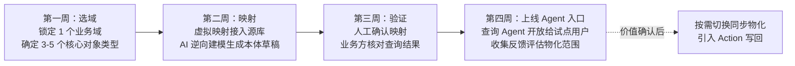

# 7. 子系统二：连接与映射引擎 Connect——改造现有系统

第 6 章 Studio 解决的是"本体如何被建模出来"，本章的 Connect 子系统回答客户落地时最先提出的问题：本体与企业已有的数十个业务系统如何对接，改造代价有多大。设计结论先行：Connect 不追求发明新的数据集成技术，而是把工程重点放在两处——复用成熟开源连接器生态解决"连得上"的问题[^19^]，自研语义映射层解决"连上之后数据以何种本体语义被消费"的问题。这一分工与第 5 章"数据接入双模"的架构决策直接衔接：虚拟化查询下推与物化 CDC 索引在 Connect 层被具体化为三种可选的映射模式，客户按系统逐一选择，而非一次性全量迁移。

## 7.1 连接器框架

连接器（Connector）是与源系统建立物理连接的插件，负责抽取 schema 元数据与数据记录。候选方案有三：全自研连接器、复用单一集成引擎、以插件接口兼容开源生态。选择第三种的依据是成本结构：Airbyte 已提供 600 余个开源连接器与连接器开发套件（CDK），Singer 则以 tap/target 协议形成了另一套可编排的事实标准[^19^]；连接器的价值在于覆盖广度而非技术深度，自研无法在长尾系统（各类国产 ERP、行业专用软件）上与生态竞争。Connect 因此定义统一的连接器插件接口，将 Airbyte/Singer 连接器封装为可插拔适配器，自研投入集中于两类生态空白：国产数据库与信创环境适配、企业 Excel/CSV 文件的语义化接入。

连接器并非均匀重要。基于目标客户系统的出现频率与试点路径的依赖关系，Connect 按三个优先级梯队规划连接器交付，如下表所示。

**表 7-1 连接器优先级清单**

| 优先级 | 连接器类别 | 典型源系统 | 纳入依据 |
| --- | --- | --- | --- |
| P0（首期必须） | 关系型数据库、Excel/CSV | MySQL、PostgreSQL、Oracle、SQL Server | 试点客户数据主体所在；虚拟映射与 AI 逆向建模的最小输入 |
| P1（二期跟进） | ERP/CRM、REST API | SAP、用友、金蝶、Salesforce | 核心业务对象（客户、订单、工单）的权威来源，决定本体覆盖面 |
| P2（按需扩展） | 消息队列、数据仓库、国产数据库 | Kafka、RocketMQ、达梦、人大金仓 | 支撑流式物化与信创交付，生态已有可复用实现[^19^] |

该优先级排序反映的是"改造现有系统"诉求下的务实次序：P0 锁定关系库与 Excel，是因为这两类承载了试点阶段可快速验证的映射链路——schema 规整、无接口谈判成本，AI 辅助映射（7.3 节）在其上的自动化程度也最高。P1 的 ERP/CRM 决定了本体能否覆盖真正的业务对象而非边缘数据，但接入往往需要客户 IT 配合开放接口，周期不可控，故列于试点验证之后。P2 中的消息队列是同步物化模式（7.2.2）的流式管道前提，国产数据库则是私有化与信创商务机会的入场券；二者生态均已有成熟实现，自研风险低，按需启用即可。清单的治理含义在于：每新增一类连接器，映射层的类型系统、CDC 适配与权限元数据抽取都要同步验证，优先级梯队实质是验证工作量的排期。

## 7.2 语义映射三模式

物理连接之上，Connect 的核心设计是语义映射：声明源系统中的表、列、外键如何对应本体的对象类型、属性、关系。第 4 章已确立数据集到本体的严格结构对应（见 4.1.1），映射因此可以被形式化表达与自动化生成。但"数据放在哪里"仍需按系统逐个决策。Connect 提供三种映射模式，对应不同的数据驻留位置与一致性保证，如下表所示。

**表 7-2 语义映射三模式对比**

| 模式 | 机制 | 适用场景 | 侵入性 | 一致性等级 |
| --- | --- | --- | --- | --- |
| 虚拟映射 | 数据留在源系统，本体作为语义视图，查询时按映射规则下推（参考 OBDA 范式[^14^]） | 快速试点、只读分析、源系统不可动的场景 | 极低：仅需只读账号 | 实时强一致（直读源端） |
| 同步物化 | CDC 捕获变更，经批/流管道同步入本体存储并建索引（参考 Object Data Funnel[^6^]） | 跨系统联合查询、图遍历计算、源库负载敏感 | 中：需开启 CDC 日志与同步管道 | 秒级至分钟级最终一致 |
| 本体原生 | 新对象直接持久化于本体存储，源系统不再持有该数据 | 新建应用、老系统渐进退役后的数据接管 | 高：新系统须以本体 API 开发 | 强一致（本体即事实源） |

三模式并非互斥选型，而是同一客户内按对象类型粒度共存的组合策略，这正是"数据可不搬家"承诺的技术形态。虚拟映射的价值在于把试点门槛压到最低——客户只需提供一个只读账号即可在数天内看到本体视图，其代价是查询性能受源系统制约且无法做图计算；Stardog 以 OBDA 范式验证了该路线的工程可行性，但其读写语义停留在图谱本身[^14^]，本平台则将虚拟映射限定为过渡形态。同步物化是跨系统价值的主战场：Palantir 的 Object Data Funnel 以分批与流式两类管道将源数据索引进对象存储[^6^]，证明 CDC 物化是支撑图遍历与低延迟查询的必经路径，代价是引入最终一致性与对账运维负担。本体原生面向增量而非存量：新建应用直接以本体 API 开发，从第一天起就享受 Action 唯一写路径与完整审计，并为老系统退役提供数据承接面。三模式的组合构成一条清晰的演进坡道——虚拟映射入场、物化扩展、原生接管，客户在任一阶段都不必推翻前一阶段的工作。

## 7.3 AI 辅助映射

映射工作的历史成本集中在人工逐表逐字段的语义判断。Connect 将该环节重构为"机器建议、人工确认"的两步流程。第一步是 Schema 自动发现：连接器抽取源库的表、列、主外键、约束与采样数据。第二步由 LLM 生成映射建议——表到对象类型、列到属性、外键到关系的对应在结构上是机械的，LLM 的增量价值在于语义消歧：依据列名、注释与采样值推断"cust_lvl"应映射为"客户.等级"枚举属性，以及两张表的外键应命名为"下单"还是"属于"。建议以 YAML 变更形式进入 Ontology-as-Code 的 diff 评审流，人工确认后生效，与第 6 章 AI 建模助手共用同一确认机制——LLM 输出永远不可直接落库，这是平台对幻觉风险的统一兜底。

逆向建模（Reverse Modeling）是 AI 辅助映射的批量形态：对存量系统整库反推，产出一套本体草稿而非逐表手工映射。此处存在明确的对标与差异化坐标：阿里云 DataWorks 的逆向建模同样从存量物理表反向生成模型，直接回应了"现有系统改造"需求，但其产出是数仓维度模型（表与指标），不含对象、关系与动作语义，产出物亦不供 Agent 消费[^17^]。Connect 的逆向建模产出七元概念实例化的本体草稿——对象类型天然携带可注册的动作、可遍历的关系与可授权的权限，从反推完成的一刻起即可被 Runtime 查询与被 Agent 消费。同一自动化技术，产出物的语义层级差异决定了改造工作的终局是"又一个数仓"还是"可行动的运营层"。

## 7.4 改造实施方法论

技术能力之外，Connect 附带一条标准化的四周试点路径，将"改造现有系统"从大型项目压缩为可验证的短周期工程。路径的不变量是：全程不动存量系统——只读接入、旁路验证，价值确认后才引入写路径。

该路径的设计取舍体现在三处。其一，首周只做"选域"不做接入——试点失败的常见原因是范围蔓延而非技术障碍，对象类型收敛到 3-5 个可使验证标准明确。其二，第二周固定使用虚拟映射而非物化，以最低侵入性换取最早的可见产出；物化决策推迟到第四周之后、由真实查询负载驱动，避免为未知需求预先承担同步运维成本。其三，第四周的交付物是 Agent 入口而非报表，试点判据是业务用户以自然语言完成了此前需要 IT 取数的问题——这直接验证本平台区别于数据中台的价值主张。四周之后，客户按 7.2 节的演进坡道自主决定各对象类型的模式升级，Connect 的使命从"接入"转入"持续映射治理"。
