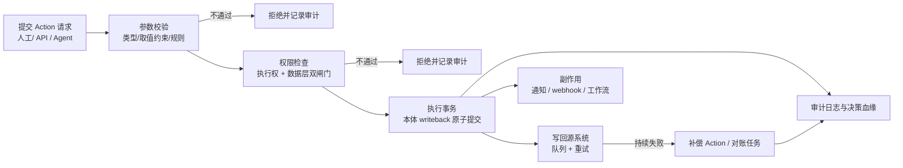

# 8. 子系统三：本体运行时 Runtime

本章回答：定义好的本体（元模型见第 4 章，建模与映射见第 6、7 章）如何被安全地查询与改变。Runtime 是本体从"静态 schema"变成"在线服务"的一层，包含查询服务、Action 引擎、权限与审计、开发者接口四个模块，设计主线只有一条：所有读写流量收敛到同一权限通道，所有写流量收敛到 Action 这一唯一写路径。

## 8.1 查询服务

### 8.1.1 由本体自动生成查询 API

查询服务的第一个决策是 API 从哪来。候选方案有三：手写 API 层（与本体演进不同步）、私有查询 DSL（无生态）、由本体 schema 自动生成标准协议 API。选择第三种：以 GraphQL 为主、REST 为辅，由对象类型、属性、关系定义直接生成对象 CRUD、图遍历与聚合接口。依据有二：GraphQL 类型系统与"对象类型—属性—关系"结构同构，嵌套选择即 N 跳遍历；Hasura、PostGraphile 等开源项目已证明"由 schema 生成 GraphQL 且内嵌行级/列级权限"成熟可行，V1 可站在该生态之上[^20^]。

权限内嵌是关键机制：行级/列级权限不由独立网关"先取回再过滤"（无权数据会短暂离开存储层，存在外溢窗口），而是编译为权限谓词随查询计划下推到存储层，成为查询本身的组成部分。取舍方面，深层遍历与聚合混合查询易退化为 N+1 问题，平台默认限制遍历深度（3 跳），更深的分析导向函数（Function）在服务端沙箱内完成。

## 8.2 Action 引擎：与知识图谱划清界限的命门

### 8.2.1 执行链路设计

第 3 章调研显示，原生支持 Action 写回的本体产品屈指可数，知识图谱厂商集体止步于"图谱构建—分析—问答"，Action 引擎因此是 Runtime 的一等公民。第 4 章已定其语义：对对象、属性、关系的一组事务性变更，含参数、提交校验与副作用，写入 writeback 数据集[^3^]，且是唯一写路径。其完整执行链路如下。

链路前两环是治理闸门：参数校验依据参数类型、取值约束与由规则编译的校验项，在进入事务前拒绝非法输入；权限检查为双闸门——先查执行者是否有该动作类型（Action Type）的执行权，再查变更涉及的对象与属性实例是否在数据层对其可见可改[^5^]，拥有"批准理赔"执行权不等于可批准任意保单。执行环节将变更原子写入本体 writeback 层；副作用异步派发，不阻塞主事务；每个环节——包括两次拒绝——都写入审计日志，审计链在失败路径上同样不断裂。

### 8.2.2 事务与补偿

写回源系统是跨系统分布式写入，存量系统普遍不支持两阶段提交，全局原子性不可得。排除强一致分布式事务（源系统不支持）与异步双写（不一致窗口不可控）后，平台选择"本体单事务原子提交 + 写回队列 + 补偿与对账"：写回失败先重试，持续失败则以另一个普通 Action 的名义提交反向变更作为补偿——"撤销"同样经过权限检查与审计，是受治理操作而非后台暗箱；周期对账任务再比对 writeback 记录与源系统状态，捕获遗漏的漂移。代价是源系统存在最终一致窗口，模板规范要求相关 Action 显式声明该窗口。

## 8.3 权限与审计

### 8.3.1 三级粒度与同一权限通道

两层权限模型[^5^]在 Runtime 落地为对象、属性、Action 三级执行粒度，由单一策略执行点（Policy Enforcement Point，PEP）统一判定：所有模块与开发者接口调用同一判定服务，权限上下文随请求贯穿链路，不存在模块级旁路。Agent 与人类用户走同一权限通道——Agent 调用工具时继承其代表用户的权限上下文，该机制已被 Palantir 官方确认为约束大模型的核心机制[^11^]。"AI 只能做你被授权做的事"由此成为系统性质：即便 Agent 构造出越权意图，也会在 PEP 被以与人类越权完全相同的方式拒绝。

### 8.3.2 全量审计与决策血缘

审计日志按第 4 章决策四要素框架组织：谁在什么权限下、依据哪些数据、经过什么逻辑、执行了什么动作。唯一写路径约束使血缘在执行点自动捕获，无需事后埋点；审计流作为只读对象类型暴露，访问需独立审计角色。

## 8.4 开发者接口

### 8.4.1 多语言 SDK 与 MCP Server

开发者接口对标 Palantir OSDK：由本体定义代码生成类型安全的 TypeScript/Python/Java 客户端绑定，本体变更后重新生成，编译器即可暴露调用方的不兼容[^10^]。鉴权借鉴其"token 限定可访问的本体资源、叠加用户权限"模式并作强化：token 声明可触及的对象类型与 Action 集合，运行时有效权限 = token 声明范围 ∩ 终端用户权限——取交集而非并集，应用无法借 token 放大终端用户权限。MCP Server 将对象查询、Action 与函数包装为模型上下文协议（Model Context Protocol，MCP）工具供外部 Agent 消费本体；每个工具调用在内部被翻译为普通查询或 Action 提交、经过同一 PEP，这是第 9 章 Agent 层的消费面。

**表 8-1 Runtime 对外接口清单**

| 接口 | 协议/形式 | 主要消费者 | 权限约束 |
| --- | --- | --- | --- |
| GraphQL 查询 API | GraphQL over HTTPS，由本体自动生成 | 前端应用、BI 工具、脚本 | 行级/列级谓词下推至查询计划 |
| REST API | RESTful 资源端点（CRUD 子集） | 传统系统集成方 | 与 GraphQL 同策略，按资源映射 |
| Action 提交端点 | GraphQL mutation / REST POST | 业务界面、外部系统、Agent | 执行权 + 数据层双闸门 |
| 函数沙箱调用 | 内部 RPC，经 Action/规则间接触达 | 平台内部模块 | 继承调用者权限，无独立授权 |
| 多语言 SDK | TS/Python/Java 代码生成客户端 | 应用开发者 | token 声明范围 ∩ 用户权限 |
| MCP Server | MCP 标准工具协议 | 外部 AI Agent | 继承代表用户的权限上下文 |
| 审计与血缘接口 | 只读 API + 批量导出 | 合规与审计团队 | 独立审计角色，与业务权限隔离 |

这张表暴露两条结构性规律。第一，接口虽多，写路径唯一：七个接口中仅 Action 提交端点能直接改变本体，其余要么只读，要么（函数沙箱、MCP）被翻译为 Action 提交——治理面只需守住一个入口，审计链无绕行可能。第二，权限约束全部收敛为"继承用户权限"与"范围取交集"两种形态，没有接口拥有独立高权限通道。由此获得可扩展性：新增接口只需实现"翻译为内部请求并携带权限上下文"一个契约，PEP 单点判定把新增消费面的安全成本降为零，为第 9 章 Agent 层预留了通道。
