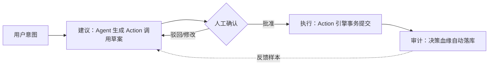

# 9. 子系统四：Agent 层——本体之上的 AI

第 1 章指出企业 AI 落地的瓶颈不在模型一侧，而在语义、权限与审计缺失的中介层；第 4 至 8 章构建的元模型、Studio、Connect 与 Runtime 已将该中介层落成引擎本体。随之而来的问题是：AI 在这座引擎之上以何种形态工作？本章的回答是**引擎为体，Agent 为用**——Agent 层不是一个新的子系统内核，而是 Runtime 能力的一类特殊消费者，它与人工用户、外部应用一样，只能通过第 8 章的查询 API、Action 引擎与同一权限通道访问本体。这一定位是刻意的架构克制：Agent 不拥有任何旁路能力，其全部可靠性来自下层引擎而非自身，这恰是"受治理的 AI"得以成立的结构性前提。

## 9.1 三类 Agent 角色

Agent 层按"对本体做什么"划分为三类角色，分别消费元模型的不同侧面，对应平台生命周期的三个阶段——建模期、使用期、运营期。

### 9.1.1 建模 Agent

建模 Agent 的输入是源系统 schema、数据字典与业务文档，输出是本体草稿与映射建议——对象类型、属性、关系的候选定义，以及它们与源表字段的对应关系。其可行性有形式化基础：第 4 章确立的数据集—本体结构对应（见 4.1.1），使 schema 到本体草稿的翻译接近机械映射，LLM 只需承担语义命名、关系推断与歧义消解等真正需要语言理解的部分。产出物是 Ontology-as-Code 框架下的 YAML 变更（见 4.3.2），天然进入 diff 评审与 CI 校验，因此建模 Agent 的人工确认点设在"草稿合并前"，而非事后审计。

### 9.1.2 查询 Agent

查询 Agent 将自然语言问数编译为本体约束下的图查询。与普通 Text-to-SQL 的本质区别在于编译目标的语义化：关系的双向语义化命名（见 4.1.3）使"该客户近 90 天下单的订单"可以直接翻译为遍历路径，无需额外词汇表；属性上的类型、单位与取值约束则为生成结果提供校验依据。生成的查询经第 8 章查询 API 在调用用户权限内执行——Agent 继承其代表用户的权限上下文，越权数据在引擎层即被过滤，而非依赖提示词约束。

### 9.1.3 行动 Agent

行动 Agent 把自然语言意图（"批准这笔理赔"）编译为对某个 Action Type 的参数化调用，是三类角色中治理要求最高的一类。参照机制来自 Palantir AIP Logic：LLM 函数以本体对象为输入，通过可配置的 Apply Action 工具编辑本体，执行可以自动化完成，也可以暂存（stage）等待人工审核[^9^]。本平台继承这一机制并叠加第 4 章的"唯一写路径"约束：行动 Agent 只能提交已定义的 Action，事务校验、权限判定与副作用全部复用 Action 引擎，Agent 自身不实现任何写入逻辑。

**表 9-1 三类 Agent 角色对比**

| 维度 | 建模 Agent | 查询 Agent | 行动 Agent |
| --- | --- | --- | --- |
| 输入 | 源系统 schema、数据字典、业务文档 | 自然语言问题 | 自然语言操作意图 |
| 核心能力 | 生成本体草稿与字段映射建议 | 生成权限内的图遍历查询 | 生成参数化 Action 调用 |
| 依赖模块 | Connect 连接器、Ontology-as-Code（Git/CI） | Runtime 查询 API、语义化关系命名、属性约束 | Runtime Action 引擎、两层权限模型 |
| 写入面 | 仅产出 YAML 草稿，不触碰实例数据 | 只读 | 经 Action 事务写回 |
| 人工确认点 | 草稿合并前 diff 评审 | 通常无需；敏感查询按策略提示 | 默认暂存确认，白名单内可自动化 |

三类角色的治理强度呈明显梯度：建模 Agent 只影响 schema 且产出可被 Git 流程完全拦截，风险最低；查询 Agent 触及数据但只读，风险由权限通道收敛；行动 Agent 直接改变业务状态，必须默认经过人工确认，仅对低风险、可逆的 Action 开放自动化白名单。这一梯度设计的启示在于：Agent 的自动化程度不应由模型能力决定，而应由其写入面的可逆性与影响半径决定——平台的职责是让"暂存—确认"路径足够低成本，使默认谨慎不损害体验。三者在依赖模块上的分工也再次验证了元模型的完备性：七元概念恰好覆盖三类 Agent 所需的全部工具面，Agent 层无需引入任何私有语义。

## 9.2 Agent 可靠性的本体根基

LLM 直接对接数据库的可靠性缺陷——幻觉字段、口径漂移、越权访问——其根源是缺少一个机器可读的业务语义与治理层。本体恰好从四个方向补齐这一缺口。其一，**实体消歧**：对象类型与关系为"客户""订单"等词提供唯一指称，LLM 不再需要在数十张同义词表之间猜测。其二，**可用工具清单**：Action 与 Function 的注册表构成 Agent 的封闭工具集，模型只能"选择并填参"，无法发明平台不存在的操作。其三，**权限边界**：AIP 复用治理整个平台的同一安全模型来约束 LLM，只授予完成任务所必需的访问权限——这是 Palantir 官方确认的机制[^9^][^11^]；本平台以"Agent 与普通应用走同一权限通道"（见 4.3.1）实现同等约束，越权在引擎层被拒绝而非在提示词层被劝告。其四，**审计轨迹**：唯一写路径使每次 Agent 发起的变更都落在 Action 提交点上，天然可追溯。

这一"语义层提升 Agent 可靠性"的判断有独立证据：dbt 官方基准测试显示，Agent 经由语义层消费数据的回答准确率接近 100%[^13^]。需要说明的是，dbt 语义层仅覆盖只读指标语义，不包含对象关系模型与写路径；本平台的本体是更厚的语义层，其可靠性收益理应覆盖查询之外的行动场景，但行动场景的量化收益目前缺乏公开基准，此判断置信度中等。

## 9.3 人机协同决策闭环

行动 Agent 的默认形态不是自主执行，而是嵌入一个四步人机协同闭环：**建议—确认—执行—审计**。

四步的分工是：Agent 负责"建议"，将意图编译为带参数、校验预检结果与影响预览的 Action 草案；人负责"确认"，这是行动场景的默认闸门，白名单内低风险 Action 方可跳过；Action 引擎负责"执行"，保证事务性与副作用；平台负责"审计"，在执行点自动捕获决策血缘——谁在什么权限下、依据哪些数据、经过什么逻辑、执行了什么动作[^7^]。审计环节的输出同时回流为反馈样本：被驳回或修改的草案记录了人类偏好的修正方向，可用于后续提示词与工具配置的调优。

该闭环与第 4 章的决策四要素（Data+Logic+Action+Security）严格同构：建议阶段消费 Data 与 Logic，确认阶段是人的 Security 判断，执行与审计由 Action 锚定。这并非巧合，而是"本体代表决策而非数据"[^7^]这一定位在 Agent 层的直接投影——当决策的四要素都已在元模型中显式建模，人机协同就不需要外挂的工作流系统，而只是对本体现有构件的编排。对第 10 章 MVP 路线图而言，这条闭环链路的完整落地随 Action 引擎在 V2 实现；V1 演示的终端体验是其只读子集——查询 Agent 的自然语言问数链路（自然语言→权限内图查询→结果可解释），先展示语义与治理两个价值主张，行动价值与完整闭环留作 V2 的升级钩子。
